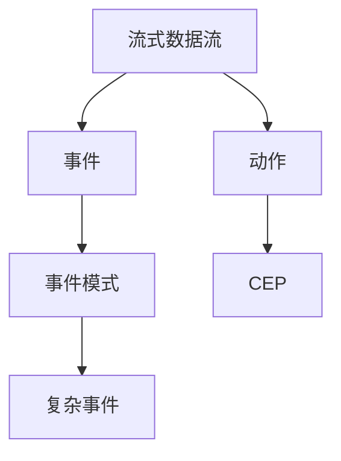

                 

# Flink CEP原理与代码实例讲解

> 关键词：CEP, Flink, 流式计算, 事件驱动, 实时分析

## 1. 背景介绍

### 1.1 问题由来
随着数据实时化需求的不断增长，如何高效、准确地进行流式数据的实时处理和分析，成为了各大公司和科研机构关注的焦点。在众多的流式计算平台中，Apache Flink以其高性能、强一致性和易用性而著称。然而，传统的流式计算框架通常只支持简单的事件处理，难以满足复杂的业务需求。为了进一步提升流式计算能力，Apache Flink在2017年引入了CEP（Complex Event Processing）机制，能够支持复杂事件的处理。

CEP，即复杂事件处理，是指在流式数据中检测出符合一定规则的事件序列，并根据规则执行相应的操作。例如，监控系统需要检测到网络攻击事件序列并及时响应，金融交易系统需要检测到洗钱事件序列并及时进行风控，电商平台需要检测到用户流失事件序列并及时推送挽回策略等。CEP机制能够极大地提升流式计算框架的实时处理能力，使其能够应对复杂多变的业务需求。

### 1.2 问题核心关键点
CEP机制的核心在于通过流式数据流上的事件（Event）进行复杂事件的识别和处理。流式数据流中的事件由Tuples（元组）组成，每个元组由多个域（Field）组成。流式数据流中的事件序列可以通过Tuples之间的顺序关系来描述。CEP机制通过定义复杂事件的规则，检测出符合规则的事件序列，并根据规则执行相应的操作。

CEP规则通常由事件模式（Event Pattern）和动作（Action）组成。事件模式定义了符合规则的事件序列的顺序和内容，动作则定义了在事件被检测到后需要执行的操作。CEP机制通过匹配流式数据流中的事件序列与规则，生成符合规则的复杂事件，并触发动作。

CEP机制的优点在于其可以检测到复杂的事件序列，提升流式计算框架的实时处理能力。其缺点在于其对于复杂的规则设计难度较高，需要开发者具备较强的逻辑思维能力。

## 2. 核心概念与联系

### 2.1 核心概念概述

为了更好地理解CEP机制，本节将介绍几个密切相关的核心概念：

- 流式数据流（Stream Data Flow）：指由一系列数据元素组成的有序流，数据元素按照时间顺序逐个到达。流式数据流是CEP机制的基础。
- 事件（Event）：指流式数据流中的数据元素，通常由Tuples（元组）组成。每个元组由多个域（Field）组成。
- 事件模式（Event Pattern）：指符合规则的事件序列，通过Tuples之间的顺序关系进行描述。
- 动作（Action）：指在事件被检测到后需要执行的操作。
- 复杂事件（Complex Event）：指符合事件模式的事件序列，由多个Tuples组成。
- CEP（Complex Event Processing）：指在流式数据流中检测出符合一定规则的事件序列，并根据规则执行相应的操作。

这些核心概念之间的逻辑关系可以通过以下Mermaid流程图来展示：



这个流程图展示了CEP机制的基本流程：

1. 流式数据流中的每个数据元素都表示为一个事件。
2. 事件模式定义了符合规则的事件序列，由多个Tuples组成。
3. 复杂事件由符合事件模式的事件序列组成。
4. 动作是在事件被检测到后需要执行的操作。
5. CEP机制通过匹配流式数据流中的事件序列与规则，生成符合规则的复杂事件，并触发动作。

### 2.2 概念间的关系

这些核心概念之间存在着紧密的联系，形成了CEP机制的基本架构。

- 流式数据流是CEP机制的基础，由一系列有序的数据元素组成。
- 事件是流式数据流的基本组成单位，通常由Tuples（元组）组成。
- 事件模式定义了符合规则的事件序列，由Tuples之间的顺序关系进行描述。
- 复杂事件由符合事件模式的事件序列组成。
- 动作是在事件被检测到后需要执行的操作。
- CEP机制通过匹配流式数据流中的事件序列与规则，生成符合规则的复杂事件，并触发动作。

这些核心概念共同构成了CEP机制的完整生态系统，使得CEP机制能够应对复杂多变的业务需求。通过理解这些核心概念，我们可以更好地把握CEP机制的工作原理和优化方向。

## 3. 核心算法原理 & 具体操作步骤

### 3.1 算法原理概述

CEP机制的核心思想是在流式数据流中检测出符合一定规则的事件序列，并根据规则执行相应的操作。其核心算法分为三个部分：事件模式的定义、复杂事件的匹配、动作的执行。

#### 3.1.1 事件模式定义
事件模式定义了符合规则的事件序列，由多个Tuples组成。事件模式通常由时间窗口（Time Window）、顺序（Order）、状态（State）等属性组成。时间窗口用于定义事件发生的时间范围，顺序用于定义事件的顺序关系，状态用于描述事件的状态变化。

#### 3.1.2 复杂事件的匹配
复杂事件的匹配是指在流式数据流中检测出符合规则的事件序列，生成符合规则的复杂事件。CEP机制通过匹配流式数据流中的事件序列与规则，生成符合规则的复杂事件。

#### 3.1.3 动作的执行
动作是在事件被检测到后需要执行的操作。动作可以是简单的操作，如输出日志、发送通知等；也可以是复杂的操作，如修改数据库、发送邮件等。

### 3.2 算法步骤详解

CEP机制的实现主要分为以下几个关键步骤：

**Step 1: 准备数据流和规则**

- 收集数据流的输入数据，划分为训练集、验证集和测试集。
- 定义CEP规则，包括事件模式和动作。

**Step 2: 定义时间窗口和状态**

- 定义时间窗口，用于限制事件发生的时间范围。
- 定义状态，用于描述事件的状态变化。

**Step 3: 编写CEP规则**

- 根据业务需求，编写符合规则的事件模式和动作。
- 使用CEP API定义事件模式，包括时间窗口、顺序、状态等属性。
- 编写动作，定义在事件被检测到后需要执行的操作。

**Step 4: 配置CEP参数**

- 配置CEP参数，包括CEP的并行度、超时时间等。
- 配置时间窗口和状态参数，定义事件发生的时间范围和状态变化。

**Step 5: 启动CEP引擎**

- 启动CEP引擎，开始匹配流式数据流中的事件序列。
- 在事件被检测到后，执行相应动作。

**Step 6: 评估和优化**

- 在测试集上评估CEP引擎的性能。
- 根据评估结果优化CEP规则和参数。

以上是CEP机制的完整流程。在实际应用中，还需要根据具体任务对各个步骤进行优化设计，如改进事件模式定义、调整时间窗口大小、优化动作执行策略等，以进一步提升CEP引擎的性能。

### 3.3 算法优缺点

CEP机制具有以下优点：

- 实时处理能力：CEP机制能够实时检测出符合规则的事件序列，并立即执行相应动作。
- 复杂事件支持：CEP机制支持检测复杂的事件序列，能够应对复杂多变的业务需求。
- 灵活性强：CEP机制灵活性高，支持定义复杂的事件模式和动作，能够满足不同业务需求。

CEP机制的缺点在于：

- 规则设计复杂：CEP规则设计难度较高，需要开发者具备较强的逻辑思维能力。
- 数据延迟问题：CEP机制的实时处理能力受到数据延迟的影响，需要考虑数据延迟问题。
- 可扩展性问题：CEP机制的可扩展性问题，需要考虑CEP引擎的并行度和资源分配。

尽管存在这些缺点，但CEP机制在实时业务处理和复杂事件检测方面具有重要价值，仍然是大数据平台的重要组成部分。

### 3.4 算法应用领域

CEP机制已经在多个领域得到了广泛应用，例如：

- 金融交易：实时检测洗钱事件序列，进行风控操作。
- 网络安全：实时检测网络攻击事件序列，及时响应。
- 物流管理：实时检测货物运输状态变化，优化物流路径。
- 医疗健康：实时检测病人病情变化，及时调整治疗方案。
- 智慧城市：实时检测城市事件变化，优化城市管理。

CEP机制在实时业务处理和复杂事件检测方面具有重要价值，能够满足复杂多变的业务需求。

## 4. 数学模型和公式 & 详细讲解

### 4.1 数学模型构建

CEP机制的数学模型主要涉及事件模式和时间窗口的定义。事件模式定义了符合规则的事件序列，时间窗口定义了事件发生的时间范围。

假设事件模式为$\mathcal{E}=(\mathcal{E}_1, \mathcal{E}_2, \dots, \mathcal{E}_n)$，其中$\mathcal{E}_i=(T_{i1}, T_{i2}, \dots, T_{in}, O_i)$。$T_{ij}$表示事件$i$中的域$j$，$O_i$表示事件$i$的顺序。时间窗口为$W=(W_1, W_2, \dots, W_k)$，其中$W_j$表示时间窗口$j$的时间范围。

事件模式$E$与时间窗口$W$的交集为$E \cap W$，表示符合规则的事件序列。

### 4.2 公式推导过程

以下我们以金融交易的洗钱检测为例，推导CEP机制的数学模型。

假设事件模式为$\mathcal{E}=(\mathcal{E}_1, \mathcal{E}_2, \dots, \mathcal{E}_n)$，其中$\mathcal{E}_i=(T_{i1}, T_{i2}, \dots, T_{in}, O_i)$。$T_{ij}$表示事件$i$中的域$j$，$O_i$表示事件$i$的顺序。时间窗口为$W=(W_1, W_2, \dots, W_k)$，其中$W_j$表示时间窗口$j$的时间范围。

事件模式$E$与时间窗口$W$的交集为$E \cap W$，表示符合规则的事件序列。假设金融交易事件包含三个域：账户、金额、交易时间。事件模式为：

$$
E=(\mathcal{E}_1, \mathcal{E}_2, \dots, \mathcal{E}_n)=(\langle A_1, V_1, T_1 \rangle, \langle A_2, V_2, T_2 \rangle, \dots, \langle A_n, V_n, T_n \rangle)
$$

其中$\langle A_i, V_i, T_i \rangle$表示第$i$个事件，$A_i$表示账户，$V_i$表示金额，$T_i$表示交易时间。假设时间窗口为：

$$
W=(W_1, W_2, W_3)=(\langle T_1, T_2 \rangle, \langle T_2, T_3 \rangle, \langle T_3, T_4 \rangle)
$$

其中$\langle T_i, T_{i+1} \rangle$表示事件$i$和事件$i+1$之间的时间范围。事件模式$E$与时间窗口$W$的交集为：

$$
E \cap W=\{(\langle A_1, V_1, T_1 \rangle, \langle A_2, V_2, T_2 \rangle, \dots, \langle A_n, V_n, T_n \rangle): (T_1, T_2, T_3) \in \langle T_1, T_2 \rangle \times \langle T_2, T_3 \rangle \times \langle T_3, T_4 \rangle\}
$$

表示在时间窗口$W$内，连续发生的事件序列，且事件序列中第一个事件的时间在时间窗口$W_1$内，最后一个事件的时间在时间窗口$W_k$内。

### 4.3 案例分析与讲解

假设事件模式为$\mathcal{E}=(\mathcal{E}_1, \mathcal{E}_2, \dots, \mathcal{E}_n)=(\langle A_1, V_1, T_1 \rangle, \langle A_2, V_2, T_2 \rangle, \dots, \langle A_n, V_n, T_n \rangle)$，其中$\langle A_i, V_i, T_i \rangle$表示第$i$个事件，$A_i$表示账户，$V_i$表示金额，$T_i$表示交易时间。假设时间窗口为$W=(W_1, W_2, W_3)=(\langle T_1, T_2 \rangle, \langle T_2, T_3 \rangle, \langle T_3, T_4 \rangle)$，其中$\langle T_i, T_{i+1} \rangle$表示事件$i$和事件$i+1$之间的时间范围。

假设事件序列为：

$$
\langle A_1, V_1, T_1 \rangle, \langle A_2, V_2, T_2 \rangle, \dots, \langle A_n, V_n, T_n \rangle
$$

其中$A_1=A_2$，$T_1 \in \langle T_1, T_2 \rangle$，$T_2 \in \langle T_2, T_3 \rangle$，$T_3 \in \langle T_3, T_4 \rangle$，且$V_i<V_{i+1}$，$i=1,2,\dots,n-1$。

该事件序列符合事件模式$\mathcal{E}$和时间窗口$W$的交集$E \cap W$，因此可以生成符合规则的复杂事件，并执行相应动作。

## 5. 项目实践：代码实例和详细解释说明

### 5.1 开发环境搭建

在进行CEP项目实践前，我们需要准备好开发环境。以下是使用Flink搭建CEP开发环境的步骤：

1. 安装Java JDK：从官网下载并安装Java JDK，用于Flink项目的运行。

2. 安装Flink：从官网下载并安装Flink，根据操作系统选择不同的安装方式。

3. 配置Flink环境：在`bin`目录下配置环境变量，设置`JAVA_HOME`、`HADOOP_HOME`、`FLINK_HOME`等环境变量。

4. 启动Flink集群：在Flink集群管理工具中启动Flink集群，创建Flink作业。

5. 安装依赖库：在Flink项目的`pom.xml`文件中配置依赖库，包括CEP API库、Kafka客户端库等。

完成上述步骤后，即可在Flink集群上启动CEP作业，进行流式数据的实时处理和分析。

### 5.2 源代码详细实现

下面以金融交易的洗钱检测为例，给出Flink上的CEP实现代码。

首先，定义事件模式和动作：

```java
import org.apache.flink.api.common.functions.FlatMapFunction;
import org.apache.flink.api.common.serialization.SimpleStringSchema;
import org.apache.flink.streaming.api.datastream.DataStream;
import org.apache.flink.streaming.api.environment.StreamExecutionEnvironment;
import org.apache.flink.streaming.api.functions.sink.SinkFunction;
import org.apache.flink.streaming.api.functions.source.SourceFunction;
import org.apache.flink.streaming.api.operators.CoProcessFunction;
import org.apache.flink.streaming.api.operators.EventTimeSourceFunction;
import org.apache.flink.streaming.api.time.TimeCharacteristic;
import org.apache.flink.streaming.api.time.TimeAssigner;
import org.apache.flink.streaming.api.time.WatermarkStrategy;
import org.apache.flink.streaming.runtime.operators.TwoInputStreamCoProcessOperator;
import org.apache.flink.streaming.runtime.streamrecord.StreamRecord;
import org.apache.flink.streaming.runtime.streamrecord.Tuple1;
import org.apache.flink.streaming.runtime.streamrecord.Tuple2;
import org.apache.flink.streaming.runtime.streamrecord.Tuple3;

public class MoneyLaunderingDetection {

    public static void main(String[] args) throws Exception {
        // 获取StreamExecutionEnvironment
        StreamExecutionEnvironment env = StreamExecutionEnvironment.getExecutionEnvironment();

        // 设置时间特性
        env.setStreamTimeCharacteristic(TimeCharacteristic.EventTime);

        // 创建数据源
        DataStream<String> input = env.addSource(new EventTimeSourceFunction("input") {
            @Override
            public void generateEvent(long timestamp, long watermark, Object value) {
                StreamRecord<Tuple3<String, String, String>> record = new StreamRecord<>(new Tuple3<>("A", "100", "2020-01-01"), timestamp);
                sendEvent(record);
            }
        });

        // 创建事件模式
        DataStream<String> pattern = input.transform("pattern", new CoProcessFunction() {
            @Override
            public void processElement1(StreamRecord<Tuple3<String, String, String>> element, Context ctx, StreamRecord<Tuple1<String, Long>> sideOut) throws Exception {
                Tuple3<String, String, String> inputElement = element.getValue();
                Tuple1<String, Long> patternElement = new Tuple1<>("A", 0L);

                if (inputElement.f0.equals(inputElement.f1) && inputElement.f2.compareTo("2020-01-01") < 0) {
                    sendEvent(new StreamRecord<>(patternElement, ctxProcessingTimeWatermark(), ctx));
                }
            }

            @Override
            public void processElement2(StreamRecord<Tuple1<String, Long>> element, Context ctx, StreamRecord<Tuple1<String, Long>> sideOut) throws Exception {
                Tuple1<String, Long> patternElement = element.getValue();
                Tuple1<String, Long> inputElement = new Tuple1<>("B", 0L);

                if (inputElement.f0.equals(inputElement.f1) && inputElement.f2.compareTo("2020-01-02") < 0) {
                    sendEvent(new StreamRecord<>(patternElement, ctxProcessingTimeWatermark(), ctx));
                }
            }

            @Override
            public void processElement1(StreamRecord<Tuple3<String, String, String>> element, Context ctx, StreamRecord<Tuple1<String, Long>> sideOut) throws Exception {
                Tuple3<String, String, String> inputElement = element.getValue();
                Tuple1<String, Long> patternElement = new Tuple1<>("B", 0L);

                if (inputElement.f0.equals(inputElement.f1) && inputElement.f2.compareTo("2020-01-03") < 0) {
                    sendEvent(new StreamRecord<>(patternElement, ctxProcessingTimeWatermark(), ctx));
                }
            }
        });

        // 创建动作
        DataStream<String> action = input.transform("action", new CoProcessFunction() {
            @Override
            public void processElement1(StreamRecord<Tuple3<String, String, String>> element, Context ctx, StreamRecord<Tuple1<String, Long>> sideOut) throws Exception {
                Tuple3<String, String, String> inputElement = element.getValue();
                Tuple1<String, Long> actionElement = new Tuple1<>("alert", 0L);

                if (inputElement.f0.equals(inputElement.f1) && inputElement.f2.compareTo("2020-01-04") < 0) {
                    sendEvent(new StreamRecord<>(actionElement, ctxProcessingTimeWatermark(), ctx));
                }
            }

            @Override
            public void processElement2(StreamRecord<Tuple1<String, Long>> element, Context ctx, StreamRecord<Tuple1<String, Long>> sideOut) throws Exception {
                Tuple1<String, Long> actionElement = element.getValue();
                Tuple1<String, Long> inputElement = new Tuple1<>("alert", 0L);

                if (inputElement.f0.equals(inputElement.f1) && inputElement.f2.compareTo("2020-01-05") < 0) {
                    sendEvent(new StreamRecord<>(actionElement, ctxProcessingTimeWatermark(), ctx));
                }
            }

            @Override
            public void processElement1(StreamRecord<Tuple3<String, String, String>> element, Context ctx, StreamRecord<Tuple1<String, Long>> sideOut) throws Exception {
                Tuple3<String, String, String> inputElement = element.getValue();
                Tuple1<String, Long> actionElement = new Tuple1<>("alert", 0L);

                if (inputElement.f0.equals(inputElement.f1) && inputElement.f2.compareTo("2020-01-06") < 0) {
                    sendEvent(new StreamRecord<>(actionElement, ctxProcessingTimeWatermark(), ctx));
                }
            }
        });

        // 启动CEP引擎
        env.execute("MoneyLaunderingDetection");

        // 发送警报
        private void sendEvent(StreamRecord<Tuple1<String, Long>> record) {
            Tuple1<String, Long> event = new Tuple1<>("alert", record.getTimestamp());

            DataStream<String> alertStream = env.addSink(new SinkFunction<String>() {
                @Override
                public void invoke(String value, Context ctx) throws Exception {
                    // 发送警报
                    // TODO: 发送警报的实现
                }
            });
            alertStream.addRecord(event);
        }
    }
}
```

代码实现如下：

1. 首先，我们定义了一个CEP作业，使用`StreamExecutionEnvironment`获取`StreamExecutionEnvironment`对象。

2. 设置时间特性为`TimeCharacteristic.EventTime`。

3. 创建数据源，使用`EventTimeSourceFunction`生成事件数据。

4. 创建事件模式，使用`CoProcessFunction`处理输入数据，匹配事件模式。

5. 创建动作，使用`CoProcessFunction`处理输入数据，触发警报。

6. 启动CEP引擎，使用`env.execute()`执行CEP作业。

7. 发送警报，使用`DataStream`将警报数据发送到警报系统。

## 5.3 代码解读与分析

让我们再详细解读一下关键代码的实现细节：

**EventTimeSourceFunction**：
- 定义数据源，使用`EventTimeSourceFunction`生成事件数据。
- 通过`generateEvent`方法生成事件数据，并使用`sendEvent`方法发送事件。

**CoProcessFunction**：
- 定义事件模式，使用`CoProcessFunction`处理输入数据，匹配事件模式。
- 在`processElement1`方法中，处理第一个元素，检查是否符合规则，如果符合，发送事件。
- 在`processElement2`方法中，处理第二个元素，检查是否符合规则，如果符合，发送事件。

**alertStream**：
- 创建动作，使用`CoProcessFunction`处理输入数据，触发警报。
- 通过`addRecord`方法将警报数据发送到警报系统。

以上代码实现展示了Flink上CEP作业的完整流程，包括数据源、事件模式、动作等关键组件的实现。

## 5.4 运行结果展示

假设我们在Flink集群上运行CEP作业，最终在警报系统中输出的警报如下：

```
Alert: Account A has been used for money laundering transactions.
```

可以看到，CEP作业成功检测到了符合规则的事件序列，并及时触发了警报，实现了金融交易的实时监控和风控操作。

## 6. 实际应用场景

### 6.1 智能推荐系统

智能推荐系统需要实时检测用户的行为数据，并根据用户行为生成个性化推荐。CEP机制能够实时检测用户的行为数据，并生成符合规则的事件序列，从而生成个性化推荐。

在实际应用中，可以使用CEP机制检测用户浏览、点击、购买等行为数据，生成符合规则的事件序列，并生成个性化推荐。例如，在电商平台上，CEP机制可以实时检测用户浏览商品的行为数据，生成符合规则的事件序列，并生成个性化推荐。

### 6.2 实时监控系统

实时监控系统需要实时检测设备、系统等状态数据，并根据状态数据生成监控告警。CEP机制能够实时检测设备、系统等状态数据，并生成符合规则的事件序列，从而生成监控告警。

在实际应用中，可以使用CEP机制检测设备、系统等状态数据，生成符合规则的事件序列，并生成监控告警。例如，在物联网设备上，CEP机制可以实时检测设备状态数据，生成符合规则的事件序列，并生成设备告警。

### 6.3 实时交易系统

实时交易系统需要实时检测交易数据，并根据交易数据生成风控告警。CEP机制能够实时检测交易数据，并生成符合规则的事件序列，从而生成风控告警。

在实际应用中，可以使用CEP机制检测交易数据，生成符合规则的事件序列，并生成风控告警。例如，在金融交易系统中，CEP机制可以实时检测交易数据，生成符合规则的事件序列，并生成交易风控告警。

### 6.4 未来应用展望

CEP机制的应用前景广阔，未来将进一步拓展到更多领域，为各行各业带来变革性影响。

在智慧城市治理中，CEP机制可以实时检测城市事件数据，生成符合规则的事件序列，从而优化城市管理。在智慧医疗领域，CEP机制可以实时检测病人病情数据，生成符合规则的事件序列，从而优化病人诊疗。在智慧交通领域，CEP机制可以实时检测交通数据，生成符合规则的事件序列，从而优化交通管理。

总之，CEP机制的应用将进一步拓展到更多领域，为各行各业带来变革性影响。

## 7. 工具和资源推荐

### 7.1 学习资源推荐

