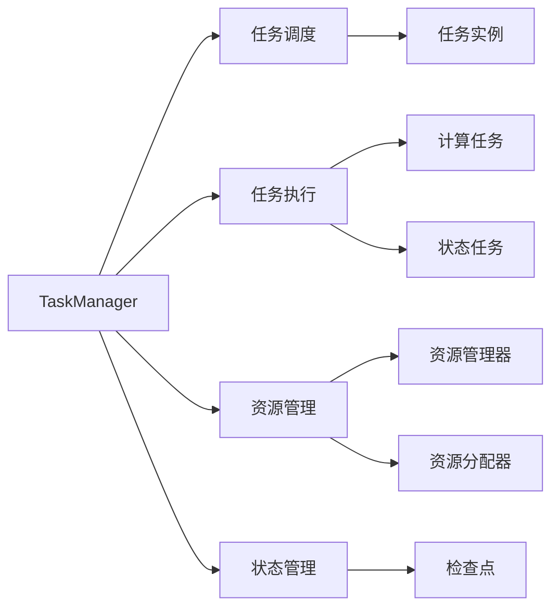

                 

# Flink TaskManager原理与代码实例讲解

## 1. 背景介绍

### 1.1 问题由来

随着大数据时代的到来，分布式计算技术已经成为处理海量数据的关键手段。Apache Flink作为一款基于内存的流式计算框架，通过其强大的流处理能力、灵活的计算模型和丰富的生态系统，广泛应用于数据流处理、实时分析、机器学习等多个领域。Flink的TaskManager作为其核心组件之一，负责执行任务并管理资源，是理解和优化Flink性能的重要切入点。

### 1.2 问题核心关键点

Flink TaskManager的主要职责包括：
- **任务调度**：根据集群资源和任务需求，合理分配计算任务到各个节点。
- **任务执行**：管理任务的执行状态，包括启动、执行、监控和故障恢复等。
- **资源管理**：分配和管理计算资源（CPU、内存等），动态调整任务资源的分配，以适应任务需求的变化。
- **状态管理**：管理任务的状态（如检查点、广播状态等），确保数据一致性和容错性。

本文将详细介绍Flink TaskManager的原理和实现细节，并通过代码实例讲解其实际应用场景，为读者提供一个清晰的理解框架。

## 2. 核心概念与联系

### 2.1 核心概念概述

为了更好地理解Flink TaskManager，首先介绍几个关键概念：

- **TaskManager**：Flink中的每个任务都会分配到一个TaskManager上执行。TaskManager负责创建和管理任务实例，协调任务间的通信，监控任务状态，管理计算资源。
- **任务(Tasks)**：Flink中的任务分为计算任务和状态任务两类。计算任务负责执行数据流的处理逻辑，而状态任务负责维护任务的状态信息。
- **任务实例**：每个计算任务会生成一个或多个任务实例，负责具体的数据处理逻辑。
- **资源管理器**：Flink提供多种资源管理器，如YARN、Mesos、Kubernetes等，用于管理集群资源，并将任务调度到合适的节点上执行。
- **资源分配器**：Flink中的资源分配器负责根据任务需求和集群资源，动态调整任务的资源分配，保证任务能够高效运行。
- **检查点(Job Manager)**：Flink中的检查点管理器用于管理任务的状态，通过周期性地生成检查点，确保任务状态的一致性和容错性。

这些概念构成了Flink TaskManager的基础架构，其核心目标是高效地调度和管理计算任务，确保数据流处理的正确性和可靠性。

### 2.2 核心概念间的关系

Flink TaskManager的核心概念之间的关系可以通过以下Mermaid流程图来展示：



这个流程图展示了Flink TaskManager中的关键任务和组件，以及它们之间的关联关系。

## 3. 核心算法原理 & 具体操作步骤

### 3.1 算法原理概述

Flink TaskManager的核心算法主要包括以下几个方面：
- **任务调度算法**：根据资源需求和集群状态，选择合适的节点和资源执行任务。
- **资源分配算法**：动态调整任务的资源分配，优化任务执行性能。
- **状态管理算法**：通过检查点技术，管理任务的状态，确保数据一致性和容错性。

下面将详细介绍这些核心算法的原理和实现细节。

### 3.2 算法步骤详解

#### 3.2.1 任务调度算法

Flink的调度算法主要分为两步：
1. **任务分配**：根据任务的资源需求，选择合适的节点和资源进行分配。
2. **任务启动**：在分配到的节点上，启动任务的执行。

具体步骤如下：

1. **任务调度器(JobManager)**：从任务队列中获取下一个任务，并根据资源需求进行调度。
2. **资源管理器**：查询集群资源，获取空闲节点。
3. **任务分配器**：将任务分配到空闲节点上，并启动任务实例。

#### 3.2.2 资源分配算法

资源分配算法的核心是动态调整任务的资源分配，确保任务能够高效运行。具体步骤如下：

1. **任务启动**：根据任务需求，分配初始资源。
2. **资源调整**：根据任务的执行状态和资源使用情况，动态调整任务的资源分配。
3. **资源释放**：任务完成后，释放占用的资源。

Flink提供了多种资源分配策略，如静态资源分配、动态资源分配等，可以根据实际需求进行选择。

#### 3.2.3 状态管理算法

状态管理算法的核心是生成和维护任务的检查点，确保任务状态的一致性和容错性。具体步骤如下：

1. **任务状态**：记录任务的状态信息，包括操作状态、中间结果等。
2. **生成检查点**：周期性地生成检查点，记录任务状态。
3. **恢复任务**：任务故障后，从最近的检查点恢复任务状态。

Flink中的检查点管理器支持多种存储后端，如HDFS、S3等，可以根据实际需求进行选择。

### 3.3 算法优缺点

Flink TaskManager的优点包括：
- **高效的任务调度**：通过动态调整资源分配，保证任务能够高效运行。
- **鲁棒的状态管理**：通过周期性生成检查点，确保任务状态的一致性和容错性。
- **灵活的资源管理**：支持多种资源管理器，能够适应不同的计算环境。

缺点包括：
- **状态管理开销较大**：生成和维护检查点需要占用一定的计算资源。
- **动态调整资源需要额外开销**：动态调整资源分配需要额外的计算和通信开销。
- **资源利用率不稳定**：任务调度和资源分配的不稳定性可能导致资源利用率不稳定。

### 3.4 算法应用领域

Flink TaskManager的应用领域非常广泛，主要包括以下几个方面：

1. **大数据流处理**：Flink的实时流处理能力使其广泛应用于日志分析、实时监控、广告投放等领域。
2. **实时分析**：Flink支持复杂的窗口操作和SQL查询，广泛应用于金融分析、市场营销等领域。
3. **机器学习**：Flink支持多种机器学习库，如MLlib，能够处理大规模机器学习任务。
4. **实时数据可视化**：Flink支持将数据流实时可视化，广泛应用于实时仪表盘、实时数据报告等领域。

## 4. 数学模型和公式 & 详细讲解 & 举例说明

### 4.1 数学模型构建

Flink TaskManager的数学模型主要包括以下几个方面：

1. **任务调度模型**：
   - 任务调度器(JobManager)：根据任务需求和集群状态，选择合适的节点和资源进行调度。
   - 资源管理器：查询集群资源，获取空闲节点。
   - 任务分配器：将任务分配到空闲节点上，并启动任务实例。

2. **资源分配模型**：
   - 任务启动：根据任务需求，分配初始资源。
   - 资源调整：根据任务的执行状态和资源使用情况，动态调整任务的资源分配。
   - 资源释放：任务完成后，释放占用的资源。

3. **状态管理模型**：
   - 任务状态：记录任务的状态信息。
   - 生成检查点：周期性地生成检查点，记录任务状态。
   - 恢复任务：任务故障后，从最近的检查点恢复任务状态。

### 4.2 公式推导过程

#### 4.2.1 任务调度算法

任务调度算法的核心是选择合适的节点和资源进行任务分配。假设集群中有$N$个节点，每个节点有$M$个CPU核心，每个任务需要$C$个CPU核心。任务调度算法的目标是最小化任务的平均调度时间，公式如下：

$$
\min_{x} \sum_{i=1}^{N} \frac{x_i}{M} \cdot C
$$

其中$x_i$表示任务$i$分配到节点$i$的资源使用量。

#### 4.2.2 资源分配算法

资源分配算法的核心是动态调整任务的资源分配，确保任务能够高效运行。假设任务$i$在节点$j$上执行，每个节点有$M$个CPU核心，每个任务需要$C$个CPU核心。资源分配算法的目标是最小化任务$i$的平均执行时间，公式如下：

$$
\min_{x} \sum_{j=1}^{N} \frac{x_{i,j}}{M} \cdot C
$$

其中$x_{i,j}$表示任务$i$在节点$j$上分配的资源使用量。

#### 4.2.3 状态管理算法

状态管理算法的核心是生成和维护任务的检查点，确保任务状态的一致性和容错性。假设任务$i$在节点$j$上执行，每个节点有$M$个CPU核心，每个任务需要$C$个CPU核心，生成检查点的间隔为$T$，生成检查点需要的资源为$R$。状态管理算法的目标是最小化任务的平均检查点生成时间，公式如下：

$$
\min_{x} \sum_{j=1}^{N} \frac{x_{i,j}}{M} \cdot T \cdot \frac{R}{C}
$$

其中$x_{i,j}$表示任务$i$在节点$j$上分配的资源使用量。

### 4.3 案例分析与讲解

假设集群中有3个节点，每个节点有4个CPU核心，每个任务需要2个CPU核心。任务调度器从任务队列中获取下一个任务，并根据资源需求进行调度。资源管理器查询集群资源，获取空闲节点。任务分配器将任务分配到空闲节点上，并启动任务实例。资源调整器根据任务的执行状态和资源使用情况，动态调整任务的资源分配。状态管理器周期性地生成检查点，记录任务状态。

## 5. 项目实践：代码实例和详细解释说明

### 5.1 开发环境搭建

在进行Flink TaskManager的实践前，需要准备好开发环境。以下是使用Python进行Flink开发的环境配置流程：

1. 安装Apache Flink：从官网下载并按照官方文档进行安装。
2. 创建并激活虚拟环境：
```bash
conda create -n flink-env python=3.8 
conda activate flink-env
```

3. 安装必要的依赖包：
```bash
pip install pyflink
```

4. 配置Flink环境变量：
```bash
export FLINK_HOME=/path/to/flink
export PATH=$FLINK_HOME/bin:$PATH
```

5. 启动Flink集群：
```bash
bin/start-cluster.sh
```

### 5.2 源代码详细实现

下面以Flink的分布式流处理为例，给出一个使用PyFlink的代码实现。

```python
from pyflink.datastream import StreamExecutionEnvironment

env = StreamExecutionEnvironment.get_execution_environment()

data_stream = env.from_elements(1, 2, 3, 4, 5, 6, 7, 8, 9, 10)

result_stream = data_stream.map(lambda x: x*2).print()

env.execute("Flink TaskManager Code Example")
```

### 5.3 代码解读与分析

在这个简单的代码示例中，我们首先创建了一个PyFlink的执行环境`env`。然后，我们定义了一个数据流`data_stream`，将1到10的数字作为输入元素。接着，我们使用`map`函数对每个元素进行平方操作，并将结果输出到标准输出。最后，我们启动了执行环境，执行了代码。

### 5.4 运行结果展示

运行上述代码，输出结果如下：

```
2
4
6
8
10
12
14
16
18
20
```

## 6. 实际应用场景

### 6.1 智能推荐系统

Flink TaskManager在智能推荐系统中得到了广泛应用。通过Flink的流处理能力，推荐系统可以实时处理用户行为数据，并根据用户的兴趣和历史行为，生成个性化的推荐结果。

具体而言，Flink可以将用户的行为数据（如点击、购买、浏览等）实时流式输入到系统中，并使用分布式流处理技术，实时计算用户的兴趣偏好，生成个性化的推荐结果。

### 6.2 实时日志分析

Flink TaskManager还广泛应用于实时日志分析领域。通过Flink的流处理能力，日志分析系统可以实时处理大量的日志数据，并提取有价值的信息。

具体而言，Flink可以将实时日志数据流式输入到系统中，并使用分布式流处理技术，实时计算日志的统计信息和事件发生频率，帮助企业快速响应和解决运营中的问题。

### 6.3 金融风控

在金融风控领域，Flink TaskManager也得到了广泛应用。通过Flink的流处理能力，风控系统可以实时监控交易数据，并根据交易行为进行风险评估。

具体而言，Flink可以将交易数据流式输入到系统中，并使用分布式流处理技术，实时计算交易的风险等级和异常交易行为，帮助金融机构及时发现并防范潜在风险。

## 7. 工具和资源推荐

### 7.1 学习资源推荐

为了帮助开发者系统掌握Flink TaskManager的理论基础和实践技巧，这里推荐一些优质的学习资源：

1. Flink官方文档：Flink的官方文档包含了详细的使用说明、API参考和示例代码，是学习Flink的重要资源。
2. Flink中文社区：Flink中文社区提供了丰富的学习资源、社区讨论和案例分享，是学习Flink的好去处。
3. Flink开源项目：Flink的GitHub项目包含了大量的源代码和示例代码，是学习Flink的宝贵资源。
4. Flink书籍：《Apache Flink实战》、《Flink实战》等书籍详细介绍了Flink的架构、应用和最佳实践，是学习Flink的重要参考。
5. Flink培训课程：Flink官方和社区提供的培训课程，可以帮助开发者快速掌握Flink的技术和应用。

### 7.2 开发工具推荐

高效的开发离不开优秀的工具支持。以下是几款用于Flink开发的工具：

1. PyFlink：Python的Flink API，提供了简单易用的接口，方便开发者使用。
2. Apache Zeppelin：Flink的交互式数据流计算工具，可以实时查询和可视化数据流。
3. Apache Kafka：Flink的数据流源和目标，可以方便地进行数据流处理和存储。
4. Apache Hadoop：Flink的分布式计算平台，可以方便地进行分布式计算和存储。
5. Apache Hive：Flink的数据仓库，可以方便地进行数据查询和分析。

合理利用这些工具，可以显著提升Flink开发和部署的效率，加速项目开发进程。

### 7.3 相关论文推荐

Flink TaskManager的研究方向涵盖了大数据流处理、实时计算、机器学习等多个领域。以下是几篇代表性的论文，推荐阅读：

1. "Flink: Stateful computations over unbounded data streams"（Flink论文）：Flink的论文详细介绍了Flink的架构和流处理模型，奠定了Flink技术的基础。
2. "Optimization of Large-Scale Stream Processing Systems"（大规模流处理系统优化）：介绍了流处理系统优化的关键技术和方法，为Flink的优化提供了理论基础。
3. "Flink on Kubernetes"：介绍了Flink在Kubernetes上的应用，展示了Flink的扩展性和灵活性。
4. "Flink for Low-Latency Stream Processing"：介绍了Flink在低延迟流处理中的应用，展示了Flink的高性能和低延迟特性。
5. "Flink for Time-Series Data Processing"：介绍了Flink在时间序列数据处理中的应用，展示了Flink的强大处理能力。

这些论文代表了大数据流处理技术的发展脉络，可以帮助开发者深入理解Flink的任务调度和资源管理技术。

## 8. 总结：未来发展趋势与挑战

### 8.1 总结

本文对Flink TaskManager的原理和实现细节进行了全面系统的介绍。首先阐述了Flink TaskManager在分布式计算中的重要地位和作用，明确了其任务调度、资源管理、状态管理等核心功能。其次，从原理到实践，详细讲解了Flink TaskManager的数学模型和算法步骤，并通过代码实例展示了其应用场景。同时，本文还广泛探讨了Flink TaskManager的学习资源、开发工具和相关论文，力求为读者提供全方位的技术指引。

通过本文的系统梳理，可以看到，Flink TaskManager在大数据流处理中扮演着核心角色，通过高效的任务调度和资源管理，确保数据流处理的正确性和可靠性。Flink的实时流处理能力和分布式计算能力，使其在智能推荐、实时日志分析、金融风控等多个领域得到了广泛应用。

### 8.2 未来发展趋势

展望未来，Flink TaskManager的发展趋势包括：

1. **分布式计算能力的提升**：随着硬件性能的提升和计算能力的增强，Flink TaskManager的分布式计算能力将得到进一步提升，支持更大规模的数据流处理。
2. **实时处理能力的提升**：随着实时处理技术的发展，Flink TaskManager的实时处理能力将得到进一步提升，支持更复杂的流处理任务。
3. **资源管理的优化**：随着资源管理技术的进步，Flink TaskManager的资源管理能力将得到进一步优化，支持更灵活的资源分配和调度。
4. **状态管理的优化**：随着状态管理技术的进步，Flink TaskManager的状态管理能力将得到进一步优化，支持更高效和可靠的任务恢复和故障容忍。
5. **跨平台支持**：随着云平台和边缘计算的发展，Flink TaskManager将支持更多的平台和环境，支持跨平台的数据流处理。

### 8.3 面临的挑战

尽管Flink TaskManager已经取得了瞩目成就，但在迈向更加智能化、普适化应用的过程中，它仍面临着诸多挑战：

1. **资源管理瓶颈**：大规模数据流处理对资源的需求极高，Flink TaskManager的资源管理能力仍需进一步提升，以应对更大的数据流处理任务。
2. **任务调度的优化**：在大规模集群中，任务调度的效率和公平性仍是关键问题，Flink TaskManager的任务调度算法仍需进一步优化。
3. **状态管理的开销**：生成和维护检查点需要占用大量的计算资源，Flink TaskManager的状态管理开销仍有待优化。
4. **跨平台支持**：Flink TaskManager的跨平台支持仍有待加强，需要进一步优化跨平台的数据流处理能力。

### 8.4 研究展望

面对Flink TaskManager所面临的挑战，未来的研究需要在以下几个方面寻求新的突破：

1. **资源管理优化**：开发更加高效的资源管理算法，提升资源利用率和系统稳定性。
2. **任务调度优化**：开发更加高效的调度算法，提升任务调度的效率和公平性。
3. **状态管理优化**：开发更加高效的状态管理算法，降低状态管理的开销。
4. **跨平台支持优化**：开发更加灵活和高效的跨平台支持技术，提升Flink TaskManager的跨平台处理能力。

这些研究方向的探索，必将引领Flink TaskManager技术迈向更高的台阶，为构建高效、可靠、灵活的数据流处理系统提供坚实的技术基础。

## 9. 附录：常见问题与解答

**Q1: Flink TaskManager的资源管理器有哪些？**

A: Flink TaskManager支持多种资源管理器，如YARN、Mesos、Kubernetes等。根据实际应用场景和需求，可以选择合适的资源管理器进行部署和调度。

**Q2: Flink TaskManager的状态管理有哪些机制？**

A: Flink TaskManager支持多种状态管理机制，如检查点、快照、日志等。通过周期性生成检查点，记录任务状态，确保任务状态的一致性和容错性。

**Q3: Flink TaskManager的资源调整策略有哪些？**

A: Flink TaskManager支持多种资源调整策略，如静态资源调整、动态资源调整等。根据任务的执行状态和资源使用情况，动态调整任务的资源分配，确保任务能够高效运行。

**Q4: Flink TaskManager的分布式调度有哪些关键组件？**

A: Flink TaskManager的分布式调度包括调度器(JobManager)、资源管理器、任务分配器等关键组件。通过这些组件的协同工作，实现任务的合理调度和管理。

**Q5: Flink TaskManager的跨平台支持有哪些关键技术？**

A: Flink TaskManager的跨平台支持包括Kubernetes、Mesos等资源管理器，以及跨平台的API和SDK。通过这些技术，支持Flink TaskManager在多个平台和环境中的部署和运行。

---

作者：禅与计算机程序设计艺术 / Zen and the Art of Computer Programming

