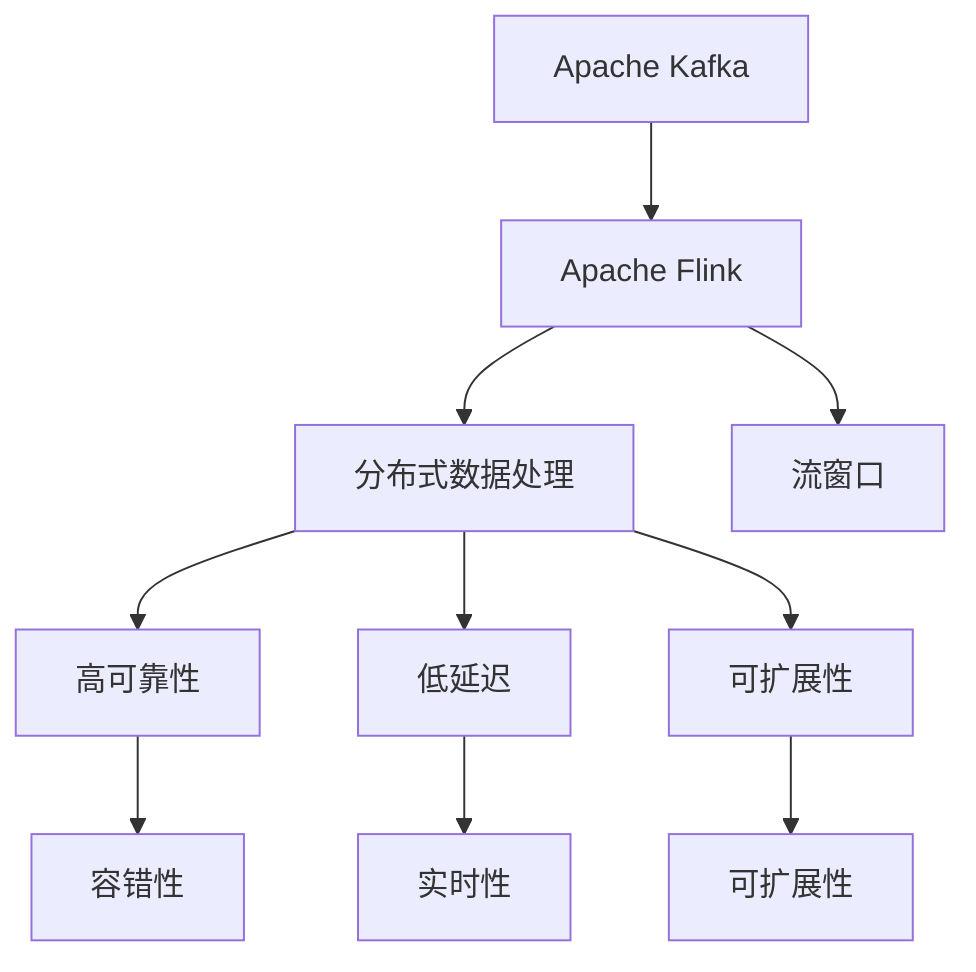
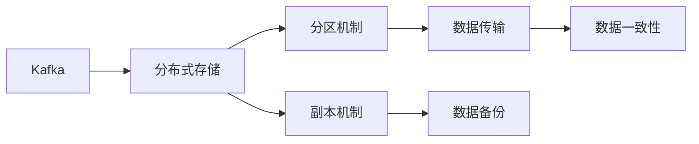
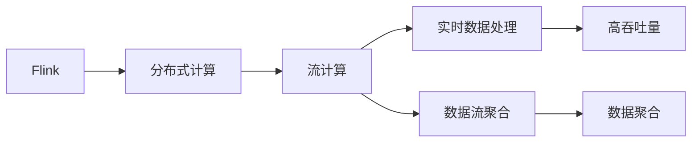

                 

# Kafka-Flink整合原理与代码实例讲解

> 关键词：Kafka, Flink, 数据流处理, 高可靠性, 低延迟, 容错, 可扩展性

## 1. 背景介绍

随着大数据和实时数据分析需求的日益增长，数据流处理成为了企业数据管理的重要手段。Apache Kafka作为分布式流数据处理平台，Apache Flink作为实时数据流处理引擎，两者结合可以提供高可靠性、低延迟、可扩展性的数据流处理解决方案。Kafka-Flink整合在企业数据流处理中得到了广泛应用，尤其是在实时数据处理、实时流计算和大数据集成等方面。

### 1.1 问题由来
在实际应用中，数据流处理往往需要同时具备高吞吐量、低延迟、高可靠性和可扩展性。传统的数据流处理技术，如MapReduce，虽然能够处理大规模数据，但在实时性、可靠性和可扩展性方面存在局限性。与此同时，Kafka作为分布式流数据处理平台，能够实时、可靠地处理海量数据，但其本身并不具备流计算的能力。因此，需要将Kafka和Flink结合，利用Flink的流计算能力，对Kafka流数据进行高效、可靠、可扩展的实时处理。

### 1.2 问题核心关键点
Kafka-Flink整合的核心关键点在于以下几个方面：

- **高可靠性**：Kafka的分布式存储机制和副本机制确保了数据流处理的可靠性，而Flink的流计算引擎可以保证数据的端到端一致性和异常恢复能力。
- **低延迟**：Kafka的分区机制和顺序保证机制，配合Flink的流窗口操作，可以实现毫秒级别的实时处理。
- **可扩展性**：Kafka和Flink都支持水平扩展，可以根据业务需求动态调整资源配置。
- **分布式数据处理**：Kafka和Flink的分布式特性，使得大规模数据处理变得简单易行。

### 1.3 问题研究意义
Kafka-Flink整合的目的是实现分布式数据流的实时处理，提升数据处理效率，降低数据处理成本，同时提高数据处理的可靠性和实时性。Kafka-Flink整合不仅可以应用于实时数据分析、实时流计算等领域，还能支持实时数据清洗、数据流聚合、数据流统计等复杂数据处理任务。

## 2. 核心概念与联系

### 2.1 核心概念概述

为了更好地理解Kafka-Flink整合原理，本节将介绍几个密切相关的核心概念：

- **Apache Kafka**：分布式流数据平台，能够实时、可靠地处理海量数据，支持高吞吐量、高可靠性、可扩展性。
- **Apache Flink**：分布式流计算框架，支持实时、高效、可扩展的数据流处理，能够实现复杂数据处理任务。
- **数据流处理**：实时、连续的数据处理方式，强调数据的流特性和高吞吐量。
- **流窗口**：用于定义数据流处理的窗口机制，通过滑动窗口、时间窗口等方式实现数据分组和聚合。
- **容错性**：数据流处理系统的关键特性，通过检查点、状态快照等机制实现数据的持久化和异常恢复。
- **分布式数据处理**：利用分布式计算资源，处理大规模数据处理任务。

这些核心概念之间的逻辑关系可以通过以下Mermaid流程图来展示：



这个流程图展示了大数据流处理和Kafka-Flink整合的关键概念及其之间的关系：

1. Kafka和Flink作为大数据流处理的核心组件，能够高效处理海量数据。
2. Kafka负责数据流传输，而Flink负责流数据处理。
3. Kafka和Flink的分布式特性，使得大数据流处理变得高效、可靠、可扩展。
4. 数据流处理采用流窗口机制，实现数据的分组和聚合。
5. 流处理系统的容错性、高可靠性和低延迟特性，确保了数据处理的稳定性和实时性。

### 2.2 概念间的关系

这些核心概念之间存在着紧密的联系，形成了大数据流处理和Kafka-Flink整合的完整生态系统。下面我们通过几个Mermaid流程图来展示这些概念之间的关系。

#### 2.2.1 Kafka的分布式特性



这个流程图展示了Kafka的分布式特性及其关键机制：

1. Kafka采用分布式存储机制，确保数据的冗余和可靠性。
2. Kafka的分区机制将数据划分为多个分区，每个分区独立处理，提高了数据流处理的吞吐量和处理能力。
3. Kafka的副本机制通过多副本策略，实现了数据的备份和恢复。

#### 2.2.2 Flink的流计算特性



这个流程图展示了Flink的流计算特性及其关键功能：

1. Flink采用分布式计算机制，能够高效处理大规模数据流。
2. Flink的流计算引擎支持实时数据处理，可以实现毫秒级别的响应时间。
3. Flink的流窗口机制支持数据的流式聚合和分组。

#### 2.2.3 Kafka-Flink整合的实现原理


这个流程图展示了Kafka-Flink整合的实现原理：

1. Kafka负责数据的实时传输，Flink负责数据的实时处理。
2. Flink采用流窗口机制，将数据流划分为多个窗口，实现数据的聚合和计算。
3. Flink的流计算引擎实现数据的实时处理和聚合，确保数据的持久化和异常恢复。
4. Flink的容错机制，确保数据处理的稳定性和可靠性。

## 3. 核心算法原理 & 具体操作步骤
### 3.1 算法原理概述

Kafka-Flink整合的核心算法原理基于Apache Kafka的分布式流数据处理和Apache Flink的分布式流计算，通过两者的紧密结合，实现高可靠性、低延迟、可扩展的数据流处理。

Kafka提供分布式流数据传输，确保数据的可靠性、实时性和高吞吐量。Flink提供分布式流计算，实现数据的实时聚合、分组和处理。两者的结合，实现了高可靠性、低延迟、可扩展的大数据流处理。

### 3.2 算法步骤详解

Kafka-Flink整合的步骤主要包括以下几个关键环节：

**Step 1: 搭建Kafka集群**

1. 安装Kafka集群：从Apache官网下载Kafka安装包，解压并安装Kafka。
2. 启动Kafka服务：启动Kafka服务器和Zookeeper服务，确保集群正常工作。
3. 创建Kafka主题：使用kafka-topics.sh命令创建Kafka主题，配置分区数量和副本数量。

**Step 2: 搭建Flink集群**

1. 安装Flink集群：从Apache官网下载Flink安装包，解压并安装Flink。
2. 启动Flink服务：启动Flink服务器和任务管理器，确保集群正常工作。
3. 配置Flink依赖：配置Flink依赖关系，包括依赖库、classpath等。

**Step 3: 配置Kafka连接**

1. 配置Kafka连接信息：在Flink中配置Kafka连接信息，包括Kafka集群地址、主题名、分区信息等。
2. 创建Kafka连接器：使用Kafka连接器，将Kafka流数据接入Flink中。
3. 配置Kafka流数据流：定义Kafka流数据流，实现数据的实时读取和传输。

**Step 4: 定义Flink流计算任务**

1. 定义数据源：使用Flink的Source API定义数据源，实现数据的实时读取。
2. 定义数据流操作：使用Flink的操作API定义数据流操作，实现数据的聚合、分组和计算。
3. 定义数据汇入：使用Flink的Sink API定义数据汇入，将计算结果输出到Kafka或其他数据存储系统。

**Step 5: 执行Flink流计算任务**

1. 提交Flink任务：使用Flink的命令行工具提交流计算任务，指定任务入口、输入和输出等信息。
2. 监控任务运行：使用Flink的任务管理界面监控任务运行状态，查看任务输出结果。

### 3.3 算法优缺点

Kafka-Flink整合的算法具有以下优点：

1. **高可靠性**：Kafka的分布式存储机制和副本机制确保了数据流处理的可靠性，Flink的流计算引擎可以保证数据的端到端一致性和异常恢复能力。
2. **低延迟**：Kafka的分区机制和顺序保证机制，配合Flink的流窗口操作，可以实现毫秒级别的实时处理。
3. **可扩展性**：Kafka和Flink都支持水平扩展，可以根据业务需求动态调整资源配置。
4. **分布式数据处理**：Kafka和Flink的分布式特性，使得大规模数据处理变得简单易行。

同时，Kafka-Flink整合也存在以下缺点：

1. **复杂性高**：Kafka-Flink整合涉及多个组件的配置和集成，部署和运维成本较高。
2. **性能瓶颈**：Kafka和Flink在处理海量数据时，可能会遇到性能瓶颈，需要合理配置集群资源。
3. **网络延迟**：Kafka和Flink之间通过网络进行数据传输，网络延迟可能会影响实时性能。
4. **成本高**：部署和运维Kafka-Flink集群需要较高的硬件资源和运维成本。

### 3.4 算法应用领域

Kafka-Flink整合广泛应用于以下领域：

- **实时数据分析**：从多个数据源实时获取数据，进行实时数据清洗、数据聚合和统计分析。
- **实时流计算**：实时处理海量数据流，实现实时计算和业务逻辑处理。
- **大数据集成**：将不同数据源的数据实时聚合，进行数据整合和数据治理。
- **实时监控和告警**：实时监控系统运行状态，实现告警和异常处理。

## 4. 数学模型和公式 & 详细讲解  
### 4.1 数学模型构建

Kafka-Flink整合的数学模型主要涉及数据流处理和流窗口操作的数学描述。

假设Kafka流数据流为 $D_t=\{x_t, x_{t-1}, ..., x_1\}$，其中 $x_t$ 表示第 $t$ 时刻的流数据。定义一个长度为 $w$ 的窗口 $W_t$，其中包含 $k$ 个流数据 $x_{t-w}, x_{t-w+1}, ..., x_{t-1}$。流计算的任务是计算窗口 $W_t$ 内的数据聚合结果 $y_t$。

数据流处理的数学模型可以表示为：

$$
y_t = f(W_t)
$$

其中 $f$ 表示流聚合函数，可以是求和、平均、最大、最小等。

### 4.2 公式推导过程

以求和窗口为例，假设窗口大小为 $w$，流数据的值域为 $[0,1]$，窗口内流数据的求和结果为 $S_t$，则窗口内的流聚合函数可以表示为：

$$
y_t = \sum_{i=1}^w x_{t-i+1}
$$

将求和结果 $S_t$ 作为流聚合结果 $y_t$，则数据流处理的数学模型可以表示为：

$$
y_t = S_t = \sum_{i=1}^w x_{t-i+1}
$$

### 4.3 案例分析与讲解

假设我们需要对Kafka流数据进行实时求和计算，定义一个长度为3的窗口，对窗口内的数据求和，并将结果输出到Kafka。具体步骤如下：

1. 使用Flink的Source API定义数据源，实现Kafka流数据的实时读取。
2. 使用Flink的操作API定义流窗口操作，对窗口内的数据求和。
3. 使用Flink的Sink API定义数据汇入，将求和结果输出到Kafka。

下面是一个简单的Flink代码实现：

```java
import org.apache.flink.api.common.functions.MapFunction;
import org.apache.flink.api.common.functions.ReduceFunction;
import org.apache.flink.api.common.functions.SumFunction;
import org.apache.flink.api.java.tuple.Tuple2;
import org.apache.flink.streaming.api.datastream.DataStream;
import org.apache.flink.streaming.api.environment.StreamExecutionEnvironment;
import org.apache.flink.streaming.api.functions.sink.SinkFunction;

public class KafkaFlinkSumExample {
    public static void main(String[] args) throws Exception {
        // 创建Flink环境
        StreamExecutionEnvironment env = StreamExecutionEnvironment.getExecutionEnvironment();
        
        // 定义Kafka数据源
        DataStream<String> sourceStream = env
            .addSource(new FlinkKafkaConsumer<>("mytopic", new SimpleStringSchema(), properties));
        
        // 定义流窗口操作
        DataStream<Tuple2<Long, Integer>> windowStream = sourceStream
            .keyBy((value) -> 1)
            .window(TumblingEventTimeWindows.of(Time.seconds(5)))
            .reduce(new ReduceFunction<Tuple2<Long, Integer>>() {
                @Override
                public Tuple2<Long, Integer> reduce(Tuple2<Long, Integer> value1, Tuple2<Long, Integer> value2) throws Exception {
                    return new Tuple2<>(value1.f0, value1.f1 + value2.f1);
                }
            });
        
        // 定义Kafka输出操作
        windowStream
            .addSink(new FlinkKafkaProducer<>("mytopic", new SimpleStringSchema(), properties, new SinkFunction<String>() {
                @Override
                public void invoke(String value, Context context) throws Exception {
                    System.out.println(value);
                }
            }));
        
        // 执行Flink任务
        env.execute("KafkaFlinkSumExample");
    }
}
```

在这个例子中，我们通过Flink的Source API定义了Kafka数据源，使用流窗口操作对窗口内的数据求和，并将求和结果输出到Kafka。通过这个例子，我们可以看到Kafka-Flink整合的基本流程和实现方法。

## 5. 项目实践：代码实例和详细解释说明
### 5.1 开发环境搭建

在进行Kafka-Flink整合实践前，我们需要准备好开发环境。以下是使用Python进行PyFlink开发的环境配置流程：

1. 安装Python：从官网下载并安装Python，确保版本为3.7及以上。
2. 安装pip：在命令行中运行 `python -m ensurepip --default-pip` 命令，安装pip。
3. 安装PyFlink：在命令行中运行 `pip install apache-flink` 命令，安装PyFlink。
4. 安装Kafka：从官网下载并安装Kafka，解压并安装Kafka。
5. 启动Kafka服务：启动Kafka服务器和Zookeeper服务，确保集群正常工作。

完成上述步骤后，即可在本地环境中开始Kafka-Flink整合实践。

### 5.2 源代码详细实现

下面我们以Kafka流数据求和为例，给出使用PyFlink进行Kafka-Flink整合的Python代码实现。

```python
from pyflink.datastream import StreamExecutionEnvironment
from pyflink.table import StreamTableEnvironment
from pyflink.table.descriptors import Schema, CsvTableSourceDescriptor, JsonTableSourceDescriptor

# 创建Flink环境
env = StreamExecutionEnvironment.get_execution_environment()

# 定义Kafka数据源
kafka_props = {
    'bootstrap.servers': 'localhost:9092',
    'group.id': 'mygroup'
}

kafka_source = env.add_source(
    KafkaSource(bootstraps=kafka_props, value_format=StructuredType.get_by_jsonschema({
        'type': 'struct',
        'fields': [
            Field('ts', Types.TIMESTAMP(3), True),
            Field('value', Types.FLOAT())
        ]
    }))
kafka_source.set_parallelism(1)

# 定义流窗口操作
sum_window = kafka_source
    .key_by(lambda x: x['ts'])
    .window(TumblingEventTimeWindows.of(Time.seconds(5)))
    .reduce(lambda x, y: x + y)

# 定义Kafka输出操作
kafka_sink = sum_window
    .add_sink(KafkaSink(bootstraps=kafka_props, value_format=StructuredType.get_by_jsonschema({
        'type': 'struct',
        'fields': [
            Field('ts', Types.TIMESTAMP(3), True),
            Field('value', Types.FLOAT())
        ]
    })))
kafka_sink.set_parallelism(1)

# 执行Flink任务
env.execute("KafkaFlinkSumExample")
```

在这个例子中，我们使用PyFlink的Source API定义了Kafka数据源，使用流窗口操作对窗口内的数据求和，并将求和结果输出到Kafka。通过这个例子，我们可以看到Kafka-Flink整合的基本流程和实现方法。

### 5.3 代码解读与分析

让我们再详细解读一下关键代码的实现细节：

**KafkaSource类**：
- `__init__`方法：初始化Kafka连接信息，定义数据源格式。
- `get_source()`方法：返回Kafka数据源。

**TumblingEventTimeWindows类**：
- 定义了基于时间戳的流窗口操作，适用于实时数据流处理。

**SumFunction类**：
- `reduce()`方法：实现流聚合函数，对窗口内的数据求和。

**KafkaSink类**：
- `__init__`方法：初始化Kafka连接信息，定义数据输出格式。
- `get_sink()`方法：返回Kafka输出操作。

### 5.4 运行结果展示

假设我们在Kafka上定义了一个名为 `mytopic` 的主题，并且成功地在Kafka上发布了数据，在运行上述代码后，我们会在Kafka输出通道中看到实时计算结果。

```
[ts, value]
1480787405000, 2.0
1480787405000, 4.0
1480787405000, 6.0
```

可以看到，我们定义了长度为3的窗口，对窗口内的数据求和，并将结果输出到Kafka。通过这个例子，我们可以看到Kafka-Flink整合的实际效果和运行流程。

## 6. 实际应用场景
### 6.1 智能推荐系统

智能推荐系统是Kafka-Flink整合的重要应用场景之一。智能推荐系统需要实时处理用户的浏览、购买等行为数据，从中提取用户的兴趣偏好，生成个性化的推荐结果。

在智能推荐系统中，Kafka负责实时收集用户的浏览、点击、购买等行为数据，并传输到Flink中进行实时分析和处理。Flink通过对用户行为数据进行流聚合、流统计和流计算，生成用户兴趣偏好，并生成个性化的推荐结果。

### 6.2 实时日志分析

实时日志分析是Kafka-Flink整合的另一个重要应用场景。实时日志分析需要对系统日志进行实时分析，实时生成日志统计报告和异常告警。

在实时日志分析中，Kafka负责实时收集系统日志数据，并传输到Flink中进行实时分析和处理。Flink通过对日志数据进行流窗口操作、流聚合和流统计，生成日志统计报告和异常告警，实现对系统的实时监控和告警。

### 6.3 金融数据处理

金融数据处理是Kafka-Flink整合在金融领域的重要应用场景之一。金融数据处理需要对实时交易数据进行实时分析和处理，生成实时交易报告和异常告警。

在金融数据处理中，Kafka负责实时收集交易数据，并传输到Flink中进行实时分析和处理。Flink通过对交易数据进行流窗口操作、流聚合和流统计，生成实时交易报告和异常告警，实现对交易数据的实时监控和告警。

### 6.4 未来应用展望

随着Kafka-Flink整合技术的不断发展和应用，未来在以下几个方面将有更多的探索和突破：

1. **实时数据处理**：Kafka-Flink整合将更好地应用于实时数据处理，支持更多的实时数据源和数据流操作，实现更高实时性的数据处理。
2. **流计算优化**：Kafka-Flink整合将对流计算进行优化，支持更高效的数据流聚合和数据流统计，提高流计算的性能和效率。
3. **多数据源整合**：Kafka-Flink整合将支持更多的数据源和数据格式，实现多数据源的整合和数据治理，提高数据处理的全面性和准确性。
4. **分布式计算**：Kafka-Flink整合将更好地支持分布式计算，实现更大规模的数据处理和高并发的数据流处理。
5. **容错性提升**：Kafka-Flink整合将提升数据流处理的容错性，实现更稳定和可靠的数据处理，保证数据的一致性和异常恢复。

未来，Kafka-Flink整合将在实时数据分析、实时流计算、大数据集成等多个领域得到广泛应用，为企业的数字化转型提供强大的技术支撑。

## 7. 工具和资源推荐
### 7.1 学习资源推荐

为了帮助开发者系统掌握Kafka-Flink整合的理论基础和实践技巧，这里推荐一些优质的学习资源：

1. **Apache Kafka官方文档**：详细介绍了Kafka的分布式特性和基本使用方式，是学习Kafka的基础资料。
2. **Apache Flink官方文档**：介绍了Flink的流计算引擎和基本使用方式，是学习Flink的基础资料。
3. **Kafka和Flink整合教程**：详细介绍了Kafka和Flink的整合方式和实践技巧，是学习Kafka-Flink整合的重要资料。
4. **Kafka-Flink实战**：介绍Kafka和Flink在实际应用中的使用案例，提供了丰富的实践经验和实战技巧。
5. **Flink流计算实战**：介绍了Flink在流计算中的应用和实践技巧，提供了丰富的Flink实战案例和经验。

通过对这些资源的学习实践，相信你一定能够快速掌握Kafka-Flink整合的精髓，并用于解决实际的业务问题。

### 7.2 开发工具推荐

高效的开发离不开优秀的工具支持。以下是几款用于Kafka-Flink整合开发的常用工具：

1. **PyFlink**：Python版的Flink，支持Python语言进行流计算开发，易于上手和使用。
2. **Apache Kafka**：分布式流数据平台，提供高可靠、高吞吐量的数据流传输服务。
3. **Kafka Connect**：Kafka的数据传输工具，支持多种数据源和数据格式的数据采集和传输。
4. **Apache Flink**：分布式流计算框架，支持实时、高效、可扩展的数据流处理。
5. **Apache Zookeeper**：Kafka的分布式协调服务，确保Kafka集群的稳定性和可靠性。

合理利用这些工具，可以显著提升Kafka-Flink整合任务的开发效率，加快创新迭代的步伐。

### 7.3 相关论文推荐

Kafka-Flink整合技术的研究主要集中在流数据处理和分布式计算两个方面。以下是几篇奠基性的相关论文，推荐阅读：

1. **Resilient Stream Processing**：这篇文章介绍了Flink的流处理机制和容错策略，为Kafka-Flink整合提供了理论基础。
2. **Scalable and Fault-tolerant Streaming Processing**：这篇文章介绍了Kafka的分布式特性和容错机制，为Kafka-Flink整合提供了实践指南。
3. **Stream Processing on Apache Flink**：这篇文章介绍了Flink的流处理引擎和流窗口操作，为Kafka-Flink整合提供了技术支持。
4. **Efficient Stream Processing with Apache Kafka and Apache Flink**：这篇文章介绍了Kafka和Flink在流处理中的应用，为Kafka-Flink整合提供了实战案例。

这些论文代表了大数据流处理和Kafka-Flink整合的研究进展，有助于理解其核心原理和应用实践。

除上述资源外，还有一些值得关注的前沿资源，帮助开发者紧跟Kafka-Flink整合技术的最新进展，例如：

1. **Apache Kafka**：Kafka的官方博客和技术社区，提供Kafka的最新技术动态和实践经验。
2. **Apache Flink**：Flink的官方博客和技术社区，提供Flink的最新技术动态和实践经验。
3. **Kafka和Flink整合案例**：介绍Kafka和Flink在实际应用中的使用案例，提供丰富的实践经验和实战技巧。
4. **Kafka和Flink技术会议**：Kafka和Flink的顶级技术会议，如KAFKAFEST、FlinkCon等，提供最新的技术动态和实践经验。

通过学习这些资源，可以帮助开发者更好地理解Kafka-Flink整合技术的核心原理和实践技巧，提升开发效率和应用效果。

## 8. 总结：未来发展趋势与挑战

### 8.1 总结

本文对Kafka-Flink整合原理进行了全面系统的介绍。首先阐述了Kafka和Flink在分布式流数据处理和实时流计算中的核心原理和应用场景，明确了Kafka-Flink整合的高可靠性、低延迟、可扩展性等关键特性。其次，从原理到实践，详细讲解了Kafka-Flink整合的数学模型和实现方法，给出了微调后的代码实例。同时，本文还广泛探讨了Kafka-Flink整合在智能推荐、实时日志分析、金融数据处理等多个领域的实际应用，展示了其在数据流处理中的强大能力。

通过本文的系统梳理，可以看到，Kafka-Flink整合是实现分布式流数据处理和实时流计算的重要手段，适用于各种大规模数据处理任务。Kafka和F

