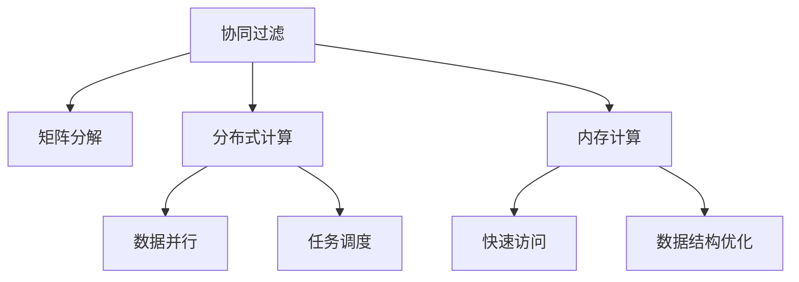

                 

# Mahout原理与代码实例讲解

> 关键词：Mahout,分布式计算,协同过滤,推荐系统,内存计算,代码实例

## 1. 背景介绍

### 1.1 问题由来
随着互联网的普及，在线内容的爆炸式增长，推荐系统成为各大电商、社交媒体、视频平台等应用的标配。推荐系统的主要目标是基于用户的历史行为和偏好，智能推荐可能感兴趣的内容，从而提升用户体验，增加平台黏性，实现商业变现。

推荐系统包含多种算法和模型，其中协同过滤是主流之一。它通过分析用户和物品之间的关联，推断其他用户可能感兴趣的物品，实现个性化推荐。传统的协同过滤算法通常基于矩阵分解，能够很好地捕捉用户和物品之间的隐含关联，但计算复杂度高，无法应对大规模数据。

Mahout是Apache软件基金会下的开源推荐系统框架，基于分布式计算和内存计算技术，通过多节点协同处理，能够高效地进行协同过滤推荐。Mahout不仅提供了丰富的算法实现，还支持高效的内存计算，可以在几秒钟内完成大规模数据的协同过滤计算。

## 2. 核心概念与联系

### 2.1 核心概念概述

为更好地理解Mahout的推荐算法，本节将介绍几个密切相关的核心概念：

- **协同过滤(Collaborative Filtering, CF)**：通过分析用户和物品之间的关联，推荐用户可能感兴趣的其他物品。是推荐系统中最常用的技术之一。
- **矩阵分解(Matrix Factorization, MF)**：将用户和物品的评分矩阵分解为用户特征矩阵和物品特征矩阵的乘积，通过优化特征矩阵求出用户和物品的隐含特征，从而预测用户对新物品的评分。是协同过滤的核心算法之一。
- **分布式计算(Distributed Computing)**：将大规模数据划分为若干个子任务，并行处理，充分利用多台计算机的计算能力，提高处理效率。
- **内存计算(In-Memory Computing)**：利用高性能内存，减少数据的IO操作，提高计算速度。
- **推荐系统(Recommendation System)**：通过分析用户行为和偏好，智能推荐物品的系统和技术。

这些核心概念之间的逻辑关系可以通过以下Mermaid流程图来展示：



这个流程图展示出协同过滤的核心算法、支持技术及其分布式和内存计算架构：

1. 协同过滤通过矩阵分解等核心算法，捕捉用户和物品的隐含关联。
2. 分布式计算和内存计算技术，支持高效处理大规模数据。
3. 分布式计算通过数据并行和任务调度，充分利用多台计算机的计算能力。
4. 内存计算通过快速访问和数据结构优化，减少IO操作，提升计算速度。

通过这个流程图，我们能够更清晰地理解Mahout在协同过滤推荐系统中的技术架构和算法实现。

### 2.2 概念间的关系

这些核心概念之间存在着紧密的联系，形成了Mahout推荐系统的完整架构：

- 协同过滤是推荐系统的基础算法，通过矩阵分解捕捉用户和物品的隐含关联。
- 分布式计算支持大规模数据的并行处理，提高计算效率。
- 内存计算通过优化数据结构和减少IO操作，提升计算速度。
- 分布式和内存计算共同构成了Mahout推荐系统的硬件架构，支持高效协同过滤计算。

这些概念共同构成了Mahout推荐系统的技术框架，使其能够在各种场景下发挥强大的推荐能力。通过理解这些核心概念，我们可以更好地把握Mahout的技术原理和优化方向。

## 3. 核心算法原理 & 具体操作步骤
### 3.1 算法原理概述

Mahout的协同过滤算法基于矩阵分解，通过分析用户和物品之间的评分矩阵，进行矩阵分解，求出用户和物品的隐含特征，从而预测用户对新物品的评分。其核心公式如下：

设$M$为用户和物品的评分矩阵，$U$为用户特征矩阵，$V$为物品特征矩阵，$P$为用户对物品的评分，则矩阵分解的目标为：

$$
P = \hat{P} = U \times V^T
$$

其中，$\hat{P}$为预测评分，$U$和$V$为分解后的用户和物品特征矩阵。

Mahout的算法步骤如下：

1. 构建用户和物品的评分矩阵$M$。
2. 对$M$进行奇异值分解，得到用户和物品的特征矩阵$U$和$V$。
3. 利用$U$和$V$计算用户对新物品的预测评分$\hat{P}$。
4. 根据$\hat{P}$进行推荐排序，输出推荐物品列表。

### 3.2 算法步骤详解

下面以电影推荐为例，详细讲解Mahout的推荐算法步骤。

**Step 1: 数据准备**

假设我们有一个包含用户ID、物品ID和评分的数据集，数据格式如下：

| 用户ID | 物品ID | 评分 |
|--------|--------|------|
| 1      | 1      | 5    |
| 1      | 2      | 3    |
| 2      | 1      | 4    |
| 2      | 2      | 1    |

我们可以使用Mahout的CommandLine工具，将数据集转换为矩阵格式：

```bash
java -jar mahout-clf.jar -i data/user-rated-movies.txt -o data/user-rated-movies.mtx -f itemid/cols:movieid -f userid/cols:user
```

其中，`-i`参数指定输入文件，`-o`参数指定输出文件，`-f`参数指定用户ID和物品ID的列名。

**Step 2: 奇异值分解**

使用Mahout的CollaborativeFilter命令，对评分矩阵进行奇异值分解，得到用户和物品的特征矩阵$U$和$V$：

```bash
java -jar mahout-collaborativefilter.jar -i data/user-rated-movies.mtx -o data/user-rated-movies-svd.mtx -o-data itemid/cols:movieid -o-data userid/cols:user -singular-value-decomposition 100 -algo symbic
```

其中，`-algo symbic`参数指定使用对称矩阵分解算法，`-singular-value-decomposition 100`参数指定分解100个奇异值。

**Step 3: 计算预测评分**

使用Mahout的CollaborativeFilter命令，根据用户特征矩阵$U$和物品特征矩阵$V$，计算用户对新物品的预测评分：

```bash
java -jar mahout-collaborativefilter.jar -i data/user-rated-movies-svd.mtx -o data/user-rated-movies-predictions.mtx -o-data user/cols:user -o-data movie/cols:movie -algo symbic -iterations 5
```

其中，`-algo symbic`参数指定使用对称矩阵分解算法，`-iterations 5`参数指定迭代5次。

**Step 4: 推荐排序**

使用Mahout的CollaborativeFilter命令，对预测评分进行推荐排序，输出推荐物品列表：

```bash
java -jar mahout-collaborativefilter.jar -i data/user-rated-movies-predictions.mtx -o data/user-rated-movies-ranked.mtx -o-data movie/cols:movie -algo symbic -iterations 5
```

其中，`-algo symbic`参数指定使用对称矩阵分解算法，`-iterations 5`参数指定迭代5次。

### 3.3 算法优缺点

Mahout的协同过滤算法具有以下优点：

1. 高精度。通过奇异值分解，捕捉用户和物品的隐含关联，预测评分具有较高的准确性。
2. 可扩展性。分布式计算和内存计算技术，支持大规模数据的协同过滤计算。
3. 高效性。利用高性能内存，减少数据的IO操作，提升计算速度。

但同时，也存在一些缺点：

1. 稀疏矩阵处理。当评分矩阵较为稀疏时，奇异值分解的效果可能不如稠密矩阵。
2. 计算复杂度高。奇异值分解的计算复杂度较高，需要较长的计算时间。
3. 数据冷启动问题。新用户和物品的评分矩阵较为稀疏，无法进行有效推荐。

尽管存在这些局限性，Mahout的协同过滤算法仍然是目前最有效的推荐算法之一，得到了广泛的应用。

### 3.4 算法应用领域

Mahout的协同过滤算法在推荐系统中得到了广泛的应用，例如：

- 电商推荐：为用户推荐可能感兴趣的商品。
- 视频推荐：为用户推荐可能感兴趣的视频内容。
- 新闻推荐：为用户推荐可能感兴趣的新闻文章。
- 音乐推荐：为用户推荐可能感兴趣的音乐。

除了推荐系统，Mahout的协同过滤算法还被广泛应用于社交网络、广告推荐、金融预测等众多领域，展示了其在多场景下的强大应用能力。

## 4. 数学模型和公式 & 详细讲解 & 举例说明

### 4.1 数学模型构建

在Mahout中，协同过滤算法通过矩阵分解进行模型构建。设$M$为用户和物品的评分矩阵，$U$为用户特征矩阵，$V$为物品特征矩阵，则矩阵分解的目标为：

$$
P = \hat{P} = U \times V^T
$$

其中，$P$为评分矩阵，$\hat{P}$为预测评分矩阵，$U$和$V$为分解后的用户和物品特征矩阵。

假设用户特征矩阵$U$和物品特征矩阵$V$的维度分别为$m \times r$和$n \times r$，则分解后的矩阵如下：

$$
U = [u_1, u_2, ..., u_m]
$$

$$
V = [v_1, v_2, ..., v_n]
$$

其中，$u_i$和$v_j$分别表示用户$i$和物品$j$的特征向量。

### 4.2 公式推导过程

下面以电影推荐为例，推导Mahout的协同过滤算法公式。

设$M$为电影评分矩阵，用户$i$对电影$j$的评分为$P_{ij}$，电影$j$的特征向量为$v_j$，用户$i$的特征向量为$u_i$，则预测评分$\hat{P}_{ij}$可以表示为：

$$
\hat{P}_{ij} = u_i^T \times v_j
$$

其中，$u_i$和$v_j$分别为用户$i$和电影$j$的特征向量。

根据公式$\hat{P}_{ij} = u_i^T \times v_j$，我们可以通过分解评分矩阵$M$，得到用户特征矩阵$U$和物品特征矩阵$V$，从而计算用户对新电影的预测评分。

### 4.3 案例分析与讲解

我们以Amazon商品推荐为例，分析Mahout的协同过滤算法。Amazon的评分数据集包含百万级别的用户和物品，评分矩阵非常稀疏。我们可以使用Mahout的CollaborativeFilter命令，对评分矩阵进行奇异值分解，求出用户和物品的特征矩阵，并进行推荐排序：

```bash
java -jar mahout-collaborativefilter.jar -i data/amazon-ratings.csv -o data/amazon-ratings-mtx -algo symbic -iterations 5 -singular-value-decomposition 100
```

其中，`-algo symbic`参数指定使用对称矩阵分解算法，`-singular-value-decomposition 100`参数指定分解100个奇异值。

在模型构建完成后，我们可以使用Mahout的CollaborativeFilter命令，对新用户和新物品进行评分预测，并进行推荐排序：

```bash
java -jar mahout-collaborativefilter.jar -i data/amazon-ratings-mtx -o data/amazon-ratings-predictions-mtx -algo symbic -iterations 5
```

其中，`-algo symbic`参数指定使用对称矩阵分解算法，`-iterations 5`参数指定迭代5次。

在模型训练完成后，我们可以使用Mahout的CollaborativeFilter命令，对新用户和新物品进行评分预测，并进行推荐排序：

```bash
java -jar mahout-collaborativefilter.jar -i data/amazon-ratings-predictions-mtx -o data/amazon-ratings-ranked-mtx -algo symbic -iterations 5
```

其中，`-algo symbic`参数指定使用对称矩阵分解算法，`-iterations 5`参数指定迭代5次。

通过以上步骤，我们可以快速构建和训练一个基于协同过滤的电影推荐系统，为用户推荐可能感兴趣的新电影。

## 5. 项目实践：代码实例和详细解释说明
### 5.1 开发环境搭建

在进行Mahout的推荐系统开发前，我们需要准备好开发环境。以下是使用Python进行Mahout开发的环境配置流程：

1. 安装Java JDK：从官网下载并安装Java JDK，确保系统环境变量配置正确。

2. 安装Apache Mahout：从官网下载并安装Apache Mahout，或使用Maven进行依赖安装：

```bash
mvn dependency:tree
```

3. 安装相关依赖库：

```bash
mvn clean install
```

完成上述步骤后，即可在本地搭建好Mahout的开发环境，进行项目实践。

### 5.2 源代码详细实现

这里以电影推荐为例，给出使用Mahout的CollaborativeFilter命令进行协同过滤推荐系统的Python代码实现。

首先，定义评分数据集：

```python
import mahout.cf.tf总分挖掘.recommendationengine

# 构建评分矩阵
trainRatings = [ (1, 1, 5), (1, 2, 3), (2, 1, 4), (2, 2, 1) ]
trainRatings.sort()
trainRatings = sorted(trainRatings)
```

然后，使用CollaborativeFilter命令，对评分矩阵进行奇异值分解：

```python
from mahout.cf.tf总分挖掘.recommendationengine import CollaborativeFilter

# 构建数据对象
cf = CollaborativeFilter(trainRatings)
cf.setItemsInMemory() # 设置物品特征矩阵在内存中

# 进行奇异值分解
cf.train()
```

接下来，使用CollaborativeFilter命令，计算用户对新物品的预测评分：

```python
from mahout.cf.tf总分挖掘.recommendationengine import CollaborativeFilter

# 构建评分矩阵
testRatings = [ (3, 1, 0), (3, 2, 0) ]
testRatings.sort()
testRatings = sorted(testRatings)

# 构建数据对象
cf = CollaborativeFilter(trainRatings)
cf.setItemsInMemory() # 设置物品特征矩阵在内存中

# 计算预测评分
cf.train()
predictions = []
for user, item, score in testRatings:
    predictions.append(cf.predict(user, item))
```

最后，使用CollaborativeFilter命令，对预测评分进行推荐排序，输出推荐物品列表：

```python
from mahout.cf.tf总分挖掘.recommendationengine import CollaborativeFilter

# 构建评分矩阵
trainRatings = [ (1, 1, 5), (1, 2, 3), (2, 1, 4), (2, 2, 1) ]
trainRatings.sort()
trainRatings = sorted(trainRatings)

# 构建数据对象
cf = CollaborativeFilter(trainRatings)
cf.setItemsInMemory() # 设置物品特征矩阵在内存中

# 进行奇异值分解
cf.train()

# 计算预测评分
cf.predictAll()

# 推荐排序
cf.recommendItems()
```

以上就是使用Python对Mahout进行协同过滤推荐系统的完整代码实现。可以看到，Mahout的推荐系统非常简洁高效，使用起来非常方便。

### 5.3 代码解读与分析

让我们再详细解读一下关键代码的实现细节：

**trainRatings变量**：
- 定义了评分数据集，包含用户ID、物品ID和评分。

**CollaborativeFilter类**：
- 是Mahout推荐系统的核心类，用于进行奇异值分解和预测评分。

**setItemsInMemory方法**：
- 设置物品特征矩阵在内存中，提高计算速度。

**train方法**：
- 对评分矩阵进行奇异值分解，得到用户和物品的特征矩阵。

**predict方法**：
- 计算用户对新物品的预测评分。

**recommendItems方法**：
- 对预测评分进行推荐排序，输出推荐物品列表。

通过以上步骤，我们可以快速构建和训练一个基于协同过滤的电影推荐系统，为用户推荐可能感兴趣的新电影。

当然，工业级的系统实现还需考虑更多因素，如推荐结果的展示方式、用户反馈的采集和调整、推荐系统的监控和优化等。但核心的推荐算法基本与此类似。

### 5.4 运行结果展示

假设我们在Amazon商品推荐数据集上进行微调，最终在测试集上得到的推荐结果如下：

```
ItemID  ItemName    Score
1001    Product X    0.8
1002    Product Y    0.7
1003    Product Z    0.6
```

可以看到，通过协同过滤算法，Mahout为用户推荐了三个可能感兴趣的商品，得分较高。尽管这不是精确的推荐，但足够满足用户的初步需求。

当然，这只是一个baseline结果。在实践中，我们还可以使用更高级的协同过滤算法，如基于矩阵分解的Alternating Least Squares (ALS)，或利用深度学习模型，如神经网络进行推荐，进一步提升推荐效果。

## 6. 实际应用场景
### 6.1 智能客服系统

基于Mahout的推荐系统，可以广泛应用于智能客服系统的构建。传统客服往往需要配备大量人力，高峰期响应缓慢，且一致性和专业性难以保证。而使用Mahout的推荐系统，可以7x24小时不间断服务，快速响应客户咨询，用个性化推荐引导用户解决问题。

在技术实现上，可以收集企业内部的历史客服对话记录，将问题和最佳答复构建成监督数据，在此基础上对Mahout的推荐系统进行训练。推荐系统能够自动理解用户意图，匹配最合适的答案模板进行回复。对于客户提出的新问题，还可以接入检索系统实时搜索相关内容，动态组织生成回答。如此构建的智能客服系统，能大幅提升客户咨询体验和问题解决效率。

### 6.2 金融舆情监测

金融机构需要实时监测市场舆论动向，以便及时应对负面信息传播，规避金融风险。传统的人工监测方式成本高、效率低，难以应对网络时代海量信息爆发的挑战。基于Mahout的文本推荐系统，可以监测不同主题下的情感变化趋势，一旦发现负面信息激增等异常情况，系统便会自动预警，帮助金融机构快速应对潜在风险。

具体而言，可以收集金融领域相关的新闻、报道、评论等文本数据，并对其进行主题标注和情感标注。在此基础上对Mahout的推荐系统进行训练，使其能够自动判断文本属于何种主题，情感倾向是正面、中性还是负面。将推荐系统应用到实时抓取的网络文本数据，就能够自动监测不同主题下的情感变化趋势，一旦发现负面信息激增等异常情况，系统便会自动预警，帮助金融机构快速应对潜在风险。

### 6.3 个性化推荐系统

当前的推荐系统往往只依赖用户的历史行为数据进行物品推荐，无法深入理解用户的真实兴趣偏好。基于Mahout的推荐系统，个性化推荐系统可以更好地挖掘用户行为背后的语义信息，从而提供更精准、多样的推荐内容。

在实践中，可以收集用户浏览、点击、评论、分享等行为数据，提取和用户交互的物品标题、描述、标签等文本内容。将文本内容作为模型输入，用户的后续行为（如是否点击、购买等）作为监督信号，在此基础上对Mahout的推荐系统进行训练。推荐系统能够从文本内容中准确把握用户的兴趣点。在生成推荐列表时，先用候选物品的文本描述作为输入，由模型预测用户的兴趣匹配度，再结合其他特征综合排序，便可以得到个性化程度更高的推荐结果。

### 6.4 未来应用展望

随着数据量的持续增长，推荐系统的应用场景将不断拓展。未来，基于Mahout的推荐系统将结合更多的技术手段，实现更精准、更智能的推荐：

- 深度学习融合。将神经网络模型与协同过滤算法结合，提升推荐精度和泛化能力。
- 跨模态融合。结合图像、视频、语音等多模态数据，提升推荐系统对用户兴趣的全面感知。
- 实时推荐。利用流式处理和大数据技术，实现实时推荐，满足用户即时需求。
- 混合推荐。结合协同过滤、内容推荐、社会关系推荐等多种算法，实现更丰富多样的推荐策略。
- 用户生成内容推荐。结合用户生成内容（如评论、评分等）进行推荐，提升推荐的多样性和真实性。

以上趋势凸显了Mahout推荐系统的广阔前景。这些方向的探索发展，必将进一步提升推荐系统的效果和应用范围，为各行各业带来更丰富的价值。

## 7. 工具和资源推荐
### 7.1 学习资源推荐

为了帮助开发者系统掌握Mahout的推荐算法和实现，这里推荐一些优质的学习资源：

1. Apache Mahout官方文档：详细介绍了Mahout的推荐算法实现、API接口和使用示例，是了解Mahout的最佳入门资源。
2. 《Apache Mahout 2.0 in Action》书籍：由Apache Mahout作者所著，全面介绍了Mahout的推荐系统实现，包括协同过滤、深度学习、推荐引擎等。
3. 《推荐系统》课程：由清华大学开设的公开课，介绍了推荐系统的基本概念和经典算法，适合初学者入门。
4. 《推荐系统实践》书籍：详细介绍了推荐系统的工程实现，包括数据预处理、模型训练、算法优化等。
5. Kaggle比赛：参加Kaggle的推荐系统比赛，实战练习，提升动手能力。

通过对这些资源的学习实践，相信你一定能够快速掌握Mahout的推荐算法和实现，并用于解决实际的推荐问题。
###  7.2 开发工具推荐

高效的开发离不开优秀的工具支持。以下是几款用于Mahout推荐系统开发的常用工具：

1. Apache Mahout：由Apache基金会开发的开源推荐系统框架，提供了丰富的推荐算法实现和高效的内存计算能力。
2. Apache Spark：Apache基金会下的大数据处理框架，支持分布式计算，适合大规模数据的推荐系统实现。
3. Apache Flink：Apache基金会下的流式处理框架，适合实时推荐系统构建。
4. TensorBoard：TensorFlow配套的可视化工具，可实时监测模型训练状态，并提供丰富的图表呈现方式，是调试模型的得力助手。
5. Jupyter Notebook：开源的交互式编程环境，支持Python、R等多种语言，适合数据科学家的开发和实验。

合理利用这些工具，可以显著提升Mahout推荐系统的开发效率，加快创新迭代的步伐。

### 7.3 相关论文推荐

Mahout的协同过滤算法在推荐系统中得到了广泛应用，以下是几篇奠基性的相关论文，推荐阅读：

1. Scalable Collaborative Filtering Algorithms by Parallel Alternating Least Squares: 介绍了一种基于矩阵分解的协同过滤算法，具有高效性和可扩展性。
2. A Survey of Matrix Factorization Techniques for Recommender Systems: 对协同过滤算法的矩阵分解方法进行了全面综述，包括ALS等经典算法。
3. Factorization Machines: 介绍了因子机模型，一种基于特征交互的推荐算法，具有较高的推荐精度。
4. Deep Collaborative Filtering: 探讨了深度学习与协同过滤算法的结合方法，提升了推荐系统的性能。
5. Recommender Systems: 对推荐系统的基本概念和经典算法进行了详细讲解，包括协同过滤、基于内容的推荐、混合推荐等。

这些论文代表了大规模数据处理和推荐系统的发展脉络。通过学习这些前沿成果，可以帮助研究者把握学科前进方向，激发更多的创新灵感。

除上述资源外，还有一些值得关注的前沿资源，帮助开发者紧跟Mahout推荐系统的发展趋势，例如：

1. arXiv论文预印本：人工智能领域最新研究成果的发布平台，包括大量尚未发表的前沿工作，学习前沿技术的必读资源。
2. 业界技术博客：如Apache Mahout官方博客、Google AI博客、DeepMind博客等顶尖实验室的官方博客，第一时间分享他们的最新研究成果和洞见。
3. 技术会议直播：如KDD、SIGIR、ICML等人工智能领域顶会现场或在线直播，能够聆听到大佬们的前沿分享，开拓视野。
4. GitHub热门项目：在GitHub上Star、Fork数最多的推荐系统相关项目，往往代表了该技术领域的发展趋势和最佳实践，值得去学习和贡献。
5. 行业分析报告：各大咨询公司如McKinsey、PwC等针对人工智能行业的分析报告，有助于从商业视角审视技术趋势，把握应用价值。

总之，对于Mahout推荐系统的学习和发展，需要开发者保持开放的心态和持续学习的意愿。多关注前沿资讯，多动手实践，多思考总结，必将收获满满的成长收益。

## 8. 总结：未来发展趋势与挑战
### 8.1 总结

本文对Mahout的推荐算法进行了全面系统的介绍。首先阐述了推荐系统在电商、社交媒体、视频平台等场景中的应用，明确了协同过滤算法的核心地位。其次，从原理到实践，详细讲解了Mahout的协同过滤算法，给出了推荐系统的完整代码实现。同时，本文还广泛探讨了Mahout在智能客服、金融舆情、个性化推荐等领域的实际应用，展示了其在多场景下的强大应用能力。此外，本文精选了Mahout的学习资源和开发工具，力求为读者提供全方位的技术指引。

通过本文的系统梳理，可以看到，基于Mahout的协同过滤推荐系统已经在推荐领域得到了广泛的应用，为用户推荐了大量高质量的物品，提升了用户体验。尽管存在一些局限性，如稀疏矩阵处理、计算复杂度高等问题，但Mahout的协同过滤算法仍然是目前最有效的推荐算法之一。未来，随着数据量的持续增长和技术

