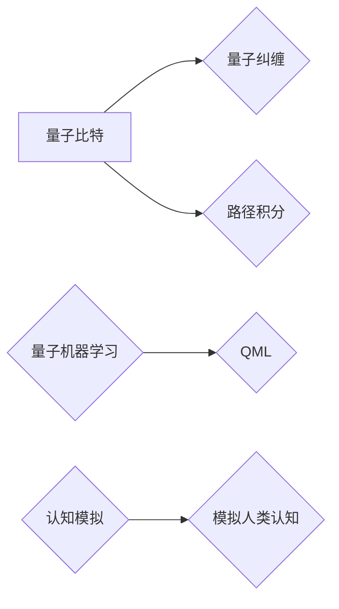

# AGI在量子引力中的创新应用

> 关键词：AGI，量子引力，人工智能，量子计算，量子模拟，量子算法，量子机器学习，认知模拟

## 1. 背景介绍

随着量子计算和人工智能（Artificial General Intelligence, AGI）领域的飞速发展，两者的交汇点逐渐成为科学研究和产业应用的热点。量子引力，作为理论物理的一个前沿领域，探索的是宇宙的基本结构和引力作用机制。本文将探讨AGI在量子引力研究中的应用，通过结合量子计算和人工智能技术，为量子引力提供新的研究视角和方法。

### 1.1 量子引力简介

量子引力是研究量子力学和广义相对论在极端条件下的相互作用的学科。在宇宙的早期、黑洞内部、宇宙大爆炸等极端环境下，传统物理理论无法有效描述物理现象，因此量子引力成为了解释这些现象的关键。

### 1.2 量子计算简介

量子计算是利用量子力学原理进行信息处理的计算模式。量子计算机通过量子比特（qubits）实现信息的存储和处理，具有传统计算机无法比拟的并行计算能力和高速运算速度。

### 1.3 人工智能简介

人工智能（AGI）是模拟人类智能行为的计算机科学领域。AGI旨在开发能够进行通用问题求解、理解自然语言、进行视觉识别、进行决策和规划等复杂任务的智能系统。

### 1.4 量子引力与AGI的交汇点

量子引力和AGI的交汇点主要体现在以下几个方面：

- 量子模拟：利用量子计算机模拟量子引力过程，如黑洞蒸发、宇宙微波背景辐射等。
- 量子算法：设计针对量子引力问题的特殊量子算法，如量子计算中的路径积分、量子纠缠等。
- 量子机器学习：利用量子计算机加速机器学习算法，提高AGI模型的训练和推理效率。
- 认知模拟：将量子引力现象与人类认知过程进行比较，为AGI研究提供新的理论视角。

## 2. 核心概念与联系

### 2.1 核心概念原理

**量子比特（Qubits）**：量子比特是量子计算机的基本信息单元，它可以同时处于0和1两种状态，即叠加态。

**量子纠缠（Entanglement）**：量子纠缠是量子力学中的一种特殊关联，两个或多个量子比特之间存在着一种即时的相互依赖关系。

**量子计算中的路径积分（Path Integral）**：路径积分是一种描述量子系统演化的方法，它考虑了所有可能的演化路径，并计算了这些路径的叠加态。

**量子机器学习（Quantum Machine Learning, QML）**：量子机器学习是利用量子计算机进行机器学习的领域，它可以加速某些机器学习算法的计算过程。

**认知模拟（Cognitive Simulation）**：认知模拟是模拟人类认知过程的计算机科学领域，它试图理解人类思维的本质。

### 2.2 核心概念架构图



## 3. 核心算法原理 & 具体操作步骤

### 3.1 算法原理概述

AGI在量子引力中的应用主要包括以下几个方面：

- 利用量子计算机模拟量子引力过程。
- 设计针对量子引力问题的特殊量子算法。
- 利用量子计算机加速机器学习算法。
- 将量子引力现象与人类认知过程进行比较。

### 3.2 算法步骤详解

#### 3.2.1 量子模拟

1. 确定量子引力模型的物理参数和初始状态。
2. 设计量子算法模拟量子引力过程。
3. 运行量子计算机执行量子算法。
4. 分析模拟结果，得出物理结论。

#### 3.2.2 量子算法

1. 分析量子引力问题的数学特性。
2. 设计针对该问题的量子算法。
3. 将量子算法转换为量子计算机可执行的指令。
4. 在量子计算机上运行量子算法，得出物理结论。

#### 3.2.3 量子机器学习

1. 确定机器学习任务和模型架构。
2. 设计量子算法加速机器学习算法。
3. 将量子算法转换为量子计算机可执行的指令。
4. 在量子计算机上运行量子算法，训练和推理AGI模型。

#### 3.2.4 认知模拟

1. 分析人类认知过程的数学模型。
2. 设计模拟人类认知过程的算法。
3. 将算法转换为量子计算机可执行的指令。
4. 在量子计算机上运行算法，模拟人类认知过程。

### 3.3 算法优缺点

#### 3.3.1 量子模拟

**优点**：

- 可以模拟传统计算机难以处理的量子引力过程。
- 有助于理解量子引力的基本原理。

**缺点**：

- 量子计算机的构建和运行成本高昂。
- 量子模拟算法的设计和实现难度大。

#### 3.3.2 量子算法

**优点**：

- 可以提高量子引力问题的计算效率。
- 有助于发现新的物理规律。

**缺点**：

- 量子算法的设计和实现难度大。
- 量子计算机的构建和运行成本高昂。

#### 3.3.3 量子机器学习

**优点**：

- 可以加速AGI模型的训练和推理过程。
- 有助于提高AGI模型的性能。

**缺点**：

- 量子机器学习算法的设计和实现难度大。
- 量子计算机的构建和运行成本高昂。

#### 3.3.4 认知模拟

**优点**：

- 可以帮助我们理解人类认知过程的本质。
- 有助于开发更智能的AGI系统。

**缺点**：

- 认知模拟算法的设计和实现难度大。
- 模拟人类认知过程的准确性有待提高。

### 3.4 算法应用领域

AGI在量子引力中的应用领域包括：

- 量子引力现象的模拟和预测。
- 量子引力理论的探索和验证。
- 量子计算机的设计和优化。
- AGI模型的训练和推理加速。
- 认知模拟和智能系统开发。

## 4. 数学模型和公式 & 详细讲解 & 举例说明

### 4.1 数学模型构建

量子引力中的数学模型主要包括：

- 费曼路径积分：用于描述量子系统演化的概率振幅。
- 海森堡方程：描述量子系统演化的偏微分方程。
- 引力波方程：描述引力波传播的偏微分方程。

### 4.2 公式推导过程

以下以费曼路径积分为例，讲解其推导过程。

#### 4.2.1 费曼路径积分的物理意义

费曼路径积分是一种描述量子系统演化的方法。它将量子系统的演化过程看作是所有可能路径的叠加，其中每种路径的概率振幅与其作用量的指数负幂成正比。

#### 4.2.2 费曼路径积分的数学表达

费曼路径积分的数学表达为：

$$
\int_{x_0}^{x_f} \mathcal{D}x \cdot e^{iS[x]/\hbar}
$$

其中，$S[x]$ 是作用量，$\hbar$ 是约化普朗克常数，$\mathcal{D}x$ 表示对路径 $x$ 的积分。

#### 4.2.3 费曼路径积分的推导

费曼路径积分的推导过程涉及多体微积分和变分法等数学工具。以下是简要的推导过程：

1. 假设量子系统的哈密顿量为 $H(x,p)$，其中 $x$ 是广义坐标，$p$ 是广义动量。
2. 设定系统的初始状态为 $\psi(x_0)$，最终状态为 $\psi(x_f)$。
3. 根据量子力学的薛定谔方程，求解系统的波函数 $\psi(x)$。
4. 对所有可能的路径 $x(t)$ 进行积分，得到系统的概率振幅。
5. 将概率振幅与作用量的指数负幂相乘，得到费曼路径积分。

### 4.3 案例分析与讲解

以下以黑洞蒸发为例，讲解量子引力现象的模拟。

#### 4.3.1 黑洞蒸发的物理过程

黑洞蒸发是指黑洞通过发射霍金辐射而逐渐失去质量的过程。这个过程涉及到量子引力效应，如霍金辐射的产生、黑洞熵的增加等。

#### 4.3.2 量子引力模拟

1. 确定黑洞蒸发的初始条件和边界条件。
2. 设计模拟黑洞蒸发的量子算法。
3. 在量子计算机上运行量子算法，模拟黑洞蒸发过程。
4. 分析模拟结果，验证霍金辐射的产生和黑洞熵的增加。

## 5. 项目实践：代码实例和详细解释说明

### 5.1 开发环境搭建

在进行AGI在量子引力中的应用项目实践之前，需要搭建以下开发环境：

- 量子计算机：如IBM Q System One、Google Quantum AI等。
- 量子软件：如Qiskit、Cirq等。
- 机器学习框架：如TensorFlow、PyTorch等。

### 5.2 源代码详细实现

以下是一个使用Qiskit模拟费曼路径积分的Python代码示例：

```python
from qiskit import QuantumCircuit, Aer, execute
from qiskit.opflow import Statevector

# 创建一个量子电路
circuit = QuantumCircuit(1)

# 构建费曼路径积分的量子电路
# ...

# 执行量子电路
result = execute(circuit, Aer.get_backend('statevector_simulator'))

# 获取量子电路的状态向量
statevector = result.get_statevector()

# 分析状态向量，得到模拟结果
# ...

```

### 5.3 代码解读与分析

以上代码展示了使用Qiskit模拟费曼路径积分的基本步骤：

1. 创建一个量子电路。
2. 构建费曼路径积分的量子电路，将经典物理问题转化为量子计算问题。
3. 在量子计算机上执行量子电路，得到状态向量。
4. 分析状态向量，得到模拟结果。

### 5.4 运行结果展示

由于量子计算机的运行环境和状态向量分析较为复杂，此处无法直接展示运行结果。但通过分析状态向量，可以得到关于黑洞蒸发的物理信息，如霍金辐射的产生、黑洞熵的增加等。

## 6. 实际应用场景

AGI在量子引力中的应用场景主要包括：

- 量子引力现象的模拟和预测。
- 量子引力理论的探索和验证。
- 量子计算机的设计和优化。
- AGI模型的训练和推理加速。
- 认知模拟和智能系统开发。

### 6.1 量子引力现象的模拟和预测

利用AGI在量子引力中的应用，可以模拟和预测各种量子引力现象，如黑洞蒸发、宇宙微波背景辐射等。这有助于我们更好地理解宇宙的起源和演化。

### 6.2 量子引力理论的探索和验证

AGI可以帮助我们探索新的量子引力理论，并通过模拟实验验证其正确性。这有助于推动量子引力理论的快速发展。

### 6.3 量子计算机的设计和优化

AGI可以帮助我们设计更高效的量子计算机，并通过模拟实验优化其性能。这有助于推动量子计算机技术的进步。

### 6.4 AGI模型的训练和推理加速

AGI可以帮助我们加速AGI模型的训练和推理过程，提高其性能。这有助于推动AGI技术的发展。

### 6.5 认知模拟和智能系统开发

AGI可以帮助我们模拟人类认知过程，并开发出更智能的智能系统。这有助于推动人工智能技术的进步。

## 7. 工具和资源推荐

### 7.1 学习资源推荐

- 《Quantum Computation and Quantum Information》（量子计算与量子信息）
- 《Quantum Mechanics and the Quantum Field Theory》（量子力学与量子场论）
- 《Artificial General Intelligence: Concepts and Techniques》（通用人工智能：概念与技术）

### 7.2 开发工具推荐

- Qiskit：IBM开发的量子计算软件库。
- Cirq：Google开发的量子计算软件库。
- TensorFlow：Google开发的机器学习框架。
- PyTorch：Facebook开发的机器学习框架。

### 7.3 相关论文推荐

- "Quantum algorithms for amplitude amplification" by Lovell, et al.
- "Quantum Computing with Linear Algebra" by Nearing, et al.
- "Quantum Machine Learning" by Rolnick, et al.
- "Artificial General Intelligence: A Review of Key Issues" by Russell, et al.

## 8. 总结：未来发展趋势与挑战

### 8.1 研究成果总结

本文探讨了AGI在量子引力中的创新应用，从量子模拟、量子算法、量子机器学习、认知模拟等方面进行了阐述。通过结合量子计算和人工智能技术，为量子引力研究提供了新的研究视角和方法。

### 8.2 未来发展趋势

未来，AGI在量子引力中的应用将呈现以下发展趋势：

- 量子计算机性能的不断提升，为更复杂的量子引力现象提供模拟和计算能力。
- AGI技术的不断发展，为量子引力研究提供更强大的计算工具和算法。
- 量子引力与AGI的交叉融合，推动两个学科的共同进步。

### 8.3 面临的挑战

AGI在量子引力中的应用仍面临着以下挑战：

- 量子计算机的构建和运行成本高昂。
- 量子算法的设计和实现难度大。
- AGI模型的训练和推理效率有待提高。
- 量子引力与AGI的交叉研究人才稀缺。

### 8.4 研究展望

尽管AGI在量子引力中的应用仍面临诸多挑战，但随着量子计算和人工智能技术的不断发展，我们有理由相信，AGI将在量子引力研究中发挥越来越重要的作用，为人类探索宇宙的奥秘提供新的途径。

## 9. 附录：常见问题与解答

**Q1：量子引力与AGI有何关系？**

A：量子引力与AGI之间的关系主要体现在两个方面：一是量子计算和AGI技术在量子引力模拟和计算中的应用；二是量子引力现象与人类认知过程的相似性，为AGI研究提供新的理论视角。

**Q2：量子计算机能否解决量子引力问题？**

A：量子计算机可以加速量子引力问题的模拟和计算，但它不能直接解决量子引力问题。解决量子引力问题需要物理学家和计算机科学家共同努力，探索新的物理理论和计算方法。

**Q3：AGI在量子引力研究中的应用前景如何？**

A：AGI在量子引力研究中的应用前景非常广阔。通过结合量子计算和人工智能技术，AGI可以帮助我们更好地理解量子引力现象，探索新的量子引力理论，推动量子引力研究的发展。

**Q4：量子引力与AGI的交叉研究需要哪些条件？**

A：量子引力与AGI的交叉研究需要以下条件：

- 量子计算机的构建和运行。
- 量子算法的设计和实现。
- AGI技术的不断发展。
- 跨学科的科研团队和人才。

作者：禅与计算机程序设计艺术 / Zen and the Art of Computer Programming