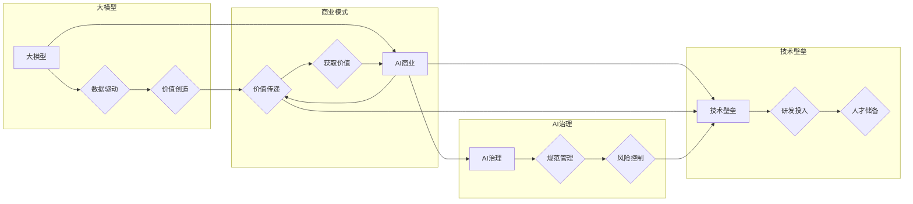

# AI 大模型原理与应用：大模型的商业模式和壁垒

> 关键词：大模型，AI商业，技术壁垒，商业模式，价值创造，数据驱动，AI治理

## 1. 背景介绍

近年来，随着计算能力的提升和大数据的积累，人工智能（AI）领域迎来了大模型时代。大模型，如GPT-3、BERT等，凭借其强大的学习能力和泛化能力，在自然语言处理、计算机视觉、语音识别等领域取得了显著进展。然而，大模型的开发和应用不仅仅是一个技术问题，更是一个复杂的商业模式和战略问题。本文将深入探讨大模型的原理、应用以及其背后的商业模式和壁垒。

## 2. 核心概念与联系

### 2.1 核心概念原理

**大模型**：指具有数十亿甚至数千亿参数的深度学习模型，能够处理大量数据并学习复杂的模式。

**AI商业**：指利用人工智能技术创造价值和利润的商业活动。

**技术壁垒**：指在特定领域内，由于技术难度、资金投入、人才储备等原因，其他竞争对手难以进入的领域。

**商业模式**：指企业通过提供产品或服务来创造价值、传递价值和获取价值的基本逻辑。

**数据驱动**：指企业通过收集、分析和利用数据来指导决策和优化业务。

**AI治理**：指对人工智能技术的应用进行规范和管理的制度安排。

### 2.2 核心概念架构的 Mermaid 流程图



## 3. 核心算法原理 & 具体操作步骤

### 3.1 算法原理概述

大模型的原理主要基于深度学习的多层神经网络，通过海量数据的训练，学习到复杂的特征表示和模式。其基本操作步骤如下：

1. 数据收集：收集大量相关领域的文本、图像、音频等数据。
2. 数据预处理：对数据进行清洗、标注和格式化。
3. 模型设计：设计具有数十亿甚至数千亿参数的神经网络模型。
4. 模型训练：使用大量数据进行训练，优化模型参数。
5. 模型评估：使用测试数据评估模型性能。
6. 模型部署：将模型部署到实际应用中。

### 3.2 算法步骤详解

1. **数据收集**：收集的数据类型取决于具体任务，如NLP任务可能需要大量文本数据，图像任务可能需要大量图像数据。

2. **数据预处理**：对数据进行清洗，去除噪声和冗余信息。对于标注数据，需要进行标注工作，如NLP中的文本分类任务需要对文本进行情感分析标注。

3. **模型设计**：选择合适的神经网络架构，如Transformer、CNN等，并确定模型层数和每层的参数数量。

4. **模型训练**：使用GPU或TPU等高性能计算设备进行模型训练，优化模型参数，使模型在训练数据上达到收敛。

5. **模型评估**：使用测试数据评估模型性能，选择性能指标，如准确率、召回率、F1值等。

6. **模型部署**：将训练好的模型部署到实际应用中，如网站、移动应用、服务器等。

### 3.3 算法优缺点

**优点**：

- **强大的学习能力**：大模型能够从海量数据中学习到复杂的特征表示和模式。
- **泛化能力强**：大模型在训练数据上学习到的知识可以迁移到其他相似任务上。
- **高效性**：大模型能够快速处理大规模数据。

**缺点**：

- **计算资源需求高**：大模型需要大量的计算资源进行训练和推理。
- **数据需求大**：大模型需要大量的数据才能达到较好的性能。
- **模型可解释性差**：大模型的内部决策过程难以解释。

### 3.4 算法应用领域

大模型的应用领域非常广泛，包括：

- **自然语言处理**：文本分类、情感分析、机器翻译、对话系统等。
- **计算机视觉**：图像分类、目标检测、图像分割等。
- **语音识别**：语音识别、语音合成等。
- **推荐系统**：个性化推荐、广告投放等。

## 4. 数学模型和公式 & 详细讲解 & 举例说明

### 4.1 数学模型构建

大模型的数学模型主要基于深度学习的多层神经网络。以下是一个简单的神经网络模型示例：

$$
h_{l+1} = \sigma(W_l h_l + b_l)
$$

其中 $h_l$ 表示第 $l$ 层的激活函数输出，$W_l$ 表示第 $l$ 层的权重，$b_l$ 表示第 $l$ 层的偏置，$\sigma$ 表示激活函数。

### 4.2 公式推导过程

以一个简单的全连接神经网络为例，其数学模型如下：

$$
y = f(W \cdot x + b)
$$

其中 $x$ 表示输入向量，$y$ 表示输出向量，$W$ 表示权重矩阵，$b$ 表示偏置向量，$f$ 表示激活函数。

### 4.3 案例分析与讲解

以下是一个使用PyTorch构建和训练简单神经网络模型的示例：

```python
import torch
import torch.nn as nn
import torch.optim as optim

# 定义神经网络模型
class SimpleNN(nn.Module):
    def __init__(self):
        super(SimpleNN, self).__init__()
        self.fc1 = nn.Linear(784, 500)
        self.fc2 = nn.Linear(500, 10)
    
    def forward(self, x):
        x = torch.relu(self.fc1(x))
        x = self.fc2(x)
        return x

# 创建模型实例
model = SimpleNN()

# 定义损失函数和优化器
criterion = nn.CrossEntropyLoss()
optimizer = optim.SGD(model.parameters(), lr=0.01)

# 训练模型
for epoch in range(10):
    for data, target in train_loader:
        optimizer.zero_grad()
        output = model(data)
        loss = criterion(output, target)
        loss.backward()
        optimizer.step()

# 评估模型
with torch.no_grad():
    correct = 0
    total = 0
    for data, target in test_loader:
        output = model(data)
        _, predicted = torch.max(output.data, 1)
        total += target.size(0)
        correct += (predicted == target).sum().item()

print('Test Accuracy of the model on the test images: {} %'.format(100 * correct / total))
```

## 5. 项目实践：代码实例和详细解释说明

### 5.1 开发环境搭建

在Python中，可以使用PyTorch框架进行大模型的开发。以下是在Python环境中搭建PyTorch开发环境的步骤：

1. 安装Anaconda：从Anaconda官网下载并安装Anaconda。
2. 创建虚拟环境：`conda create -n pytorch_env python=3.8`
3. 激活虚拟环境：`conda activate pytorch_env`
4. 安装PyTorch：`conda install pytorch torchvision torchaudio cudatoolkit=11.1 -c pytorch -c conda-forge`
5. 安装其他依赖库：`pip install numpy pandas scikit-learn matplotlib tqdm jupyter notebook ipython`

### 5.2 源代码详细实现

以下是一个使用PyTorch实现简单神经网络模型的示例：

```python
import torch
import torch.nn as nn
import torch.optim as optim

# 定义神经网络模型
class SimpleNN(nn.Module):
    def __init__(self):
        super(SimpleNN, self).__init__()
        self.fc1 = nn.Linear(784, 500)
        self.fc2 = nn.Linear(500, 10)
    
    def forward(self, x):
        x = torch.relu(self.fc1(x))
        x = self.fc2(x)
        return x

# 创建模型实例
model = SimpleNN()

# 定义损失函数和优化器
criterion = nn.CrossEntropyLoss()
optimizer = optim.SGD(model.parameters(), lr=0.01)

# 训练模型
for epoch in range(10):
    for data, target in train_loader:
        optimizer.zero_grad()
        output = model(data)
        loss = criterion(output, target)
        loss.backward()
        optimizer.step()

# 评估模型
with torch.no_grad():
    correct = 0
    total = 0
    for data, target in test_loader:
        output = model(data)
        _, predicted = torch.max(output.data, 1)
        total += target.size(0)
        correct += (predicted == target).sum().item()

print('Test Accuracy of the model on the test images: {} %'.format(100 * correct / total))
```

### 5.3 代码解读与分析

以上代码首先导入了PyTorch的相关模块，并定义了一个简单的神经网络模型`SimpleNN`。模型由两个全连接层组成，第一个全连接层将输入的784个特征映射到500个特征，第二个全连接层将500个特征映射到10个类别。

接着，定义了损失函数`nn.CrossEntropyLoss`和优化器`optim.SGD`。然后，通过遍历训练数据，使用梯度下降算法更新模型参数，使得模型在训练数据上的损失最小。

最后，使用测试数据评估模型的准确率。

## 6. 实际应用场景

### 6.1 自然语言处理

大模型在自然语言处理领域有着广泛的应用，如：

- **文本分类**：将文本数据分类为不同的类别，如新闻分类、情感分析等。
- **机器翻译**：将一种语言的文本翻译成另一种语言。
- **问答系统**：根据用户的问题，从知识库中检索出相应的答案。

### 6.2 计算机视觉

大模型在计算机视觉领域也有着广泛的应用，如：

- **图像分类**：将图像分类为不同的类别，如动物分类、物体检测等。
- **图像分割**：将图像分割成不同的区域，如语义分割、实例分割等。

### 6.3 语音识别

大模型在语音识别领域也有着广泛的应用，如：

- **语音识别**：将语音信号转换为文本。
- **语音合成**：将文本转换为语音。

## 7. 工具和资源推荐

### 7.1 学习资源推荐

- 《深度学习》[Goodfellow et al., 2016]
- 《动手学深度学习》[花书]
- 《PyTorch深度学习》[斋藤康毅]
- PyTorch官方文档：https://pytorch.org/docs/stable/
- TensorFlow官方文档：https://www.tensorflow.org/tutorials

### 7.2 开发工具推荐

- PyTorch：https://pytorch.org/
- TensorFlow：https://www.tensorflow.org/
- Jupyter Notebook：https://jupyter.org/

### 7.3 相关论文推荐

- Goodfellow, I., Bengio, Y., & Courville, A. (2016). Deep learning. MIT press.
- Vaswani, A., Shazeer, N., Parmar, N., Uszkoreit, J., Jones, L., Gomez, A. N., ... & Polosukhin, I. (2017). Attention is all you need. In Advances in neural information processing systems (pp. 5998-6008).
- Devlin, J., Chang, M. W., Lee, K., & Toutanova, K. (2018). BERT: Pre-training of deep bidirectional transformers for language understanding. In Proceedings of the 2019 conference of the north american chapter of the association for computational linguistics: human language technologies, volume 1 (long and short papers) (pp. 4171-4186).

## 8. 总结：未来发展趋势与挑战

### 8.1 研究成果总结

本文深入探讨了AI大模型的原理、应用以及其背后的商业模式和壁垒。通过介绍大模型的基本概念、原理和算法，分析了大模型在实际应用中的优势和应用场景。同时，本文还探讨了AI大模型的商业模式和面临的挑战，并给出了相应的解决方案。

### 8.2 未来发展趋势

1. **模型规模和性能的进一步提升**：随着计算能力的提升和算法的改进，大模型的规模和性能将进一步提升，能够处理更复杂的任务。
2. **多模态融合**：大模型将融合文本、图像、音频等多模态数据，实现更全面的智能感知和理解。
3. **可解释性和可控性**：随着AI技术的发展，大模型的可解释性和可控性将得到提升，使得AI更加安全可靠。
4. **AI治理**：随着AI技术的普及，AI治理将成为一个重要议题，需要制定相应的政策和法规来规范AI技术的应用。

### 8.3 面临的挑战

1. **数据隐私和安全**：大模型需要大量数据来训练，如何保护用户隐私和数据安全是一个重要挑战。
2. **算法偏见和歧视**：大模型可能会学习到数据中的偏见和歧视，需要进行有效的预防和缓解。
3. **计算资源消耗**：大模型需要大量的计算资源进行训练和推理，如何降低计算资源消耗是一个重要挑战。
4. **AI治理**：随着AI技术的普及，AI治理将成为一个重要议题，需要制定相应的政策和法规来规范AI技术的应用。

### 8.4 研究展望

未来，AI大模型将在以下方面取得进一步发展：

1. **开发更加高效和可解释的算法**：降低计算资源消耗，提高模型的可解释性和可控性。
2. **探索新的应用场景**：将大模型应用于更多领域，如医疗、金融、教育等。
3. **加强AI治理**：制定相应的政策和法规来规范AI技术的应用，确保AI技术的安全、可靠和公正。

## 9. 附录：常见问题与解答

**Q1：大模型是否适用于所有任务？**

A：大模型在许多任务上都表现出色，但并非所有任务都适合使用大模型。对于一些简单的任务，使用小模型或轻量级模型可能更加高效。

**Q2：如何评估大模型的性能？**

A：评估大模型的性能通常需要使用多个指标，如准确率、召回率、F1值等。同时，还需要考虑模型在测试数据上的表现。

**Q3：大模型的训练需要多少数据？**

A：大模型的训练需要大量数据，具体数据量取决于任务和数据集。

**Q4：如何解决大模型的过拟合问题？**

A：可以通过正则化、数据增强、集成学习等方法来解决大模型的过拟合问题。

**Q5：大模型如何部署到实际应用中？**

A：可以将大模型部署到服务器、移动设备或云端等平台。需要考虑模型的计算资源消耗和推理速度。

作者：禅与计算机程序设计艺术 / Zen and the Art of Computer Programming
