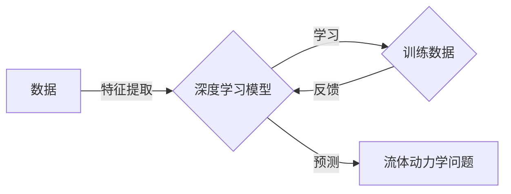

> 关键词：深度学习，流体动力学，神经网络，人工智能，数值模拟，机器学习，计算机模拟

# AI人工智能深度学习算法：在流体动力学中的应用

流体动力学是研究流体（液体和气体）运动的科学，它在工程、气象学、海洋学、航空航天等领域有着广泛的应用。随着计算能力的提升和深度学习技术的进步，深度学习算法在流体动力学中的应用日益增多，为解决复杂流体问题提供了新的途径。本文将探讨深度学习在流体动力学中的应用，包括其核心概念、算法原理、实践案例以及未来发展趋势。

## 1. 背景介绍

### 1.1 流体动力学挑战

传统的流体动力学研究依赖于数值模拟方法，如有限差分法、有限体积法等。这些方法虽然能够解决许多流体问题，但在处理复杂几何形状、多尺度流动、非线性动力学等方面仍存在挑战。例如：

- 复杂几何形状：流体动力学模型需要适应复杂的几何形状，如管道、翼型、涡轮叶片等，传统的数值方法在网格生成和适应性方面存在困难。
- 多尺度流动：许多流动问题涉及多尺度特征，如湍流、涡旋、边界层等，传统的数值方法难以捕捉这些细节。
- 非线性动力学：流体动力学中的非线性方程导致数值解的计算复杂性和数值误差。

### 1.2 深度学习优势

深度学习，特别是神经网络，为流体动力学研究带来了以下优势：

- 自动特征提取：深度学习模型能够自动从数据中提取特征，无需人工设计特征，适用于复杂几何形状和多尺度流动。
- 高度并行化：深度学习模型可以利用现代计算资源进行高度并行化计算，提高计算效率。
- 灵活性：深度学习模型能够适应不同的流体动力学问题，具有很高的灵活性。

## 2. 核心概念与联系

### 2.1 核心概念

**深度学习**：一种模拟人脑神经网络结构和功能的计算模型，能够从数据中自动学习和提取特征。

**神经网络**：由大量的神经元组成的计算模型，通过调整神经元之间的连接权重来学习数据中的模式。

**流体动力学**：研究流体（液体和气体）运动规律的科学，涉及连续介质力学、湍流理论、数值模拟等方法。

### 2.2 架构 Mermaid 流程图



## 3. 核心算法原理 & 具体操作步骤

### 3.1 算法原理概述

深度学习在流体动力学中的应用主要基于以下原理：

- **前向传播**：输入数据通过神经网络的前向传播路径，经过每一层神经元的非线性变换，最终得到输出结果。
- **反向传播**：根据输出结果与真实值的差异，通过反向传播算法计算损失函数的梯度，进而更新神经网络的权重。
- **优化算法**：使用梯度下降等优化算法，根据损失函数的梯度更新网络权重，最小化损失函数。

### 3.2 算法步骤详解

1. **数据准备**：收集流体动力学实验数据或模拟数据，包括几何形状、边界条件、初始条件等。
2. **特征提取**：使用深度学习模型从数据中自动提取特征。
3. **模型训练**：使用训练数据对深度学习模型进行训练，通过反向传播算法更新模型权重。
4. **模型评估**：使用验证数据评估模型的性能，调整模型结构和参数。
5. **模型应用**：将训练好的模型应用于流体动力学问题求解，如预测流动速度、压力分布等。

### 3.3 算法优缺点

**优点**：

- 自动特征提取，无需人工设计特征。
- 高度并行化，计算效率高。
- 灵活性强，适用于各种流体动力学问题。

**缺点**：

- 需要大量的训练数据。
- 模型可解释性较差。
- 计算资源需求高。

### 3.4 算法应用领域

深度学习在流体动力学中的应用领域包括：

- 湍流模拟：使用深度学习模型模拟湍流流动，预测湍流速度、压力等。
- 翼型设计：使用深度学习模型优化翼型设计，提高气动性能。
- 燃烧模拟：使用深度学习模型模拟燃烧过程，预测火焰形状、温度分布等。
- 流体-结构相互作用：使用深度学习模型模拟流体与结构的相互作用，预测结构响应。

## 4. 数学模型和公式 & 详细讲解 & 举例说明

### 4.1 数学模型构建

流体动力学中的数学模型通常基于Navier-Stokes方程：

$$
\frac{\partial \mathbf{u}}{\partial t} + (\mathbf{u} \cdot \nabla) \mathbf{u} = -\frac{1}{\rho} \nabla p + \mu \nabla^2 \mathbf{u}
$$

其中，$\mathbf{u}$ 是速度场，$p$ 是压力，$\rho$ 是密度，$\mu$ 是动力粘度。

### 4.2 公式推导过程

Navier-Stokes方程的推导涉及连续介质力学和微积分，具体推导过程可参考流体力学教材。

### 4.3 案例分析与讲解

以下是一个使用深度学习模型预测湍流速度的案例：

- 使用实验数据或模拟数据训练一个神经网络模型。
- 神经网络模型由多个隐层组成，每个隐层使用ReLU激活函数。
- 训练过程中，使用反向传播算法更新网络权重，最小化速度预测误差。
- 训练完成后，使用测试数据评估模型性能。

## 5. 项目实践：代码实例和详细解释说明

### 5.1 开发环境搭建

- 安装Python、NumPy、SciPy、TensorFlow或PyTorch等必要的库。
- 准备流体动力学实验数据或模拟数据。

### 5.2 源代码详细实现

以下是一个使用TensorFlow实现神经网络模型的简单示例：

```python
import tensorflow as tf

# 构建神经网络模型
model = tf.keras.Sequential([
    tf.keras.layers.Flatten(input_shape=(28, 28)),
    tf.keras.layers.Dense(128, activation='relu'),
    tf.keras.layers.Dropout(0.2),
    tf.keras.layers.Dense(10, activation='softmax')
])

# 编译模型
model.compile(optimizer='adam',
              loss='sparse_categorical_crossentropy',
              metrics=['accuracy'])

# 训练模型
model.fit(x_train, y_train, epochs=5)

# 评估模型
model.evaluate(x_test,  y_test, verbose=2)
```

### 5.3 代码解读与分析

上述代码使用TensorFlow构建了一个简单的神经网络模型，用于分类任务。模型包含三个层：输入层、隐藏层和输出层。输入层将二维数据展平为一维数据，隐藏层使用ReLU激活函数，输出层使用softmax激活函数进行多分类。

### 5.4 运行结果展示

运行上述代码后，模型将在训练集上进行训练，并在测试集上进行评估。输出结果将包括模型的准确率、损失函数等指标。

## 6. 实际应用场景

### 6.1 湍流模拟

使用深度学习模型模拟湍流流动，可以预测湍流速度、压力等参数，为工程设计提供参考。

### 6.2 翼型设计

使用深度学习模型优化翼型设计，可以提高气动性能，降低能耗。

### 6.3 燃烧模拟

使用深度学习模型模拟燃烧过程，可以预测火焰形状、温度分布等，为燃烧工程提供支持。

### 6.4 流体-结构相互作用

使用深度学习模型模拟流体与结构的相互作用，可以预测结构响应，为结构设计提供依据。

## 7. 工具和资源推荐

### 7.1 学习资源推荐

- 《深度学习》（Goodfellow et al.）
- 《流体力学习》（Landau and Lifshitz）
- 《流体动力学数值方法》（Leveque）

### 7.2 开发工具推荐

- TensorFlow
- PyTorch
- Keras

### 7.3 相关论文推荐

- "Deep Learning for Fluid Dynamics" by A. Shukla et al.
- "Learning to Simulate Fluid Dynamics with Generative Adversarial Networks" by D. Krueger et al.
- "Neural Networks for CFD" by A. Chorin et al.

## 8. 总结：未来发展趋势与挑战

### 8.1 研究成果总结

深度学习在流体动力学中的应用取得了显著的成果，为解决复杂流体问题提供了新的途径。

### 8.2 未来发展趋势

- 深度学习模型将更加高效、可解释，并能够处理更复杂的流体问题。
- 深度学习与其他计算流体动力学方法（如数值模拟）的融合将更加紧密。
- 深度学习将在更广泛的流体动力学领域得到应用。

### 8.3 面临的挑战

- 深度学习模型的可解释性仍然是一个挑战。
- 深度学习模型需要大量的训练数据。
- 深度学习模型对计算资源的需求很高。

### 8.4 研究展望

未来，深度学习在流体动力学中的应用将朝着以下方向发展：

- 开发更加高效、可解释的深度学习模型。
- 降低深度学习模型的计算资源需求。
- 将深度学习与其他计算流体动力学方法深度融合。

## 9. 附录：常见问题与解答

**Q1：深度学习在流体动力学中的应用前景如何？**

A：深度学习在流体动力学中的应用前景广阔，有望为解决复杂流体问题提供新的途径，推动流体动力学研究的发展。

**Q2：深度学习模型在流体动力学中的应用有哪些局限性？**

A：深度学习模型在流体动力学中的应用存在以下局限性：

- 模型可解释性较差。
- 需要大量的训练数据。
- 对计算资源的需求很高。

**Q3：深度学习模型如何与传统的计算流体动力学方法结合？**

A：深度学习模型可以与传统的计算流体动力学方法结合，例如：

- 使用深度学习模型作为前处理工具，预测流动特征。
- 使用深度学习模型作为后处理工具，分析模拟结果。
- 将深度学习模型嵌入到传统的计算流体动力学代码中。

**Q4：如何解决深度学习模型的可解释性问题？**

A：解决深度学习模型的可解释性问题需要从以下几个方面入手：

- 开发可解释的深度学习模型。
- 分析模型内部的决策过程。
- 结合专家知识进行解释。

**Q5：深度学习在流体动力学中的应用有哪些潜在风险？**

A：深度学习在流体动力学中的应用存在以下潜在风险：

- 模型偏差：深度学习模型可能学习到数据中的偏差。
- 误用：深度学习模型可能被用于有害目的。
- 安全性：深度学习模型可能存在安全隐患。

作者：禅与计算机程序设计艺术 / Zen and the Art of Computer Programming