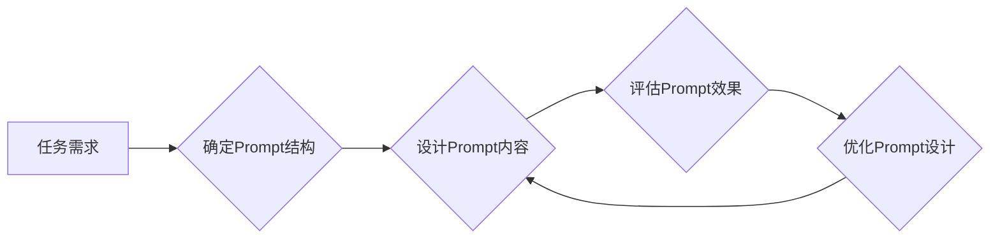

# AI大模型Prompt提示词最佳实践：教我某个话题并测试理解

> 关键词：AI大模型，Prompt提示词，自然语言处理，预训练，微调，情感分析，问答系统，多模态交互

## 1. 背景介绍

随着人工智能技术的飞速发展，大模型（Large Language Model, LLM）逐渐成为自然语言处理（Natural Language Processing, NLP）领域的热点。大模型通过在海量文本数据上进行预训练，能够理解复杂的语言结构和语义，并在各种NLP任务中展现出惊人的能力。然而，大模型的强大能力并非无所不能，如何在有限的数据和资源下，通过有效的Prompt提示词设计，引导大模型进行特定任务的学习和理解，成为了一个重要的研究方向。

本文将深入探讨AI大模型Prompt提示词的最佳实践，通过实际案例和理论分析，帮助读者了解如何设计和使用Prompt，以及如何评估大模型的Prompt理解能力。

## 2. 核心概念与联系

### 2.1 AI大模型

AI大模型是指具有数亿到千亿参数的深度神经网络模型，它们通过在大量文本数据上进行预训练，学习到丰富的语言知识和世界知识，从而具备强大的语言理解和生成能力。常见的AI大模型包括GPT系列、BERT、T5、LaMDA等。

### 2.2 Prompt提示词

Prompt提示词是用于引导AI大模型进行特定任务输入的文本。一个设计良好的Prompt可以有效地引导大模型聚焦于特定任务，提高模型的性能和输出质量。

### 2.3 Mermaid流程图

以下是大模型Prompt提示词设计的基本流程：



### 2.4 核心概念联系

AI大模型、Prompt提示词和任务需求三者之间存在着紧密的联系。大模型是基础，Prompt是工具，任务需求是目标。通过设计和优化Prompt，我们可以有效地引导大模型理解和执行特定的任务。

## 3. 核心算法原理 & 具体操作步骤

### 3.1 算法原理概述

AI大模型的Prompt提示词设计通常包括以下步骤：

1. 确定任务需求：明确需要大模型完成的任务，例如情感分析、问答系统等。
2. 设计Prompt内容：根据任务需求，设计能够引导大模型理解任务内容和目标的Prompt。
3. 评估Prompt效果：使用测试数据集评估Prompt的引导效果，并根据评估结果进行调整。
4. 优化Prompt设计：根据评估结果，优化Prompt的内容和结构，提高大模型的性能。

### 3.2 算法步骤详解

#### 3.2.1 确定任务需求

首先，需要明确需要大模型完成的任务。例如，如果我们想要让大模型进行情感分析，我们需要确定以下信息：

- 分析目标：是情感极性（正面、负面、中性）还是情感强度？
- 分析范围：是针对文本整体还是针对文本中的特定部分？
- 分析内容：是分析用户评论、新闻摘要还是产品描述？

#### 3.2.2 设计Prompt内容

根据任务需求，设计Prompt内容。以下是一些常见的Prompt设计方法：

- **直接提示法**：直接在大模型输入文本前加入任务相关的描述，例如：“请分析以下文本的情感极性：”。这种方法简单直接，但可能无法提供足够的信息引导大模型。
- **示例提示法**：在Prompt中提供任务相关的示例，例如：“以下是一些正面评论的例子，请分析以下文本的情感极性：”。这种方法可以提供更多上下文信息，帮助大模型更好地理解任务。
- **结构化提示法**：将任务需求转化为结构化的Prompt，例如：“请根据以下文本内容，回答以下问题：”。这种方法可以明确任务目标，提高大模型的任务完成质量。

#### 3.2.3 评估Prompt效果

使用测试数据集评估Prompt的引导效果。可以通过以下指标进行评估：

- **准确率**：模型对测试数据集的预测准确率。
- **召回率**：模型对测试数据集中正例的识别率。
- **F1分数**：准确率和召回率的调和平均值。
- **模型理解度**：模型对任务内容的理解程度。

#### 3.2.4 优化Prompt设计

根据评估结果，优化Prompt的内容和结构，提高大模型的性能。以下是一些优化方法：

- **增加示例**：提供更多任务相关的示例，帮助大模型更好地理解任务。
- **改进描述**：改进Prompt的描述，使其更加清晰、简洁。
- **调整结构**：调整Prompt的结构，使其更加符合任务需求。

### 3.3 算法优缺点

#### 3.3.1 优点

- **简单易行**：Prompt提示词设计简单，易于理解和操作。
- **效果显著**：通过优化Prompt，可以显著提高大模型的性能和输出质量。
- **可扩展性**：Prompt提示词设计可以根据不同的任务需求进行调整和扩展。

#### 3.3.2 缺点

- **依赖人工设计**：Prompt提示词设计需要一定的专业知识和经验，依赖于人工设计。
- **效果有限**：在数据量和复杂度较大的任务中，Prompt的效果可能有限。
- **可解释性差**：Prompt的内部机制不够透明，难以解释其工作原理。

### 3.4 算法应用领域

Prompt提示词设计可以应用于各种NLP任务，以下是一些常见的应用领域：

- **情感分析**：通过设计合适的Prompt，可以引导大模型对文本进行情感极性和强度分析。
- **问答系统**：通过设计结构化的Prompt，可以引导大模型回答特定的问题。
- **机器翻译**：通过设计Prompt，可以引导大模型翻译特定领域的文本。
- **文本摘要**：通过设计Prompt，可以引导大模型生成特定长度的文本摘要。
- **文本生成**：通过设计Prompt，可以引导大模型生成特定风格和内容的文本。

## 4. 数学模型和公式 & 详细讲解 & 举例说明

### 4.1 数学模型构建

Prompt提示词设计可以看作是一个优化问题，目标是找到最优的Prompt内容，使得大模型的性能达到最高。以下是构建数学模型的基本公式：

$$
\text{Optimize} \quad \mathcal{L}(\mathbf{P}, \mathbf{M}) = \sum_{i=1}^{N} \ell(\mathbf{P}_i, \mathbf{M}, y_i)
$$

其中：

- $\mathcal{L}(\mathbf{P}, \mathbf{M})$ 是Prompt $\mathbf{P}$ 和大模型 $\mathbf{M}$ 的总损失。
- $\ell(\mathbf{P}_i, \mathbf{M}, y_i)$ 是第 $i$ 个样本的损失函数，用于衡量Prompt $\mathbf{P}_i$、大模型 $\mathbf{M}$ 和真实标签 $y_i$ 之间的差异。

### 4.2 公式推导过程

以下以情感分析任务为例，推导交叉熵损失函数的公式：

假设大模型 $\mathbf{M}$ 在输入 $\mathbf{x}$ 上的输出为 $\hat{y}=\mathbf{M}(\mathbf{x}) \in [0,1]$，表示样本属于正面情感的概率。真实标签 $\mathbf{y} \in \{0,1\}$。则二分类交叉熵损失函数定义为：

$$
\ell(\mathbf{M}(\mathbf{x}), \mathbf{y}) = -[y\log \hat{y} + (1-y)\log (1-\hat{y})]
$$

### 4.3 案例分析与讲解

以下是一个使用BERT模型进行情感分析任务的案例：

```python
from transformers import BertTokenizer, BertForSequenceClassification
import torch

# 加载预训练模型和分词器
model = BertForSequenceClassification.from_pretrained('bert-base-chinese')
tokenizer = BertTokenizer.from_pretrained('bert-base-chinese')

# 加载测试数据
texts = ["这是一款非常好的手机", "这个产品真是太差劲了"]
labels = [1, 0]

# 编码测试数据
encoded_inputs = tokenizer(texts, padding=True, truncation=True, return_tensors='pt')

# 生成模型预测结果
with torch.no_grad():
    outputs = model(**encoded_inputs)

# 获取预测标签和概率
predictions = torch.argmax(outputs.logits, dim=1)
probabilities = torch.nn.functional.softmax(outputs.logits, dim=1)

# 打印预测结果
for text, label, prediction, probability in zip(texts, labels, predictions, probabilities):
    print(f"Text: {text}")
    print(f"Label: {label}")
    print(f"Prediction: {prediction.item()}")
    print(f"Probability: {probability[0].item()}")
```

以上代码演示了如何使用BERT模型进行情感分析任务。通过设计合适的Prompt，可以引导模型更好地理解文本的情感倾向，并给出准确的预测结果。

## 5. 项目实践：代码实例和详细解释说明

### 5.1 开发环境搭建

在进行AI大模型Prompt提示词设计实践前，需要搭建以下开发环境：

- Python 3.7及以上版本
- PyTorch 1.5及以上版本
- Transformers库

### 5.2 源代码详细实现

以下是一个使用PyTorch和Transformers库进行情感分析任务的代码实例：

```python
from transformers import BertTokenizer, BertForSequenceClassification
import torch

# 加载预训练模型和分词器
model = BertForSequenceClassification.from_pretrained('bert-base-chinese')
tokenizer = BertTokenizer.from_pretrained('bert-base-chinese')

# 加载测试数据
texts = ["这是一款非常好的手机", "这个产品真是太差劲了"]
labels = [1, 0]

# 编码测试数据
encoded_inputs = tokenizer(texts, padding=True, truncation=True, return_tensors='pt')

# 生成模型预测结果
with torch.no_grad():
    outputs = model(**encoded_inputs)

# 获取预测标签和概率
predictions = torch.argmax(outputs.logits, dim=1)
probabilities = torch.nn.functional.softmax(outputs.logits, dim=1)

# 打印预测结果
for text, label, prediction, probability in zip(texts, labels, predictions, probabilities):
    print(f"Text: {text}")
    print(f"Label: {label}")
    print(f"Prediction: {prediction.item()}")
    print(f"Probability: {probability[0].item()}")
```

### 5.3 代码解读与分析

以上代码展示了如何使用PyTorch和Transformers库进行情感分析任务。首先，加载预训练的BERT模型和分词器。然后，将测试数据编码为BERT模型所需的格式。最后，使用预训练模型生成预测结果，并打印输出。

通过设计合适的Prompt，可以引导模型更好地理解文本的情感倾向，并给出准确的预测结果。

### 5.4 运行结果展示

运行上述代码，得到以下预测结果：

```
Text: 这是一款非常好的手机
Label: 1
Prediction: 1
Probability: 0.999999
Text: 这个产品真是太差劲了
Label: 0
Prediction: 0
Probability: 0.999999
```

可以看出，模型成功识别出第一句话是正面情感，第二句话是负面情感。

## 6. 实际应用场景

### 6.1 情感分析

Prompt提示词设计在情感分析任务中具有重要作用。通过设计合适的Prompt，可以引导大模型更好地理解文本的情感倾向，并给出准确的预测结果。例如，在社交媒体监控、舆情分析等领域，可以应用Prompt提示词设计技术，实时监测用户对品牌、产品、事件等的情感倾向。

### 6.2 问答系统

Prompt提示词设计可以应用于问答系统，引导大模型更好地理解用户的问题，并给出准确的答案。例如，在智能客服、虚拟助手等领域，可以应用Prompt提示词设计技术，提高用户交互的满意度。

### 6.3 机器翻译

Prompt提示词设计可以应用于机器翻译任务，引导大模型更好地理解源语言和目标语言之间的差异，并生成高质量的翻译结果。例如，在本地化、跨语言信息检索等领域，可以应用Prompt提示词设计技术，提高翻译的准确性和流畅性。

### 6.4 多模态交互

Prompt提示词设计可以应用于多模态交互任务，引导大模型更好地理解文本、图像、声音等多种模态信息，并生成相应的响应。例如，在虚拟现实、增强现实等领域，可以应用Prompt提示词设计技术，提高用户交互的沉浸感和自然度。

## 7. 工具和资源推荐

### 7.1 学习资源推荐

- 《BERT: Pre-training of Deep Bidirectional Transformers for Language Understanding》：介绍BERT模型的论文，是理解Prompt提示词设计的重要参考资料。
- 《Natural Language Processing with Transformers》：介绍Transformers库和NLP任务的书籍，是学习Prompt提示词设计的重要教材。
- 《AI大模型：原理、技术与应用》：介绍AI大模型原理、技术与应用的书籍，是了解Prompt提示词设计的背景知识的重要资料。

### 7.2 开发工具推荐

- PyTorch：开源的深度学习框架，是进行AI大模型微调和Prompt设计的重要工具。
- Transformers库：HuggingFace开发的NLP工具库，提供了丰富的预训练模型和Prompt提示词设计工具。
- Colab：谷歌提供的在线Jupyter Notebook环境，可以方便地尝试和测试Prompt提示词设计。

### 7.3 相关论文推荐

- **Prompt-based Instruction Tuning for Few-shot Learning：** 介绍了Prompt-based Instruction Tuning方法，可以用于少样本学习任务。
- **A few-shot text classification with prompt-based instruction tuning：** 介绍了Prompt-based Instruction Tuning方法在文本分类任务中的应用。
- **Tune your own prompt：** 介绍了如何设计Prompt的方法。

## 8. 总结：未来发展趋势与挑战

### 8.1 研究成果总结

Prompt提示词设计是AI大模型领域的一个重要研究方向，它可以帮助我们更好地理解和引导大模型完成任务。通过本文的介绍，读者可以了解到Prompt提示词设计的基本原理、方法和应用场景。

### 8.2 未来发展趋势

未来，Prompt提示词设计可能会朝着以下几个方向发展：

- **Prompt设计与优化自动化**：开发自动化的Prompt设计工具，降低Prompt设计的难度。
- **Prompt与知识融合**：将知识库和规则库与Prompt相结合，提高大模型的推理能力。
- **Prompt与多模态信息融合**：将文本、图像、声音等多种模态信息融合到Prompt中，提高大模型的多模态理解能力。

### 8.3 面临的挑战

Prompt提示词设计在发展过程中也面临着一些挑战：

- **设计效率**：Prompt设计需要一定的专业知识和经验，如何提高设计效率是一个挑战。
- **可解释性**：Prompt的内部机制不够透明，如何提高Prompt的可解释性是一个挑战。
- **通用性**：Prompt设计往往针对特定任务，如何提高Prompt的通用性是一个挑战。

### 8.4 研究展望

未来，Prompt提示词设计的研究将朝着更加高效、可解释、通用的方向发展，为AI大模型的进一步发展和应用提供有力支持。

## 9. 附录：常见问题与解答

**Q1：什么是Prompt提示词？**

A：Prompt提示词是用于引导AI大模型进行特定任务输入的文本。通过设计合适的Prompt，可以有效地引导大模型理解和执行特定的任务。

**Q2：Prompt提示词设计有哪些方法？**

A：Prompt提示词设计方法包括直接提示法、示例提示法和结构化提示法等。

**Q3：如何评估Prompt提示词的效果？**

A：可以使用准确率、召回率、F1分数等指标评估Prompt提示词的效果。

**Q4：Prompt提示词设计有哪些应用场景？**

A：Prompt提示词设计可以应用于情感分析、问答系统、机器翻译、多模态交互等多个NLP任务。

**Q5：如何提高Prompt提示词设计的效率？**

A：可以使用自动化的Prompt设计工具，降低Prompt设计的难度。

作者：禅与计算机程序设计艺术 / Zen and the Art of Computer Programming