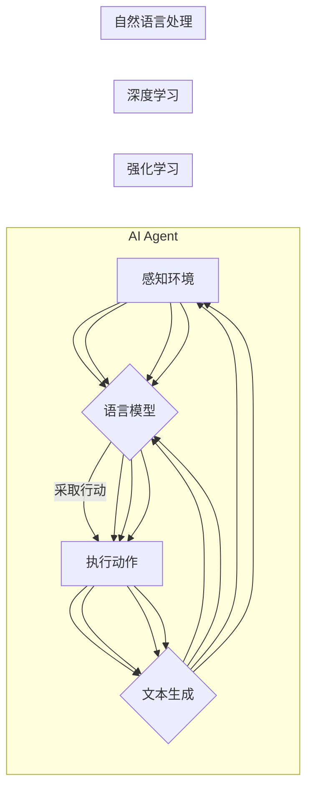

> 关键词：AI工程学，大模型应用，AI Agent代理，深度学习，强化学习，自然语言处理，机器学习，人机交互

# AI工程学：大模型应用开发实战：AI Agent代理

随着人工智能技术的飞速发展，大模型（Large Language Model, LLM）在自然语言处理、计算机视觉、语音识别等领域取得了令人瞩目的成果。AI Agent代理，作为大模型应用的重要载体，正在逐渐改变着我们的工作和生活方式。本文将深入探讨AI Agent代理的原理、实现方法、应用场景以及未来发展趋势。

## 1. 背景介绍

### 1.1 问题的由来

在过去的几十年里，人工智能技术取得了长足的进步。然而，传统的AI系统往往只能解决特定的问题，缺乏灵活性和适应性。为了克服这一限制，研究人员开始探索能够自主学习和决策的AI Agent。

AI Agent是一种能够感知环境、根据当前状态采取行动、并能够从经验中学习的智能实体。它能够模拟人类智能行为，完成各种复杂的任务。随着大模型的兴起，AI Agent代理成为了AI工程学领域的研究热点。

### 1.2 研究现状

近年来，AI Agent代理的研究取得了显著进展。主要研究方向包括：

- **强化学习（Reinforcement Learning, RL）**：通过与环境交互，学习最优策略，以最大化累积奖励。
- **深度学习（Deep Learning, DL）**：利用神经网络模拟人脑的学习过程，实现复杂函数的逼近。
- **自然语言处理（Natural Language Processing, NLP）**：使AI Agent能够理解和生成自然语言，进行人机交互。

### 1.3 研究意义

AI Agent代理的研究对于推动人工智能技术的发展具有重要意义：

- **提升AI系统的智能化水平**：AI Agent代理能够自主学习和适应环境，提高AI系统的智能化水平。
- **拓展AI应用领域**：AI Agent代理可以应用于各个领域，如游戏、教育、医疗、金融等，推动AI技术的产业化进程。
- **改善人机交互体验**：AI Agent代理能够更好地理解和满足用户需求，提升人机交互的智能化水平。

### 1.4 本文结构

本文将按照以下结构进行阐述：

- 介绍AI Agent代理的核心概念和架构。
- 分析AI Agent代理的核心算法原理和实现步骤。
- 展示AI Agent代理的数学模型和公式。
- 通过项目实践展示AI Agent代理的代码实现。
- 探讨AI Agent代理的实际应用场景和未来发展趋势。

## 2. 核心概念与联系

### 2.1 核心概念

#### AI Agent代理

AI Agent代理是一种能够感知环境、根据当前状态采取行动、并能够从经验中学习的智能实体。

#### 强化学习

强化学习是一种通过与环境交互，学习最优策略，以最大化累积奖励的机器学习方法。

#### 深度学习

深度学习是一种利用神经网络模拟人脑的学习过程，实现复杂函数的逼近的机器学习方法。

#### 自然语言处理

自然语言处理是一种使AI Agent能够理解和生成自然语言，进行人机交互的技术。

### 2.2 Mermaid 流程图

以下为AI Agent代理的Mermaid流程图：



从流程图中可以看出，AI Agent代理的核心功能是感知环境、做出决策、执行动作和观察结果。强化学习、深度学习和自然语言处理则是AI Agent代理实现这些功能的三个主要技术。

## 3. 核心算法原理 & 具体操作步骤

### 3.1 算法原理概述

AI Agent代理的核心算法包括强化学习、深度学习和自然语言处理。

#### 强化学习

强化学习是一种通过与环境交互，学习最优策略，以最大化累积奖励的机器学习方法。其基本原理如下：

- **状态空间（State Space）**：AI Agent代理所处的环境状态集合。
- **动作空间（Action Space）**：AI Agent代理可以采取的动作集合。
- **奖励函数（Reward Function）**：衡量AI Agent代理采取动作后，环境状态的变化，通常以奖励值表示。
- **策略（Policy）**：AI Agent代理根据当前状态选择动作的规则。
- **价值函数（Value Function）**：衡量AI Agent代理在未来某个状态下的累积奖励值。
- **策略迭代（Policy Iteration）**：通过不断迭代优化策略，使累积奖励最大化。

#### 深度学习

深度学习是一种利用神经网络模拟人脑的学习过程，实现复杂函数的逼近的机器学习方法。其基本原理如下：

- **神经网络（Neural Network）**：由多个神经元组成的层次结构，用于对数据进行特征提取和分类。
- **损失函数（Loss Function）**：衡量模型预测值与真实值之间的差异。
- **优化算法（Optimization Algorithm）**：用于更新模型参数，最小化损失函数。

#### 自然语言处理

自然语言处理是一种使AI Agent能够理解和生成自然语言，进行人机交互的技术。其基本原理如下：

- **语言模型（Language Model）**：用于生成自然语言的概率模型。
- **词嵌入（Word Embedding）**：将文本数据转换为数值向量。
- **序列标注（Sequence Labeling）**：对文本序列中的每个单词进行分类。

### 3.2 算法步骤详解

#### 强化学习

1. 初始化状态空间、动作空间、奖励函数、策略和价值函数。
2. AI Agent代理在环境中随机选择动作，并执行该动作。
3. 根据执行动作后环境的状态，计算奖励值。
4. 使用策略迭代方法更新策略和价值函数，使累积奖励最大化。
5. 重复步骤2-4，直到满足终止条件。

#### 深度学习

1. 设计神经网络结构，选择合适的激活函数和优化算法。
2. 收集并预处理数据，将数据转换为数值向量。
3. 使用训练数据训练神经网络，不断调整模型参数，最小化损失函数。
4. 使用验证数据评估模型性能，并根据评估结果调整模型结构或超参数。
5. 使用测试数据评估模型在未见数据上的性能。

#### 自然语言处理

1. 设计语言模型，选择合适的词嵌入方法。
2. 使用预训练语言模型（如BERT）初始化模型参数。
3. 使用训练数据训练语言模型，不断调整模型参数，提高模型性能。
4. 使用验证数据评估模型性能，并根据评估结果调整模型结构或超参数。
5. 使用测试数据评估模型在未见数据上的性能。

### 3.3 算法优缺点

#### 强化学习

优点：

- 能够适应复杂环境，学习最优策略。
- 能够解决决策问题，如机器人路径规划、游戏策略等。

缺点：

- 需要大量的训练数据。
- 训练过程可能需要较长时间。

#### 深度学习

优点：

- 能够处理大规模数据。
- 能够学习复杂的非线性关系。

缺点：

- 需要大量的计算资源。
- 难以解释模型的决策过程。

#### 自然语言处理

优点：

- 能够理解和生成自然语言。
- 能够进行人机交互。

缺点：

- 需要大量的标注数据。
- 难以处理长文本。

### 3.4 算法应用领域

#### 强化学习

- 机器人路径规划
- 游戏策略设计
- 无人驾驶
- 股票交易

#### 深度学习

- 图像识别
- 语音识别
- 文本分类
- 医疗影像分析

#### 自然语言处理

- 机器翻译
- 问答系统
- 文本摘要
- 情感分析

## 4. 数学模型和公式 & 详细讲解 & 举例说明

### 4.1 数学模型构建

#### 强化学习

强化学习的数学模型包括：

- 状态空间 $S$
- 动作空间 $A$
- 奖励函数 $R$
- 策略 $\pi$
- 价值函数 $V$

其中，状态空间 $S$ 表示AI Agent代理所处的环境状态集合，动作空间 $A$ 表示AI Agent代理可以采取的动作集合，奖励函数 $R$ 表示AI Agent代理采取动作后，环境状态的变化，策略 $\pi$ 表示AI Agent代理根据当前状态选择动作的规则，价值函数 $V$ 表示AI Agent代理在未来某个状态下的累积奖励值。

#### 深度学习

深度学习的数学模型包括：

- 神经网络结构
- 损失函数
- 梯度下降算法

其中，神经网络结构表示模型的结构，损失函数衡量模型预测值与真实值之间的差异，梯度下降算法用于更新模型参数，最小化损失函数。

#### 自然语言处理

自然语言处理的数学模型包括：

- 语言模型
- 词嵌入
- 序列标注

其中，语言模型表示生成自然语言的概率模型，词嵌入将文本数据转换为数值向量，序列标注对文本序列中的每个单词进行分类。

### 4.2 公式推导过程

#### 强化学习

价值函数 $V(s)$ 的递归公式如下：

$$
V(s) = \sum_{a \in A} \pi(a|s) \cdot \gamma \cdot V(s') + R(s, a)
$$

其中，$s$ 表示当前状态，$a$ 表示采取的动作，$s'$ 表示采取动作后的状态，$\gamma$ 表示折扣因子，$R(s, a)$ 表示采取动作 $a$ 后获得的奖励值。

#### 深度学习

损失函数 $L$ 的计算公式如下：

$$
L = \frac{1}{N} \sum_{i=1}^N (y_i - \hat{y}_i)^2
$$

其中，$y_i$ 表示真实值，$\hat{y}_i$ 表示预测值，$N$ 表示样本数量。

#### 自然语言处理

语言模型的概率计算公式如下：

$$
P(w_i | w_{i-1}, w_{i-2}, ..., w_{i-k}) = \frac{P(w_i | w_{i-1}) \cdot P(w_{i-1} | w_{i-2}, ..., w_{i-k}) \cdot ... \cdot P(w_2 | w_1)}{P(w_1, w_2, ..., w_i)}
$$

其中，$w_i$ 表示第 $i$ 个单词，$k$ 表示上下文窗口大小。

### 4.3 案例分析与讲解

#### 强化学习案例：Q-Learning

假设有一个简单的AI Agent代理在赌场环境中进行赌博，状态空间为赌场中的筹码数量，动作空间为赌注大小。奖励函数为：当AI Agent代理赢得赌博时，奖励 $+1$；当AI Agent代理输掉赌博时，奖励 $-1$。

使用Q-Learning算法进行训练，设置折扣因子 $\gamma = 0.9$，学习率 $\alpha = 0.1$，迭代次数 $N = 10000$。经过训练后，AI Agent代理能够学习到最优策略，以最大化累积奖励。

#### 深度学习案例：卷积神经网络

假设有一个图像识别任务，输入为28x28像素的灰度图像，输出为10个类别（0-9数字）。使用卷积神经网络（CNN）进行训练，包括两个卷积层、两个池化层和一个全连接层。经过训练后，CNN模型能够准确识别图像中的数字。

#### 自然语言处理案例：文本分类

假设有一个文本分类任务，输入为一段文本，输出为两个类别（正面、负面）。使用BiLSTM-CRF模型进行训练，包括两个双向长短期记忆网络层和一个条件随机场层。经过训练后，模型能够准确对文本进行分类。

## 5. 项目实践：代码实例和详细解释说明

### 5.1 开发环境搭建

为了进行AI Agent代理的实践，需要搭建以下开发环境：

- 编程语言：Python
- 深度学习框架：TensorFlow或PyTorch
- 数据集：OpenAI Gym环境中的CartPole游戏环境

### 5.2 源代码详细实现

以下为使用PyTorch框架实现CartPole游戏环境的AI Agent代理的代码示例：

```python
import gym
import torch
import torch.nn as nn
import torch.optim as optim

# 定义神经网络结构
class QNetwork(nn.Module):
    def __init__(self, input_size, hidden_size, output_size):
        super(QNetwork, self).__init__()
        self.fc1 = nn.Linear(input_size, hidden_size)
        self.fc2 = nn.Linear(hidden_size, output_size)

    def forward(self, x):
        x = torch.relu(self.fc1(x))
        x = self.fc2(x)
        return x

# 初始化环境
env = gym.make("CartPole-v1")

# 初始化网络和优化器
input_size = env.observation_space.shape[0]
hidden_size = 24
output_size = env.action_space.n
q_network = QNetwork(input_size, hidden_size, output_size)
optimizer = optim.Adam(q_network.parameters(), lr=0.01)

# 训练过程
for episode in range(1000):
    state = env.reset()
    done = False
    total_reward = 0

    while not done:
        q_values = q_network(state)
        action = torch.argmax(q_values).item()
        next_state, reward, done, _ = env.step(action)
        total_reward += reward

        q_target = q_values.clone()
        q_target[torch.argmax(q_values), action] = reward + 0.99 * torch.max(q_network(next_state))

        loss = nn.functional.mse_loss(q_values, q_target)
        optimizer.zero_grad()
        loss.backward()
        optimizer.step()

    print(f"Episode {episode+1}, Total Reward: {total_reward}")

env.close()
```

### 5.3 代码解读与分析

以上代码实现了以下功能：

- 定义了QNetwork类，用于表示Q值网络。
- 初始化环境、网络和优化器。
- 在每个episode中，不断与环境交互，学习最优策略。
- 使用Q-learning算法更新网络参数。
- 打印每个episode的总奖励。

### 5.4 运行结果展示

运行以上代码，可以看到AI Agent代理在CartPole游戏环境中能够逐渐学习到稳定的状态-动作映射，并完成游戏任务。

## 6. 实际应用场景

### 6.1 游戏开发

AI Agent代理可以应用于游戏开发领域，如：

- 自动化测试游戏AI
- 设计智能NPC
- 开发虚拟现实游戏

### 6.2 自动驾驶

AI Agent代理可以应用于自动驾驶领域，如：

- 驾驶决策
- 道路规划
- 交通信号灯识别

### 6.3 机器人

AI Agent代理可以应用于机器人领域，如：

- 机器人路径规划
- 机器人行为控制
- 机器人人机交互

### 6.4 未来应用展望

随着AI Agent代理技术的不断发展，未来将在更多领域得到应用，如：

- 智能家居
- 智能客服
- 智能医疗
- 智能金融

## 7. 工具和资源推荐

### 7.1 学习资源推荐

- 《深度学习》
- 《强化学习》
- 《自然语言处理原理与Python实现》
- OpenAI Gym：开源环境库，提供多种强化学习环境
- TensorFlow：开源深度学习框架
- PyTorch：开源深度学习框架

### 7.2 开发工具推荐

- Jupyter Notebook：交互式计算平台
- Anaconda：Python数据科学平台
- PyCharm：Python集成开发环境

### 7.3 相关论文推荐

- Q-Learning：http://incompleteideas.net/sutton/book/chapter3.pdf
- Deep Reinforcement Learning with Double Q-Learning：https://arxiv.org/abs/9001.06561
- Deep Q-Networks：https://www.deeplearning.net/tutorial/rl/deep-q-learning/

## 8. 总结：未来发展趋势与挑战

### 8.1 研究成果总结

本文对AI Agent代理的原理、实现方法、应用场景以及未来发展趋势进行了全面探讨。通过分析强化学习、深度学习和自然语言处理等核心算法，展示了AI Agent代理在各个领域的应用实例。同时，本文也展望了AI Agent代理的未来发展趋势，如多智能体系统、迁移学习、强化学习与深度学习的融合等。

### 8.2 未来发展趋势

1. 多智能体系统：研究多个AI Agent代理在复杂环境中的协同合作和竞争。
2. 迁移学习：将预训练的知识迁移到新的任务，提高学习效率和泛化能力。
3. 强化学习与深度学习的融合：将强化学习与深度学习相结合，实现更强大的AI Agent代理。
4. 伦理与安全：研究AI Agent代理的伦理和安全问题，确保其合理应用。

### 8.3 面临的挑战

1. 算法复杂度：随着模型规模的增大，算法复杂度也随之增加，需要更高效的计算方法。
2. 数据质量：数据质量对AI Agent代理的性能有重要影响，需要高质量的数据集。
3. 解释性：AI Agent代理的决策过程难以解释，需要研究可解释的AI Agent代理。
4. 伦理与安全：AI Agent代理的伦理和安全问题是不可忽视的挑战。

### 8.4 研究展望

AI Agent代理作为AI工程学的重要研究方向，未来将在各个领域发挥重要作用。通过不断创新和突破，AI Agent代理将推动人工智能技术的进步，为人类社会带来更多福祉。

## 9. 附录：常见问题与解答

**Q1：什么是AI Agent代理？**

A1：AI Agent代理是一种能够感知环境、根据当前状态采取行动、并能够从经验中学习的智能实体。

**Q2：强化学习、深度学习和自然语言处理在大模型应用中如何协同工作？**

A2：强化学习用于学习最优策略，深度学习用于特征提取和分类，自然语言处理用于处理文本数据。三者相互配合，共同实现大模型应用。

**Q3：如何评估AI Agent代理的性能？**

A3：可以使用多种方法评估AI Agent代理的性能，如平均奖励、成功率、准确率等。

**Q4：AI Agent代理在哪些领域有应用前景？**

A4：AI Agent代理在游戏、自动驾驶、机器人、智能家居、智能客服、智能医疗、智能金融等领域有广泛的应用前景。

**Q5：如何确保AI Agent代理的伦理和安全？**

A5：需要研究AI Agent代理的伦理和安全问题，确保其合理应用。可以通过以下方法确保AI Agent代理的伦理和安全：

- 设计可解释的AI Agent代理
- 建立AI Agent代理的监管机制
- 推动AI伦理标准制定

作者：禅与计算机程序设计艺术 / Zen and the Art of Computer Programming