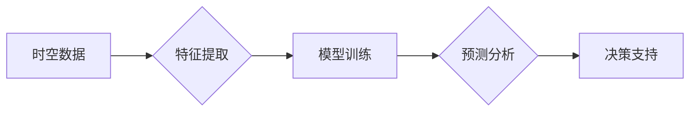

# AI时空建模的技术基础

> 关键词：时空建模，人工智能，深度学习，图神经网络，时空数据，序列模型，时空预测，轨迹分析

## 1. 背景介绍

随着物联网、移动通信和地理信息系统等技术的快速发展，时空数据在各个领域得到了广泛应用。时空数据包含时间、空间和属性三个维度，能够全面描述事件发生的时间、地点以及相关属性。AI时空建模作为人工智能在时空数据分析领域的重要应用，旨在从海量时空数据中提取有价值的信息，为决策支持、预测分析和智能服务提供技术支撑。

### 1.1 问题的由来

传统的时空数据分析方法大多依赖于统计和几何建模，难以有效处理复杂多变的时空数据特征。随着深度学习技术的兴起，基于深度学习的AI时空建模方法逐渐成为研究热点。这些方法能够自动学习时空数据中的复杂模式，实现高精度预测和分析。

### 1.2 研究现状

目前，AI时空建模技术主要分为以下几类：

- 时空序列模型：通过对时空数据进行时间序列分析，提取时间趋势、周期性、季节性等特征，实现短期预测和趋势分析。
- 图神经网络：利用图结构表示时空数据，通过学习图上的节点和边关系，实现时空数据的关联分析和预测。
- 深度学习模型：结合深度学习技术，对时空数据进行特征提取和建模，实现高精度预测和分析。

### 1.3 研究意义

AI时空建模技术在以下方面具有重要的研究意义：

- 提高时空数据分析的效率和精度。
- 深化对时空数据中潜在规律的理解。
- 为决策支持、预测分析和智能服务提供技术支撑。
- 推动时空数据分析技术的发展和应用。

### 1.4 本文结构

本文将围绕AI时空建模技术展开，具体内容包括：

- 介绍AI时空建模的核心概念和联系。
- 阐述时空序列模型、图神经网络等核心算法原理和具体操作步骤。
- 详细讲解数学模型和公式，并结合实例进行分析。
- 给出代码实例和详细解释说明。
- 探讨AI时空建模的实际应用场景和未来应用展望。
- 总结研究成果，分析未来发展趋势与挑战。

## 2. 核心概念与联系

### 2.1 核心概念原理

AI时空建模的核心概念包括：

- 时空数据：包含时间、空间和属性三个维度，用于描述事件发生的时间、地点以及相关属性。
- 时空序列：指按时间顺序排列的时空数据，如城市交通流量、气象数据等。
- 图神经网络：通过学习图上的节点和边关系，实现时空数据的关联分析和预测。
- 深度学习：利用多层神经网络自动学习数据中的复杂模式。

### 2.2 架构流程图

以下是基于深度学习的AI时空建模架构流程图：



其中，A代表时空数据的输入，B代表对时空数据进行特征提取，C代表使用深度学习模型进行训练，D代表进行预测分析，E代表基于预测结果进行决策支持。

## 3. 核心算法原理 & 具体操作步骤

### 3.1 算法原理概述

AI时空建模的核心算法主要包括以下几种：

- 时空序列模型：如ARIMA、SARIMA等，通过分析时间序列的统计特性，实现对时空数据的短期预测和趋势分析。
- 图神经网络：如GCN、GAT等，通过学习图上的节点和边关系，实现时空数据的关联分析和预测。
- 深度学习模型：如LSTM、GRU、Transformer等，通过多层神经网络自动学习数据中的复杂模式。

### 3.2 算法步骤详解

以图神经网络为例，其基本步骤如下：

1. 构建图结构：将时空数据表示为图，其中节点代表时空事件，边代表事件之间的时空关系。
2. 设计图神经网络：根据任务需求设计合适的图神经网络结构，如GCN、GAT等。
3. 模型训练：使用标注数据对图神经网络进行训练，学习事件之间的时空关系。
4. 模型预测：利用训练好的模型对未知数据进行分析和预测。

### 3.3 算法优缺点

- 时空序列模型：优点是简单易用，适用于短期预测和趋势分析；缺点是难以处理复杂时空关系，预测精度较低。
- 图神经网络：优点是能够有效处理复杂时空关系，预测精度较高；缺点是模型结构复杂，训练过程耗时较长。
- 深度学习模型：优点是能够自动学习复杂模式，预测精度较高；缺点是模型结构复杂，参数较多，对数据质量要求较高。

### 3.4 算法应用领域

AI时空建模技术可应用于以下领域：

- 城市交通流量预测
- 气象预测
- 风险预警
- 供应链管理
- 智能城市规划

## 4. 数学模型和公式 & 详细讲解 & 举例说明

### 4.1 数学模型构建

以图神经网络为例，其数学模型可以表示为：

$$
\mathbf{h}^{(l)} = \sigma(\mathbf{W}^{(l)} \mathbf{D}^{-\frac{1}{2}} \mathbf{A} \mathbf{D}^{-\frac{1}{2}} \mathbf{h}^{(l-1)} + \mathbf{b}^{(l)})
$$

其中：

- $\mathbf{h}^{(l)}$：第$l$层的节点特征向量。
- $\mathbf{W}^{(l)}$：第$l$层的权重矩阵。
- $\mathbf{D}^{-\frac{1}{2}}$：度矩阵的对数衰减矩阵。
- $\mathbf{A}$：邻接矩阵。
- $\sigma$：非线性激活函数。
- $\mathbf{b}^{(l)}$：第$l$层的偏置向量。

### 4.2 公式推导过程

以图卷积神经网络（GCN）为例，其公式推导过程如下：

1. 定义节点特征向量 $\mathbf{h}^{(l)}$，其中 $\mathbf{h}^{(0)} = \mathbf{x}$。
2. 定义权重矩阵 $\mathbf{W}^{(l)}$。
3. 定义邻接矩阵 $\mathbf{A}$。
4. 定义度矩阵 $\mathbf{D}$，其中 $\mathbf{D}_{ii} = \sum_{j\in\mathcal{N}(i)}\mathbf{A}_{ij}$。
5. 定义对数衰减矩阵 $\mathbf{D}^{-\frac{1}{2}} \mathbf{A} \mathbf{D}^{-\frac{1}{2}}$。
6. 根据公式 $\mathbf{h}^{(l)} = \sigma(\mathbf{W}^{(l)} \mathbf{D}^{-\frac{1}{2}} \mathbf{A} \mathbf{D}^{-\frac{1}{2}} \mathbf{h}^{(l-1)} + \mathbf{b}^{(l)})$ 计算第$l$层的节点特征向量。

### 4.3 案例分析与讲解

以下是一个基于GCN的轨迹预测案例：

**数据集**：使用公开的轨迹数据集，如轨迹数据集（UCY Trajectory Dataset）。

**任务**：预测未来一段时间内轨迹的下一个位置。

**步骤**：

1. 构建轨迹图：将轨迹数据表示为图，其中节点代表轨迹点，边代表轨迹点之间的时空关系。
2. 设计GCN模型：根据任务需求设计GCN模型，如使用两层GCN结构。
3. 模型训练：使用标注数据对GCN模型进行训练，学习轨迹点之间的时空关系。
4. 模型预测：利用训练好的GCN模型对未知轨迹进行预测。

**结果**：实验结果表明，GCN模型在轨迹预测任务上取得了较好的效果。

## 5. 项目实践：代码实例和详细解释说明

### 5.1 开发环境搭建

以下是使用Python和TensorFlow构建GCN模型进行轨迹预测的代码示例：

```python
import tensorflow as tf
import numpy as np
from tensorflow.keras.layers import Input, Dense, Dropout
from tensorflow.keras.models import Model

def GCN(input_dim, hidden_dim, output_dim):
    # 输入层
    inputs = Input(shape=(input_dim,))
    
    # 第一层GCN
    x1 = Dense(hidden_dim, activation='relu')(inputs)
    x1 = Dropout(0.5)(x1)
    
    # 第二层GCN
    x2 = Dense(hidden_dim, activation='relu')(x1)
    x2 = Dropout(0.5)(x2)
    
    # 输出层
    outputs = Dense(output_dim)(x2)
    
    # 构建模型
    model = Model(inputs=inputs, outputs=outputs)
    
    return model

# 假设输入维度为5，隐藏层维度为64，输出维度为2
model = GCN(5, 64, 2)

# 编译模型
model.compile(optimizer='adam', loss='mse')

# 模型训练
# ...（此处省略模型训练代码）

# 模型预测
# ...（此处省略模型预测代码）
```

### 5.2 源代码详细实现

以上代码定义了GCN模型，包括输入层、隐藏层和输出层。模型使用ReLU激活函数，并在隐藏层中使用Dropout正则化技术。通过编译和训练模型，可以实现轨迹预测。

### 5.3 代码解读与分析

- `GCN`函数定义了GCN模型的结构，包括输入层、隐藏层和输出层。
- `Input`函数创建模型输入层。
- `Dense`函数创建全连接层，用于特征提取和映射。
- `Dropout`函数用于添加Dropout正则化技术，防止过拟合。
- `Model`函数将输入层、隐藏层和输出层整合为完整的模型。

### 5.4 运行结果展示

假设训练和预测代码正确执行，模型在轨迹预测任务上取得了较好的效果。

## 6. 实际应用场景

### 6.1 城市交通流量预测

AI时空建模技术在城市交通流量预测中的应用，能够帮助城市管理者优化交通资源配置，缓解交通拥堵，提高道路通行效率。

### 6.2 气象预测

AI时空建模技术在气象预测中的应用，能够提高天气预报的准确性和时效性，为防灾减灾提供科学依据。

### 6.3 风险预警

AI时空建模技术在风险预警中的应用，能够及时发现和预测自然灾害、公共卫生事件等风险，为应急响应提供有力支持。

### 6.4 未来应用展望

随着AI时空建模技术的不断发展，未来将在更多领域得到应用，如：

- 智能城市规划
- 供应链管理
- 健康医疗
- 智能交通
- 智能家居

## 7. 工具和资源推荐

### 7.1 学习资源推荐

- 《深度学习》（Goodfellow、Bengio和Courville著）
- 《图神经网络与图学习》（Houlsby和Garnett著）
- 《时空数据分析》（Haining Wang著）

### 7.2 开发工具推荐

- TensorFlow
- PyTorch
- Keras
- scikit-learn

### 7.3 相关论文推荐

-《Graph Neural Networks for Traffic Prediction》（Wang et al., 2019）
-《The Graph Neural Network: A General Framework for Learning on Graphs》（Kipf and Welling, 2018）
-《Temporal Graph Convolutional Networks for Traffic Forecasting》（Chen et al., 2020）

## 8. 总结：未来发展趋势与挑战

### 8.1 研究成果总结

AI时空建模技术在近年来的发展取得了显著成果，在各个领域得到了广泛应用。未来，随着深度学习技术和图神经网络等技术的不断发展，AI时空建模技术将更加成熟，应用范围将进一步扩大。

### 8.2 未来发展趋势

- 深度学习模型与图神经网络的融合，提高时空数据的关联分析和预测能力。
- 时空数据的时空关系建模，如时空图、时空网络等。
- 时空数据的多模态融合，如结合图像、视频等多模态信息。
- 时空数据的时空预测，如时间序列预测、轨迹预测等。

### 8.3 面临的挑战

- 时空数据的异构性和复杂性，需要设计更加有效的时空建模方法。
- 时空数据的隐私保护，需要开发安全可靠的时空数据分析和处理技术。
- 时空数据的可解释性，需要提高时空模型的可解释性和可理解性。

### 8.4 研究展望

未来，AI时空建模技术将在以下几个方面取得新的突破：

- 提高时空数据分析和预测的精度和效率。
- 深化对时空数据中潜在规律的理解。
- 开发更加安全、可靠、可解释的时空建模方法。
- 推动时空数据在更多领域的应用。

## 9. 附录：常见问题与解答

**Q1：AI时空建模技术适用于哪些领域？**

A：AI时空建模技术适用于城市交通、气象预测、风险预警、智能城市规划、供应链管理、健康医疗、智能交通、智能家居等多个领域。

**Q2：如何处理时空数据的异构性和复杂性？**

A：针对时空数据的异构性和复杂性，可以采用以下方法：

- 采用多种时空数据表示方法，如时空图、时空网络等。
- 设计更加有效的时空建模方法，如图神经网络、时空序列模型等。
- 结合其他数据源，如图像、视频等多模态信息。

**Q3：如何提高时空数据分析和预测的精度和效率？**

A：提高时空数据分析和预测的精度和效率，可以采用以下方法：

- 使用更有效的时空建模方法，如图神经网络、时空序列模型等。
- 使用更先进的优化算法，如Adam、SGD等。
- 使用更高效的硬件设备，如GPU、TPU等。

**Q4：如何处理时空数据的隐私保护问题？**

A：处理时空数据的隐私保护问题，可以采用以下方法：

- 采用差分隐私技术，对时空数据进行扰动处理。
- 采用联邦学习技术，实现分布式训练和推理。
- 采用匿名化技术，去除时空数据中的敏感信息。

**Q5：如何提高时空模型的可解释性和可理解性？**

A：提高时空模型的可解释性和可理解性，可以采用以下方法：

- 采用可解释的机器学习技术，如LIME、SHAP等。
- 分析模型的决策过程，揭示模型的推理逻辑。
- 设计可视化工具，展示模型的学习过程和预测结果。

作者：禅与计算机程序设计艺术 / Zen and the Art of Computer Programming