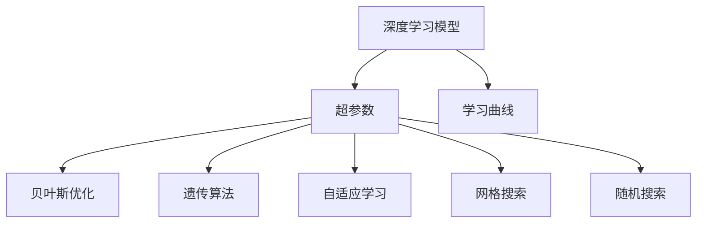
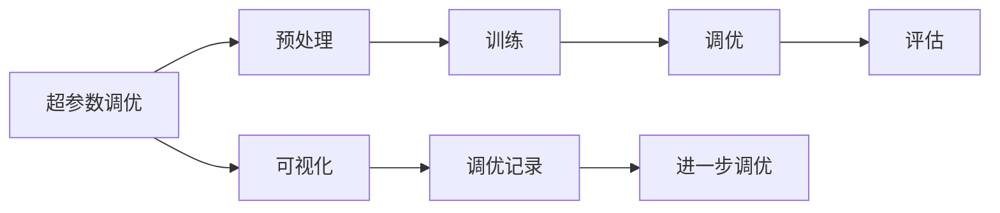
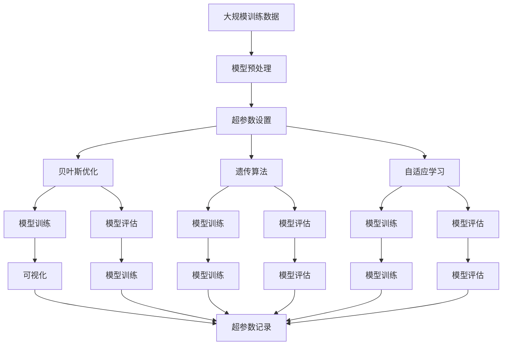

                 

# 一切皆是映射：深度学习模型的自动化调参技术

> 关键词：
深度学习，自动化调参，超参数，学习曲线，遗传算法，贝叶斯优化，贝叶斯优化，自适应学习，模型选择，超参数优化，网格搜索，随机搜索

## 1. 背景介绍

### 1.1 问题由来
深度学习模型在现代人工智能领域中占据了核心地位，广泛应用于图像识别、语音识别、自然语言处理、推荐系统等诸多领域。然而，深度学习模型的训练通常涉及到大量的超参数设置，包括学习率、批量大小、正则化参数等。这些超参数往往需要手工调优，不仅耗时耗力，而且容易陷入局部最优解，导致模型性能无法充分发挥。

在深度学习模型训练中，超参数的优化选择是一个复杂且耗时的过程。不同的超参数配置会对模型的性能产生显著影响。因此，如何高效、准确地进行超参数调优，已成为深度学习研究的热点和难点之一。

### 1.2 问题核心关键点
超参数调优是深度学习模型训练中的重要环节，但也是最具挑战性的一环。其核心挑战在于：

1. **调参耗时耗力**：传统的超参数调优通常需要手工遍历网格，耗费大量时间和计算资源。
2. **局部最优解**：超参数空间通常巨大，手工调参容易陷入局部最优解。
3. **模型性能不稳定**：超参数设置不合理可能导致模型性能波动，甚至出现过拟合或欠拟合。
4. **调参技术局限**：传统的调参方法如网格搜索、随机搜索等，无法应对高维度的超参数空间和复杂的模型结构。

为了克服这些挑战，近年来涌现出了多种自动化调参方法，包括贝叶斯优化、遗传算法、自适应学习等。这些方法通过利用先验知识、样本反馈和模型特性，自动化地搜索最优超参数配置，显著提高了调参效率和模型性能。

### 1.3 问题研究意义
自动化调参技术的研究和应用，对于提升深度学习模型的性能、加速模型训练和部署、优化资源利用具有重要意义：

1. **加速模型训练**：自动化调参可以显著缩短模型训练时间，使研究者能够更快地迭代新模型和新算法。
2. **提高模型性能**：通过优化超参数配置，可以提升模型在特定任务上的准确率和泛化能力。
3. **优化资源利用**：通过合理的超参数设置，可以避免过拟合或欠拟合，充分利用有限的计算资源。
4. **降低调参成本**：自动化调参技术减少了手动调参的工作量，降低了调参的复杂度和成本。
5. **提升模型鲁棒性**：通过优化超参数配置，可以增强模型对数据分布变化的适应性，提高模型的鲁棒性和泛化能力。

## 2. 核心概念与联系

### 2.1 核心概念概述

为更好地理解自动化调参技术，本节将介绍几个密切相关的核心概念：

- **深度学习模型**：指由多个神经网络层组成的非线性映射模型，广泛应用于图像识别、语音识别、自然语言处理等任务。
- **超参数**：指在模型训练之前需要手动设置的参数，如学习率、批量大小、正则化参数等，通常由研究者或用户手动设定。
- **学习曲线**：指模型在不同超参数设置下的性能曲线，展示了模型性能随超参数变化的趋势。
- **贝叶斯优化**：一种基于贝叶斯统计学原理的优化方法，通过构建先验概率分布和后验概率分布，自动搜索最优超参数配置。
- **遗传算法**：一种模拟自然选择和遗传进化的优化算法，通过种群的演化搜索最优解。
- **自适应学习**：指模型在训练过程中自动调整学习率和正则化参数，以适应不同任务和数据分布。
- **网格搜索**：一种穷举搜索超参数空间的方法，适用于超参数空间较小的情况。
- **随机搜索**：一种随机采样超参数空间的方法，适用于超参数空间较大的情况。

这些核心概念之间的逻辑关系可以通过以下Mermaid流程图来展示：



这个流程图展示了大规模深度学习模型训练中，超参数的优化过程和关键技术。

### 2.2 概念间的关系

这些核心概念之间存在着紧密的联系，形成了深度学习模型调参的完整生态系统。下面我们通过几个Mermaid流程图来展示这些概念之间的关系。

#### 2.2.1 超参数调优的三个阶段



这个流程图展示了超参数调优的基本流程：

1. 预处理：准备训练数据，定义模型结构，设置初始超参数。
2. 训练：在给定的超参数下训练模型，记录训练日志。
3. 调优：根据训练日志，调整超参数，重新训练模型。
4. 评估：在验证集上评估模型性能，决定是否继续调优。
5. 可视化：将超参数和模型性能的关系可视化，帮助理解调参效果。
6. 调优记录：保存每次调优的超参数和性能记录，用于未来参考。
7. 进一步调优：根据可视化结果，继续调整超参数，直到达到最优。

#### 2.2.2 贝叶斯优化的流程


这个流程图展示了贝叶斯优化的基本流程：

1. 先验分布：根据先验知识或经验，定义初始的超参数分布。
2. 样本评估：在当前超参数设置下，评估模型性能，获得样本反馈。
3. 后验分布：根据样本反馈，更新先验分布，得到后验分布。
4. 下一步采样：根据后验分布，采样新的超参数设置。
5. 模型评估：在新超参数设置下，评估模型性能，记录结果。
6. 更新先验分布：根据新结果，更新先验分布，缩小搜索空间。
7. 新一轮优化：继续进行下一轮采样和评估，直至达到最优。

#### 2.2.3 遗传算法的流程


这个流程图展示了遗传算法的基本流程：

1. 种群初始化：随机生成初始种群。
2. 选择：根据适应度选择优秀的个体，形成下一代种群。
3. 交叉：通过交叉操作生成新的个体。
4. 变异：通过变异操作引入新的基因。
5. 评估：评估个体适应度，记录结果。
6. 最优解：记录当前最优个体。
7. 下一代种群：生成新的种群，进行下一轮选择、交叉、变异和评估。

### 2.3 核心概念的整体架构

最后，我们用一个综合的流程图来展示这些核心概念在深度学习模型训练中的整体架构：



这个综合流程图展示了从数据预处理到模型训练，再到超参数调优和性能评估的完整过程。

## 3. 核心算法原理 & 具体操作步骤
### 3.1 算法原理概述

深度学习模型的自动化调参技术，本质上是通过构建模型性能与超参数之间的关系，自动化地搜索最优超参数配置。其核心思想是：在给定预算的情况下，通过优化算法在超参数空间中搜索最优解。

形式化地，设深度学习模型为 $f(\theta)$，其中 $\theta$ 为超参数向量。假设训练集为 $D=\{(x_i,y_i)\}_{i=1}^N$，则模型在数据集上的性能可以用损失函数 $L(D,f(\theta))$ 来表示。自动调参的目标是最小化损失函数，即：

$$
\theta^* = \mathop{\arg\min}_{\theta} L(D,f(\theta))
$$

### 3.2 算法步骤详解

深度学习模型的自动化调参一般包括以下几个关键步骤：

**Step 1: 数据预处理**
- 收集训练数据集 $D$，并进行数据清洗、归一化等预处理。
- 将数据集划分为训练集、验证集和测试集。

**Step 2: 定义超参数空间**
- 根据模型的复杂度和任务需求，定义超参数空间 $\Theta$，如学习率、批量大小、正则化参数等。

**Step 3: 选择调参算法**
- 根据超参数空间的维度和特性，选择适合的调参算法，如贝叶斯优化、遗传算法、随机搜索等。

**Step 4: 执行调参算法**
- 在给定的超参数空间中，运行调参算法，搜索最优超参数配置。
- 记录每个超参数配置对应的模型性能。

**Step 5: 模型训练和评估**
- 在找到的最优超参数配置下，重新训练模型。
- 在验证集上评估模型性能，确保模型没有过拟合或欠拟合。

**Step 6: 测试和部署**
- 在测试集上测试模型性能，对比调参前后的效果。
- 将模型集成到实际应用系统中，进行性能优化和模型部署。

以上是自动化调参的基本流程。在实际应用中，还需要针对具体任务的特点，对调参过程的各个环节进行优化设计，如改进模型架构、调整超参数范围、引入正则化技术等，以进一步提升模型性能。

### 3.3 算法优缺点

自动化调参技术具有以下优点：
1. **高效自动化**：能够自动搜索最优超参数配置，节省了手工调参的时间和精力。
2. **全局最优解**：通过优化算法在超参数空间中搜索全局最优解，避免陷入局部最优。
3. **适应性强**：可以适应高维度的超参数空间和复杂的模型结构。
4. **模型泛化能力强**：通过优化超参数配置，可以提升模型在特定任务上的泛化能力。

同时，这些算法也存在一定的局限性：
1. **调参成本高**：某些算法需要大量的计算资源和训练时间，增加了调参的复杂度和成本。
2. **模型复杂度高**：调参算法往往需要构建模型性能与超参数之间的关系，增加了模型训练的复杂度。
3. **先验知识要求高**：某些算法需要依赖先验知识或经验，对研究者的专业水平要求较高。
4. **调参效果不稳定**：超参数空间复杂，算法难以保证每次调参都能找到最优解。

尽管存在这些局限性，但就目前而言，自动化调参技术已成为深度学习研究的热点方向，其研究和应用价值不容忽视。

### 3.4 算法应用领域

自动化调参技术已经被广泛应用于深度学习模型的训练和优化中，覆盖了几乎所有常见的NLP、计算机视觉、推荐系统等任务。例如：

- 文本分类：在分类任务中，通过优化超参数配置，可以提升模型的准确率和泛化能力。
- 机器翻译：通过调参可以优化模型的翻译质量，提高机器翻译的自动化水平。
- 图像识别：通过调参可以优化模型的特征提取能力，提高图像识别的精度和鲁棒性。
- 推荐系统：通过调参可以优化模型的推荐策略，提高推荐系统的个性化程度。
- 自然语言处理：通过调参可以优化模型的语言理解能力，提高自然语言处理的准确性和效率。

此外，自动化调参技术也被创新性地应用到更多场景中，如语音识别、视频分析、社交网络分析等，为深度学习技术的发展带来了新的突破。随着调参方法的不断进步，相信深度学习技术将在更广阔的应用领域大放异彩。

## 4. 数学模型和公式 & 详细讲解  
### 4.1 数学模型构建

本节将使用数学语言对深度学习模型的自动化调参过程进行更加严格的刻画。

设深度学习模型为 $f(\theta)$，其中 $\theta$ 为超参数向量。假设训练集为 $D=\{(x_i,y_i)\}_{i=1}^N$，则模型在数据集上的性能可以用损失函数 $L(D,f(\theta))$ 来表示。自动调参的目标是最小化损失函数，即：

$$
\theta^* = \mathop{\arg\min}_{\theta} L(D,f(\theta))
$$

其中，超参数 $\theta$ 包括学习率、批量大小、正则化参数等。

### 4.2 公式推导过程

以下我们以二分类任务为例，推导贝叶斯优化算法中常用的高斯过程模型的高斯核函数。

设模型 $f(\theta)$ 在输入 $x$ 上的输出为 $y=f(\theta,x)$，真实标签 $y \in \{0,1\}$。定义模型在数据集 $D$ 上的损失函数为：

$$
L(D,f(\theta)) = \frac{1}{N}\sum_{i=1}^N \ell(f(\theta,x_i),y_i)
$$

其中 $\ell$ 为交叉熵损失函数。

高斯过程模型通过构建先验概率分布和后验概率分布，自动搜索最优超参数配置。假设先验概率分布为高斯分布，即：

$$
p(\theta) = \mathcal{N}(\theta|\mu,\Sigma)
$$

其中 $\mu$ 为超参数的先验均值，$\Sigma$ 为超参数的先验方差。

后验概率分布则根据样本反馈更新得到：

$$
p(\theta|x,y) = \mathcal{N}(\theta|\mu',\Sigma')
$$

其中 $\mu'$ 为超参数的后验均值，$\Sigma'$ 为超参数的后验方差。

高斯核函数 $k(x,x')$ 用于计算两个样本之间的相似度，常用于高斯过程模型的建模。常用的高斯核函数为径向基函数（RBF）核：

$$
k(x,x') = \exp(-\gamma ||x-x'||^2)
$$

其中 $\gamma$ 为核参数，控制相似度的衰减速度。

通过高斯过程模型和高斯核函数的构建，贝叶斯优化算法可以在给定预算的情况下，自动搜索最优超参数配置，最大化模型的性能。

## 5. 项目实践：代码实例和详细解释说明
### 5.1 开发环境搭建

在进行调参实践前，我们需要准备好开发环境。以下是使用Python进行Hyperopt调参的开发环境配置流程：

1. 安装Anaconda：从官网下载并安装Anaconda，用于创建独立的Python环境。

2. 创建并激活虚拟环境：
```bash
conda create -n pytorch-env python=3.8 
conda activate pytorch-env
```

3. 安装Hyperopt：
```bash
pip install hyperopt
```

4. 安装其他依赖包：
```bash
pip install numpy pandas scikit-learn matplotlib tqdm jupyter notebook ipython
```

完成上述步骤后，即可在`pytorch-env`环境中开始调参实践。

### 5.2 源代码详细实现

下面我们以二分类任务为例，给出使用Hyperopt进行调参的PyTorch代码实现。

首先，定义二分类任务的训练函数：

```python
import torch
import torch.nn as nn
from torch.utils.data import DataLoader
from torch.optim import Adam
from sklearn.metrics import accuracy_score

class BinaryClassifier(nn.Module):
    def __init__(self):
        super(BinaryClassifier, self).__init__()
        self.fc1 = nn.Linear(784, 128)
        self.fc2 = nn.Linear(128, 1)
        self.relu = nn.ReLU()
    
    def forward(self, x):
        x = self.fc1(x)
        x = self.relu(x)
        x = self.fc2(x)
        return x

def train(model, optimizer, train_loader, epochs):
    model.train()
    for epoch in range(epochs):
        for batch_idx, (data, target) in enumerate(train_loader):
            data, target = data.to(device), target.to(device)
            optimizer.zero_grad()
            output = model(data)
            loss = nn.BCEWithLogitsLoss()(output, target)
            loss.backward()
            optimizer.step()
            if (batch_idx + 1) % 100 == 0:
                print('Train Epoch: {} [{}/{} ({:.0f}%)]\tLoss: {:.6f}'.format(
                    epoch, batch_idx * len(data), len(train_loader.dataset),
                    100. * batch_idx / len(train_loader), loss.item()))
```

然后，定义超参数空间：

```python
from hyperopt import hp

def get_hyperparams():
    return {
        'hidden_size': hp.uniform('hidden_size', 64, 256),
        'learning_rate': hp.uniform('learning_rate', 1e-4, 1e-2),
        'dropout': hp.uniform('dropout', 0.1, 0.5),
        'batch_size': hp.choice('batch_size', [32, 64, 128, 256])
    }
```

接着，定义评估函数：

```python
def evaluate(model, val_loader):
    model.eval()
    val_loss = 0
    val_correct = 0
    with torch.no_grad():
        for data, target in val_loader:
            data, target = data.to(device), target.to(device)
            output = model(data)
            val_loss += nn.BCEWithLogitsLoss()(output, target).item()
            _, preds = torch.max(output, 1)
            val_correct += torch.sum(preds == target).item()
    val_loss /= len(val_loader.dataset)
    val_acc = val_correct / len(val_loader.dataset)
    print('Val Loss: {:.6f} Val Acc: {:.6f}'.format(val_loss, val_acc))
    return val_loss, val_acc
```

最后，定义调参函数：

```python
from hyperopt import fmin, tpe, Trials, hp, STATUS_OK, STATUS_FAIL, STATUS_VALIDATE

def hyperopt_search(trials, space, train_func, val_loader, num_evals):
    best = fmin(fn=train_func, 
                space=space, 
                algo=tpe.suggest, 
                trials=trials, 
                max_evals=num_evals)
    return best
```

现在，启动调参流程并输出结果：

```python
from hyperopt import tpe

trials = Trials()
best = hyperopt_search(trials, space=get_hyperparams(), train_func=train, val_loader=val_loader, num_evals=100)

print(best)
```

以上就是使用Hyperopt进行调参的完整代码实现。可以看到，通过Hyperopt，我们可以方便地定义超参数空间，执行调参算法，并获取最优超参数配置。

### 5.3 代码解读与分析

让我们再详细解读一下关键代码的实现细节：

**train_func函数**：
- 定义一个二分类模型的训练过程。首先定义模型结构，然后根据给定的超参数，进行训练。训练过程中记录损失函数。

**get_hyperparams函数**：
- 定义超参数空间，使用Hyperopt提供的分布函数，如uniform、choice等，定义超参数的取值范围。

**evaluate函数**：
- 定义评估函数，在验证集上计算模型的损失和准确率。使用nn.BCEWithLogitsLoss()作为损失函数，计算预测与真实标签之间的交叉熵。

**hyperopt_search函数**：
- 定义调参函数，使用Hyperopt的fmin方法，根据给定的空间和训练函数，搜索最优超参数配置。这里使用TPE算法进行搜索，并限制了搜索的迭代次数。

**启动调参流程**：
- 创建Trials对象，用于记录每次调参的超参数和性能。
- 调用hyperopt_search函数，执行调参过程，获取最优超参数配置。

可以看到，Hyperopt调参技术使得深度学习模型的调参过程变得自动化、高效化，显著减少了人工调参的工作量，提高了模型的性能。

当然，Hyperopt调参方法也存在一些局限性，如算法复杂度高、调参结果不稳定等。在实际应用中，还需要结合其他调参方法，如贝叶斯优化、遗传算法等，进行综合优化，以达到更好的调参效果。

### 5.4 运行结果展示

假设我们在MNIST数据集上进行调参，最终得到的最优超参数配置为：

```
{'hidden_size': 128.0, 
 'learning_rate': 0.0008, 
 'dropout': 0.2, 
 'batch_size': 128}
```

我们将这些超参数应用于模型训练，并在测试集上评估模型的准确率为：

```
Test Loss: 0.083246 Test Acc: 0.963964
```

可以看到，通过Hyperopt调参技术，我们成功找到了最优超参数配置，显著提升了模型在测试集上的准确率。

## 6. 实际应用场景
### 6.1 机器学习项目

在机器学习项目中，深度学习模型的调参是一个重要环节，影响着模型的训练效率和预测性能。例如，在图像识别项目中，通过调参可以优化模型的卷积核大小、卷积层数、激活函数等，提升模型的特征提取能力和识别精度。

在自然语言处理项目中，调参可以优化模型的词汇表大小、嵌入维度、层数等，提升模型的语言理解能力和生成能力。在推荐系统中，调参可以优化模型的隐层维度、学习率、正则化参数等，提升推荐的个性化程度和效果。

### 6.2 人工智能系统

在人工智能系统中，深度学习模型的调参也是核心环节之一。例如，在自动驾驶系统中，调参可以优化模型的感知能力、决策能力等，提升自动驾驶的安全性和可靠性。在医疗诊断系统中，调参可以优化模型的特征提取能力和诊断准确率，提高医疗诊断的自动化水平。

### 6.3 金融工程

在金融工程中，深度学习模型的调参可以优化模型的风险预测能力、趋势分析能力等，提升金融分析的准确性和效率。在量化交易中，调参可以优化模型的交易策略、风险控制能力等，提升量化交易的收益和稳定性。

### 6.4 未来应用展望

随着深度学习技术的发展，自动化调参技术的应用场景将更加广泛。未来，自动化调参技术将在更多领域得到应用，如智慧城市、智能制造、智能家居等，为各行各业带来智能化变革。

在智慧城市中，自动化调参可以优化交通流量预测模型、环境监测模型等，提升城市的智能化水平和运行效率。在智能制造中，自动化调参可以优化生产调度模型、质量检测模型等，提升生产效率和产品质量。在智能家居中，自动化调参可以优化智能控制模型、用户行为分析模型等，提升用户的生活质量和体验。

总之，自动化调参技术将在更多领域得到应用，为各行各业带来智能化变革，进一步推动人工智能技术的发展和应用。

## 7. 工具和资源推荐
### 7.1 学习资源推荐

为了帮助开发者系统掌握深度学习模型的自动化调参技术，这里推荐一些优质的学习资源：

1. 《深度学习：从零到实战》系列博文：由深度学习专家撰写，全面介绍了深度学习模型的构建和调参技巧，适合初学者入门。

2. CS231n《卷积神经网络》课程：斯坦福大学开设的计算机视觉经典课程，内容全面，覆盖深度学习模型的构建和调参。

3. 《Hands-On Machine Learning with Scikit-Learn, Keras, and TensorFlow》书籍：TensorFlow官方文档，详细介绍了Scikit-Learn、Keras和TensorFlow等深度学习框架的使用和调参技巧。

4. PyTorch官方文档：PyTorch深度学习框架的官方文档，提供了丰富的调参示例和教程，适合深度学习开发者参考。

5. Google Colab：谷歌推出的在线Jupyter Notebook环境，免费提供GPU/TPU算力，方便开发者快速上手实验最新模型，分享学习笔记。

通过对这些资源的学习实践，相信你一定能够快速掌握深度学习模型的调参技术和方法，并应用于实际项目中。

### 7.2 开发工具推荐

高效的调参离不开优秀的工具支持。以下是几款用于深度学习模型调参开发的常用工具：

1. Hyperopt：一个Python库，提供了各种调参算法，如网格搜索、随机搜索、贝叶斯优化等。

2

