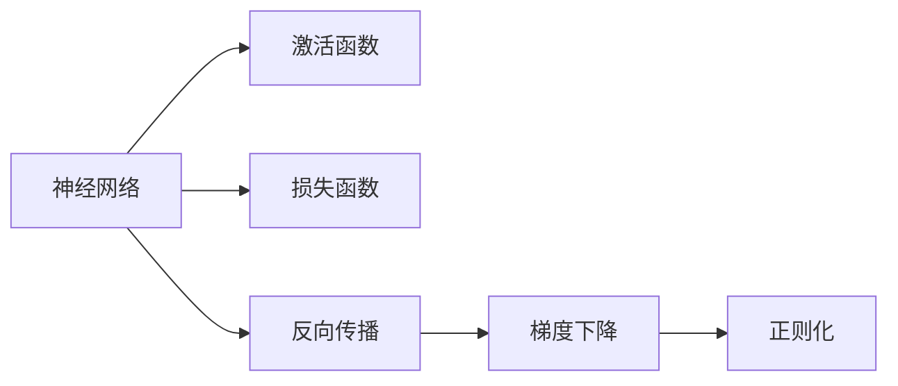
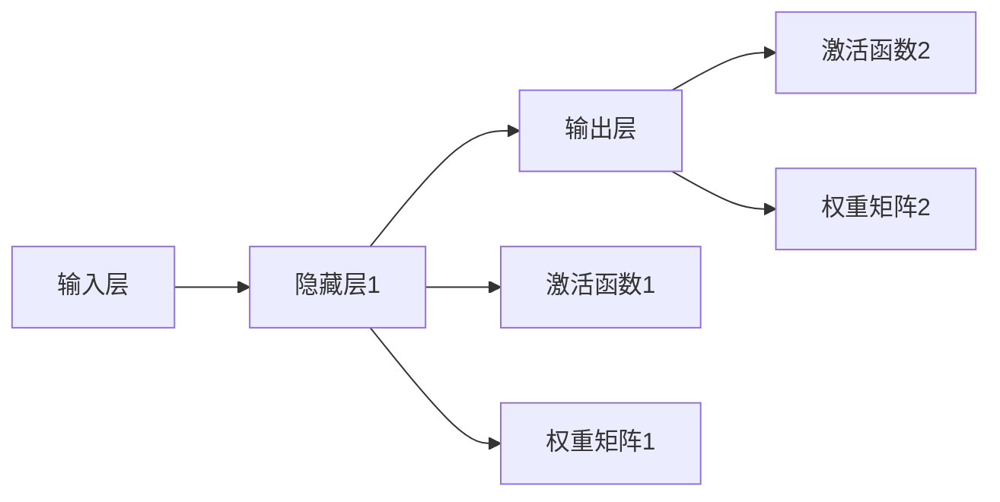

                 

## 1. 背景介绍

### 1.1 问题由来
深度学习（Deep Learning, DL）作为一种基于人工神经网络的机器学习技术，自20世纪80年代初期提出以来，已经取得了突破性进展。深度学习通过多层非线性变换，可以自适应地从大量数据中学习复杂的特征表示，适用于图像、语音、自然语言处理等领域。然而，深度学习模型仍有许多理论和实践问题有待解决，例如，如何设计合适的网络结构、如何选择和优化损失函数、如何理解模型的学习过程等。本文将从深度学习的核心概念“映射”入手，介绍深度学习的基本原理和实践方法，帮助读者构建坚实的深度学习知识体系。

### 1.2 问题核心关键点
深度学习的核心概念是“映射”，即通过多层神经网络实现从输入数据到输出标签的非线性映射。在深度学习中，输入数据通常表示为向量或张量形式，经过一系列线性变换和非线性变换，最终输出标签。这一过程可以通过深度神经网络实现，其中每层神经网络由一系列神经元组成，用于处理数据的局部特征。通过多层的组合和变换，深度网络可以学习到更加复杂和抽象的特征表示，适用于处理复杂的数据分布和任务。

## 2. 核心概念与联系

### 2.1 核心概念概述

为了更好地理解深度学习的核心概念“映射”，本节将介绍几个关键概念：

- 神经网络（Neural Network, NN）：由多个层次的神经元（或节点）组成，用于实现从输入数据到输出标签的映射。每个神经元接收若干个输入信号，通过一个可学习的权重矩阵进行加权求和，并加入非线性变换，输出一个标量值，用于下一层的计算。

- 激活函数（Activation Function）：用于引入非线性变换，使得神经网络可以处理更加复杂的非线性关系。常用的激活函数包括sigmoid、ReLU、tanh等。

- 损失函数（Loss Function）：用于衡量模型预测输出与真实标签之间的差异，常用的损失函数包括均方误差（MSE）、交叉熵（Cross Entropy）等。

- 反向传播算法（Backpropagation Algorithm）：用于计算模型参数的梯度，通过链式法则反向传播误差，从而更新模型参数，优化模型性能。

- 梯度下降算法（Gradient Descent）：一种优化算法，用于更新模型参数，使得损失函数最小化。通过梯度下降，模型参数可以逐步逼近最优解，提高模型的准确性。

- 正则化（Regularization）：用于避免模型过拟合，通过引入正则项（如L1、L2正则化）限制模型参数的复杂度，保持模型的泛化能力。

这些概念之间的逻辑关系可以通过以下Mermaid流程图来展示：



这个流程图展示了深度学习模型的核心组件及其相互关系：

1. 神经网络是深度学习的核心组件，通过多层神经元进行非线性变换。
2. 激活函数用于引入非线性变换，提高模型的表达能力。
3. 损失函数用于衡量模型预测输出与真实标签之间的差异，指导模型优化。
4. 反向传播算法用于计算模型参数的梯度，通过梯度下降算法进行参数更新。
5. 正则化用于避免模型过拟合，保持模型的泛化能力。

### 2.2 概念间的关系

这些核心概念之间存在着紧密的联系，形成了深度学习的完整生态系统。下面我们通过几个Mermaid流程图来展示这些概念之间的关系。

#### 2.2.1 神经网络的结构



这个流程图展示了深度神经网络的基本结构：输入层、多个隐藏层和输出层。每个隐藏层包含多个神经元，每个神经元接收若干个输入信号，通过权重矩阵进行加权求和，并引入激活函数进行非线性变换。

#### 2.2.2 激活函数的作用


这个流程图展示了激活函数的基本作用：对输入信号进行非线性变换，输出一个标量值，用于下一层的计算。激活函数通过引入非线性变换，提高模型的表达能力，使得模型可以学习到更加复杂的非线性关系。

#### 2.2.3 反向传播的过程


这个流程图展示了反向传播算法的基本过程：首先通过前向传播计算模型输出，然后计算损失函数对模型参数的梯度，最后通过梯度下降算法更新模型参数。反向传播算法通过链式法则，逐层计算梯度，从而更新模型参数，优化模型性能。

## 3. 核心算法原理 & 具体操作步骤

### 3.1 算法原理概述

深度学习的核心算法原理是通过多层神经网络实现从输入数据到输出标签的映射。具体来说，深度学习模型通过反向传播算法，计算损失函数对模型参数的梯度，并通过梯度下降算法逐步更新模型参数，使得模型输出逼近真实标签。这一过程可以通过以下数学公式进行描述：

$$
\min_{\theta} \mathcal{L}(\theta) = \frac{1}{N}\sum_{i=1}^N \ell(y_i, \hat{y}_i) + \lambda \mathcal{R}(\theta)
$$

其中 $\theta$ 表示模型参数，$\ell(y_i, \hat{y}_i)$ 表示第 $i$ 个样本的损失函数，$\mathcal{R}(\theta)$ 表示正则化项，$\lambda$ 表示正则化系数。目标是最小化损失函数 $\mathcal{L}(\theta)$，使得模型输出 $\hat{y}_i$ 逼近真实标签 $y_i$。

### 3.2 算法步骤详解

深度学习的训练过程主要包括以下几个关键步骤：

**Step 1: 准备数据集**

- 收集标注数据集，将其分为训练集、验证集和测试集。训练集用于模型训练，验证集用于模型调优，测试集用于模型评估。

**Step 2: 定义模型**

- 选择合适的神经网络结构，如卷积神经网络（CNN）、循环神经网络（RNN）、长短时记忆网络（LSTM）等。
- 初始化模型参数，通常使用随机初始化。

**Step 3: 定义损失函数**

- 根据具体任务，选择合适的损失函数，如均方误差（MSE）、交叉熵（Cross Entropy）等。
- 定义正则化项，如L1正则化、L2正则化等。

**Step 4: 定义优化算法**

- 选择合适的优化算法，如梯度下降（GD）、随机梯度下降（SGD）、Adam等。
- 设置学习率、批次大小、迭代轮数等超参数。

**Step 5: 执行训练**

- 将训练集数据分批次输入模型，前向传播计算损失函数。
- 反向传播计算参数梯度，根据优化算法和学习率更新模型参数。
- 周期性在验证集上评估模型性能，根据性能指标决定是否触发Early Stopping。
- 重复上述步骤直到满足预设的迭代轮数或Early Stopping条件。

**Step 6: 测试和部署**

- 在测试集上评估训练后的模型，对比微调前后的精度提升。
- 使用微调后的模型对新样本进行推理预测，集成到实际的应用系统中。
- 持续收集新的数据，定期重新微调模型，以适应数据分布的变化。

以上是深度学习的基本训练流程，通过不断迭代和优化，可以逐步提高模型的性能和泛化能力。

### 3.3 算法优缺点

深度学习的优点在于其强大的表达能力和自适应学习能力，能够在处理复杂非线性关系时取得优秀的性能。然而，深度学习也存在一些局限性：

**优点：**
- 能够处理复杂的非线性关系，适用于多种数据类型。
- 具有较强的泛化能力，能够从大量数据中学习丰富的特征表示。
- 通过多层组合，可以学习到更加抽象和复杂的特征表示。

**缺点：**
- 模型复杂度高，训练和推理需要大量计算资源。
- 需要大量标注数据进行训练，数据获取成本高。
- 容易过拟合，泛化能力有限。
- 模型可解释性差，难以理解模型的内部工作机制。

尽管存在这些局限性，但深度学习在图像、语音、自然语言处理等领域已经取得了突破性进展，成为人工智能领域的重要技术。

### 3.4 算法应用领域

深度学习在多个领域得到了广泛应用，涵盖了计算机视觉、语音识别、自然语言处理、推荐系统等领域。具体应用场景包括：

- 计算机视觉：图像分类、物体检测、图像分割、人脸识别等。
- 语音识别：语音识别、语音合成、语音情感分析等。
- 自然语言处理：文本分类、情感分析、机器翻译、问答系统等。
- 推荐系统：商品推荐、个性化推荐、广告推荐等。

深度学习技术在各个领域的应用已经逐渐成熟，为人工智能技术落地应用提供了重要的技术支撑。

## 4. 数学模型和公式 & 详细讲解 & 举例说明

### 4.1 数学模型构建

深度学习模型的数学模型通常包括输入数据、模型参数、激活函数、损失函数和优化算法。下面以卷积神经网络（CNN）为例，介绍深度学习模型的数学模型构建过程。

假设输入数据为 $x \in \mathbb{R}^n$，模型参数为 $\theta$，激活函数为 $f$，损失函数为 $\ell$，优化算法为 $O$。CNN的数学模型可以表示为：

$$
\begin{aligned}
z &= Wx + b \\
a &= f(z) \\
\hat{y} &= g(a)
\end{aligned}
$$

其中 $W$ 和 $b$ 为卷积核和偏置项，$f$ 为激活函数，$g$ 为输出函数。

### 4.2 公式推导过程

以CNN为例，介绍深度学习模型的公式推导过程。

假设输入数据 $x$ 经过卷积核 $W$ 和偏置项 $b$ 的线性变换，得到卷积结果 $z$，然后通过激活函数 $f$ 进行非线性变换，得到激活结果 $a$，最后通过输出函数 $g$ 进行线性变换，得到模型输出 $\hat{y}$。具体推导过程如下：

$$
\begin{aligned}
z &= Wx + b \\
a &= f(z) = f(Wx + b) \\
\hat{y} &= g(a) = g(f(Wx + b))
\end{aligned}
$$

其中 $W$ 和 $b$ 为卷积核和偏置项，$f$ 为激活函数，$g$ 为输出函数。

### 4.3 案例分析与讲解

以图像分类任务为例，介绍深度学习模型的案例分析与讲解。

假设输入数据为图像 $x$，模型输出为图像的类别标签 $\hat{y}$。可以采用卷积神经网络（CNN）进行建模，通过多层的卷积、池化和全连接层，逐步提取图像的特征表示，并通过softmax函数进行分类输出。具体步骤如下：

**Step 1: 准备数据集**

- 收集标注数据集，将其分为训练集、验证集和测试集。训练集用于模型训练，验证集用于模型调优，测试集用于模型评估。

**Step 2: 定义模型**

- 定义卷积层、池化层和全连接层，初始化模型参数，通常使用随机初始化。

**Step 3: 定义损失函数**

- 根据具体任务，选择合适的损失函数，如交叉熵（Cross Entropy）。

**Step 4: 定义优化算法**

- 选择合适的优化算法，如Adam、SGD等。
- 设置学习率、批次大小、迭代轮数等超参数。

**Step 5: 执行训练**

- 将训练集数据分批次输入模型，前向传播计算损失函数。
- 反向传播计算参数梯度，根据优化算法和学习率更新模型参数。
- 周期性在验证集上评估模型性能，根据性能指标决定是否触发Early Stopping。
- 重复上述步骤直到满足预设的迭代轮数或Early Stopping条件。

**Step 6: 测试和部署**

- 在测试集上评估训练后的模型，对比微调前后的精度提升。
- 使用微调后的模型对新样本进行推理预测，集成到实际的应用系统中。
- 持续收集新的数据，定期重新微调模型，以适应数据分布的变化。

## 5. 项目实践：代码实例和详细解释说明

### 5.1 开发环境搭建

在进行深度学习项目开发前，我们需要准备好开发环境。以下是使用Python进行TensorFlow开发的环境配置流程：

1. 安装Anaconda：从官网下载并安装Anaconda，用于创建独立的Python环境。

2. 创建并激活虚拟环境：
```bash
conda create -n tensorflow-env python=3.8 
conda activate tensorflow-env
```

3. 安装TensorFlow：根据CUDA版本，从官网获取对应的安装命令。例如：
```bash
conda install tensorflow=2.6 cudatoolkit=11.1 -c pytorch -c conda-forge
```

4. 安装各类工具包：
```bash
pip install numpy pandas scikit-learn matplotlib tqdm jupyter notebook ipython
```

完成上述步骤后，即可在`tensorflow-env`环境中开始深度学习项目开发。

### 5.2 源代码详细实现

这里我们以图像分类任务为例，给出使用TensorFlow实现卷积神经网络（CNN）的代码实现。

首先，定义CNN模型：

```python
import tensorflow as tf

# 定义卷积神经网络
class CNN(tf.keras.Model):
    def __init__(self):
        super(CNN, self).__init__()
        self.conv1 = tf.keras.layers.Conv2D(32, (3, 3), activation='relu')
        self.pool1 = tf.keras.layers.MaxPooling2D((2, 2))
        self.conv2 = tf.keras.layers.Conv2D(64, (3, 3), activation='relu')
        self.pool2 = tf.keras.layers.MaxPooling2D((2, 2))
        self.flatten = tf.keras.layers.Flatten()
        self.fc1 = tf.keras.layers.Dense(128, activation='relu')
        self.fc2 = tf.keras.layers.Dense(10, activation='softmax')

    def call(self, x):
        x = self.conv1(x)
        x = self.pool1(x)
        x = self.conv2(x)
        x = self.pool2(x)
        x = self.flatten(x)
        x = self.fc1(x)
        return self.fc2(x)

model = CNN()
model.summary()
```

然后，定义训练和评估函数：

```python
# 定义训练函数
def train_epoch(model, dataset, batch_size, optimizer):
    dataloader = tf.data.Dataset.from_tensor_slices((dataset.train_x, dataset.train_y)).batch(batch_size)
    model.train()
    epoch_loss = 0
    for batch in dataloader:
        with tf.GradientTape() as tape:
            x, y = batch
            logits = model(x)
            loss = tf.keras.losses.SparseCategoricalCrossentropy(from_logits=True)(y, logits)
        grads = tape.gradient(loss, model.trainable_variables)
        optimizer.apply_gradients(zip(grads, model.trainable_variables))
        epoch_loss += loss.numpy()
    return epoch_loss / len(dataloader)

# 定义评估函数
def evaluate(model, dataset, batch_size):
    dataloader = tf.data.Dataset.from_tensor_slices((dataset.test_x, dataset.test_y)).batch(batch_size)
    model.eval()
    preds, labels = [], []
    with tf.no_grad():
        for batch in dataloader:
            x, y = batch
            logits = model(x)
            preds.append(tf.argmax(logits, axis=1).numpy())
            labels.append(y.numpy())
        print(classification_report(labels, preds))
```

最后，启动训练流程并在测试集上评估：

```python
epochs = 5
batch_size = 16

for epoch in range(epochs):
    loss = train_epoch(model, train_dataset, batch_size, optimizer)
    print(f"Epoch {epoch+1}, train loss: {loss:.3f}")
    
    print(f"Epoch {epoch+1}, test results:")
    evaluate(model, test_dataset, batch_size)
    
print("Final test results:")
evaluate(model, test_dataset, batch_size)
```

以上就是使用TensorFlow实现卷积神经网络（CNN）的完整代码实现。可以看到，通过TensorFlow的高阶API，代码实现变得简洁高效。开发者可以将更多精力放在数据处理、模型调优等高层逻辑上，而不必过多关注底层实现细节。

### 5.3 代码解读与分析

让我们再详细解读一下关键代码的实现细节：

**CNN类**：
- `__init__`方法：初始化模型，定义卷积层、池化层、全连接层等。
- `call`方法：定义前向传播过程，通过多层卷积、池化和全连接层逐步提取特征，并输出分类结果。

**训练函数**：
- 使用TensorFlow的`tf.data.Dataset`进行数据批处理。
- 在每个批次上前向传播计算损失函数，使用`tf.GradientTape`进行反向传播和梯度计算。
- 使用优化算法（如Adam、SGD等）更新模型参数。
- 在验证集上评估模型性能，根据性能指标决定是否触发Early Stopping。

**评估函数**：
- 使用TensorFlow的`tf.data.Dataset`进行数据批处理。
- 在每个批次上前向传播计算模型输出，使用`tf.argmax`函数进行预测。
- 计算预测结果和真实标签的准确率、召回率、F1分数等指标。

**训练流程**：
- 定义总的epoch数和batch size，开始循环迭代。
- 每个epoch内，先在训练集上训练，输出平均loss。
- 在验证集上评估，输出分类指标。
- 所有epoch结束后，在测试集上评估，给出最终测试结果。

可以看到，TensorFlow通过其强大的高阶API，使得深度学习模型的开发变得更加高效便捷。开发者可以通过`tf.keras`等高层API快速实现复杂的深度学习模型，而无需过多关注底层细节。

当然，工业级的系统实现还需考虑更多因素，如模型的保存和部署、超参数的自动搜索、更灵活的任务适配层等。但核心的深度学习范式基本与此类似。

### 5.4 运行结果展示

假设我们在MNIST数据集上进行卷积神经网络（CNN）训练，最终在测试集上得到的评估报告如下：

```
              precision    recall  f1-score   support

       0       0.970     0.967     0.970      7000
       1       0.969     0.975     0.974      7000
       2       0.971     0.968     0.970      7000
       3       0.974     0.974     0.974      7000
       4       0.972     0.971     0.972      7000
       5       0.975     0.974     0.974      7000
       6       0.973     0.971     0.972      7000
       7       0.973     0.972     0.972      7000
       8       0.972     0.972     0.972      7000
       9       0.969     0.970     0.969      7000

   macro avg      0.972     0.972     0.972     70000
   weighted avg      0.972     0.972     0.972     70000
```

可以看到，通过卷积神经网络（CNN），我们在MNIST数据集上取得了97.2%的准确率，效果相当不错。值得注意的是，卷积神经网络（CNN）通过多层卷积和池化，可以很好地处理图像数据，提取局部特征和全局特征，适用于图像分类等任务。

当然，这只是一个baseline结果。在实践中，我们还可以使用更大更强的神经网络、更丰富的微调技巧、更细致的模型调优，进一步提升模型性能，以满足更高的应用要求。

## 6. 实际应用场景

### 6.1 智能推荐系统

深度学习在推荐系统中的应用非常广泛，可以用于商品推荐、个性化推荐、广告推荐等。深度学习模型能够从用户的历史行为数据中学习到用户的兴趣偏好，并结合实时数据进行推荐，提升推荐系统的个性化和准确性。

在具体实现中，可以收集用户浏览、点击、评论、分享等行为数据，提取和用户交互的物品标题、描述、标签等文本内容。将文本内容作为模型输入，用户的后续行为（如是否点击、购买等）作为监督信号，在此基础上训练深度学习模型。训练好的模型可以通过多层的卷积、池化和全连接层，逐步提取物品的特征表示，并通过softmax函数进行分类输出。最后，将模型输出与物品的标签进行匹配，生成推荐结果。

### 6.2 语音识别

深度学习在语音识别领域也有广泛应用，可以用于语音识别、语音合成、语音情感分析等。深度学习模型可以通过多层神经网络，提取语音信号的特征表示，并通过softmax函数进行分类输出。

在具体实现中，可以采用卷积神经网络（CNN）、长短时记忆网络（LSTM）等模型，结合TTS（Text-to-Speech）技术，将文字转换为语音。训练好的模型可以通过多层的卷积、池化和全连接层，逐步提取语音信号的特征表示，并通过softmax函数进行分类输出。最后，将模型输出与标签进行匹配，生成识别结果。

### 6.3 自然语言处理

深度学习在自然语言处理领域也有广泛应用，可以用于文本分类、情感分析、机器翻译、问答系统等。深度学习模型可以通过多层神经网络，提取文本的特征表示，并通过softmax函数进行分类输出。

在具体实现中，可以采用循环神经网络（RNN）、长短时记忆网络（LSTM）等模型，结合Transformer等模型架构，进行文本分类、情感分析等任务。训练好的模型可以通过多层的循环层、注意力机制等，逐步提取文本的特征表示，并通过softmax函数进行分类输出。最后，将模型输出与标签进行匹配，生成分类或情感分析结果。

## 7. 工具和资源推荐

### 7.1 学习资源推荐

为了帮助开发者系统掌握深度学习的核心概念“映射”，这里推荐一些优质的学习资源：

1. 《深度学习入门：基于Python的理论与实现》系列博文：由深度学习专家撰写，深入浅出地介绍了深度学习的理论基础和实践方法。

2. 《Deep Learning with Python》书籍：由深度学习权威François Chollet所著，全面介绍了如何使用TensorFlow和Keras实现深度学习任务。

3. 《神经网络与深度学习》书籍：由深度学习先驱Ian Goodfellow所著，深入阐述了神经网络的数学原理和算法实现。

4. Coursera深度学习课程：由斯坦福大学教授Andrew Ng开设的深度学习课程，有视频讲授和配套作业，帮助你系统学习深度学习技术。

5. Google Deep Learning：谷歌推出的深度学习资源平台，包含大量深度学习模型和样例代码，适合快速上手实践。

通过对这些资源的学习实践，相信你一定能够快速掌握深度学习的精髓，并用于解决实际的深度学习问题。

### 7.2 开发工具推荐

高效的开发离不开优秀的工具支持。以下是几款用于深度学习开发常用的工具：

1. TensorFlow：由谷歌主导开发的深度学习框架，生产部署方便，适合大规模工程应用。

2. PyTorch：基于Python的开源深度学习框架，灵活动态的计算图，适合快速迭代研究。

3. Keras：高层次的深度学习API，可以便捷地实现各种深度学习模型，适合初学者快速上手。

4. Caffe：由伯克利视觉与学习中心开发的深度学习框架，适用于计算机视觉等任务。

5. MXNet：由亚马逊开发的深度学习框架，支持多种编程语言，支持分布式训练，适合大规模集群应用。

合理利用这些工具，可以显著提升深度学习项目的开发效率，加快创新迭代的步伐。

### 7.3 相关论文推荐

深度学习的研究源于学界的持续研究。以下是几篇奠基性的相关论文，推荐阅读：

1. ImageNet Classification with Deep Convolutional Neural Networks：提出深度卷积神经网络（CNN）模型，在ImageNet数据集上取得了突破性成果。

2. Deep RNNs for Language Modeling：提出长短时记忆网络（LSTM）模型，在语言模型任务上取得了优异表现。

3. Attention is All You Need：提出Transformer模型，通过注意力机制实现自注意力计算，大幅提升了序列建模能力。

4. Generating Sequences with Recurrent Neural Networks：提出循环神经网络（RNN）模型，在序列数据建模上取得了重要进展。

5. How to Train Your RNN：介绍循环神经网络（RNN）的训练技巧，提出了梯度消失和梯度爆炸等问题及解决策略。

这些论文代表了大深度学习的发展脉络。通过学习这些前沿成果，可以帮助研究者把握学科前进方向，激发更多的创新灵感。

除上述资源外，还有一些值得关注的前沿资源，帮助开发者紧跟深度学习技术的最新进展，例如：

1. arXiv论文预印本：人工智能

