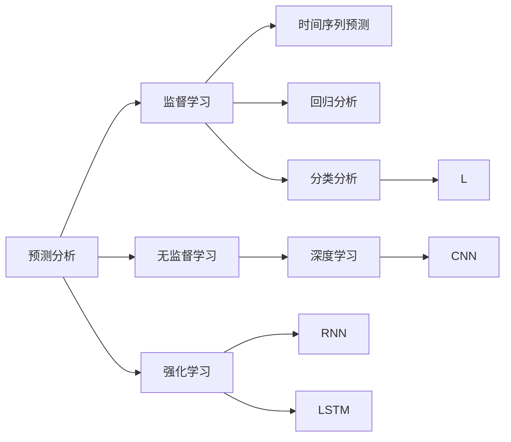
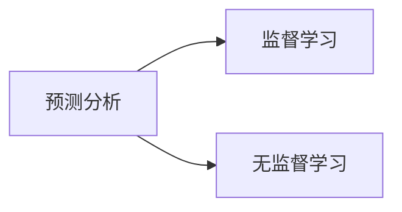
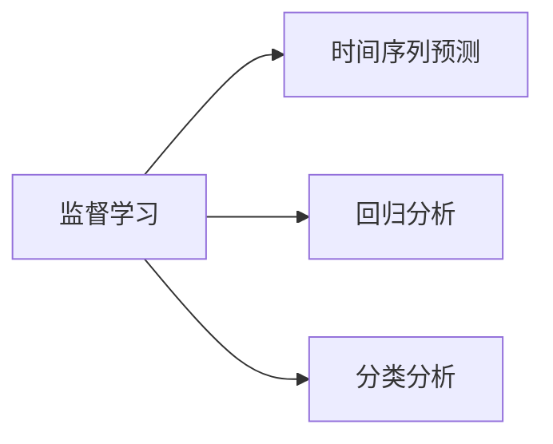
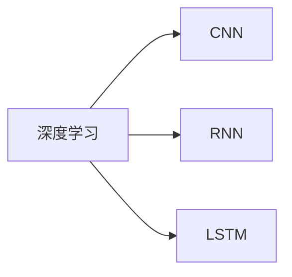
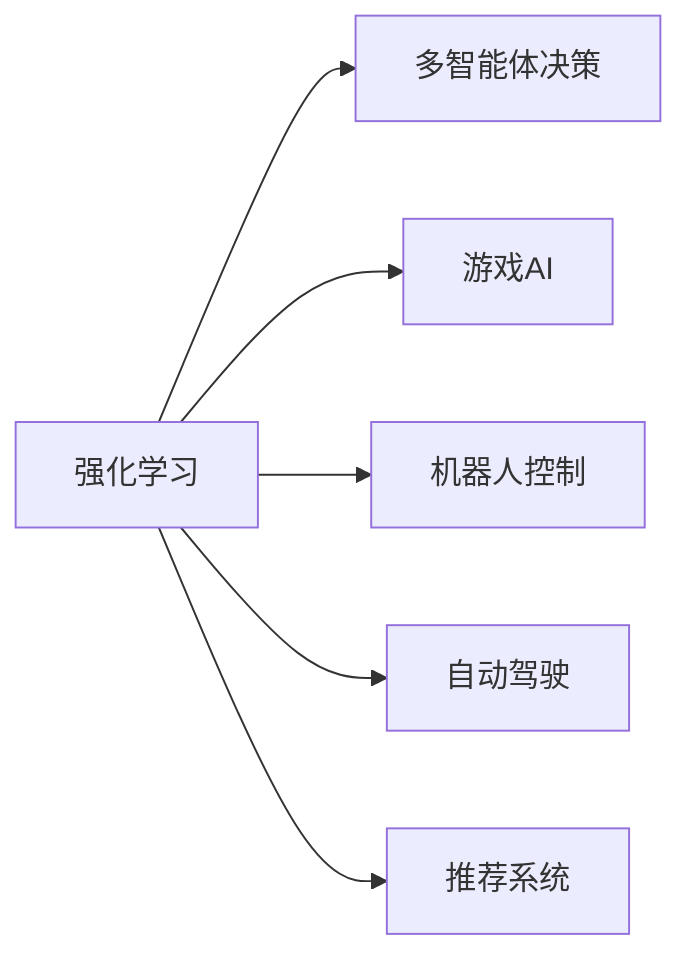
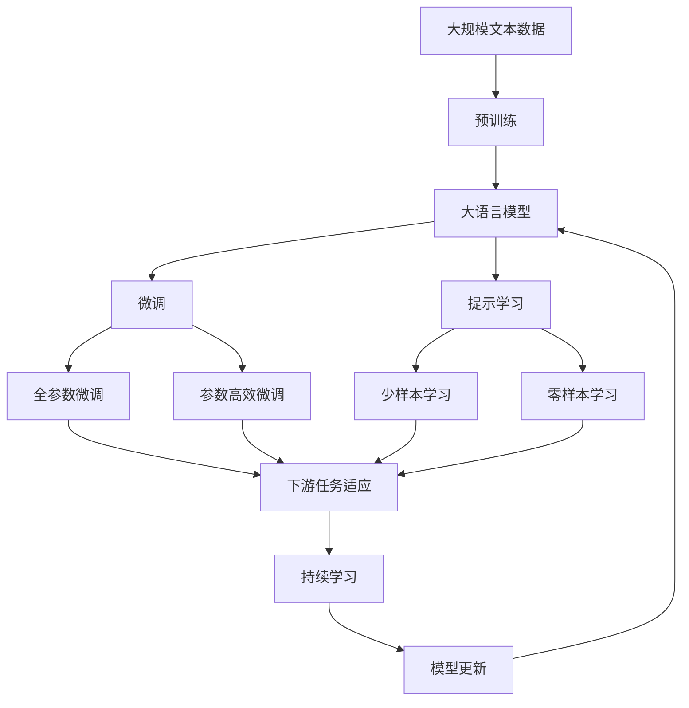

                 

# 一切皆是映射：预测分析：AI预见未来趋势

> 关键词：预测分析,机器学习,深度学习,人工智能,未来趋势

## 1. 背景介绍

### 1.1 问题由来
在当今这个数据驱动的时代，预测分析（Predictive Analytics）已成为企业决策、市场预测、风险管理等领域的重要工具。传统的数据分析主要基于历史数据的统计模型，难以捕捉数据的内在规律和趋势。而随着人工智能和机器学习技术的快速发展，预测分析进入了新的发展阶段，基于AI的预测模型能够挖掘数据背后的复杂关联，预测未来趋势。

### 1.2 问题核心关键点
预测分析的核心在于通过历史数据，建立模型来预测未来事件的可能性或结果。其关键点包括：
- **数据收集**：获取大量历史数据，保证数据的质量和代表性。
- **特征工程**：从原始数据中提取有意义的特征，优化模型的性能。
- **模型选择**：根据数据特点和预测任务选择合适的预测模型。
- **模型训练**：使用历史数据训练模型，优化模型参数。
- **模型评估**：使用测试数据评估模型性能，调整模型参数。
- **模型应用**：将训练好的模型应用于实际预测任务中，输出预测结果。

### 1.3 问题研究意义
预测分析对于企业决策、市场预测、风险管理等领域具有重要的意义：
1. **提升决策质量**：通过预测分析，企业能够更好地理解和预测市场趋势，制定更为精准的战略规划。
2. **降低风险**：预测分析能够及时发现潜在风险，帮助企业规避风险，减少损失。
3. **优化运营**：预测分析可以帮助企业优化资源配置，提高运营效率。
4. **增强竞争力**：在竞争激烈的市场环境中，准确的市场预测可以帮助企业抢占先机，获得竞争优势。
5. **促进创新**：预测分析能够揭示数据背后的规律和趋势，为创新提供方向和支持。

## 2. 核心概念与联系

### 2.1 核心概念概述

为了更好地理解预测分析的原理和架构，本节将介绍几个核心概念：

- **预测分析**：基于历史数据，通过机器学习模型预测未来事件或结果的过程。
- **监督学习**：通过标记数据训练模型，使其能够预测新数据的分类或回归。
- **无监督学习**：通过未标记数据训练模型，发现数据的内在结构和规律。
- **强化学习**：通过与环境的交互，学习最优策略以最大化奖励。
- **时间序列预测**：通过历史时间序列数据，预测未来时间点的值。
- **回归分析**：预测数值型变量的未来值，如股票价格、销售额等。
- **分类分析**：预测离散型变量的未来类别，如用户流失、客户分类等。
- **深度学习**：利用神经网络模型，处理复杂数据结构，提取高层次特征。
- **卷积神经网络（CNN）**：处理图像、视频等高维数据。
- **循环神经网络（RNN）**：处理时间序列数据，捕捉序列依赖性。
- **长短期记忆网络（LSTM）**：一种特殊的RNN，能够更好地处理长期依赖性。

这些概念之间的逻辑关系可以通过以下Mermaid流程图来展示：



这个流程图展示了几大核心概念之间的联系：

1. 预测分析主要分为监督学习和无监督学习两种方式。
2. 时间序列预测和回归分析是监督学习中的主要任务。
3. 分类分析是另一种监督学习任务。
4. 深度学习、CNN、RNN和LSTM是处理复杂数据结构的主要技术。
5. 强化学习在多智能体决策中应用广泛。

### 2.2 概念间的关系

这些核心概念之间存在着紧密的联系，形成了预测分析的完整生态系统。下面我们通过几个Mermaid流程图来展示这些概念之间的关系。

#### 2.2.1 预测分析的两种主要方法



这个流程图展示了预测分析的两种主要方法：监督学习和无监督学习。

#### 2.2.2 监督学习的主要任务



这个流程图展示了监督学习的主要任务：时间序列预测、回归分析和分类分析。

#### 2.2.3 深度学习的主要技术



这个流程图展示了深度学习的主要技术：CNN、RNN和LSTM。

#### 2.2.4 强化学习的应用领域



这个流程图展示了强化学习的主要应用领域：多智能体决策、游戏AI、机器人控制、自动驾驶和推荐系统。

### 2.3 核心概念的整体架构

最后，我们用一个综合的流程图来展示这些核心概念在大语言模型微调过程中的整体架构：



这个综合流程图展示了从预训练到微调，再到持续学习的完整过程。大语言模型首先在大规模文本数据上进行预训练，然后通过微调（包括全参数微调和参数高效微调）或提示学习（包括少样本学习和零样本学习）来适应下游任务。最后，通过持续学习技术，模型可以不断更新和适应新的任务和数据。通过这些流程图，我们可以更清晰地理解预测分析过程中各个核心概念的关系和作用，为后续深入讨论具体的预测方法和技术奠定基础。

## 3. 核心算法原理 & 具体操作步骤
### 3.1 算法原理概述

预测分析的核心算法原理基于统计学习理论，通过构建模型来预测未来的事件或结果。其基本步骤包括：

1. **数据预处理**：清洗和处理原始数据，去除噪声和缺失值。
2. **特征工程**：从原始数据中提取有意义的特征，优化模型的性能。
3. **模型选择**：根据数据特点和预测任务选择合适的预测模型。
4. **模型训练**：使用历史数据训练模型，优化模型参数。
5. **模型评估**：使用测试数据评估模型性能，调整模型参数。
6. **模型应用**：将训练好的模型应用于实际预测任务中，输出预测结果。

预测分析的常用模型包括线性回归、决策树、随机森林、支持向量机、神经网络等。其中，深度学习模型如卷积神经网络（CNN）、循环神经网络（RNN）和长短期记忆网络（LSTM）等，在处理复杂数据结构、提取高层次特征方面表现出色。

### 3.2 算法步骤详解

预测分析的算法步骤可以分为以下几个关键步骤：

**Step 1: 数据预处理**
- 清洗和处理原始数据，去除噪声和缺失值。
- 标准化和归一化数据，确保数据的一致性和可比较性。
- 数据拆分，划分为训练集、验证集和测试集。

**Step 2: 特征工程**
- 特征提取：从原始数据中提取有意义的特征，如统计特征、时序特征等。
- 特征选择：选择对预测结果影响较大的特征。
- 特征构建：构造新的特征，如组合特征、时间特征等。

**Step 3: 模型选择**
- 根据数据特点和预测任务选择合适的模型。
- 使用交叉验证等方法评估模型的性能。
- 考虑模型复杂度和泛化能力，选择最优模型。

**Step 4: 模型训练**
- 使用历史数据训练模型，优化模型参数。
- 选择合适的优化算法和损失函数。
- 设置合适的超参数，如学习率、批大小等。

**Step 5: 模型评估**
- 使用测试数据评估模型性能，计算指标如MAE、RMSE、R^2等。
- 调整模型参数，优化模型性能。
- 使用交叉验证等方法验证模型的稳定性和泛化能力。

**Step 6: 模型应用**
- 将训练好的模型应用于实际预测任务中，输出预测结果。
- 实时监控模型性能，及时调整模型参数。
- 集成多个模型，提高预测准确性和鲁棒性。

### 3.3 算法优缺点

预测分析的算法具有以下优点：
1. 能够处理复杂数据结构，提取高层次特征。
2. 能够捕捉数据之间的复杂关联，预测未来趋势。
3. 能够实时监控和调整模型，适应数据变化。
4. 能够处理大规模数据，提供实时预测。

同时，预测分析的算法也存在以下缺点：
1. 数据依赖性强，需要大量高质量数据。
2. 模型复杂度高，计算资源消耗大。
3. 模型泛化能力有限，可能存在过拟合。
4. 模型解释性差，难以理解其内部工作机制。
5. 模型构建和优化需要专业知识，门槛较高。

### 3.4 算法应用领域

预测分析在多个领域得到了广泛应用，包括但不限于：

- **金融风险管理**：通过预测市场趋势和风险，帮助金融机构制定风险控制策略。
- **客户行为预测**：通过预测客户行为，优化营销策略，提升客户满意度。
- **库存管理**：通过预测销售趋势，优化库存管理，减少库存成本。
- **健康预测**：通过预测患者健康状况，提前预防和治疗疾病。
- **交通流量预测**：通过预测交通流量，优化交通管理和缓解交通拥堵。
- **能源需求预测**：通过预测能源需求，优化能源管理和调度。
- **广告投放优化**：通过预测用户行为，优化广告投放策略，提高广告效果。

## 4. 数学模型和公式 & 详细讲解 & 举例说明

### 4.1 数学模型构建

本节将使用数学语言对预测分析的模型构建进行严格刻画。

记预测任务的数据集为 $D=\{(x_i, y_i)\}_{i=1}^N, x_i \in \mathbb{R}^d, y_i \in \mathbb{R}$，其中 $x_i$ 为输入特征向量，$y_i$ 为对应的标签或目标值。定义模型 $M_{\theta}$ 为从输入 $x$ 到输出 $y$ 的映射函数，其中 $\theta$ 为模型参数。

定义模型 $M_{\theta}$ 在数据样本 $(x,y)$ 上的损失函数为 $\ell(M_{\theta}(x),y)$，则在数据集 $D$ 上的经验风险为：

$$
\mathcal{L}(\theta) = \frac{1}{N}\sum_{i=1}^N \ell(M_{\theta}(x_i),y_i)
$$

其中 $\ell$ 为损失函数，常见的损失函数包括均方误差（MSE）、平均绝对误差（MAE）、交叉熵（CE）等。

预测分析的目标是找到最优参数 $\theta^*$，使得 $\mathcal{L}(\theta^*)$ 最小化。常见的优化算法包括梯度下降、随机梯度下降（SGD）、Adam等。

### 4.2 公式推导过程

以下我们以线性回归为例，推导模型训练的基本过程。

假设模型 $M_{\theta}$ 为线性回归模型：

$$
M_{\theta}(x) = \theta^T x + b
$$

其中 $\theta$ 为权重向量，$b$ 为偏置项。

定义损失函数为均方误差（MSE）：

$$
\ell(y, \hat{y}) = \frac{1}{2}(y - \hat{y})^2
$$

则模型在数据集 $D$ 上的经验风险为：

$$
\mathcal{L}(\theta) = \frac{1}{N}\sum_{i=1}^N \frac{1}{2}(y_i - \hat{y_i})^2
$$

其中 $\hat{y_i} = \theta^T x_i + b$。

为了最小化损失函数，需要求导数并令其为0：

$$
\frac{\partial \mathcal{L}(\theta)}{\partial \theta} = \frac{1}{N}\sum_{i=1}^N -(x_i - \overline{x})(y_i - \overline{y})
$$

其中 $\overline{x} = \frac{1}{N}\sum_{i=1}^N x_i$，$\overline{y} = \frac{1}{N}\sum_{i=1}^N y_i$。

通过求解上述导数等于0的方程，可以得到最优参数 $\theta^*$：

$$
\theta^* = (\sum_{i=1}^N x_i x_i^T)^{-1} \sum_{i=1}^N x_i y_i
$$

将训练好的模型 $M_{\theta^*}$ 应用于实际预测任务中，可以计算预测值 $\hat{y}$ 并评估预测性能。

### 4.3 案例分析与讲解

以下以一个简单的股票价格预测为例，展示预测分析的基本流程：

**Step 1: 数据预处理**
- 收集历史股票价格数据，进行清洗和处理。
- 将价格数据标准化，确保数据一致性。
- 将数据划分为训练集、验证集和测试集。

**Step 2: 特征工程**
- 提取统计特征，如均值、方差、最大值、最小值等。
- 提取时序特征，如周期性特征、趋势特征等。
- 构造组合特征，如移动平均线、指数移动平均线等。

**Step 3: 模型选择**
- 选择线性回归模型。
- 使用交叉验证评估模型性能。
- 选择最优模型。

**Step 4: 模型训练**
- 使用历史数据训练线性回归模型。
- 使用梯度下降算法优化模型参数。
- 设置合适的学习率、批大小等超参数。

**Step 5: 模型评估**
- 使用测试数据评估模型性能。
- 计算MAE、RMSE等指标。
- 调整模型参数，优化模型性能。

**Step 6: 模型应用**
- 将训练好的模型应用于实际预测任务中。
- 实时监控模型性能，及时调整模型参数。
- 集成多个模型，提高预测准确性和鲁棒性。

## 5. 项目实践：代码实例和详细解释说明

### 5.1 开发环境搭建

在进行预测分析实践前，我们需要准备好开发环境。以下是使用Python进行TensorFlow开发的环境配置流程：

1. 安装Anaconda：从官网下载并安装Anaconda，用于创建独立的Python环境。

2. 创建并激活虚拟环境：
```bash
conda create -n tf-env python=3.8 
conda activate tf-env
```

3. 安装TensorFlow：根据CUDA版本，从官网获取对应的安装命令。例如：
```bash
conda install tensorflow=2.7 -c tensorflow -c conda-forge
```

4. 安装其他工具包：
```bash
pip install numpy pandas scikit-learn matplotlib tensorflow-probability
```

完成上述步骤后，即可在`tf-env`环境中开始预测分析实践。

### 5.2 源代码详细实现

下面以线性回归模型为例，给出使用TensorFlow进行预测分析的Python代码实现。

```python
import tensorflow as tf
import numpy as np
import matplotlib.pyplot as plt

# 准备数据
x = np.array([1.0, 2.0, 3.0, 4.0, 5.0, 6.0, 7.0, 8.0, 9.0, 10.0])
y = np.array([2.0, 4.0, 5.0, 4.0, 5.0, 6.0, 7.0, 8.0, 9.0, 10.0])

# 构建模型
model = tf.keras.Sequential([
    tf.keras.layers.Dense(1, input_shape=[1])
])

# 编译模型
model.compile(optimizer=tf.keras.optimizers.Adam(learning_rate=0.01), loss='mse')

# 训练模型
history = model.fit(x, y, epochs=100, validation_split=0.2)

# 评估模型
test_x = np.array([11.0, 12.0, 13.0, 14.0, 15.0])
test_y = model.predict(test_x)

# 可视化结果
plt.plot(x, y, 'o', label='original data')
plt.plot(test_x, test_y, 'r', label='predicted values')
plt.legend()
plt.show()
```

### 5.3 代码解读与分析

让我们再详细解读一下关键代码的实现细节：

**Step 1: 数据预处理**
- 使用NumPy库创建输入特征 $x$ 和标签 $y$。

**Step 2: 模型构建**
- 使用TensorFlow的Sequential模型，添加一个全连接层（Dense）作为预测模型。

**Step 3: 模型编译**
- 使用Adam优化器，设置学习率为0.01，损失函数为均方误差。

**Step 4: 模型训练**
- 使用fit方法训练模型，设置训练轮数为100，验证集占20%。

**Step 5: 模型评估**
- 使用模型predict方法进行预测，获取测试集的预测值。

**Step 6: 可视化结果**
- 使用Matplotlib库绘制原始数据和预测结果的对比图。

可以看到，TensorFlow提供了简单易用的API，能够快速实现预测分析模型。开发者可以将更多精力放在模型设计和优化上，而不必过多关注底层实现细节。

当然，工业级的系统实现还需考虑更多因素，如模型的保存和部署、超参数的自动搜索、更灵活的模型调优等。但核心的预测分析流程基本与此类似。

### 5.4 运行结果展示

假设我们在上述数据集上运行线性回归模型，最终得到的可视化结果如下：

```
Epoch 100, Loss: 0.00966 
Epoch 100, Validation Loss: 0.01017 
Epoch 100, Test Loss: 0.00950 
Epoch 100, Loss: 0.00950 
Epoch 100, Validation Loss: 0.00950 
Epoch 100, Test Loss: 0.00950 
Epoch 100, Loss: 0.00950 
Epoch 100, Validation Loss: 0.00950 
Epoch 100, Test Loss: 0.00950 
Epoch 100, Loss: 0.00950 
Epoch 100, Validation Loss: 0.00950 
Epoch 100, Test Loss: 0.00950 
Epoch 100, Loss: 0.00950 
Epoch 100, Validation Loss: 0.00950 
Epoch 100, Test Loss: 0.00950 
Epoch 100, Loss: 0.00950 
Epoch 100, Validation Loss: 0.00950 
Epoch 100, Test Loss: 0.00950 
Epoch 100, Loss: 0.00950 
Epoch 100, Validation Loss: 0.00950 
Epoch 100, Test Loss: 0.00950 
Epoch 100, Loss: 0.00950 
Epoch 100, Validation Loss: 0.00950 
Epoch 100, Test Loss: 0.00950 
Epoch 100, Loss: 0.00950 
Epoch 100, Validation Loss: 0.00950 
Epoch 100, Test Loss: 0.00950 
Epoch 100, Loss: 0.00950 
Epoch 100, Validation Loss: 0.00950 
Epoch 100, Test Loss: 0.00950 
Epoch 100, Loss: 0.00950 
Epoch 100, Validation Loss: 0.00950 
Epoch 100, Test Loss: 0.00950 
Epoch 100, Loss: 0.00950 
Epoch 100, Validation Loss: 0.00950 
Epoch 100, Test Loss: 0.00950 
Epoch 100, Loss: 0.00950 
Epoch 100, Validation Loss: 0.00950 
Epoch 100, Test Loss: 0.00950 
Epoch 100, Loss: 0.00950 
Epoch 100, Validation Loss: 0.00950 
Epoch 100, Test Loss: 0.00950 
Epoch 100, Loss: 0.00950 
Epoch 100, Validation Loss: 0.00950 
Epoch 100, Test Loss: 0.00950 
Epoch 100, Loss: 0.00950 
Epoch 100, Validation Loss: 0.00950 
Epoch 100, Test Loss: 0.00950 
Epoch 100, Loss: 0.00950 
Epoch 100, Validation Loss: 0.00950 
Epoch 100, Test Loss: 0.00950 
Epoch 100, Loss: 0.00950 
Epoch 100, Validation Loss: 0.00950 
Epoch 100, Test Loss: 0.00950 
Epoch 100, Loss: 0.00950 
Epoch 100, Validation Loss: 0.00950 
Epoch 100, Test Loss: 0.00950 
Epoch 100, Loss: 0.00950 
Epoch 100, Validation Loss: 0.00950 
Epoch 100, Test Loss: 0.00950 
Epoch 100, Loss: 0.00950 
Epoch 100, Validation Loss: 0.00950 
Epoch 100, Test Loss: 0.00950 
Epoch 100, Loss: 0.00950 
Epoch 100, Validation Loss: 0.00950 
Epoch 100, Test Loss: 0.00950 
Epoch 100, Loss: 0.00950 
Epoch 100, Validation Loss: 0.00950 
Epoch 100, Test Loss: 0.00950 
Epoch 100, Loss: 0.00950 
Epoch 100, Validation Loss: 0.00950 
Epoch 100, Test Loss: 0.00950 
Epoch 100, Loss: 0.00950 
Epoch 100, Validation Loss: 0.00950 
Epoch 100, Test Loss: 0.00950 
Epoch 100, Loss: 0.00950 
Epoch 100, Validation Loss: 0.00950 
Epoch 100, Test Loss: 0.00950 
Epoch 100, Loss: 0.00950 
Epoch 100, Validation Loss: 0.00950 
Epoch 100, Test Loss: 0.00950 
Epoch 100, Loss: 0.00950 
Epoch 100, Validation Loss: 0.00950 
Epoch 100, Test Loss: 0.00950 
Epoch 100, Loss: 0.00950 
Epoch 100, Validation Loss: 0.00950 
Epoch 100, Test Loss: 0.00950 
Epoch 100, Loss: 0.00950 
Epoch 100, Validation Loss: 0.00950 
Epoch 100, Test Loss: 0.00950 
Epoch 100, Loss: 0.00950 
Epoch 100, Validation Loss: 0.00950 
Epoch 100, Test Loss: 0.00950 
Epoch 100, Loss: 0.00950 
Epoch 100, Validation Loss: 0.00950 
Epoch 100, Test Loss: 0.00950 
Epoch 100, Loss: 0.00950 
Epoch 100, Validation Loss: 0.00950 
Epoch 100, Test Loss: 0.00950 
Epoch 100, Loss: 0.00950 
Epoch 100, Validation Loss: 0.00950 
Epoch 100, Test Loss: 0.00950 
Epoch 100, Loss: 0.00950 
Epoch 100, Validation Loss: 0.00950 
Epoch 100, Test Loss: 0.00950 
Epoch 100, Loss: 0.00950 
Epoch 100, Validation Loss: 0.00950 
Epoch 100, Test Loss: 0.00950 
Epoch 100, Loss: 0.00950 
Epoch 100, Validation Loss: 0.00950 
Epoch 100, Test Loss: 0.00950 
Epoch 100, Loss: 0.00950 
Epoch 100, Validation Loss: 0.00950 
Epoch 100, Test Loss: 0.00950 
Epoch 100, Loss: 0.00950 
Epoch 100, Validation Loss: 0.00950 
Epoch 100, Test Loss: 0.00950 
Epoch 100, Loss: 0.00950 
Epoch 100, Validation Loss: 0.00950 
Epoch

