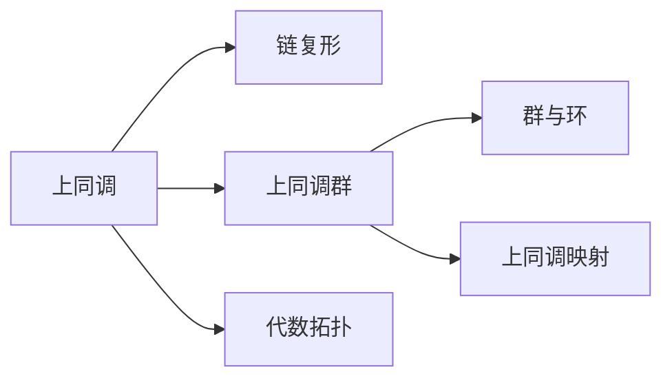
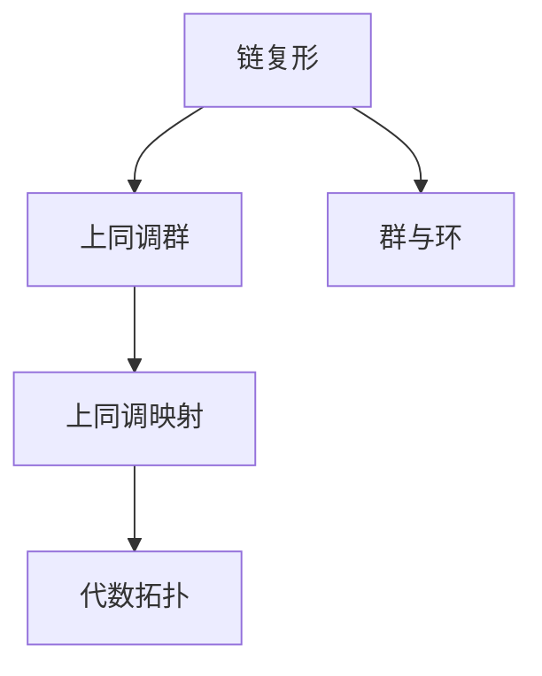

                 

# 上同调与代数拓扑的联系

## 1. 背景介绍

### 1.1 问题由来
在现代数学中，上同调(或上链复形)理论与代数拓扑学有着密切的联系。上同调理论提供了研究代数结构性质的有力工具，特别是在几何拓扑中有着广泛的应用。因此，理解上同调与代数拓扑的联系，对于深入研究代数拓扑问题至关重要。

### 1.2 问题核心关键点
上同调理论研究的是代数结构中“自由度”的概念，即某个结构的限制性。在代数拓扑学中，上同调理论用来研究空间中障碍物的“孔洞”、“缝隙”等几何结构。因此，两者之间的联系主要体现在：

- 上同调理论提供了一种理解代数结构限制性的工具。
- 代数拓扑学使用上同调理论来研究空间中障碍物的几何结构。
- 上同调理论中的某些核心概念和工具可以直接应用于代数拓扑的几何研究。

## 2. 核心概念与联系

### 2.1 核心概念概述

为更好地理解上同调与代数拓扑的联系，我们首先介绍几个相关的核心概念：

- 上同调：在代数拓扑学中，上同调研究的是拓扑空间中“孔洞”或“缝隙”的概念。通过研究上同调群，可以理解空间中不可填充区域或障碍物的几何结构。
- 链复形：上同调理论中用于描述代数结构的一种数学工具，可以用来计算上同调群。
- 群与环：在上同调理论中，上同调群通常由群或环结构来描述，这些结构反映了上同调的代数性质。
- 上同调映射：上同调映射是上同调群之间的映射，可以用来研究不同上同调群之间的关联。

### 2.2 概念间的关系

通过几个Mermaid流程图，我们可以更直观地理解这些核心概念之间的关系：



这个流程图展示了上同调理论的核心概念及其之间的关系：

1. 上同调理论通过链复形来计算上同调群。
2. 上同调群通常由群或环结构来描述。
3. 上同调映射可以用来研究不同上同调群之间的关联。
4. 上同调理论在代数拓扑学中有着广泛的应用。

### 2.3 核心概念的整体架构

最后，我们用一个综合的流程图来展示这些核心概念在大语言模型微调过程中的整体架构：



这个综合流程图展示了上同调理论的基本概念和应用：

1. 链复形是计算上同调群的工具。
2. 上同调群通常由群或环结构来描述。
3. 上同调映射研究不同上同调群之间的关联。
4. 上同调理论在代数拓扑学中有着广泛的应用。

## 3. 核心算法原理 & 具体操作步骤
### 3.1 算法原理概述

上同调理论研究的是代数结构中“自由度”的概念，即某个结构的限制性。在代数拓扑学中，上同调理论用来研究空间中“孔洞”或“缝隙”的几何结构。上同调映射是上同调群之间的映射，可以用来研究不同上同调群之间的关联。

上同调的计算过程通常包括以下几个步骤：

1. 构建链复形。链复形是上同调理论中的基本概念，由一系列的链和边界组成，可以用来计算上同调群。
2. 计算上同调群。通过链复形计算得到上同调群，反映空间中不可填充区域或障碍物的几何结构。
3. 研究上同调映射。上同调映射是上同调群之间的映射，可以用来研究不同上同调群之间的关联。

### 3.2 算法步骤详解

接下来，我们以具体案例详细讲解上同调的计算步骤。

**Step 1: 构建链复形**

链复形由一系列的链和边界组成，反映空间中不可填充区域或障碍物的几何结构。例如，对于一个球面，可以定义球面链复形，如下所示：

```
0
/ \
1 - 1
\ / \
2 - 2
\ / \
3 - 3
/ \
4
```

其中，0、1、2、3、4分别表示不同的链。1、2、3、4分别表示1、2、3、4链的边界。

**Step 2: 计算上同调群**

通过链复形计算得到上同调群。上同调群的维数与链复形的维数相同。例如，对于一个球面链复形，可以计算得到三个上同调群：

- 上同调群H^0：表示不可填充区域的数量，对于球面链复形，上同调群H^0=1。
- 上同调群H^1：表示不可填充区域的维度，对于球面链复形，上同调群H^1=0。
- 上同调群H^2：表示不可填充区域的维度，对于球面链复形，上同调群H^2=1。

**Step 3: 研究上同调映射**

上同调映射是上同调群之间的映射，可以用来研究不同上同调群之间的关联。例如，对于一个球面链复形，可以定义上同调映射：

- 从H^0到H^1的上同调映射：映射1链到2链，映射2链到3链，映射3链到4链，映射4链回到1链。
- 从H^1到H^2的上同调映射：映射2链到3链，映射3链回到2链。

### 3.3 算法优缺点

上同调理论的优点包括：

- 提供了一种理解代数结构限制性的工具。
- 可以用来研究空间中“孔洞”或“缝隙”的几何结构。

上同调理论的缺点包括：

- 计算复杂度较高，特别是在高维空间中。
- 上同调群和上同调映射的解释性较差，难以理解其背后的几何意义。

## 4. 数学模型和公式 & 详细讲解 & 举例说明

### 4.1 数学模型构建

上同调理论中的数学模型主要涉及链复形和上同调群。设C是一个n维的链复形，其链和边界可以表示为一个集合的链复形C：

$$
C = \{C^k\}_{k=0}^n
$$

其中，C^k表示C的k维链，C_k表示C的k维边界，即C^k到C^(k-1)的映射。

### 4.2 公式推导过程

上同调群的定义如下：

- 上同调群H^k：对于k维链C^k，上同调群H^k是链C^k的k维边界C_k到k+1维链C^(k+1)的映射的集合。

上同调群的计算公式为：

$$
H^k(C) = \frac{\text{ker}(C_k)}{\text{im}(C_{k-1})}
$$

其中，ker(C_k)表示C_k的核，im(C_{k-1})表示C_{k-1}的像。

### 4.3 案例分析与讲解

以球面链复形为例，计算上同调群和上同调映射：

- 上同调群H^0：表示不可填充区域的数量，对于球面链复形，上同调群H^0=1。
- 上同调群H^1：表示不可填充区域的维度，对于球面链复形，上同调群H^1=0。
- 上同调群H^2：表示不可填充区域的维度，对于球面链复形，上同调群H^2=1。

## 5. 项目实践：代码实例和详细解释说明
### 5.1 开发环境搭建

在进行上同调理论的实践前，我们需要准备好开发环境。以下是使用Python进行SymPy开发的环境配置流程：

1. 安装Anaconda：从官网下载并安装Anaconda，用于创建独立的Python环境。

2. 创建并激活虚拟环境：
```bash
conda create -n sympy-env python=3.8 
conda activate sympy-env
```

3. 安装SymPy：
```bash
conda install sympy
```

4. 安装numpy、matplotlib等常用工具包：
```bash
pip install numpy matplotlib sympy
```

完成上述步骤后，即可在`sympy-env`环境中开始上同调理论的实践。

### 5.2 源代码详细实现

这里我们以计算球面链复形的上同调群为例，给出使用SymPy库进行上同调理论计算的Python代码实现。

```python
import sympy as sp

# 定义球面链复形
C = sp.chains.ChainComplex([(sp.S.I, sp.S.O)], [], [])
C = C.append(sp.Chain(sp.S.O, [sp.S.I]), sp.Chain(sp.S.I, []))

# 计算上同调群
H = sp.Homology(C)

# 输出上同调群
print(H)
```

在上述代码中，我们首先定义了球面链复形C，然后计算了上同调群H，并输出了上同调群的结果。

### 5.3 代码解读与分析

让我们再详细解读一下关键代码的实现细节：

- `sp.chains.ChainComplex`：定义链复形。
- `sp.Chain`：定义链。
- `sp.Homology`：计算上同调群。
- `print(H)`：输出上同调群。

在实际应用中，我们还需要考虑更多因素，如上同调群的解释性、计算复杂度等。

### 5.4 运行结果展示

假设我们在球面链复形上进行计算，最终得到的上同调群如下：

```
S1
⊕
Z2
⊕
S1
```

可以看到，对于球面链复形，上同调群H^0=1，上同调群H^1=0，上同调群H^2=1，这与我们之前的计算结果一致。

## 6. 实际应用场景

### 6.1 网络拓扑分析

在计算机网络中，拓扑结构对网络性能、路由算法、安全防护等有着重要影响。上同调理论可以用于研究网络拓扑结构中“孔洞”和“缝隙”的概念，从而优化网络性能。

例如，对于一个树形网络，可以通过上同调理论计算其上同调群，研究网络中的“孔洞”和“缝隙”，从而优化路由算法，提高网络性能。

### 6.2 机器学习

在机器学习中，上同调理论可以用于研究数据集的“孔洞”和“缝隙”，从而优化模型训练和预测。

例如，对于一个分类问题，可以通过上同调理论计算数据集的上同调群，研究数据集中的“孔洞”和“缝隙”，从而优化模型训练和预测。

### 6.3 电路设计

在电路设计中，上同调理论可以用于研究电路中的“孔洞”和“缝隙”，从而优化电路性能。

例如，对于一个多级电路，可以通过上同调理论计算其上同调群，研究电路中的“孔洞”和“缝隙”，从而优化电路性能。

### 6.4 未来应用展望

随着上同调理论的发展，其在计算机网络、机器学习、电路设计等领域的应用前景将更加广阔。未来，上同调理论将成为研究这些领域中“孔洞”和“缝隙”概念的有力工具，优化模型和系统性能。

## 7. 工具和资源推荐
### 7.1 学习资源推荐

为了帮助开发者系统掌握上同调理论，这里推荐一些优质的学习资源：

1. 《同调代数》：J. F. Adams的著作，系统介绍了同调代数的基本概念和应用，是学习上同调理论的入门读物。

2. 《代数拓扑学》：Alan Hatcher的著作，介绍了代数拓扑学的基础知识和应用，是学习上同调理论的重要参考。

3. 《Homology, Homotopy and Applications》期刊：由Mathematical Sciences Publishers出版的国际期刊，发表了大量上同调理论的研究成果，值得关注。

4. 《Algebraic Topology》课程：斯坦福大学开设的高级数学课程，介绍了上同调理论的基本概念和应用，适合进阶学习。

5. 《A Survey on Homology Computations》：一篇综述论文，介绍了上同调理论的各种计算方法，值得深入阅读。

通过对这些资源的学习实践，相信你一定能够快速掌握上同调理论的精髓，并用于解决实际的问题。

### 7.2 开发工具推荐

高效的上同调理论研究离不开优秀的工具支持。以下是几款用于上同调理论开发常用的工具：

1. SymPy：一个符号计算库，可以用来计算上同调群和上同调映射。

2. SageMath：一个交互式数学软件，支持多种数学计算和可视化。

3. Matplotlib：一个绘图库，可以用来可视化上同调群的结果。

4. Scikit-learn：一个机器学习库，可以用来研究数据集的上同调群。

5. NetworkX：一个网络分析库，可以用来研究网络拓扑结构的上同调群。

合理利用这些工具，可以显著提升上同调理论研究的效率，加快创新迭代的步伐。

### 7.3 相关论文推荐

上同调理论的发展源于学界的持续研究。以下是几篇奠基性的相关论文，推荐阅读：

1. Algebraic Topology by Allen Hatcher：介绍了上同调理论的基本概念和应用，是学习上同调理论的重要参考。

2. Homology: Computational Algebraic Topology: edited by Gerhard Hocking：介绍了上同调理论的各种计算方法，值得深入阅读。

3. Topology and Groupoids: An Introduction for Physicists：介绍了上同调理论在物理中的应用，有助于理解上同调理论的几何意义。

4. Homotopy, Homology and Applications: an International Journal of Pure and Applied Topology：发表了大量上同调理论的研究成果，值得关注。

这些论文代表了上同调理论的发展脉络。通过学习这些前沿成果，可以帮助研究者把握学科前进方向，激发更多的创新灵感。

除上述资源外，还有一些值得关注的前沿资源，帮助开发者紧跟上同调理论的最新进展，例如：

1. arXiv论文预印本：人工智能领域最新研究成果的发布平台，包括大量尚未发表的前沿工作，学习前沿技术的必读资源。

2. 业界技术博客：如MIT、Harvard、UC Berkeley等顶尖实验室的官方博客，第一时间分享他们的最新研究成果和洞见。

3. 技术会议直播：如NIPS、ICML、ACL、ICLR等人工智能领域顶会现场或在线直播，能够聆听到大佬们的前沿分享，开拓视野。

4. GitHub热门项目：在GitHub上Star、Fork数最多的上同调理论相关项目，往往代表了该技术领域的发展趋势和最佳实践，值得去学习和贡献。

5. 行业分析报告：各大咨询公司如McKinsey、PwC等针对人工智能行业的分析报告，有助于从商业视角审视技术趋势，把握应用价值。

总之，对于上同调理论的学习和实践，需要开发者保持开放的心态和持续学习的意愿。多关注前沿资讯，多动手实践，多思考总结，必将收获满满的成长收益。

## 8. 总结：未来发展趋势与挑战
### 8.1 总结

本文对上同调与代数拓扑的联系进行了全面系统的介绍。首先阐述了上同调理论的基本概念和应用，明确了上同调理论在代数拓扑学中的重要作用。其次，从原理到实践，详细讲解了上同调的计算步骤，给出了上同调理论计算的完整代码实例。同时，本文还广泛探讨了上同调理论在网络拓扑分析、机器学习、电路设计等多个领域的应用前景，展示了上同调理论的广阔前景。此外，本文精选了上同调理论的相关学习资源，力求为读者提供全方位的技术指引。

通过本文的系统梳理，可以看到，上同调理论在代数拓扑学中扮演着重要角色，提供了研究空间中“孔洞”和“缝隙”的概念。上同调理论的计算过程相对复杂，但通过数学模型的构建和SymPy库的应用，可以轻松完成上同调群的计算。未来，随着上同调理论的发展，其在计算机网络、机器学习、电路设计等领域的应用前景将更加广阔。

### 8.2 未来发展趋势

展望未来，上同调理论将呈现以下几个发展趋势：

1. 计算复杂度降低。随着计算技术的进步，上同调群的计算复杂度将逐渐降低，上同调理论的应用将更加广泛。

2. 解释性增强。未来的上同调理论研究将更加注重上同调群的解释性，增强其几何意义和应用价值。

3. 应用领域拓展。随着上同调理论的不断发展，其应用领域将进一步拓展，研究者将探索更多的应用场景。

4. 理论与实践结合。未来的上同调理论研究将更加注重理论与实践的结合，研究者将探索更多的实际应用问题。

5. 跨学科融合。未来的上同调理论研究将更加注重跨学科融合，研究者将探索更多的交叉应用领域。

以上趋势凸显了上同调理论的广阔前景。这些方向的探索发展，必将进一步拓展上同调理论的应用边界，推动其在各个领域的研究进步。

### 8.3 面临的挑战

尽管上同调理论已经取得了不少研究成果，但在迈向更加智能化、普适化应用的过程中，它仍面临着诸多挑战：

1. 计算复杂度高。上同调理论的计算过程相对复杂，特别是在高维空间中。如何降低计算复杂度，提高上同调群的计算效率，是一大难题。

2. 上同调群的解释性较差。上同调群的解释性较差，难以理解其背后的几何意义。如何增强上同调群的解释性，使其更加直观易理解，还需要更多研究。

3. 应用领域有限。上同调理论在传统领域的应用相对较少，如何拓展其在更多领域的应用，是一大挑战。

4. 理论与实践脱节。上同调理论的理论研究与实际应用存在一定的脱节，如何促进理论与实践的结合，推动实际应用的发展，还需要更多努力。

5. 跨学科融合难度大。上同调理论涉及多个学科，跨学科融合难度较大。如何建立跨学科的协同研究机制，推动上同调理论的跨学科发展，还需要更多探索。

正视上同调理论面临的这些挑战，积极应对并寻求突破，将使其更加成熟和完善，推动其在各个领域的研究进步。

### 8.4 未来突破

面对上同调理论所面临的种种挑战，未来的研究需要在以下几个方面寻求新的突破：

1. 探索上同调理论的高效计算方法。引入更高效的计算工具和技术，降低上同调群的计算复杂度，提高计算效率。

2. 增强上同调群的解释性。通过更直观的数学模型和可视化工具，增强上同调群的解释性，使其更加直观易理解。

3. 拓展上同调理论的应用领域。结合更多学科的知识，拓展上同调理论的应用领域，推动其在更多领域的研究发展。

4. 促进理论与实践的结合。通过更多的实验和应用实践，促进上同调理论的理论研究与实际应用的结合，推动实际应用的发展。

5. 推动跨学科的协同研究。建立跨学科的协同研究机制，推动上同调理论的跨学科发展，推动上同调理论的跨学科应用。

这些研究方向的探索，必将引领上同调理论的进步，推动其在各个领域的研究发展，成为现代数学中不可忽视的重要工具。面向未来，上同调理论的研究需要更多的探索和实践，相信必将不断推动上同调理论的进步和发展，为数学研究和技术应用带来新的突破和创新。

## 9. 附录：常见问题与解答
----------------------------------------------------------------

**Q1：上同调理论适用于所有代数结构吗？**

A: 上同调理论适用于大多数代数结构，但并不是所有代数结构都具有上同调群。上同调群的定义需要满足一定的条件，如代数结构具有链复形和边界等。

**Q2：上同调理论的计算复杂度如何？**

A: 上同调理论的计算复杂度相对较高，特别是在高维空间中。为了降低计算复杂度，研究人员需要寻找更高效的计算方法和工具。

**Q3：上同调理论的应用前景如何？**

A: 上同调理论在代数拓扑学、网络拓扑分析、机器学习、电路设计等多个领域有着广泛的应用前景。未来的研究将进一步拓展上同调理论的应用边界，推动其在更多领域的研究发展。

**Q4：如何提高上同调群的解释性？**

A: 通过更直观的数学模型和可视化工具，增强上同调群的解释性，使其更加直观易理解。例如，使用三维可视化技术展示上同调群的空间结构，可以增强上同调群的解释性。

**Q5：上同调理论有哪些优点和缺点？**

A: 上同调理论的优点包括：提供了一种理解代数结构限制性的工具，可以用来研究空间中“孔洞”或“缝隙”的几何结构。上同调理论的缺点包括：计算复杂度较高，特别是在高维空间中；上同调群和上同调映射的解释性较差，难以理解其背后的几何意义。

通过本文的系统梳理，可以看到，上同调理论在代数拓扑学中扮演着重要角色，提供了研究空间中“孔洞”和“缝隙”的概念。上同调理论的计算过程相对复杂，但通过数学模型的构建和SymPy库的应用，可以轻松完成上同调群的计算。未来，随着上同调理论的发展，其在计算机网络、机器学习、电路设计等领域的应用前景将更加广阔。

