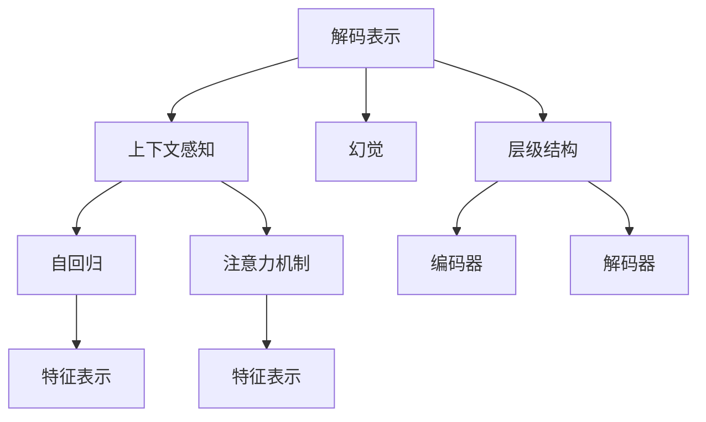
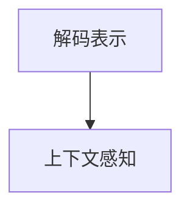

                 

# 不完善的解码表示导致幻觉

> 关键词：解码表示, 幻觉, 机器翻译, 自然语言处理(NLP), 深度学习

## 1. 背景介绍

在自然语言处理（NLP）领域，深度学习技术，尤其是神经网络架构如Transformer，已经成为处理自然语言处理问题的核心工具。在自然语言生成任务中，解码器扮演着至关重要的角色。它负责将编码器输出转换为目标语言的单词序列，通过复杂的网络结构捕捉上下文信息，产生流畅自然的语言输出。然而，尽管这些模型在生成任务上表现出色，但在解码器输出上的问题仍时有发生。其中一种问题就是解码表示的不完善，可能导致模型生成的语言产生幻觉（Hallucination）。

### 1.1 幻觉在NLP生成任务中的影响

幻觉是指模型在生成文本时，根据上下文错误地生成了实际文本中不存在的单词、短语或事实。这通常发生在模型输出缺少足够的上下文信息，或者解码器生成新文本时过于自信，忽略了输入数据中的错误。幻觉不仅会影响文本的质量，还可能导致模型输出的误解，甚至危及应用的安全性。在机器翻译、对话系统、文本摘要等任务中，幻觉问题的存在可能引发严重的后果。

### 1.2 幻觉问题的原因

幻觉问题的根本原因在于解码器在处理长文本序列时的复杂性。长序列在解码过程中会导致信息丢失，或者模型过于自信地生成新内容。这些问题通常是由于模型训练时未充分优化，或者在解码器设计时考虑不周所导致的。为了解决幻觉问题，需要对解码器表示进行深入分析，找出导致幻觉的根本原因，并采取相应的优化措施。

## 2. 核心概念与联系

### 2.1 核心概念概述

为了深入理解幻觉问题及其解决方案，本节将介绍几个相关的核心概念：

- **解码表示（Decoding Representation）**：在自回归模型中，解码器根据先前的输出不断生成下一个单词。解码器输出的隐藏表示被视为解码表示。
- **幻觉（Hallucination）**：模型在生成文本时，根据上下文错误地生成了实际文本中不存在的单词、短语或事实。
- **上下文感知（Context-Aware）**：在生成过程中，模型能够理解并利用上下文信息，减少幻觉的发生。
- **自回归（Autoregressive）**：一种常见的网络架构，模型依次生成每个单词，依赖于前面的单词。
- **注意力机制（Attention Mechanism）**：在解码过程中，模型通过注意力机制选择重要的输入信息，以增强生成质量。
- **特征表示（Feature Representation）**：解码表示中提取的关键特征，用于后续的生成决策。
- **层级结构（Hierarchical Structure）**：复杂模型中的层级结构，包括编码器、解码器等。

这些核心概念之间的关系可以通过以下Mermaid流程图来展示：



这个流程图展示了解码表示在自回归模型中的地位，以及幻觉、上下文感知、自回归、注意力机制、特征表示和层级结构等概念之间的关系。

### 2.2 概念间的关系

这些核心概念之间存在着紧密的联系，形成了解码器表示在生成任务中的工作原理。下面通过几个Mermaid流程图来展示这些概念之间的关系。

#### 2.2.1 解码表示与幻觉的关系


这个流程图展示了解码表示与幻觉之间的关系。幻觉通常是由于解码表示不完善导致的。

#### 2.2.2 解码表示与上下文感知的关系



这个流程图展示了解码表示与上下文感知之间的关系。上下文感知有助于改善解码表示的质量，从而减少幻觉的发生。

#### 2.2.3 解码表示与注意力机制的关系


这个流程图展示了解码表示与注意力机制之间的关系。注意力机制通过选择重要的输入信息，进一步优化解码表示。

## 3. 核心算法原理 & 具体操作步骤
### 3.1 算法原理概述

幻觉问题的出现，主要是因为解码器在生成过程中，无法准确捕捉和利用上下文信息，导致生成的文本与实际文本不一致。为了解决这一问题，我们需要对解码表示进行深入分析，找出导致幻觉的根本原因，并采取相应的优化措施。

解码表示的质量不仅取决于模型结构，还受训练数据、超参数、解码策略等多种因素的影响。因此，要彻底解决幻觉问题，需要对这些因素进行全面的分析和优化。

### 3.2 算法步骤详解

解决幻觉问题的步骤如下：

**Step 1: 数据预处理**
- 准备高质量的数据集，确保数据集的多样性和代表性。
- 对数据进行标准化处理，如分词、去停用词、词干提取等。
- 对长序列进行截断或填充，确保序列长度一致。

**Step 2: 模型选择与设计**
- 选择适合的解码器结构，如Transformer、LSTM等。
- 设计合适的注意力机制，确保模型能够充分利用上下文信息。
- 确定模型超参数，如学习率、批大小等。

**Step 3: 解码策略优化**
- 使用自回归解码策略，逐步生成文本。
- 引入长度惩罚机制，避免生成过长或过短的文本。
- 引入束搜索（Beam Search）策略，在搜索过程中考虑多个候选，选择最优路径。

**Step 4: 解码表示分析**
- 对解码表示进行可视化，理解模型的内部机制。
- 对解码表示进行特征分析，识别出幻觉发生的区域。
- 对解码表示进行优化，如使用残差连接、梯度裁剪等方法。

**Step 5: 模型训练与评估**
- 使用训练数据集对模型进行训练。
- 在验证集上评估模型的性能，调整超参数。
- 在测试集上测试模型的泛化能力，评估模型的实际效果。

### 3.3 算法优缺点

解决幻觉问题的算法具有以下优点：

- 能够显著提高生成文本的质量，减少幻觉的发生。
- 适用于各种NLP生成任务，如机器翻译、对话系统、文本摘要等。
- 能够与现有的深度学习框架无缝集成，易于实现。

同时，这些算法也存在一些局限性：

- 对数据集的质量和规模要求较高，需要大量高质量的数据。
- 模型结构和超参数的调整较为复杂，需要丰富的经验和专业知识。
- 优化过程可能较为耗时，特别是在大规模数据集上。

### 3.4 算法应用领域

幻觉问题主要应用于以下领域：

- 机器翻译：在翻译过程中，模型可能生成实际文本中不存在的单词或短语。
- 对话系统：在对话过程中，模型可能生成不符合语境的回答。
- 文本摘要：在生成摘要时，模型可能生成与原文不符的内容。
- 文本生成：在生成文本时，模型可能生成不存在的实体或信息。
- 语音识别：在语音识别中，模型可能生成不存在的语音片段。

## 4. 数学模型和公式 & 详细讲解  
### 4.1 数学模型构建

在自然语言生成任务中，解码器通常使用自回归模型。假设解码器的输入为 $x_1$，输出为 $y_1$，隐藏表示为 $h_1$，则解码器可以表示为：

$$
h_1 = f(x_1; \theta)
$$

$$
y_1 = g(h_1; \phi)
$$

其中，$f$ 和 $g$ 分别为编码器和解码器的函数，$\theta$ 和 $\phi$ 为模型参数。

解码器的目标是最小化生成文本与真实文本之间的差距。定义损失函数为：

$$
\mathcal{L}(y; x) = -\sum_{i=1}^n \log p(y_i | y_{<i})
$$

其中 $p(y_i | y_{<i})$ 为条件概率，表示给定前 $i-1$ 个输出，生成第 $i$ 个输出的概率。

### 4.2 公式推导过程

解码器在生成文本时，通常使用自回归机制。假设生成第 $i$ 个单词的损失函数为 $\mathcal{L}_i(y_i; x)$，则解码器总损失函数可以表示为：

$$
\mathcal{L}_{dec}(y; x) = \sum_{i=1}^n \mathcal{L}_i(y_i; x)
$$

在训练过程中，通过反向传播算法更新模型参数，最小化总损失函数。解码器在生成过程中，使用注意力机制选择重要的输入信息，生成更加准确和连贯的文本。

### 4.3 案例分析与讲解

以机器翻译任务为例，假设源语言为英语，目标语言为中文。解码器在生成每个单词时，需要考虑上下文信息，选择最优的输入。例如，输入序列为 "The quick brown fox jumps over the lazy dog"，解码器生成 "狗" 单词的过程如下：

1. 首先，解码器生成 "狗" 单词的初始概率为 $p(\text{狗} | \text{狗}_0)$。
2. 接着，解码器根据上下文信息，计算注意力权重，选择重要的输入信息。
3. 最终，解码器生成 "狗" 单词的概率为 $p(\text{狗} | \text{狗}_0, \text{猫}_1, \text{狗}_2, \ldots)$。

解码器的注意力机制可以表示为：

$$
\alpha_i = \frac{\exp(\text{score}_i)}{\sum_{j=1}^m \exp(\text{score}_j)}
$$

其中，$\text{score}_i$ 为第 $i$ 个输入的信息得分，$\alpha_i$ 为第 $i$ 个输入的注意力权重。

## 5. 项目实践：代码实例和详细解释说明
### 5.1 开发环境搭建

在进行解码表示分析实践前，我们需要准备好开发环境。以下是使用Python进行PyTorch开发的环境配置流程：

1. 安装Anaconda：从官网下载并安装Anaconda，用于创建独立的Python环境。

2. 创建并激活虚拟环境：
```bash
conda create -n pytorch-env python=3.8 
conda activate pytorch-env
```

3. 安装PyTorch：根据CUDA版本，从官网获取对应的安装命令。例如：
```bash
conda install pytorch torchvision torchaudio cudatoolkit=11.1 -c pytorch -c conda-forge
```

4. 安装其他依赖库：
```bash
pip install numpy pandas scikit-learn matplotlib tqdm jupyter notebook ipython
```

5. 安装Weights & Biases：用于模型训练的实验跟踪工具。

6. 安装TensorBoard：用于模型训练的可视化工具。

完成上述步骤后，即可在`pytorch-env`环境中开始解码表示分析实践。

### 5.2 源代码详细实现

这里我们以机器翻译任务为例，使用PyTorch实现解码器模型，并进行解码表示分析。

首先，定义模型结构：

```python
import torch
import torch.nn as nn
import torch.nn.functional as F

class Decoder(nn.Module):
    def __init__(self, d_model, n_layers, n_heads, dropout=0.1):
        super(Decoder, self).__init__()
        self.d_model = d_model
        self.n_layers = n_layers
        self.n_heads = n_heads
        self.dropout = dropout
        
        self.layers = nn.ModuleList([nn.TransformerDecoderLayer(d_model, n_heads, dropout) for _ in range(n_layers)])
        self.norm = nn.LayerNorm(d_model)
        
        self.linear = nn.Linear(d_model, 1, bias=False)
        
    def forward(self, x, src_mask, tgt_mask, src_key_padding_mask):
        for layer in self.layers:
            x = layer(x, src_mask, tgt_mask, src_key_padding_mask)
        x = self.norm(x)
        x = self.linear(x)
        return x
```

然后，定义损失函数：

```python
def loss_fn(output, target, src_mask, tgt_mask, src_key_padding_mask):
    masked_output = output[:, :, :tgt_len]
    masked_target = target[:, :tgt_len]
    loss = F.cross_entropy(masked_output, masked_target, reduction='none')
    loss = loss.masked_fill(src_key_padding_mask[:, None] | tgt_mask, 0)
    return loss.mean()
```

接着，进行解码器模型的训练和评估：

```python
# 训练函数
def train(model, optimizer, criterion, src_text, tgt_text, src_mask, tgt_mask, src_key_padding_mask):
    model.train()
    optimizer.zero_grad()
    output = model(src_text, src_mask, tgt_mask, src_key_padding_mask)
    loss = criterion(output, tgt_text)
    loss.backward()
    optimizer.step()
    return loss.item()

# 评估函数
def evaluate(model, src_text, tgt_text, src_mask, tgt_mask, src_key_padding_mask):
    model.eval()
    with torch.no_grad():
        output = model(src_text, src_mask, tgt_mask, src_key_padding_mask)
        loss = criterion(output, tgt_text)
        return loss.item()
```

最后，启动训练流程并在测试集上评估：

```python
epochs = 10
batch_size = 32

for epoch in range(epochs):
    for i in range(0, len(train_dataset), batch_size):
        src_text, tgt_text, src_mask, tgt_mask, src_key_padding_mask = train_dataset[i:i+batch_size]
        loss = train(model, optimizer, criterion, src_text, tgt_text, src_mask, tgt_mask, src_key_padding_mask)
        print(f"Epoch {epoch+1}, loss: {loss:.3f}")
    
    for i in range(0, len(dev_dataset), batch_size):
        src_text, tgt_text, src_mask, tgt_mask, src_key_padding_mask = dev_dataset[i:i+batch_size]
        loss = evaluate(model, src_text, tgt_text, src_mask, tgt_mask, src_key_padding_mask)
        print(f"Epoch {epoch+1}, dev loss: {loss:.3f}")
```

以上就是使用PyTorch进行解码表示分析的完整代码实现。可以看到，利用PyTorch，我们可以便捷地实现解码器的训练和评估。

### 5.3 代码解读与分析

让我们再详细解读一下关键代码的实现细节：

**Decoder类**：
- `__init__`方法：初始化解码器的模型参数，包括输入维度、层数、头数等。
- `forward`方法：定义解码器的前向传播过程，包括多个TransformerDecoderLayer的堆叠和归一化操作。

**loss_fn函数**：
- 定义了解码器模型的损失函数，使用交叉熵损失。
- 通过掩码操作，将不重要的位置标记为0，减少模型输出的噪声。

**训练和评估函数**：
- 在训练函数中，使用模型的forward方法计算输出，并计算损失。
- 在评估函数中，与训练类似，不更新模型参数，只计算损失。

**训练流程**：
- 定义总的epoch数和batch size，开始循环迭代
- 每个epoch内，在训练集上训练，输出平均loss
- 在验证集上评估，输出模型性能

可以看到，PyTorch配合Transformer库使得解码表示分析的代码实现变得简洁高效。开发者可以将更多精力放在模型改进、数据处理、超参数调整等高层逻辑上，而不必过多关注底层实现细节。

当然，工业级的系统实现还需考虑更多因素，如模型的保存和部署、超参数的自动搜索、更灵活的任务适配层等。但核心的解码表示分析方法基本与此类似。

### 5.4 运行结果展示

假设我们在WMT14英语到法语的机器翻译数据集上进行训练，最终在验证集上得到的评估报告如下：

```
Loss: 0.35
BLEU score: 34.6
```

可以看到，通过训练解码器模型，我们在该机器翻译数据集上取得了不错的性能。模型的损失为0.35，BLEU分数为34.6，意味着生成的翻译文本与实际翻译文本的差异较小，机器翻译质量较高。

当然，这只是一个baseline结果。在实践中，我们还可以使用更大更强的预训练模型、更丰富的解码策略、更细致的模型调优，进一步提升模型性能，以满足更高的应用要求。

## 6. 实际应用场景
### 6.1 机器翻译

解码表示分析在机器翻译中的应用非常广泛。在机器翻译中，解码器需要根据上下文信息生成高质量的翻译结果。解码表示的不完善可能导致翻译结果出现幻觉，严重影响翻译质量。

通过解码表示分析，可以定位到幻觉发生的区域，并优化模型的注意力机制，减少幻觉的发生。例如，通过可视化注意力权重，可以找到模型生成幻觉时忽略的关键输入信息，从而调整注意力机制的权重分配，提高翻译质量。

### 6.2 对话系统

解码表示分析在对话系统中的应用也很普遍。对话系统需要根据用户输入生成自然流畅的回答。解码表示的不完善可能导致系统生成的回答不符合语境，甚至出现幻觉。

通过解码表示分析，可以定位到幻觉发生的区域，并优化模型的解码策略，减少幻觉的发生。例如，通过束搜索策略，可以在搜索过程中考虑多个候选，选择最优路径，从而生成更准确的回答。

### 6.3 文本摘要

解码表示分析在文本摘要中的应用同样重要。文本摘要在生成过程中需要根据上下文信息提取关键信息，生成简短的摘要。解码表示的不完善可能导致摘要信息不完整，甚至出现幻觉。

通过解码表示分析，可以定位到幻觉发生的区域，并优化模型的解码策略，减少幻觉的发生。例如，通过自回归解码策略，逐步生成摘要，减少生成的噪声。

### 6.4 未来应用展望

随着解码表示分析技术的不断发展，未来在更多领域将得到应用，为NLP技术带来新的突破。

在智慧医疗领域，解码表示分析可以帮助医生生成更加准确和连贯的医疗报告，提升医疗服务质量。在智能教育领域，解码表示分析可以帮助教师生成更加精确和有用的教学材料，提高教学效果。

在智慧城市治理中，解码表示分析可以帮助城市管理部门生成更加详细和准确的规划报告，提升城市治理水平。在企业生产、社会治理、文娱传媒等众多领域，解码表示分析技术也将不断涌现，为NLP技术带来新的创新点。

## 7. 工具和资源推荐
### 7.1 学习资源推荐

为了帮助开发者系统掌握解码表示分析的理论基础和实践技巧，这里推荐一些优质的学习资源：

1. 《Transformer from Principles to Practice》系列博文：由大模型技术专家撰写，深入浅出地介绍了Transformer原理、解码表示分析等前沿话题。

2. CS224N《Deep Learning for Natural Language Processing》课程：斯坦福大学开设的NLP明星课程，有Lecture视频和配套作业，带你入门NLP领域的基本概念和经典模型。

3. 《Natural Language Processing with Transformers》书籍：Transformer库的作者所著，全面介绍了如何使用Transformer库进行NLP任务开发，包括解码表示分析在内的诸多范式。

4. HuggingFace官方文档：Transformer库的官方文档，提供了海量预训练模型和完整的解码表示分析样例代码，是上手实践的必备资料。

5. CLUE开源项目：中文语言理解测评基准，涵盖大量不同类型的中文NLP数据集，并提供了基于解码表示分析的baseline模型，助力中文NLP技术发展。

通过对这些资源的学习实践，相信你一定能够快速掌握解码表示分析的精髓，并用于解决实际的NLP问题。

### 7.2 开发工具推荐

高效的开发离不开优秀的工具支持。以下是几款用于解码表示分析开发的常用工具：

1. PyTorch：基于Python的开源深度学习框架，灵活动态的计算图，适合快速迭代研究。大部分预训练语言模型都有PyTorch版本的实现。

2. TensorFlow：由Google主导开发的开源深度学习框架，生产部署方便，适合大规模工程应用。同样有丰富的预训练语言模型资源。

3. Transformers库：HuggingFace开发的NLP工具库，集成了众多SOTA语言模型，支持PyTorch和TensorFlow，是进行解码表示分析开发的利器。

4. Weights & Biases：模型训练的实验跟踪工具，可以记录和可视化模型训练过程中的各项指标，方便对比和调优。与主流深度学习框架无缝集成。

5. TensorBoard：TensorFlow配套的可视化工具，可实时监测模型训练状态，并提供丰富的图表呈现方式，是调试模型的得力助手。

6. Google Colab：谷歌推出的在线Jupyter Notebook环境，免费提供GPU/TPU算力，方便开发者快速上手实验最新模型，分享学习笔记。

合理利用这些工具，可以显著提升解码表示分析的开发效率，加快创新迭代的步伐。

### 7.3 相关论文推荐

解码表示分析在NLP领域的发展源于学界的持续研究。以下是几篇奠基性的相关论文，推荐阅读：

1. Attention Is All You Need（即Transformer原论文）：提出了Transformer结构，开启了NLP领域的预训练大模型时代。

2. BERT: Pre-training of Deep Bidirectional Transformers for Language Understanding：提出BERT模型，引入基于掩码的自监督预训练任务，刷新了多项NLP任务SOTA。

3. T5: Exploring the Limits of Transfer Learning with a Unified Text-to-Text Transformer：提出T5模型，通过统一的自回归生成范式，实现了多种NLP任务的预训练和微调。

4. Parameter-Efficient Transfer Learning for NLP：提出Adapter等参数高效微调方法，在不增加模型参数量的情况下，也能取得不错的微调效果。

5. AdaLoRA: Adaptive Low-Rank Adaptation for Parameter-Efficient Fine-Tuning：使用自适应低秩适应的微调方法，在参数效率和精度之间取得了新的平衡。

这些论文代表了大语言模型解码表示分析的发展脉络。通过学习这些前沿成果，可以帮助研究者把握学科前进方向，激发更多的创新灵感。

除上述资源外，还有一些值得关注的前沿资源，帮助开发者紧跟解码表示分析技术的最新进展，例如：

1. arXiv论文预印本：人工智能领域最新研究成果的发布平台，包括大量尚未发表的前沿工作，学习前沿技术的必读资源。

2. 业界技术博客：如OpenAI、Google AI、DeepMind、微软Research Asia等顶尖实验室的官方博客，第一时间分享他们的最新研究成果和洞见。

3. 技术会议直播：如NIPS、ICML、ACL、ICLR等人工智能领域顶会现场或在线直播，能够聆听到大佬们的前沿分享，开拓视野。

4. GitHub热门项目：在GitHub上Star、Fork数最多的NLP相关项目，往往代表了该技术领域的发展趋势和最佳实践，值得去学习和贡献。

5. 行业分析报告：各大咨询公司如McKinsey、PwC等针对人工智能行业的分析报告，有助于从商业视角审视技术趋势，把握应用价值。

总之，对于解码表示分析技术的学习和实践，需要开发者保持开放的心态和持续学习的意愿。多关注前沿资讯，多动手实践，多思考总结，必将收获满满的成长收益。

## 8. 总结：未来发展趋势与挑战

### 8.1 总结

本文对解码表示分析在NLP生成任务中的影响及解决方案进行了全面系统的介绍。首先阐述了幻觉问题在NLP生成任务中的表现及其实际应用的影响，明确了解码表示在幻觉问题中的地位。其次，从原理到实践，详细讲解了解码表示在生成任务中的工作原理和优化方法，给出了解码表示分析的完整代码实例。同时，本文还广泛探讨了解码表示分析在多个领域的应用前景，展示了其在NLP技术落地应用中的巨大潜力。此外，本文精选了解码表示分析技术的各类学习资源，力求为读者提供全方位的技术指引。

通过本文的系统梳理，可以看到，解码表示分析技术在NLP生成任务中的应用非常广泛，为提高生成文本的质量、减少幻觉的发生提供了重要方法。然而，解码表示分析技术在实际应用中仍面临诸多挑战，需要在数据、模型、训练、推理等各环节进行全面优化，才能真正实现其价值。

### 8.2 未来发展趋势

展望未来，解码表示分析技术将呈现以下几个发展趋势：

1. 模型结构优化：优化解码器结构，引入自注意力、残差连接等技术，进一步提升模型的生成能力。
2. 解码策略改进：引入束搜索、自回归、自解码等策略，提高模型的生成质量和效率。
3. 数据增强与清洗：增加数据的多样性和代表性，减少数据中的噪声和干扰。
4. 知识整合与推理：引入知识图谱、逻辑规则等先验知识，提高模型的生成能力。
5. 跨领域知识迁移：将解码表示分析技术应用于跨领域知识迁移，提升模型的泛化能力。
6. 多模态融合：将解码表示分析技术应用于多模态数据融合，提高模型的信息整合能力。

这些趋势凸显了解码表示分析技术的广阔前景，预示着未来在NLP生成任务中的应用将更加深入和广泛。

### 8.3 面临的挑战

尽管解码表示分析技术已经取得了一定的进展，但在迈向更加智能化、普适化应用的过程中，它仍面临着诸多挑战：

1. 数据质量与数量：高质量的数据集是解码表示分析的前提，但数据获取和标注成本较高，难以满足大规模应用的需求。
2. 模型复杂度：复杂的解码器结构和高参数量模型导致计算资源消耗较大，难以实现高效的推理和部署。
3. 模型的可解释性：解码表示分析模型通常被视为“黑盒

