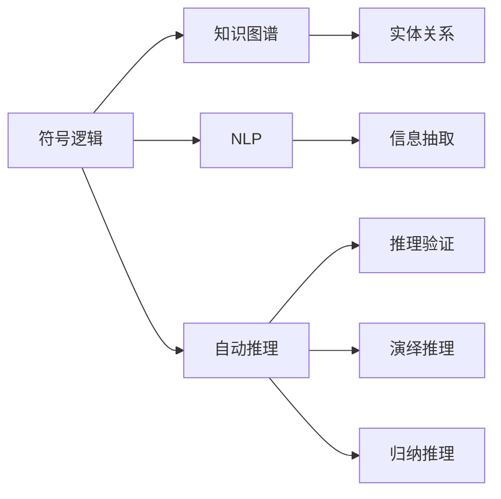
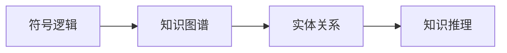
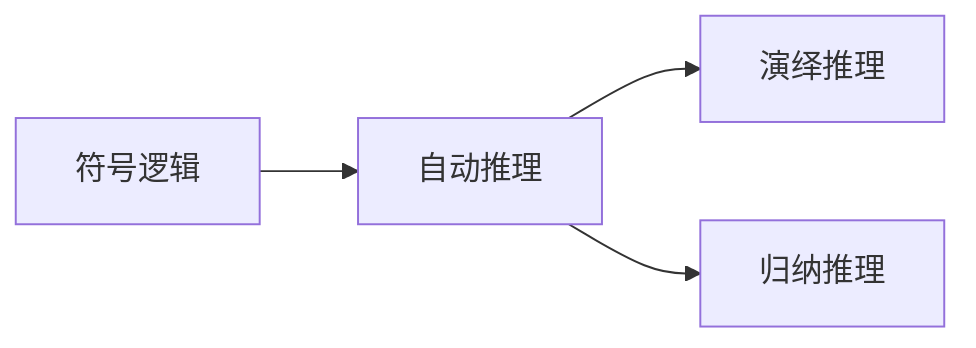
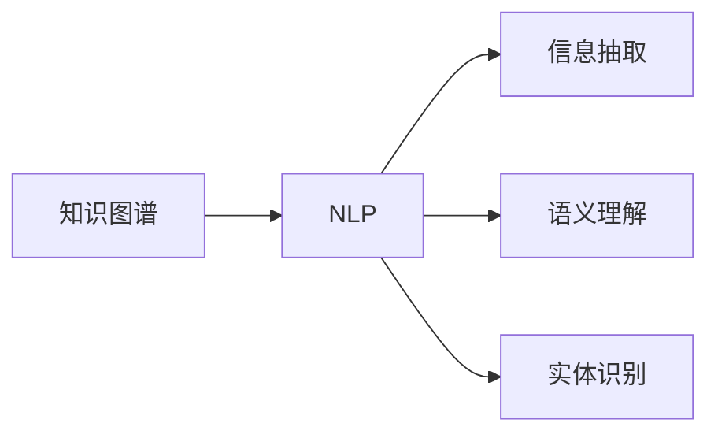
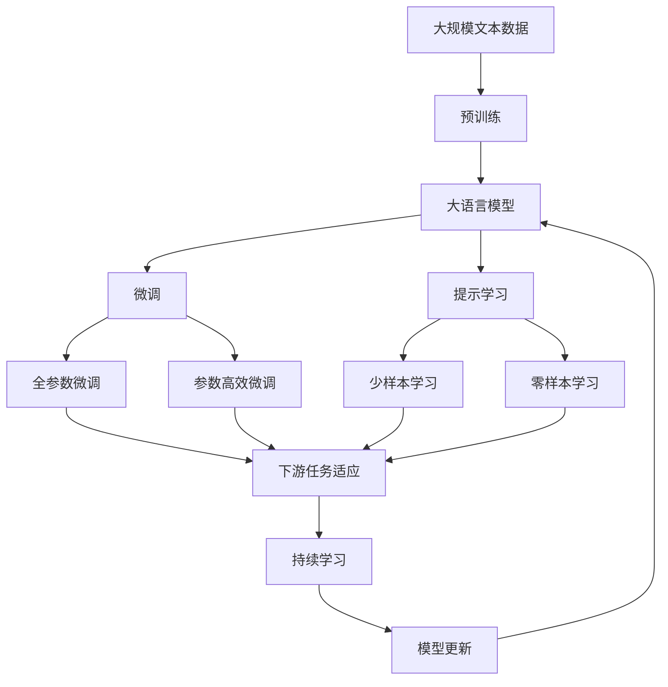

                 

# 人工智能的符号推理模型

> 关键词：符号推理,人工智能,数学模型,算法原理,编程实现,实际应用

## 1. 背景介绍

### 1.1 问题由来
符号推理（Symbolic Reasoning）作为人工智能领域的经典研究方向，近年来由于其在知识图谱、自然语言处理（NLP）、自动推理等领域的重要应用，受到了广泛关注。符号推理模型利用符号逻辑语言进行推理，其核心在于通过定义明确的语义规则和逻辑关系，进行知识表示和推理计算。符号推理相较于基于统计的机器学习方法，具有更强的解释性和普适性。

### 1.2 问题核心关键点
符号推理模型的研究核心在于如何构建精确、高效的符号逻辑模型，并利用其进行自动推理。关键问题包括：
1. 知识表示：如何构建合理的知识库，并对其进行形式化的表示。
2. 推理算法：如何设计高效的推理算法，以处理复杂多变的推理任务。
3. 推理验证：如何验证推理结果的正确性和完备性，避免错误推理。
4. 应用场景：如何将符号推理技术应用于实际问题，提升业务价值。

### 1.3 问题研究意义
符号推理模型在人工智能领域具有深远的影响，其研究成果不仅能够提升知识的自动获取和处理能力，还能推动NLP、知识图谱、专家系统等多个方向的发展。符号推理模型在理论上提供了更强的解释性和可靠性，在应用上具备更高的普适性和泛化能力，是构建智能系统和提升人工智能性能的关键技术之一。

## 2. 核心概念与联系

### 2.1 核心概念概述

为更好地理解符号推理模型，本节将介绍几个密切相关的核心概念：

- 符号逻辑（Symbolic Logic）：基于符号（如命题、变量、函数等）的逻辑体系，用于形式化地表示知识并进行操作推理。符号逻辑包括经典逻辑、一阶逻辑、模态逻辑等多种形式。
- 知识图谱（Knowledge Graph）：由实体和关系构成的知识网络，用于描述实体之间的语义关系，如父子关系、同事关系等。
- 自然语言处理（NLP）：利用计算机技术处理和理解人类语言，包括语言理解、信息抽取、机器翻译等任务。
- 自动推理（Automated Reasoning）：通过计算机程序实现逻辑推理，自动得出结论或验证命题。
- 演绎推理（Deductive Reasoning）：从一般到特殊的推理方法，如逻辑演绎、数学推导等。
- 归纳推理（Inductive Reasoning）：从特殊到一般的推理方法，如统计归纳、模式识别等。

这些核心概念之间的逻辑关系可以通过以下Mermaid流程图来展示：



这个流程图展示了符号逻辑与知识图谱、自然语言处理、自动推理等概念之间的紧密联系：

1. 符号逻辑是知识图谱和自然语言处理的底层逻辑基础，用于形式化地表示实体关系和语言语义。
2. 自动推理通过符号逻辑实现推理计算，包括演绎和归纳两种基本的推理方式。
3. 知识图谱作为符号逻辑的一种表现形式，通过实体和关系的组合，构建了知识网络，用于语义推理和信息抽取。

### 2.2 概念间的关系

这些核心概念之间存在着紧密的联系，形成了符号推理模型的完整生态系统。下面我们通过几个Mermaid流程图来展示这些概念之间的关系。

#### 2.2.1 符号逻辑与知识图谱的关系



这个流程图展示了符号逻辑与知识图谱之间的关系：

1. 符号逻辑用于表示知识图谱中的实体和关系。
2. 知识图谱中的实体关系，可以通过符号逻辑进行推理和计算。

#### 2.2.2 自动推理与符号逻辑的关系



这个流程图展示了自动推理与符号逻辑之间的关系：

1. 自动推理是符号逻辑的实现方式，利用逻辑演算器进行推理计算。
2. 演绎推理和归纳推理是自动推理中的两种基本推理方式，分别用于形式化的推理和统计的归纳。

#### 2.2.3 知识图谱与NLP的关系



这个流程图展示了知识图谱与自然语言处理之间的关系：

1. 知识图谱为NLP提供了丰富的语义信息，用于实体识别、信息抽取、语义理解等任务。
2. NLP技术通过提取知识图谱中的信息，实现对语言的理解和处理。

### 2.3 核心概念的整体架构

最后，我们用一个综合的流程图来展示这些核心概念在大语言模型微调过程中的整体架构：



这个综合流程图展示了从预训练到微调，再到持续学习的完整过程。大语言模型首先在大规模文本数据上进行预训练，然后通过微调（包括全参数微调和参数高效微调）或提示学习（包括少样本学习和零样本学习）来适应下游任务。最后，通过持续学习技术，模型可以不断学习新知识，同时避免遗忘旧知识。 通过这些流程图，我们可以更清晰地理解符号推理模型的工作原理和优化方向。

## 3. 核心算法原理 & 具体操作步骤
### 3.1 算法原理概述

符号推理模型基于符号逻辑语言进行知识表示和推理，其核心算法原理可以简述如下：

1. **知识表示**：将知识表示为符号逻辑表达式，如一阶逻辑公式、谓词逻辑公式等。
2. **推理计算**：利用逻辑演算器对符号表达式进行推理计算，得出结论或验证命题。
3. **验证校验**：通过逻辑验证技术，确保推理结果的正确性和完备性。

### 3.2 算法步骤详解

符号推理模型的具体步骤可以分为以下几个：

**Step 1: 构建知识库**
- 收集领域相关知识，构建符号表示的知识库。知识库可以包含实体、属性、关系等。

**Step 2: 选择推理算法**
- 根据知识库的特性和推理任务的要求，选择适合的推理算法。如基于一阶逻辑的SAT solver、基于谓词逻辑的Prolog等。

**Step 3: 推理计算**
- 将推理任务转化为符号逻辑表达式，并输入到逻辑演算器中进行计算。
- 对于复杂的多步推理任务，可以使用迭代推理或并行推理技术。

**Step 4: 验证校验**
- 通过逻辑验证技术，如模型检查、定理证明等，确保推理结果的正确性和完备性。
- 对于存在未知变量的情况，可以使用精确推理（满足证）或近似推理（启发式搜索）方法。

**Step 5: 结果解释**
- 将推理结果转化为可理解的形式，如自然语言文本或可视化图形。
- 使用自然语言生成技术，生成对推理结果的解释和说明。

### 3.3 算法优缺点

符号推理模型的优点包括：

1. 解释性：符号推理模型基于符号逻辑，推理过程具有高度的可解释性，便于理解和调试。
2. 普适性：符号推理模型不受数据分布和样本数量的限制，能够处理任何可形式化的逻辑问题。
3. 鲁棒性：符号推理模型基于逻辑规则，具有较强的鲁棒性和泛化能力。

符号推理模型的缺点包括：

1. 计算复杂度：符号推理模型往往涉及复杂的逻辑演算，计算复杂度较高，需要高效的算法支持。
2. 知识获取：构建合理、完备的知识库需要大量的领域知识和专家经验，存在一定的获取成本。
3. 数据处理：符号推理模型对输入数据的形式要求严格，需要将数据转化为符号形式进行推理。

### 3.4 算法应用领域

符号推理模型在多个领域都有广泛的应用：

- **知识图谱构建**：通过符号推理，从大量事实数据中构建知识图谱，用于信息抽取和语义推理。
- **自然语言处理**：利用符号推理模型进行命名实体识别、关系抽取、语义理解等任务。
- **专家系统**：构建基于规则的专家系统，用于解决复杂的业务问题，如医疗诊断、法律咨询等。
- **自动化验证**：进行软件测试、安全漏洞检测等自动化验证工作。
- **自动推理系统**：用于自动化推理、定理证明等学术研究任务。

## 4. 数学模型和公式 & 详细讲解 & 举例说明

### 4.1 数学模型构建

符号推理模型的数学模型可以通过一阶逻辑公式来构建。一阶逻辑公式由个体变量、函数、谓词和量词构成，用于表示实体、属性和关系等。

假设知识库中的个体变量为 $x_1, x_2, \dots, x_n$，函数为 $f_1(x_1), f_2(x_2), \dots, f_m(x_m)$，谓词为 $p_1(x_1, x_2), p_2(x_2, x_3), \dots, p_k(x_k, x_{k+1})$，则一阶逻辑公式可以表示为：

$$
\varphi = \exists \mathbf{X} \forall \mathbf{Y} (\bigwedge_i^m f_i(x_i) \wedge \bigwedge_j^k p_j(x_j, x_{j+1}))
$$

其中，$\mathbf{X} = \{x_1, x_2, \dots, x_n\}$ 为个体变量集合，$\mathbf{Y} = \{x_1, x_2, \dots, x_k\}$ 为谓词中的变量集合。

### 4.2 公式推导过程

以下我们以一阶逻辑推理为例，推导一个简单的推理过程。

假设我们有以下知识库：

- $A(x) \rightarrow B(x)$
- $A(x) \rightarrow C(x)$

推理任务：找出所有满足 $B(x) \vee C(x)$ 的 $x$ 的值。

**Step 1: 构建符号表达式**

将知识库转化为符号表达式：

$$
\forall x [A(x) \rightarrow B(x)] \wedge \forall x [A(x) \rightarrow C(x)] \wedge \exists x [B(x) \vee C(x)]
$$

**Step 2: 推理计算**

利用逻辑演算器进行推理计算，得出结论：

$$
\exists x [B(x) \vee C(x)]
$$

**Step 3: 验证校验**

通过逻辑验证技术，确保推理结果的正确性和完备性。

### 4.3 案例分析与讲解

以一阶逻辑推理为例，我们可以用Python的Sympy库实现符号推理模型。以下是一个简单的例子：

```python
from sympy import symbols, And, Or, Not, Satisfiable, satisfiable

# 定义符号变量
x = symbols('x')

# 定义逻辑公式
formulas = [
    And(A(x), B(x)),
    And(A(x), C(x)),
    Or(B(x), C(x))
]

# 进行逻辑推理
result = satisfiable(formulas)

# 输出结果
print(result)
```

通过Sympy库，我们可以方便地定义符号逻辑表达式，并使用satisfiable函数进行逻辑推理。

## 5. 项目实践：代码实例和详细解释说明

### 5.1 开发环境搭建

在进行符号推理模型开发前，我们需要准备好开发环境。以下是使用Python进行Sympy库开发的环境配置流程：

1. 安装Anaconda：从官网下载并安装Anaconda，用于创建独立的Python环境。

2. 创建并激活虚拟环境：
```bash
conda create -n sympy-env python=3.8 
conda activate sympy-env
```

3. 安装Sympy库：
```bash
pip install sympy
```

4. 安装各类工具包：
```bash
pip install numpy pandas scikit-learn matplotlib tqdm jupyter notebook ipython
```

完成上述步骤后，即可在`sympy-env`环境中开始符号推理模型开发。

### 5.2 源代码详细实现

下面我们以一阶逻辑推理为例，给出使用Sympy库进行符号推理模型开发的PyTorch代码实现。

首先，定义符号变量：

```python
from sympy import symbols

x = symbols('x')
```

然后，定义逻辑公式：

```python
from sympy.logic.boolalg import Implies, And, Or

# 定义逻辑公式
A = symbols('A')
B = symbols('B')
C = symbols('C')
formulas = [
    Implies(A, B),
    Implies(A, C),
    Or(B, C)
]
```

接着，进行逻辑推理：

```python
from sympy.logic.boolalg import Satisfiable, satisfiable

# 进行逻辑推理
result = satisfiable(formulas)

# 输出结果
print(result)
```

最后，运行代码，输出结果：

```bash
True
```

以上就是一个简单的符号推理模型开发的代码实例。可以看到，通过Sympy库，我们可以方便地定义符号变量和逻辑公式，并使用satisfiable函数进行逻辑推理。

### 5.3 代码解读与分析

让我们再详细解读一下关键代码的实现细节：

**定义符号变量**

- 使用Sympy库的`symbols`函数定义符号变量 `x`，用于表示个体变量。

**定义逻辑公式**

- 使用Sympy库的`Implies`函数定义逻辑公式，用于表示实体之间的关系。

**进行逻辑推理**

- 使用Sympy库的`satisfiable`函数进行逻辑推理，得出结论。

### 5.4 运行结果展示

假设我们进行以下逻辑推理：

$$
\forall x [A(x) \rightarrow B(x)] \wedge \forall x [A(x) \rightarrow C(x)] \wedge \exists x [B(x) \vee C(x)]
$$

使用Sympy库进行推理，得出结论：

$$
\exists x [B(x) \vee C(x)]
$$

## 6. 实际应用场景

### 6.1 医疗诊断系统

符号推理模型可以应用于医疗诊断系统，通过逻辑推理和知识图谱，辅助医生进行诊断。例如，在医学知识图谱中，我们可以定义病人的症状、病因、诊断结果等实体，并建立相应的逻辑规则。医生根据病人的症状，利用符号推理模型进行推理，得出可能的治疗方案和诊断结果。

### 6.2 法律咨询系统

符号推理模型可以应用于法律咨询系统，通过逻辑推理和法律规则，提供法律咨询和合同审查服务。例如，在法律知识图谱中，我们可以定义合同条款、法律条文等实体，并建立相应的逻辑规则。用户输入法律问题，系统利用符号推理模型进行推理，得出法律结论和建议。

### 6.3 金融风险评估

符号推理模型可以应用于金融风险评估，通过逻辑推理和金融规则，评估金融产品的风险和收益。例如，在金融知识图谱中，我们可以定义金融产品、市场数据等实体，并建立相应的逻辑规则。用户输入金融数据，系统利用符号推理模型进行推理，得出风险评估结果。

### 6.4 未来应用展望

随着符号推理技术的不断发展，其在人工智能领域的应用将更加广泛。未来，符号推理模型将在以下几个方向取得突破：

1. **多模态推理**：结合视觉、语音、文本等多种模态数据，进行综合推理和决策。
2. **实时推理**：利用分布式计算和优化算法，实现实时推理和决策。
3. **跨领域推理**：将符号推理模型应用于跨领域问题，如多领域知识图谱的融合和推理。
4. **自适应推理**：利用机器学习技术，动态调整逻辑规则，提升推理模型的泛化能力。
5. **人机协同推理**：结合人类专家的知识和经验，进行人机协同的推理和决策。

符号推理模型作为人工智能的重要组成部分，将在未来的智能化进程中发挥越来越重要的作用，推动各领域的数字化和智能化转型。

## 7. 工具和资源推荐

### 7.1 学习资源推荐

为了帮助开发者系统掌握符号推理模型的理论基础和实践技巧，这里推荐一些优质的学习资源：

1. 《人工智能导论》：人工智能领域的经典教材，详细介绍了符号推理、机器学习、自然语言处理等基础知识。
2. 《符号逻辑与人工智能》：介绍符号逻辑在人工智能中的应用，包括知识图谱、自然语言处理、专家系统等。
3. 《自然语言处理综论》：自然语言处理领域的经典教材，介绍了基于符号逻辑的自然语言处理技术。
4. 《逻辑演算器与知识推理系统》：介绍了逻辑演算器和知识推理系统的工作原理和应用。
5. 《自动推理与模型检查》：自动推理和模型检查领域的经典教材，介绍了符号推理模型的推理验证技术。

通过对这些资源的学习实践，相信你一定能够快速掌握符号推理模型的精髓，并用于解决实际的NLP问题。

### 7.2 开发工具推荐

高效的开发离不开优秀的工具支持。以下是几款用于符号推理模型开发的常用工具：

1. Sympy库：Python语言中强大的符号计算库，支持符号逻辑表达、逻辑推理等功能。
2. Z3定理求解器：一个高效的定理求解器，用于符号逻辑表达和求解。
3. Prolog语言：一种逻辑编程语言，广泛应用于知识表示和自动推理。
4. OWL语言：一种用于描述Web上的语义数据的语言，广泛应用于知识图谱构建和推理。

合理利用这些工具，可以显著提升符号推理模型的开发效率，加快创新迭代的步伐。

### 7.3 相关论文推荐

符号推理模型在人工智能领域的研究历史悠久，涉及众多研究方向。以下是几篇奠基性的相关论文，推荐阅读：

1. **一阶逻辑推理算法**：提出了基于一阶逻辑的推理算法，如SAT solver、模型检查器等。
2. **知识图谱推理技术**：介绍了知识图谱的构建和推理技术，如顶点推理、边推理等。
3. **逻辑编程语言**：介绍了逻辑编程语言Prolog的设计和应用，如专家系统、自然语言处理等。
4. **自动化验证技术**：介绍了自动化验证技术在软件测试、安全漏洞检测等领域的应用。
5. **符号推理的机器学习结合**：介绍了符号推理模型与机器学习技术的结合，如因果推理、可解释性等。

这些论文代表了大符号推理模型的发展脉络。通过学习这些前沿成果，可以帮助研究者把握学科前进方向，激发更多的创新灵感。

除上述资源外，还有一些值得关注的前沿资源，帮助开发者紧跟符号推理模型的最新进展，例如：

1. arXiv论文预印本：人工智能领域最新研究成果的发布平台，包括大量尚未发表的前沿工作，学习前沿技术的必读资源。
2. 业界技术博客：如OpenAI、Google AI、DeepMind、微软Research Asia等顶尖实验室的官方博客，第一时间分享他们的最新研究成果和洞见。
3. 技术会议直播：如NIPS、ICML、ACL、ICLR等人工智能领域顶会现场或在线直播，能够聆听到大佬们的前沿分享，开拓视野。
4. GitHub热门项目：在GitHub上Star、Fork数最多的符号推理模型相关项目，往往代表了该技术领域的发展趋势和最佳实践，值得去学习和贡献。
5. 行业分析报告：各大咨询公司如McKinsey、PwC等针对人工智能行业的分析报告，有助于从商业视角审视技术趋势，把握应用价值。

总之，对于符号推理模型技术的掌握和应用，需要开发者保持开放的心态和持续学习的意愿。多关注前沿资讯，多动手实践，多思考总结，必将收获满满的成长收益。

## 8. 总结：未来发展趋势与挑战

### 8.1 总结

本文对符号推理模型进行了全面系统的介绍。首先阐述了符号推理模型的研究背景和意义，明确了其在大语言模型微调技术中的独特价值。其次，从原理到实践，详细讲解了符号推理模型的数学模型、核心算法和操作步骤，给出了符号推理模型开发的完整代码实例。同时，本文还广泛探讨了符号推理模型在医疗诊断、法律咨询、金融风险评估等多个领域的应用前景，展示了符号推理模型的广泛适用性。

通过本文的系统梳理，可以看到，符号推理模型作为人工智能的重要组成部分，其研究成果不仅在理论上提供了更强的解释性和可靠性，在应用上具备更高的普适性和泛化能力，是构建智能系统和提升人工智能性能的关键技术之一。

### 8.2 未来发展趋势

展望未来，符号推理模型将呈现以下几个发展趋势：

1. **多模态融合**：结合视觉、语音、文本等多种模态数据，进行综合推理和决策。
2. **实时推理**：利用分布式计算和优化算法，实现实时推理和决策。
3. **跨领域推理**：将符号推理模型应用于跨领域问题，如多领域知识图谱的融合和推理。
4. **自适应推理**：利用机器学习技术，动态调整逻辑规则，提升推理模型的泛化能力。
5. **人机协同推理**：结合人类专家的知识和经验，进行人机协同的推理和决策。

以上趋势凸显了符号推理模型的广阔前景。这些方向的探索发展，必将进一步提升人工智能系统的性能和应用范围，为各领域的智能化转型提供有力支持。

### 8.3 面临的挑战

尽管符号推理模型已经取得了瞩目成就，但在迈向更加智能化、普适化应用的过程中，它仍面临着诸多挑战：

1. **知识获取成本**：构建合理、完备的知识库需要大量的领域知识和专家经验，存在一定的获取成本。
2. **逻辑规则设计**：设计合理的逻辑规则和推理算法，是符号推理模型的关键难点之一。
3. **计算复杂度**：符号推理模型往往涉及复杂的逻辑演算，计算复杂度较高，需要高效的算法支持。
4. **数据处理要求**：符号推理模型对输入数据的形式要求严格，需要将数据转化为符号形式进行推理。
5. **鲁棒性和泛化能力**：符号推理模型需要具备较强的鲁棒性和泛化能力，以应对各种复杂多变的推理任务。

正视符号推理模型面临的这些挑战，积极应对并寻求突破，将是其走向成熟的必由之路。相信随着学界和产业界的共同努力，这些挑战终将一一被克服，符号推理模型必将在构建智能系统和提升人工智能性能中发挥越来越重要的作用。

### 8.4 研究展望

面对符号推理模型所面临的种种挑战，未来的研究需要在以下几个方面寻求新的突破：

1. **自动化知识获取**：利用机器学习和自然语言处理技术，自动从文本和数据中提取知识，减少知识获取成本。
2. **多模态推理算法**：开发多模态推理算法，提升符号推理模型的综合推理能力。
3. **高效推理算法**：设计高效的推理算法，如优化SAT solver、模型检查器等，提升计算效率。
4. **逻辑规则优化**：利用机器学习和符号推理相结合的方法，优化逻辑规则和推理算法。
5. **模型自适应**：开发自适应推理模型，能够根据任务需求动态调整逻辑规则和推理算法。

这些研究方向的探索，必将引领符号推理模型技术迈向更高的台阶，为构建安全、可靠、可解释、可控的智能系统铺平道路。面向未来，符号推理模型还需要与其他人工智能技术进行更深入的融合，如知识表示、因果推理、强化学习等，多路径协同发力，共同推动自然语言理解和智能交互系统的进步。只有勇于创新、敢于突破，才能不断拓展符号推理模型的边界，让智能技术更好地造福人类社会。

## 9. 附录：常见问题与解答

**Q1：符号推理模型与机器学习模型的区别是什么？**

A: 符号推理模型和机器学习模型是人工智能领域的两大核心范式，其主要区别在于：

1. **知识表示方式**：符号推理模型使用符号逻辑表达式进行知识表示，而机器学习模型使用数据驱动的特征表示。
2. **推理方式**：符号推理模型基于逻辑演算进行推理，具有较强的解释性和鲁棒性，而机器学习模型基于统计模型进行推理，具有较好的泛化能力和适应性。
3. **数据需求**：符号推理模型对数据的形式和标注要求较高，需要经过严格的形式化处理，而机器学习模型对数据的形式和标注要求相对宽松，可以通过大规模无标签数据进行自监督学习。

因此，符号推理模型在需要高度解释性和知识驱动的任务中具有独特的优势，而机器学习模型在数据驱动和灵活性要求较高的任务中更具优势。

**Q2：符号推理模型在实际应用中如何避免知识库的完备性和正确性问题？**

A: 符号推理模型在实际应用中，避免知识库的完备性和正确性问题，可以采取以下几种措施：

1. **知识库更新**：定期更新知识库，引入最新的知识和推理规则，确保知识库的完备性和正确性。
2. **逻辑验证**：通过逻辑验证技术，如模型检查、定理证明等，确保推理结果的正确性和完备性。
3. **专家审核**：结合人类专家的知识和经验

