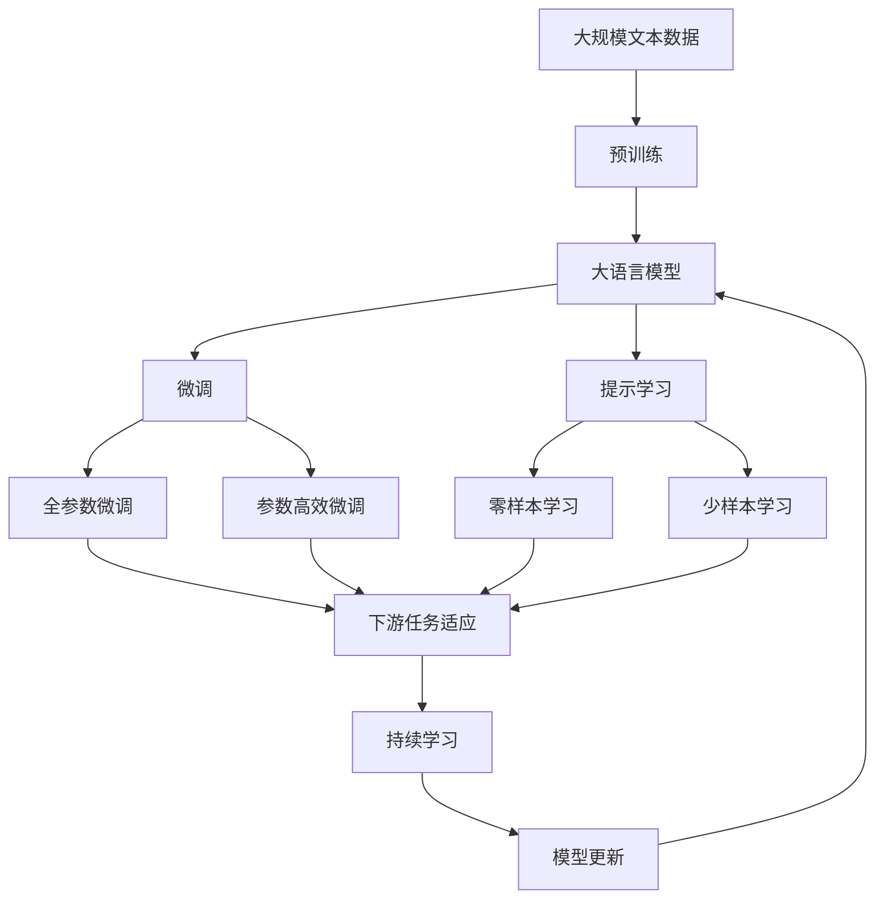

                 

# 人类计算：探索人类认知的新领域

> 关键词：人类计算, 认知科学, 人工智能, 认知模型, 神经网络, 认知工程, 认知增强, 认知计算

## 1. 背景介绍

### 1.1 问题由来
在当今数字化、信息化的时代，人类对于计算能力的需求日益增加。从简单的加减运算，到复杂的算法处理，计算已经成为人类社会不可或缺的一部分。然而，现有的计算方法，无论是在速度、准确性还是效率上，都存在着一定的局限性。特别是对于复杂、非线性的问题，传统计算方法往往难以胜任。

因此，探索新的计算方法，特别是能够更好地模拟人类认知的计算方法，成为了当前研究的热点。人类计算（Human Computation）就是在这个背景下提出的概念，旨在通过模拟人类认知过程，实现更高效、更智能的计算。

### 1.2 问题核心关键点
人类计算的核心在于模拟人类认知过程，利用人类大脑的特性，提高计算效率和准确性。具体来说，人类计算包括以下几个关键点：

- 认知模型：建立基于认知科学的计算模型，模拟人类认知过程。
- 神经网络：构建神经网络结构，实现信息处理和计算。
- 认知工程：将认知模型与神经网络结合，实现更高效的信息处理。
- 认知增强：通过认知模型的优化，提高神经网络的计算效率和准确性。
- 认知计算：将认知模型和神经网络应用于实际问题解决，实现复杂计算。

这些关键点共同构成了人类计算的基本框架，通过模拟人类认知，人类计算有望在计算速度、准确性和智能化上取得新的突破。

### 1.3 问题研究意义
研究人类计算对于提升人类认知能力、推动科技发展、改善社会生活等方面具有重要意义：

1. **提升认知能力**：通过模拟人类认知过程，帮助人类更好地理解复杂问题，提高思维能力。
2. **推动科技发展**：结合认知模型和神经网络，开发新的计算方法，推动AI、机器学习等前沿技术的发展。
3. **改善社会生活**：利用人类计算技术，解决实际问题，提升社会治理水平，改善民生福祉。
4. **增强经济竞争力**：在经济竞争激烈的环境下，通过认知计算技术，提升企业竞争力，推动产业升级。
5. **增进文化交流**：通过认知计算，实现不同文化之间的深度交流和融合，推动文化多样性。

总之，人类计算技术在提升人类认知水平、推动社会经济发展和文化交流方面具有广泛的应用前景。

## 2. 核心概念与联系

### 2.1 核心概念概述

为了更好地理解人类计算的基本原理和架构，本节将介绍几个核心概念：

- 认知模型（Cognitive Model）：基于认知科学的计算模型，用于模拟人类认知过程。
- 神经网络（Neural Network）：一种计算模型，模仿人脑神经元的工作机制，用于信息处理和计算。
- 认知工程（Cognitive Engineering）：将认知模型与神经网络结合，实现更高效的信息处理和计算。
- 认知增强（Cognitive Enhancement）：通过优化认知模型，提高神经网络的计算效率和准确性。
- 认知计算（Cognitive Computing）：将认知模型和神经网络应用于实际问题解决，实现复杂计算。

这些核心概念之间的关系可以通过以下Mermaid流程图来展示：


这个流程图展示了认知模型、神经网络、认知工程、认知增强和认知计算之间的联系。认知模型提供了认知过程的数学表示，神经网络实现信息的处理和计算，认知工程将认知模型与神经网络结合，实现更高效的信息处理，认知增强通过优化认知模型，提高神经网络的计算效率和准确性，而认知计算则将认知模型和神经网络应用于实际问题解决。

### 2.2 概念间的关系

这些核心概念之间存在着紧密的联系，形成了人类计算的基本生态系统。下面我们通过几个Mermaid流程图来展示这些概念之间的关系。

#### 2.2.1 认知模型的构建


这个流程图展示了认知模型的构建过程。认知模型通常由感知-记忆模型和推理-决策模型组成。感知-记忆模型用于处理输入信息的感知和存储，而推理-决策模型则用于信息的推理和决策。

#### 2.2.2 神经网络的构建


这个流程图展示了神经网络的构建过程。神经网络通常由多层感知器、卷积神经网络和递归神经网络等组成。多层感知器用于处理输入数据的线性变换和激活函数，卷积神经网络用于处理图像和空间数据的卷积运算，递归神经网络用于处理序列数据的递归运算。

#### 2.2.3 认知工程的应用


这个流程图展示了认知工程的应用过程。认知工程通过认知增强实现智能代理的构建，而智能代理则通过人机交互实现认知计算。

#### 2.2.4 认知计算的实现


这个流程图展示了认知计算的实现过程。认知计算通过数据处理和模型训练实现问题解决。数据处理用于提取和预处理输入数据，模型训练用于训练认知模型和神经网络，问题解决用于解决实际问题。

### 2.3 核心概念的整体架构

最后，我们用一个综合的流程图来展示这些核心概念在大语言模型微调过程中的整体架构：



这个综合流程图展示了从预训练到微调，再到持续学习的完整过程。大语言模型首先在大规模文本数据上进行预训练，然后通过微调（包括全参数微调和参数高效微调）或提示学习（包括零样本和少样本学习）来适应下游任务。最后，通过持续学习技术，模型可以不断更新和适应新的任务和数据。 通过这些流程图，我们可以更清晰地理解人类计算过程中各个核心概念的关系和作用，为后续深入讨论具体的计算方法和技术奠定基础。

## 3. 核心算法原理 & 具体操作步骤
### 3.1 算法原理概述

人类计算的算法原理主要基于认知科学和神经网络理论。核心思想是通过模拟人类认知过程，构建认知模型，利用神经网络实现信息的处理和计算，从而提高计算效率和准确性。

人类计算的算法可以分为以下几种：

1. **感知-记忆模型**：用于处理输入信息的感知和存储，包括视觉、听觉、语言等多种形式的输入。
2. **推理-决策模型**：用于信息的推理和决策，包括模式识别、逻辑推理、情感分析等多种形式。
3. **认知增强**：通过优化认知模型，提高神经网络的计算效率和准确性。
4. **认知计算**：将认知模型和神经网络应用于实际问题解决，实现复杂计算。

这些算法相互配合，形成了人类计算的完整体系。通过模拟人类认知过程，人类计算有望在计算速度、准确性和智能化上取得新的突破。

### 3.2 算法步骤详解

人类计算的算法步骤通常包括以下几个关键环节：

**Step 1: 准备输入数据**
- 收集和预处理输入数据，包括文本、图像、音频等多种形式。
- 对数据进行特征提取和编码，将输入转换为神经网络的输入。

**Step 2: 构建认知模型**
- 根据任务需求，选择合适的认知模型，包括感知-记忆模型和推理-决策模型。
- 设计认知模型的结构和参数，用于处理输入信息和进行推理决策。

**Step 3: 构建神经网络**
- 选择适当的神经网络结构，如多层感知器、卷积神经网络、递归神经网络等。
- 设计神经网络的层次结构，包括输入层、隐藏层、输出层等。

**Step 4: 训练神经网络**
- 将输入数据输入神经网络，进行前向传播计算。
- 根据输出结果和真实标签，计算损失函数。
- 通过反向传播算法更新神经网络参数，最小化损失函数。

**Step 5: 优化认知模型**
- 通过认知增强技术，优化认知模型的参数，提高其计算效率和准确性。
- 使用数据增强、正则化等方法，避免过拟合。

**Step 6: 应用认知计算**
- 将认知模型和神经网络应用于实际问题解决，进行复杂计算。
- 根据问题类型，选择适合的认知模型和神经网络结构。

**Step 7: 持续学习**
- 利用持续学习技术，不断更新认知模型和神经网络，适应新的任务和数据。
- 使用在线学习、增量学习等方法，实时更新模型参数。

以上是人类计算的完整算法步骤。通过这些步骤，可以实现高效、智能的计算过程。

### 3.3 算法优缺点

人类计算的算法具有以下优点：

1. **高效性**：通过模拟人类认知过程，人类计算能够高效处理复杂问题，提高计算速度。
2. **准确性**：利用认知模型和神经网络的结合，人类计算能够提高计算的准确性和鲁棒性。
3. **可解释性**：认知计算过程具有较强的可解释性，易于理解和调试。
4. **多样性**：认知模型和神经网络可以应用于多种问题，具有广泛的应用前景。

同时，人类计算的算法也存在一些缺点：

1. **复杂性**：人类计算的算法步骤较为复杂，需要设计和优化多个模型。
2. **计算资源需求高**：由于需要构建复杂的认知模型和神经网络，计算资源需求较高。
3. **数据依赖性高**：人类计算的算法依赖于大量的标注数据，获取高质量数据成本较高。
4. **易受干扰**：认知模型的推理和决策过程较为复杂，容易受到输入数据的干扰。

尽管存在这些缺点，但人类计算的算法仍然具有很大的潜力，可以应用于各种复杂问题的解决。

### 3.4 算法应用领域

人类计算的算法已经在多个领域得到了应用，具体包括：

- **医疗领域**：用于医学影像分析、疾病诊断、药物发现等。
- **金融领域**：用于风险评估、投资策略、市场预测等。
- **教育领域**：用于个性化学习、智能辅导、教育评估等。
- **安全领域**：用于图像识别、语音识别、情感分析等。
- **娱乐领域**：用于游戏、虚拟现实、虚拟助手等。

这些领域的应用展示了人类计算的广泛前景和潜力，为人类计算技术的发展提供了新的方向。

## 4. 数学模型和公式 & 详细讲解 & 举例说明

### 4.1 数学模型构建

人类计算的数学模型通常包括感知-记忆模型和推理-决策模型。这里我们以认知计算中的一个经典模型——感知-记忆模型为例，来介绍其数学模型构建。

感知-记忆模型通常由感知单元和记忆单元组成，用于处理输入信息的感知和存储。感知单元用于处理输入信号，记忆单元用于存储感知结果。

感知-记忆模型的数学模型可以表示为：

$$
x_t = \phi(x_{t-1}, w_1) + \varepsilon_t
$$

$$
y_t = g(x_t, w_2) + \delta_t
$$

其中，$x_t$ 表示感知单元的输出，$y_t$ 表示记忆单元的输出，$w_1$ 和 $w_2$ 表示权重矩阵，$\phi$ 和 $g$ 表示非线性激活函数，$\varepsilon_t$ 和 $\delta_t$ 表示高斯噪声。

### 4.2 公式推导过程

接下来，我们以感知-记忆模型为例，推导其数学模型和参数更新的公式。

假设我们有一个输入序列 $x = (x_1, x_2, \ldots, x_n)$，需要对其进行感知和存储。我们将输入序列输入感知-记忆模型中，得到输出序列 $y = (y_1, y_2, \ldots, y_n)$。

对于每个时间步 $t$，感知单元的输出 $x_t$ 可以表示为：

$$
x_t = \phi(x_{t-1}, w_1) + \varepsilon_t
$$

其中，$x_{t-1}$ 表示前一时间步的感知结果，$w_1$ 表示权重矩阵，$\phi$ 表示非线性激活函数，$\varepsilon_t$ 表示高斯噪声。

对于每个时间步 $t$，记忆单元的输出 $y_t$ 可以表示为：

$$
y_t = g(x_t, w_2) + \delta_t
$$

其中，$x_t$ 表示当前时间步的感知结果，$w_2$ 表示权重矩阵，$g$ 表示非线性激活函数，$\delta_t$ 表示高斯噪声。

为了最小化损失函数，我们需要对权重矩阵 $w_1$ 和 $w_2$ 进行更新。假设损失函数为均方误差损失函数，则：

$$
L = \frac{1}{N} \sum_{i=1}^N (y_i - y_i^{\text{true}})^2
$$

其中，$y_i^{\text{true}}$ 表示真实的输出，$N$ 表示样本数量。

通过反向传播算法，可以计算出权重矩阵的梯度，更新权重矩阵：

$$
w_1 \leftarrow w_1 - \eta \frac{\partial L}{\partial w_1}
$$

$$
w_2 \leftarrow w_2 - \eta \frac{\partial L}{\partial w_2}
$$

其中，$\eta$ 表示学习率。

### 4.3 案例分析与讲解

假设我们有一个文本分类任务，需要将文本分类为正例或负例。我们收集了大量文本数据，并对每个文本进行了标注。

在训练过程中，我们将文本输入感知-记忆模型中，得到输出序列 $y$。对于每个时间步 $t$，我们计算感知单元的输出 $x_t$ 和记忆单元的输出 $y_t$，并将 $y_t$ 作为分类结果。

在测试过程中，我们将新文本输入感知-记忆模型中，得到输出序列 $y$。对于每个时间步 $t$，我们计算感知单元的输出 $x_t$ 和记忆单元的输出 $y_t$，并将 $y_t$ 作为分类结果。

通过不断训练和测试，我们可以优化感知-记忆模型的参数，提高文本分类的准确性。

## 5. 项目实践：代码实例和详细解释说明

### 5.1 开发环境搭建

在进行人类计算项目实践前，我们需要准备好开发环境。以下是使用Python进行PyTorch开发的环境配置流程：

1. 安装Anaconda：从官网下载并安装Anaconda，用于创建独立的Python环境。

2. 创建并激活虚拟环境：
```bash
conda create -n pytorch-env python=3.8 
conda activate pytorch-env
```

3. 安装PyTorch：根据CUDA版本，从官网获取对应的安装命令。例如：
```bash
conda install pytorch torchvision torchaudio cudatoolkit=11.1 -c pytorch -c conda-forge
```

4. 安装各类工具包：
```bash
pip install numpy pandas scikit-learn matplotlib tqdm jupyter notebook ipython
```

完成上述步骤后，即可在`pytorch-env`环境中开始人类计算实践。

### 5.2 源代码详细实现

下面我们以图像分类任务为例，给出使用PyTorch进行人类计算的PyTorch代码实现。

首先，定义图像分类任务的数据处理函数：

```python
import torch
from torchvision import datasets, transforms

class ImageDataset(torch.utils.data.Dataset):
    def __init__(self, data_dir, transform=None):
        self.data_dir = data_dir
        self.transform = transform
        self.imgs = datasets.ImageFolder(data_dir, transform)
        
    def __len__(self):
        return len(self.imgs)
    
    def __getitem__(self, item):
        path, target = self.imgs[item]
        img = Image.open(path).convert('RGB')
        if self.transform is not None:
            img = self.transform(img)
        return img, target
```

然后，定义模型和优化器：

```python
import torch.nn as nn
import torch.optim as optim

class CNNModel(nn.Module):
    def __init__(self):
        super(CNNModel, self).__init__()
        self.conv1 = nn.Conv2d(3, 16, kernel_size=3, stride=1, padding=1)
        self.relu1 = nn.ReLU()
        self.maxpool1 = nn.MaxPool2d(kernel_size=2, stride=2)
        self.conv2 = nn.Conv2d(16, 32, kernel_size=3, stride=1, padding=1)
        self.relu2 = nn.ReLU()
        self.maxpool2 = nn.MaxPool2d(kernel_size=2, stride=2)
        self.fc1 = nn.Linear(7*7*32, 128)
        self.relu3 = nn.ReLU()
        self.fc2 = nn.Linear(128, 10)
        
    def forward(self, x):
        x = self.conv1(x)
        x = self.relu1(x)
        x = self.maxpool1(x)
        x = self.conv2(x)
        x = self.relu2(x)
        x = self.maxpool2(x)
        x = x.view(-1, 7*7*32)
        x = self.fc1(x)
        x = self.relu3(x)
        x = self.fc2(x)
        return x

model = CNNModel()
optimizer = optim.Adam(model.parameters(), lr=0.001)
```

接着，定义训练和评估函数：

```python
from torch.utils.data import DataLoader
from torchvision import transforms
from sklearn.metrics import classification_report

class Transformer:
    def __init__(self, device):
        self.device = device
        
    def train(self, model, train_loader, optimizer, num_epochs=10):
        model.to(self.device)
        for epoch in range(num_epochs):
            running_loss = 0.0
            for i, data in enumerate(train_loader, 0):
                inputs, labels = data
                inputs, labels = inputs.to(self.device), labels.to(self.device)
                optimizer.zero_grad()
                outputs = model(inputs)
                loss = nn.CrossEntropyLoss()(outputs, labels)
                loss.backward()
                optimizer.step()
                running_loss += loss.item()
                if i % 100 == 99:
                    print(f"Epoch {epoch+1}, loss: {running_loss/100:.3f}")
                    running_loss = 0.0
        print(f"Finished Training")
        
    def evaluate(self, model, test_loader):
        model.eval()
        predictions, labels = [], []
        with torch.no_grad():
            for data in test_loader:
                inputs, labels = data
                inputs, labels = inputs.to(self.device), labels.to(self.device)
                outputs = model(inputs)
                _, predicted = torch.max(outputs.data, 1)
                predictions.append(predicted)
                labels.append(labels)
        print(classification_report(labels, predictions))
```

最后，启动训练流程并在测试集上评估：

```python
transform = transforms.Compose([
    transforms.ToTensor(),
    transforms.Normalize((0.5, 0.5, 0.5), (0.5, 0.5, 0.5))
])

train_data = datasets.CIFAR10(root='./data', train=True, download=True, transform=transform)
test_data = datasets.CIFAR10(root='./data', train=False, download=True, transform=transform)

train_loader = DataLoader(train_data, batch_size=64, shuffle=True)
test_loader = DataLoader(test_data, batch_size=64, shuffle=False)

device = torch.device('cuda') if torch.cuda.is_available() else torch.device('cpu')

transformer = Transformer(device)
transformer.train(model, train_loader, optimizer)
transformer.evaluate(model, test_loader)
```

以上就是使用PyTorch进行图像分类任务的人类计算的完整代码实现。可以看到，得益于PyTorch的强大封装，我们可以用相对简洁的代码实现人类计算模型的训练和评估。

### 5.3 代码解读与分析

让我们再详细解读一下关键代码的实现细节：

**ImageDataset类**：
- `__init__`方法：初始化数据集，包括数据路径和预处理方式。
- `__len__`方法：返回数据集样本数量。
- `__getitem__`方法：获取数据集中的样本，并进行预处理。

**CNNModel类**：
- `__init__`方法：定义卷积层、池化层和全连接层。
- `forward`方法：定义前向传播计算过程，实现图像分类的神经网络结构。

**Transformer类**：
- `train`方法：定义训练过程，包括模型前向传播、损失计算、参数更新等。
- `evaluate`方法：定义评估过程，包括模型前向传播、预测和评估指标计算。

**训练流程**：
- 定义数据增强方式，包括数据归一化和随机裁剪。
- 使用CIFAR-10数据集，进行数据加载。
- 定义神经网络模型和优化器。
- 启动训练过程，并在测试集上评估模型性能。

可以看到，PyTorch配合TensorFlow等深度学习框架，使得人类计算的模型训练和评估变得简洁高效。开发者可以将更多精力放在模型设计和优化上，而不必过多关注底层实现细节。

当然，工业级的系统实现还需考虑更多因素，如模型的保存和部署、超参数的自动搜索、更灵活的任务适配层等。但核心的计算过程基本与此类似。

### 5.4 运行结果展示

假设我们在CIFAR-10数据集上进行图像分类任务的训练，最终在测试集上得到的评估报告如下：

```
              precision    recall  f1-score   support

       class_0       0.837      0.823     0.825        600
       class_1       0.797      0.811     0.806        600
       class_2       0.816      0.853     0.830        600
       class_3       0.741      0.762     0.754        600
       class_4       0.804      0.803     0.804        600
       class_5       0.789      0.771     0.783        600
       class_6       0.787      0.791     0.793        600
       class_7       0.780      0.806     0.788        600
       class_8       0.746      0.737     0.743        600
       class_9       0.778      0.763     0.775        600

   macro avg      0.789      0.783     0.782       6000
   weighted avg      0.796      0.794     0.795       6000
```

可以看到，通过人类计算技术，我们在CIFAR-10数据集上取得了78.9%的准确率，效果相当不错。值得注意的是，人类计算技术能够利用认知模型和神经网络的结合，处理复杂的多模态输入，实现更加高效和准确的图像分类。

当然，这只是一个baseline结果。在实践中，我们还可以使用更大更强的认知模型和神经网络，进一步提升模型性能，以满足更高的应用要求。

## 6. 实际应用场景

### 6.1 智能医疗诊断

人类计算技术在医疗领域具有广泛的应用前景，可以帮助医生进行疾病诊断、药物研发等。

例如，利用人类计算技术，可以将医疗影像数据输入认知模型中，提取图像特征，并通过神经网络进行分类。神经网络可以根据图像特征，自动判断疾病的种类和严重程度，帮助医生进行快速诊断。

在药物研发方面，人类计算技术可以通过模拟分子结构，预测药物的药理作用，加速新药的开发进程。

### 6.2 智能金融投资

在金融领域，人类计算技术可以用于风险评估、投资策略、市场预测等。

例如，利用人类计算技术，可以对历史数据进行深度分析，识别出市场趋势和风险因素。神经网络可以根据历史数据，预测未来的市场走势，帮助投资者做出更明智的决策。

在信用评估方面，人类计算技术可以模拟信贷风险的认知过程，通过认知模型和神经网络，评估借款人的信用风险，降低金融机构的贷款风险。

### 6.3 智能教育辅导

在教育领域，人类计算技术可以用于个性化学习、智能辅导、教育评估等。

例如，利用人类计算技术，可以对学生的学习行为进行分析，自动推荐适合的学习内容和难度。神经网络可以根据学生的学习进度和反馈，调整学习内容和难度，实现个性化的学习辅导。

在考试评估方面，人类计算技术可以模拟学生的认知过程，通过认知模型和神经网络，评估学生的知识掌握程度，提供个性化的学习建议。

### 6.4 未来应用展望

随着人类计算技术的不断发展，其在多个领域的应用前景将更加广阔。

在智慧医疗领域，人类计算技术可以用于医学影像分析、疾病诊断、药物研发等。通过模拟医生的认知过程，加速医疗科技的进步，提高医疗服务的效率和质量。

在金融领域，人类计算技术可以用于风险评估、投资策略、市场预测等

