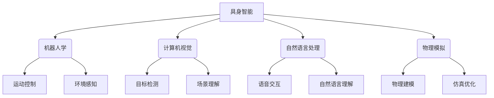

# AI+具身智能：产业未来将走向何处

## 1. 背景介绍

### 1.1 问题的由来

人工智能(AI)技术的飞速发展正在重塑着各行各业的发展格局。随着深度学习、机器学习等算法的不断突破,AI已经渗透到了生产、服务、医疗、教育等诸多领域,成为推动社会进步的重要驱动力。然而,传统的AI系统往往局限于虚拟世界,缺乏与现实物理世界的紧密交互。这就催生了"具身智能"(Embodied Intelligence)的概念,旨在赋予AI系统以身体和感知能力,使其能够更好地理解和操纵现实世界。

### 1.2 研究现状

近年来,具身智能成为了人工智能领域的一个重要研究方向。许多科技巨头和学术机构都在积极探索这一领域,例如:

- 波士顿动力公司开发出了一系列高度灵活的机器人,能够在复杂的环境中行走、跳跃和执行各种任务。
- OpenAI的Dactyl项目训练机器人手指进行物体操作,展现出了惊人的手眼协调能力。
- DeepMind的AlphaFold2算法成功预测了蛋白质的三维结构,为生物医药研究带来了革命性突破。

这些研究成果展示了具身智能在机器人控制、物理模拟和生物信息学等领域的巨大潜力。

### 1.3 研究意义

具身智能的发展将为人工智能系统带来全新的能力,使其能够更好地感知、理解并改变现实世界。这对于解决一些长期困扰人类的难题将带来重大意义,例如:

- 提高机器人在复杂环境中的自主性和适应性,促进其在制造、探索和救援等领域的应用。
- 模拟和优化物理系统的行为,为工程设计、材料科学和能源利用等领域提供指导。
- 加深对生命过程的理解,推动生物医药、农业和环境保护等领域的创新。

总的来说,具身智能将赋予人工智能以全新的身体和感知能力,开辟出一个充满无限可能的新领域。

### 1.4 本文结构

本文将全面探讨AI+具身智能的发展现状、核心理论和实践应用。文章将从以下几个方面进行阐述:

1. 核心概念与联系
2. 核心算法原理与具体操作步骤
3. 数学模型和公式详细讲解与案例分析
4. 项目实践:代码实例和详细解释说明
5. 实际应用场景和未来展望
6. 工具和资源推荐
7. 总结:未来发展趋势与挑战
8. 附录:常见问题与解答

接下来,我们将逐一深入探讨上述各个方面的内容。

## 2. 核心概念与联系

具身智能(Embodied Intelligence)是一种新兴的人工智能范式,旨在赋予AI系统以身体和感知能力,使其能够更好地理解和操纵现实物理世界。它融合了多个领域的理论和技术,包括机器人学、计算机视觉、自然语言处理、物理模拟等。

具身智能系统通常由以下几个核心组件组成:

1. **感知模块**: 通过各种传感器(如摄像头、麦克风、惯性测量单元等)获取环境信息,实现视觉、听觉、触觉等感知能力。
2. **认知模块**: 基于深度学习、机器学习等算法,对获取的感知数据进行处理和理解,形成对环境的内部表征。
3. **决策模块**: 根据认知结果和任务目标,规划和决策系统的行为策略。
4. **控制模块**: 执行决策模块的指令,控制机器人或虚拟化身在环境中的运动和操作。
5. **交互模块**: 通过自然语言处理、计算机视觉等技术,实现与人或其他智能体的交互和协作。

这些模块相互协作,形成了一个闭环的感知-认知-决策-行为循环,使具身智能系统能够持续地感知环境、学习知识并作出反应。

## 3. 核心算法原理与具体操作步骤

### 3.1 算法原理概述

具身智能系统的核心算法主要包括以下几个方面:

1. **强化学习**(Reinforcement Learning): 通过与环境的交互,智能体不断尝试不同的行为策略,获得奖励或惩罚反馈,并根据这些反馈调整策略,最终学习到一个最优策略。
2. **模型预测控制**(Model Predictive Control): 基于对环境的建模,预测未来状态并优化控制序列,使系统能够适应动态环境的变化。
3. **视觉感知**(Visual Perception): 利用深度学习算法(如卷积神经网络)对图像和视频数据进行处理,实现目标检测、语义分割、场景理解等视觉任务。
4. **运动规划**(Motion Planning): 根据环境约束和任务目标,规划出安全、高效的运动轨迹,指导机器人或虚拟化身的运动控制。
5. **多模态融合**(Multimodal Fusion): 将来自不同感知模态(视觉、听觉、触觉等)的信息进行融合,形成更加全面和准确的环境表征。

这些算法相互配合,构建了具身智能系统的核心功能。接下来,我们将详细介绍其中的强化学习和模型预测控制两种关键算法。

### 3.2 算法步骤详解

#### 3.2.1 强化学习算法

强化学习算法通过与环境的交互,不断尝试不同的行为策略,获得奖励或惩罚反馈,并根据这些反馈调整策略,最终学习到一个最优策略。它的基本过程如下:

1. **初始化**: 定义智能体的状态空间$\mathcal{S}$、行为空间$\mathcal{A}$、奖励函数$R(s,a)$和折扣因子$\gamma$。初始化策略$\pi(a|s)$或值函数$Q(s,a)$。
2. **交互循环**:
    a. 从当前状态$s_t$出发,根据策略$\pi(a|s_t)$选择行为$a_t$。
    b. 执行行为$a_t$,观测到新状态$s_{t+1}$和即时奖励$r_t=R(s_t,a_t)$。
    c. 更新策略$\pi(a|s)$或值函数$Q(s,a)$,使其朝着最大化累积奖励的方向优化。
3. **终止条件**: 当满足某个终止条件(如达到最大迭代次数或策略收敛)时,算法结束并输出最终策略$\pi^*(a|s)$。

常见的强化学习算法包括Q-Learning、Deep Q-Network(DQN)、Policy Gradient等。这些算法在机器人控制、游戏AI、自动驾驶等领域有着广泛的应用。

#### 3.2.2 模型预测控制算法

模型预测控制算法基于对环境的建模,预测未来状态并优化控制序列,使系统能够适应动态环境的变化。它的基本步骤如下:

1. **建模**: 基于历史数据或先验知识,构建环境动态模型$x_{t+1}=f(x_t,u_t)$,其中$x_t$为系统状态,$u_t$为控制输入。
2. **优化**: 在给定的时间horizon $N$内,求解一个优化问题,找到最优控制序列$\mathbf{u}^*=\{u_t^*,u_{t+1}^*,\dots,u_{t+N-1}^*\}$,使得某个代价函数$J$最小化:

$$\begin{aligned}
\mathbf{u}^* &= \arg\min_{\mathbf{u}} J(x_t,\mathbf{u})\
&\text{s.t.}\quad x_{t+k+1}=f(x_{t+k},u_{t+k}),\quad k=0,1,\dots,N-1\
&\qquad\qquad x_t\text{ given}
\end{aligned}$$

代价函数$J$可以包括跟踪误差、控制能量等多个项。
3. **执行**: 将最优控制序列的第一个控制量$u_t^*$实施到系统,获得新状态$x_{t+1}$。
4. **滚动优化**: 在新状态$x_{t+1}$处重复步骤2和3,实现滚动优化控制。

该算法通过反复建模、优化和执行,使系统能够持续适应环境变化。它在机器人控制、过程控制等领域有着广泛应用。

### 3.3 算法优缺点

**强化学习算法**:
- 优点:
    - 无需事先的监督数据,可以通过与环境交互自主学习最优策略。
    - 具有很强的通用性,可以应用于各种决策序列问题。
- 缺点:
    - 收敛速度较慢,需要大量的试错和探索才能收敛到最优策略。
    - 存在样本低效利用和维数灾难等问题,需要一些技巧(如经验回放、参数共享等)来提高效率。

**模型预测控制算法**:
- 优点:
    - 显式地建模环境动态,可以有效处理约束和动态环境变化。
    - 通过滚动优化,可以持续跟踪和适应环境的变化。
- 缺点:
    - 需要对环境动态有较为准确的建模,否则控制性能将受到影响。
    - 优化问题往往是非线性、非凸的,求解过程可能陷入局部最优。

### 3.4 算法应用领域

强化学习和模型预测控制等核心算法在具身智能领域有着广泛的应用,包括但不限于:

- **机器人控制**: 使机器人能够自主学习各种复杂任务,如机械臂操作、行走、跳跃等。
- **自动驾驶**: 训练自动驾驶系统在复杂交通场景下做出正确的驾驶决策。
- **智能制造**: 优化工厂生产流程,提高生产效率和产品质量。
- **智能家居**: 使家用机器人能够自主完成家务、服务等任务。
- **智能医疗**: 辅助手术机器人精准操作,提高手术的安全性和成功率。
- **智能交通**: 优化交通信号控制,缓解拥堵,提高交通效率。
- **智能物流**: 规划无人机、自动导引车辆等的最优运输路线。
- **虚拟现实**: 构建高度智能和交互性的虚拟助手和虚拟世界。

总的来说,具身智能算法为人工智能系统赋予了感知、认知和操作现实世界的能力,将推动各行各业的智能化转型和升级。

## 4. 数学模型和公式详细讲解与举例说明

### 4.1 数学模型构建

在具身智能系统中,我们需要构建数学模型来描述环境动态、智能体行为和相互作用。一种常见的建模方式是基于**马尔可夫决策过程**(Markov Decision Process, MDP)。

MDP是一种离散时间随机控制过程,可以用一个五元组$(\mathcal{S},\mathcal{A},P,R,\gamma)$来表示:

- $\mathcal{S}$是有限的状态空间集合
- $\mathcal{A}$是有限的行为空间集合
- $P(s'|s,a)$是状态转移概率,表示在状态$s$执行行为$a$后,转移到状态$s'$的概率
- $R(s,a)$是即时奖励函数,表示在状态$s$执行行为$a$后获得的即时奖励
- $\gamma\in[0,1)$是折扣因子,用于权衡未来奖励的重要性

智能体的目标是找到一个策略$\pi:\mathcal{S}\rightarrow\mathcal{A}$,使得期望的累积折