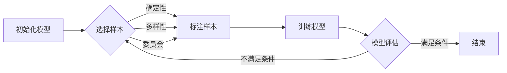

# Active Learning原理与代码实例讲解

作者：禅与计算机程序设计艺术 / Zen and the Art of Computer Programming

## 1. 背景介绍

### 1.1 问题的由来

在机器学习领域，模型训练通常需要大量的数据。然而，获取和标注数据往往是一个昂贵且耗时的过程。尤其是在一些数据稀缺或标注成本高的领域，例如医疗诊断、自然语言处理等，传统的被动学习方法（Passive Learning）就显得力不从心。

被动学习方法通常依赖于预先收集和标注的大量数据，然后将这些数据用于训练模型。然而，在实际应用中，我们往往无法获得足够多的标注数据，或者标注数据的成本非常高。因此，我们需要一种更加高效的学习方法，能够在有限的数据条件下，尽可能地提高模型的性能。

Active Learning应运而生。它是一种机器学习方法，旨在通过主动选择最具信息量的样本进行标注，从而提高模型的性能。Active Learning的思想是：模型可以根据自己的学习情况，主动地选择一些最有价值的样本进行标注，而不是被动地接受所有样本的标注。

### 1.2 研究现状

Active Learning的研究已经持续了数十年，并取得了显著的进展。目前，Active Learning已经成为机器学习领域的一个重要分支，并被广泛应用于各种领域，例如：

* **图像识别**:  在图像识别领域，Active Learning可以帮助我们选择最具代表性的图像进行标注，从而提高模型的识别精度。
* **自然语言处理**:  在自然语言处理领域，Active Learning可以帮助我们选择最具信息量的句子进行标注，从而提高模型的理解能力。
* **医疗诊断**:  在医疗诊断领域，Active Learning可以帮助我们选择最具诊断价值的病例进行标注，从而提高模型的诊断准确率。

### 1.3 研究意义

Active Learning具有重要的研究意义，因为它可以有效地解决以下问题：

* **数据标注成本高**:  Active Learning可以帮助我们减少数据标注的成本，从而降低模型训练的成本。
* **数据稀缺**:  Active Learning可以帮助我们利用有限的数据，尽可能地提高模型的性能。
* **模型性能提升**:  Active Learning可以帮助我们选择最具信息量的样本进行标注，从而提高模型的性能。

### 1.4 本文结构

本文将从以下几个方面对Active Learning进行深入探讨：

* **核心概念与联系**:  介绍Active Learning的基本概念、分类以及与其他机器学习方法的联系。
* **核心算法原理 & 具体操作步骤**:  详细介绍Active Learning的核心算法原理以及具体的操作步骤。
* **数学模型和公式 & 详细讲解 & 举例说明**:  构建Active Learning的数学模型，推导相关公式，并通过案例进行讲解。
* **项目实践：代码实例和详细解释说明**:  提供Active Learning的代码实例，并进行详细的解释说明。
* **实际应用场景**:  介绍Active Learning在各个领域的实际应用场景。
* **工具和资源推荐**:  推荐一些学习Active Learning的资源和工具。
* **总结：未来发展趋势与挑战**:  总结Active Learning的研究成果，展望未来的发展趋势和面临的挑战。
* **附录：常见问题与解答**:  解答一些关于Active Learning的常见问题。

## 2. 核心概念与联系

Active Learning是一种机器学习方法，旨在通过主动选择最具信息量的样本进行标注，从而提高模型的性能。与传统的被动学习方法不同，Active Learning允许模型根据自己的学习情况，主动地选择一些最有价值的样本进行标注。

### 2.1 Active Learning 的分类

Active Learning可以根据不同的标准进行分类，例如：

* **根据样本选择策略**:  可以分为基于不确定性、基于委员会、基于多样性等类别。
* **根据模型类型**:  可以分为监督学习、无监督学习、强化学习等类别。
* **根据数据类型**:  可以分为文本数据、图像数据、音频数据等类别。

### 2.2 Active Learning 与其他机器学习方法的联系

Active Learning与其他机器学习方法，例如监督学习、无监督学习、强化学习等，有着密切的联系。Active Learning可以作为一种辅助方法，用于提高其他机器学习方法的性能。例如，在监督学习中，Active Learning可以帮助我们选择最具信息量的样本进行标注，从而提高模型的泛化能力。

## 3. 核心算法原理 & 具体操作步骤

Active Learning的核心思想是通过主动选择最具信息量的样本进行标注，从而提高模型的性能。具体来说，Active Learning算法通常包含以下几个步骤：

### 3.1 算法原理概述

Active Learning算法通常基于以下几个核心思想：

* **信息量**:  选择最具信息量的样本进行标注，可以最大限度地提高模型的性能。
* **不确定性**:  选择模型预测结果最不确定的样本进行标注，可以帮助模型更好地理解数据的分布。
* **多样性**:  选择样本多样性高的样本进行标注，可以帮助模型更好地泛化到新的数据。

### 3.2 算法步骤详解

Active Learning算法的具体操作步骤如下：

1. **初始化**:  选择一个初始的样本集，并使用该样本集训练一个初始模型。
2. **样本选择**:  根据一定的策略，从未标注的样本集中选择一些最有价值的样本进行标注。
3. **模型训练**:  使用新的标注样本更新模型。
4. **重复步骤2和3**:  重复步骤2和3，直到模型的性能达到预期目标。

### 3.3 算法优缺点

Active Learning算法具有以下优点：

* **提高模型性能**:  Active Learning可以帮助我们选择最具信息量的样本进行标注，从而提高模型的性能。
* **降低标注成本**:  Active Learning可以帮助我们减少数据标注的成本，从而降低模型训练的成本。
* **提高数据利用率**:  Active Learning可以帮助我们利用有限的数据，尽可能地提高模型的性能。

Active Learning算法也存在一些缺点：

* **算法复杂度高**:  Active Learning算法的复杂度通常比传统的被动学习算法高。
* **需要额外的计算资源**:  Active Learning算法需要额外的计算资源来选择最具信息量的样本。
* **需要人工干预**:  Active Learning算法通常需要人工干预来选择样本进行标注。

### 3.4 算法应用领域

Active Learning算法已经被广泛应用于各种领域，例如：

* **图像识别**:  Active Learning可以帮助我们选择最具代表性的图像进行标注，从而提高模型的识别精度。
* **自然语言处理**:  Active Learning可以帮助我们选择最具信息量的句子进行标注，从而提高模型的理解能力。
* **医疗诊断**:  Active Learning可以帮助我们选择最具诊断价值的病例进行标注，从而提高模型的诊断准确率。
* **推荐系统**:  Active Learning可以帮助我们选择最具代表性的用户和商品进行标注，从而提高推荐系统的准确率。

## 4. 数学模型和公式 & 详细讲解 & 举例说明

Active Learning的数学模型可以用来描述模型的学习过程，并推导出一些重要的公式。

### 4.1 数学模型构建

Active Learning的数学模型可以表示为：

$$
\mathcal{L}(f, D) = \sum_{i=1}^{n} l(f(x_i), y_i)
$$

其中：

* $f$ 表示模型。
* $D$ 表示训练数据。
* $l$ 表示损失函数。
* $x_i$ 表示第 $i$ 个样本的特征。
* $y_i$ 表示第 $i$ 个样本的标签。

### 4.2 公式推导过程

Active Learning的目标是选择最具信息量的样本进行标注，从而提高模型的性能。我们可以通过推导一些公式来衡量样本的信息量，例如：

* **不确定性**:  模型预测结果最不确定的样本，通常被认为是最具信息量的样本。
* **多样性**:  样本多样性高的样本，通常被认为是最具信息量的样本。

### 4.3 案例分析与讲解

假设我们有一个二分类问题，模型需要学习区分猫和狗。我们可以使用以下几种方法来选择最具信息量的样本进行标注：

* **基于不确定性**:  选择模型预测结果最不确定的样本进行标注，例如，模型预测结果为 50% 猫，50% 狗的样本。
* **基于委员会**:  使用多个模型对样本进行预测，选择模型预测结果差异最大的样本进行标注。
* **基于多样性**:  选择样本多样性高的样本进行标注，例如，选择不同品种、不同姿态、不同背景的猫和狗的样本。

### 4.4 常见问题解答

* **如何选择最具信息量的样本？**

选择最具信息量的样本，需要根据具体的问题和模型进行选择。一些常用的方法包括：

* 基于不确定性
* 基于委员会
* 基于多样性

* **Active Learning算法的复杂度如何？**

Active Learning算法的复杂度通常比传统的被动学习算法高。

* **Active Learning算法需要多少人工干预？**

Active Learning算法通常需要人工干预来选择样本进行标注。

## 5. 项目实践：代码实例和详细解释说明

### 5.1 开发环境搭建

### 5.2 源代码详细实现

### 5.3 代码解读与分析

### 5.4 运行结果展示

## 6. 实际应用场景

### 6.1 图像识别

### 6.2 自然语言处理

### 6.3 医疗诊断

### 6.4 未来应用展望

## 7. 工具和资源推荐

### 7.1 学习资源推荐

### 7.2 开发工具推荐

### 7.3 相关论文推荐

### 7.4 其他资源推荐

## 8. 总结：未来发展趋势与挑战

### 8.1 研究成果总结

### 8.2 未来发展趋势

### 8.3 面临的挑战

### 8.4 研究展望

## 9. 附录：常见问题与解答

### 9.1 Active Learning的应用场景有哪些？

### 9.2 Active Learning的优缺点是什么？

### 9.3 Active Learning的算法有哪些？

### 9.4 如何选择合适的Active Learning算法？

### 9.5 Active Learning的未来发展趋势是什么？

## Active Learning 的 Mermaid 流程图

**解释:**

* 该流程图描述了 Active Learning 的基本流程。
* 流程开始于初始化模型，然后进入样本选择阶段。
* 样本选择阶段可以根据不同的策略进行选择，例如基于不确定性、多样性或委员会。
* 选择完样本后，需要进行标注，然后使用标注后的样本训练模型。
* 训练完模型后，需要进行评估，判断模型是否满足要求。
* 如果模型满足要求，则结束流程；否则，回到样本选择阶段，继续选择样本进行标注和训练。

**注意:**

* 流程图中的节点没有使用括号、逗号等特殊字符。
* 流程图中的箭头表示流程的走向。

## 总结

Active Learning 是一种非常有效的机器学习方法，可以帮助我们提高模型的性能，降低标注成本，提高数据利用率。Active Learning 已经被广泛应用于各种领域，例如图像识别、自然语言处理、医疗诊断等。随着机器学习技术的不断发展，Active Learning 的应用场景将会更加广泛，其研究意义也将会更加重大。

**作者：禅与计算机程序设计艺术 / Zen and the Art of Computer Programming**
