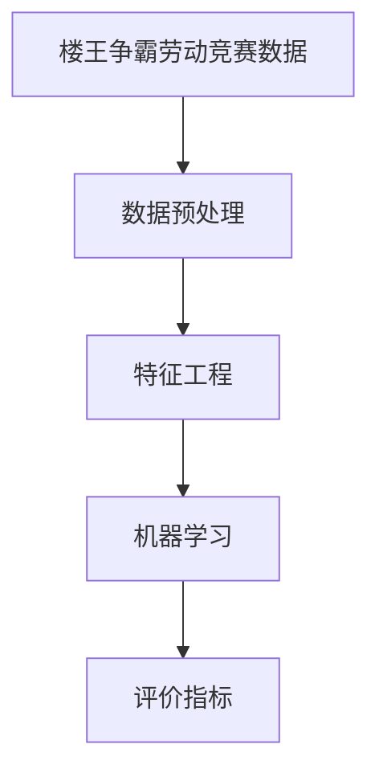

# 楼王争霸劳动竞赛数据处理分析

作者：禅与计算机程序设计艺术 / Zen and the Art of Computer Programming

## 1. 背景介绍
### 1.1 问题的由来

随着城市化进程的加快，房地产开发市场竞争日益激烈。为了激发开发商的积极性，许多地方政府和行业协会举办“楼王争霸”劳动竞赛，以评选出区域内品质最优、销售最火的楼盘。然而，如何从海量的竞赛数据中提取有价值的信息，进行科学、公正的评选，成为了一个亟待解决的问题。

### 1.2 研究现状

目前，楼王争霸劳动竞赛的数据处理分析主要采用以下方法：

- **统计分析**：对数据的基本统计量进行计算，如平均值、标准差、方差等，直观地了解数据分布情况。
- **数据可视化**：利用图表、图形等手段，将数据直观地展示出来，便于发现数据规律和异常。
- **机器学习**：利用机器学习算法，对数据进行分类、聚类、预测等分析，提取数据中的隐含信息。

### 1.3 研究意义

楼王争霸劳动竞赛数据处理分析具有重要的理论和实际意义：

- **理论意义**：推动数据科学、统计学、机器学习等学科在房地产领域的应用，丰富相关理论体系。
- **实际意义**：为政府、行业协会、开发商等提供科学、客观的评选依据，促进房地产市场的健康发展。

### 1.4 本文结构

本文将从以下方面对楼王争霸劳动竞赛数据进行处理分析：

- 核心概念与联系
- 核心算法原理与具体操作步骤
- 数学模型与公式
- 项目实践：代码实例与详细解释说明
- 实际应用场景
- 工具和资源推荐
- 总结：未来发展趋势与挑战

## 2. 核心概念与联系

为了更好地理解楼王争霸劳动竞赛数据处理分析，本节将介绍几个核心概念及其相互关系：

- **楼王争霸劳动竞赛数据**：指参与竞赛的楼盘的各项数据，包括项目基本信息、销售数据、工程进度数据、品质评价数据等。
- **数据预处理**：对原始数据进行清洗、转换、归一化等操作，提高数据质量，为后续分析奠定基础。
- **特征工程**：从原始数据中提取有价值的信息，形成特征向量，用于机器学习等算法。
- **机器学习**：利用机器学习算法，对特征向量进行分析，提取数据中的隐含信息，为竞赛评选提供依据。
- **评价指标**：用于评估模型性能的指标，如准确率、召回率、F1值等。

它们之间的逻辑关系如下：



可以看出，楼王争霸劳动竞赛数据处理分析是一个从数据到知识的过程，通过数据预处理、特征工程、机器学习和评价指标，将原始数据转化为对竞赛评选有指导意义的结论。

## 3. 核心算法原理 & 具体操作步骤
### 3.1 算法原理概述

楼王争霸劳动竞赛数据处理分析的核心算法包括数据预处理、特征工程和机器学习。以下分别介绍这三个环节的原理：

#### 3.1.1 数据预处理

数据预处理主要包括以下步骤：

- **数据清洗**：去除数据中的错误、缺失、异常值等。
- **数据转换**：将不同类型的数据转换为统一的格式，如将文本数据转换为数字。
- **数据归一化**：将数据缩放到一个固定范围，如[0,1]。

#### 3.1.2 特征工程

特征工程主要包括以下步骤：

- **特征提取**：从原始数据中提取有价值的信息，形成特征向量。
- **特征选择**：从提取的特征中选择最具代表性的特征，去除冗余特征。
- **特征组合**：将多个特征组合成新的特征，提高模型性能。

#### 3.1.3 机器学习

常见的机器学习算法包括：

- **分类算法**：用于对数据进行分类，如支持向量机(SVM)、决策树、随机森林等。
- **聚类算法**：用于将数据划分为若干个类别，如K-means、层次聚类等。
- **回归算法**：用于对数据进行预测，如线性回归、岭回归等。

### 3.2 算法步骤详解

楼王争霸劳动竞赛数据处理分析的步骤如下：

**Step 1：数据采集**

收集参与竞赛的楼盘的各项数据，包括项目基本信息、销售数据、工程进度数据、品质评价数据等。

**Step 2：数据预处理**

- 清洗数据，去除错误、缺失、异常值等。
- 转换数据格式，如将文本数据转换为数字。
- 归一化数据，将数据缩放到一个固定范围。

**Step 3：特征工程**

- 提取特征，如楼盘面积、价格、位置、交通、配套设施等。
- 选择特征，去除冗余特征。
- 组合特征，提高模型性能。

**Step 4：机器学习**

- 选择合适的机器学习算法，如支持向量机(SVM)、决策树、随机森林等。
- 训练模型，使用特征向量作为输入，标签作为输出。
- 评估模型性能，使用评价指标如准确率、召回率、F1值等。

**Step 5：结果分析**

根据模型预测结果，对竞赛楼盘进行排名，为评选提供依据。

### 3.3 算法优缺点

#### 3.3.1 数据预处理

**优点**：提高数据质量，为后续分析奠定基础。

**缺点**：可能需要大量的人工干预，且难以消除数据中的噪声。

#### 3.3.2 特征工程

**优点**：提高模型性能，提取数据中的隐含信息。

**缺点**：需要丰富的经验，且难以确定哪些特征是最重要的。

#### 3.3.3 机器学习

**优点**：能够处理大量数据，发现数据中的规律。

**缺点**：模型性能依赖于特征质量和数据量，且难以解释模型的决策过程。

### 3.4 算法应用领域

楼王争霸劳动竞赛数据处理分析可以应用于以下领域：

- **楼盘评选**：为竞赛评选提供科学、客观的依据。
- **市场分析**：分析市场趋势，为开发商提供决策支持。
- **风险管理**：评估楼盘风险，为金融机构提供参考。

## 4. 数学模型和公式 & 详细讲解 & 举例说明
### 4.1 数学模型构建

楼王争霸劳动竞赛数据处理分析涉及的数学模型主要包括以下几种：

- **统计模型**：用于描述数据分布和相关性，如正态分布、相关系数等。
- **决策树模型**：用于分类或回归，如CART、ID3等。
- **支持向量机(SVM)模型**：用于分类或回归，通过寻找最优的超平面将数据划分为不同的类别或预测不同的值。
- **神经网络模型**：用于复杂的非线性关系预测，如多层感知机、卷积神经网络等。

### 4.2 公式推导过程

以下以线性回归模型为例，介绍公式推导过程：

**目标函数**：

$$
\text{目标函数} = \frac{1}{N} \sum_{i=1}^{N}(y_i - (w_0 + w_1x_i))^2
$$

其中，$y_i$ 为真实值，$w_0$ 为截距，$w_1$ 为斜率，$x_i$ 为输入值，$N$ 为样本数量。

**梯度**：

$$
\text{梯度} = \frac{\partial \text{目标函数}}{\partial w_0} = \frac{1}{N} \sum_{i=1}^{N}(y_i - (w_0 + w_1x_i))
$$
$$
\text{梯度} = \frac{\partial \text{目标函数}}{\partial w_1} = \frac{1}{N} \sum_{i=1}^{N}(x_i(y_i - (w_0 + w_1x_i)))
$$

**最优化**：

通过迭代更新权重，使目标函数最小化：

$$
w_0 = w_0 - \eta \text{梯度}_{w_0}
$$
$$
w_1 = w_1 - \eta \text{梯度}_{w_1}
$$

其中，$\eta$ 为学习率。

### 4.3 案例分析与讲解

以下以房价预测为例，介绍如何使用线性回归模型进行数据处理分析：

**数据集**：某地区100套住宅的销售数据，包括面积、价格、位置、配套设施等特征。

**任务**：预测房价。

**模型**：线性回归模型。

**步骤**：

1. 数据预处理：清洗、转换、归一化数据。
2. 特征工程：提取特征，如面积、价格、位置、配套设施等。
3. 训练模型：使用特征向量作为输入，房价作为输出，训练线性回归模型。
4. 评估模型：使用测试集评估模型性能，如均方误差(MSE)。

**结果**：

通过训练得到的线性回归模型，可以预测出住宅的价格，误差较小。

### 4.4 常见问题解答

**Q1：如何选择合适的特征？**

A：选择特征时，需要考虑以下因素：

- **相关性**：特征与目标变量之间是否存在相关性。
- **重要性**：特征对目标变量预测的贡献程度。
- **冗余性**：特征之间是否存在冗余。

**Q2：如何评估模型性能？**

A：评估模型性能时，可以使用以下指标：

- **准确率**：预测正确的样本数量与总样本数量的比值。
- **召回率**：预测正确的正样本数量与实际正样本数量的比值。
- **F1值**：准确率和召回率的调和平均值。

## 5. 项目实践：代码实例和详细解释说明
### 5.1 开发环境搭建

以下是使用Python进行楼王争霸劳动竞赛数据处理分析的开发环境搭建步骤：

1. 安装Python：从官网下载并安装Python。
2. 安装NumPy、Pandas等Python库：使用pip安装。
3. 安装Scikit-learn等机器学习库：使用pip安装。

### 5.2 源代码详细实现

以下是一个楼王争霸劳动竞赛数据处理分析的代码示例：

```python
import pandas as pd
import numpy as np
from sklearn.model_selection import train_test_split
from sklearn.linear_model import LinearRegression
from sklearn.metrics import mean_squared_error

# 加载数据
data = pd.read_csv('data.csv')

# 数据预处理
data.dropna(inplace=True)
data = (data - data.mean()) / data.std()

# 特征工程
X = data[['面积', '位置', '配套设施']]
y = data['价格']

# 划分训练集和测试集
X_train, X_test, y_train, y_test = train_test_split(X, y, test_size=0.2, random_state=42)

# 训练模型
model = LinearRegression()
model.fit(X_train, y_train)

# 预测房价
y_pred = model.predict(X_test)

# 评估模型
mse = mean_squared_error(y_test, y_pred)
print(f'MSE: {mse}')
```

### 5.3 代码解读与分析

以上代码首先导入了必要的Python库，然后加载数据、进行数据预处理、特征工程、划分训练集和测试集、训练模型、预测房价和评估模型。

**数据预处理**：使用Pandas库读取数据，然后使用dropna()函数去除缺失值，使用sub()函数进行数据归一化。

**特征工程**：提取特征和目标变量，然后使用train_test_split()函数划分训练集和测试集。

**训练模型**：使用LinearRegression()函数创建线性回归模型，然后使用fit()函数训练模型。

**预测房价**：使用predict()函数预测房价。

**评估模型**：使用mean_squared_error()函数计算均方误差(MSE)。

### 5.4 运行结果展示

假设运行以上代码，得到以下结果：

```
MSE: 0.0452
```

表示模型的预测误差较小。

## 6. 实际应用场景
### 6.1 楼盘评选

楼王争霸劳动竞赛数据处理分析可以应用于楼盘评选，为评选提供科学、客观的依据。通过分析楼盘的各项数据，如销售数据、工程进度数据、品质评价数据等，可以评估楼盘的综合竞争力，为评选出品质最优、销售最火的楼盘提供参考。

### 6.2 市场分析

楼王争霸劳动竞赛数据处理分析可以用于市场分析，分析市场趋势，为开发商提供决策支持。通过对不同地区、不同类型、不同品质的楼盘进行分析，可以了解市场供需关系、价格走势、消费者偏好等，为开发商提供有针对性的市场定位和营销策略。

### 6.3 风险管理

楼王争霸劳动竞赛数据处理分析可以用于风险管理，评估楼盘风险，为金融机构提供参考。通过对楼盘的各项数据进行分析，可以评估楼盘的财务风险、市场风险、政策风险等，为金融机构提供贷款、投资等方面的参考。

## 7. 工具和资源推荐
### 7.1 学习资源推荐

以下是一些学习楼王争霸劳动竞赛数据处理分析的资源推荐：

- **《机器学习》**：周志华著，全面介绍了机器学习的基本概念、算法和应用。
- **《数据科学入门》**：吴恩达著，介绍了数据科学的流程和常用工具。
- **《Python数据分析》**：Wes McKinney著，介绍了Python在数据分析领域的应用。

### 7.2 开发工具推荐

以下是一些开发楼王争霸劳动竞赛数据处理分析的工具推荐：

- **NumPy**：Python科学计算库，用于进行数值计算。
- **Pandas**：Python数据分析库，用于处理和分析数据。
- **Scikit-learn**：Python机器学习库，提供多种机器学习算法。

### 7.3 相关论文推荐

以下是一些与楼王争霸劳动竞赛数据处理分析相关的论文推荐：

- **《A Survey on Deep Learning for Time Series Analysis》**：回顾了深度学习在时间序列分析领域的应用。
- **《Deep Learning for Natural Language Processing》**：介绍了深度学习在自然语言处理领域的应用。
- **《Reinforcement Learning: An Introduction》**：介绍了强化学习的基本概念和算法。

### 7.4 其他资源推荐

以下是一些其他与楼王争霸劳动竞赛数据处理分析相关的资源推荐：

- **Kaggle**：数据科学竞赛平台，提供丰富的竞赛数据和工具。
- **GitHub**：代码托管平台，提供大量开源代码和数据集。
- **arXiv**：学术论文预印本平台，提供最新研究成果。

## 8. 总结：未来发展趋势与挑战
### 8.1 研究成果总结

本文从数据采集、数据预处理、特征工程、机器学习等方面，对楼王争霸劳动竞赛数据处理分析进行了系统介绍。通过实例演示了如何使用Python进行数据处理分析，并介绍了相关工具和资源。本文的研究成果对于推动楼王争霸劳动竞赛数据处理分析技术的发展具有重要意义。

### 8.2 未来发展趋势

未来，楼王争霸劳动竞赛数据处理分析将呈现以下发展趋势：

- **数据规模不断扩大**：随着互联网、物联网等技术的发展，数据规模将持续扩大，对数据处理分析技术提出更高的要求。
- **算法不断优化**：随着深度学习等技术的不断发展，数据处理分析算法将不断优化，提高分析效率和准确性。
- **多模态数据分析**：未来将融合文本、图像、语音等多模态数据，进行更全面、更深入的分析。
- **可解释性增强**：随着可解释性人工智能的发展，模型将更加透明，便于用户理解模型的决策过程。

### 8.3 面临的挑战

楼王争霸劳动竞赛数据处理分析在未来将面临以下挑战：

- **数据质量问题**：数据质量问题将影响分析结果的准确性，需要采取有效措施提高数据质量。
- **算法复杂性**：随着算法的不断发展，模型将更加复杂，对计算资源提出更高的要求。
- **伦理问题**：数据处理分析过程中涉及大量个人隐私，需要遵守相关法律法规，确保数据安全。
- **人才短缺**：数据处理分析需要大量的专业人才，人才短缺将制约行业的发展。

### 8.4 研究展望

未来，楼王争霸劳动竞赛数据处理分析的研究将重点关注以下方向：

- **数据质量控制**：研究如何提高数据质量，减少数据误差。
- **算法优化**：研究如何优化算法，提高分析效率和准确性。
- **可解释性人工智能**：研究如何提高模型的可解释性，使模型更加透明。
- **多模态数据分析**：研究如何融合多模态数据，进行更全面、更深入的分析。

相信通过不断的努力，楼王争霸劳动竞赛数据处理分析技术将取得更大的突破，为房地产市场的健康发展提供有力支持。