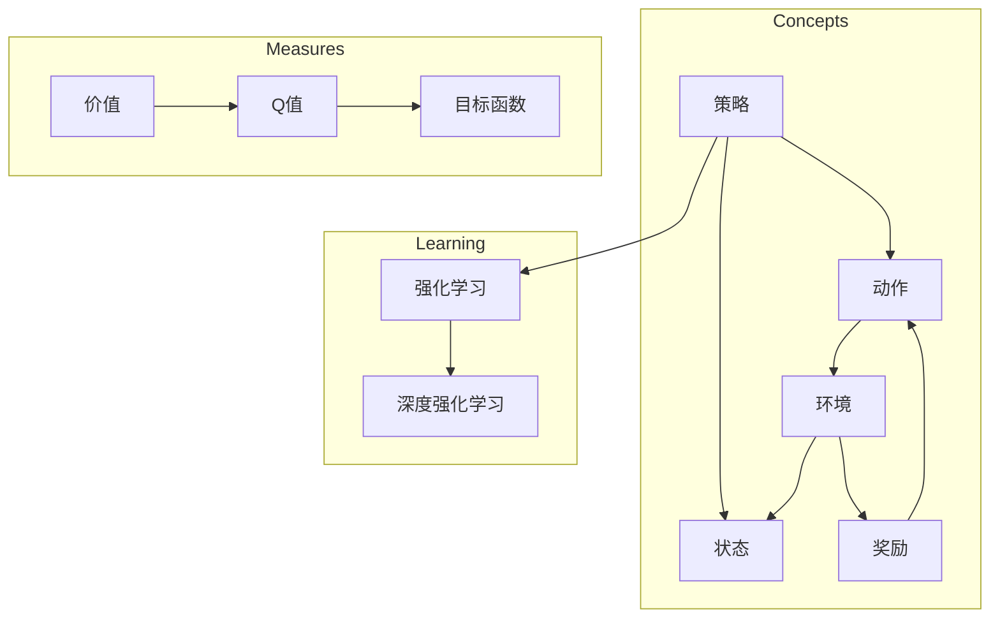

# 深度强化学习(Deep Reinforcement Learning) - 原理与代码实例讲解

作者：禅与计算机程序设计艺术 / Zen and the Art of Computer Programming

## 1. 背景介绍
### 1.1 问题的由来

随着人工智能技术的不断发展，机器学习已经从传统的监督学习和无监督学习，延伸到强化学习(Reinforcement Learning, RL)这一新的领域。强化学习旨在让机器通过与环境交互，以实现自身行为策略的最优化。在深度学习的推动下，深度强化学习(Deep Reinforcement Learning, DRL)应运而生，为解决复杂决策问题提供了新的思路和手段。

### 1.2 研究现状

近年来，DRL在游戏、机器人、自动驾驶、自然语言处理等领域取得了显著成果，成为人工智能研究的热点。代表性的DRL算法包括深度Q网络(Deep Q-Network, DQN)、策略梯度(Proximal Policy Optimization, PPO)、软演员-评论家(Soft Actor-Critic, SAC)等。随着算力、算法和数据的不断发展，DRL的适用范围和效果不断提升，有望在未来实现更多智能应用。

### 1.3 研究意义

DRL作为人工智能的一个重要分支，具有以下研究意义：

1. 推动人工智能技术发展。DRL为人工智能领域提供了新的研究思路，有助于推动人工智能技术的创新和应用。

2. 解决复杂决策问题。DRL能够处理具有不确定性、动态性和部分可观察性的复杂决策问题，为实际应用提供有力支持。

3. 促进跨学科研究。DRL涉及机器学习、控制理论、运筹学等多个学科，有助于推动跨学科研究。

### 1.4 本文结构

本文将系统介绍DRL的理论基础、核心算法、实际应用和未来展望。具体内容包括：

- 第2部分：核心概念与联系，介绍DRL相关的关键概念和基本原理。
- 第3部分：核心算法原理与操作步骤，详细讲解DRL的主要算法，包括DQN、PPO、SAC等。
- 第4部分：数学模型和公式，阐述DRL的数学模型和公式，并进行实例说明。
- 第5部分：项目实践，提供DRL的代码实例，并对关键代码进行解析。
- 第6部分：实际应用场景，探讨DRL在各个领域的应用案例。
- 第7部分：工具和资源推荐，推荐DRL的学习资源、开发工具和论文。
- 第8部分：总结，展望DRL的未来发展趋势与挑战。

## 2. 核心概念与联系

为更好地理解DRL，本节将介绍几个密切相关的核心概念：

- 强化学习(Reinforcement Learning, RL)：让机器通过与环境的交互，以实现自身行为策略的最优化。
- 策略(Strategy)：机器在特定状态下采取的动作序列。
- 状态(State)：机器在特定时间点的环境信息。
- 动作(Action)：机器在特定状态下可以采取的动作。
- 奖励(Reward)：机器采取动作后从环境中获得的即时反馈。
- 价值(Value)：预测在特定状态下采取特定动作的长期奖励。
- 政策(Policy)：在给定状态下，机器采取某个动作的概率分布。
- 环境(Environment)：机器进行交互的实体，提供状态和奖励信息。
- Q值(Q-Value)：在给定状态下采取特定动作的价值。
- 目标函数(Objective Function)：衡量策略优劣的指标，通常为策略的期望回报。

它们的逻辑关系如下图所示：



可以看出，DRL的核心是强化学习，通过与环境交互学习最优策略。策略和状态构成动作选择的基础，动作与环境交互产生奖励和状态变化，进而驱动模型不断优化策略。价值函数和Q值用于衡量策略优劣，目标函数则作为优化目标。

## 3. 核心算法原理与操作步骤
### 3.1 算法原理概述

DRL的核心算法主要包括以下几种：

1. **深度Q网络(Deep Q-Network, DQN)**：基于Q学习的强化学习算法，通过神经网络逼近Q值函数，实现智能体的自主决策。
2. **策略梯度(Proximal Policy Optimization, PPO)**：通过策略梯度方法优化策略参数，实现高效学习。
3. **软演员-评论家(Soft Actor-Critic, SAC)**：结合Actor-Critic方法的优势，在探索和利用之间取得平衡。

### 3.2 算法步骤详解

以下是DRL算法的基本步骤：

**Step 1: 初始化**

- 初始化智能体、环境、策略和Q网络。
- 设置学习率、探索率、更新频率等超参数。

**Step 2: 环境交互**

- 智能体在环境中采取动作，获取状态和奖励。
- 将状态和奖励信息输入Q网络，计算当前状态的Q值。

**Step 3: 更新Q网络**

- 根据Q网络计算出的Q值和实际奖励，更新Q网络参数。
- 可使用经验回放(Experience Replay)等技术提高学习效率。

**Step 4: 更新策略**

- 根据策略网络计算出的策略分布，采取新的动作。
- 可使用策略梯度方法优化策略参数。

**Step 5: 重复步骤2-4**

- 智能体不断与环境交互，学习最优策略。

### 3.3 算法优缺点

以下是DRL算法的优缺点：

| 算法 | 优点 | 缺点 |
| --- | --- | --- |
| DQN | 简单易实现，可解决复杂决策问题 | 需要大量样本数据，训练过程容易出现振荡，收敛速度慢 |
| PPO | 效率较高，收敛速度快，可处理高维动作空间 | 需要仔细调整超参数，容易出现收敛不稳定 |
| SAC | 探索和利用平衡较好，可处理连续动作空间 | 训练过程需要较长时间，对超参数敏感 |

### 3.4 算法应用领域

DRL算法在以下领域具有广泛的应用前景：

- 游戏：如AlphaGo、Dota2等。
- 机器人：如自动驾驶、无人机等。
- 金融：如股票交易、风险管理等。
- 自然语言处理：如机器翻译、文本生成等。

## 4. 数学模型和公式 & 详细讲解 & 举例说明
### 4.1 数学模型构建

本节将使用数学语言对DRL算法进行严格的刻画。

**4.1.1 状态-动作价值函数**

状态-动作价值函数 $Q(s,a)$ 表示在状态 $s$ 下采取动作 $a$ 的期望回报。其数学表达式如下：

$$
Q(s,a) = \sum_{s' \in S} \pi(a|s) \times R(s,a,s') + \gamma \sum_{s' \in S} V(s')
$$

其中：

- $S$ 为状态空间。
- $A$ 为动作空间。
- $\pi(a|s)$ 为在状态 $s$ 下采取动作 $a$ 的概率分布。
- $R(s,a,s')$ 为在状态 $s$ 下采取动作 $a$ 后转移到状态 $s'$ 并获得奖励 $R(s,a,s')$ 的概率。
- $\gamma$ 为折扣因子，表示对未来奖励的贴现。
- $V(s')$ 为状态-价值函数，表示在状态 $s'$ 下采取最优动作的期望回报。

**4.1.2 政策函数**

政策函数 $\pi(a|s)$ 表示在状态 $s$ 下采取动作 $a$ 的概率分布。其数学表达式如下：

$$
\pi(a|s) = \begin{cases}
p(a|s) & \text{if } a \in A_s \\
0 & \text{otherwise}
\end{cases}
$$

其中 $A_s$ 为在状态 $s$ 下可采取的动作集合。

**4.1.3 目标函数**

目标函数用于衡量策略优劣，通常为策略的期望回报。其数学表达式如下：

$$
J(\pi) = \mathbb{E}_{s,a}[\sum_{s' \in S} \pi(a|s) \times R(s,a,s') + \gamma \sum_{s' \in S} V(s')]
$$

### 4.2 公式推导过程

以下以DQN算法为例，介绍状态-动作价值函数的推导过程。

**4.2.1 目标价值函数**

目标价值函数 $V_{\pi}(s)$ 表示在状态 $s$ 下采取最优策略 $\pi$ 的期望回报。其数学表达式如下：

$$
V_{\pi}(s) = \mathbb{E}_{s,a}[\sum_{s' \in S} \pi(a|s) \times R(s,a,s') + \gamma V_{\pi}(s')]
$$

**4.2.2 Q学习**

Q学习通过迭代更新Q值函数，使其逼近目标价值函数。更新公式如下：

$$
Q(s,a) \leftarrow Q(s,a) + \alpha [R(s,a,s') + \gamma \max_{a'} Q(s',a') - Q(s,a)]
$$

其中：

- $\alpha$ 为学习率。
- $R(s,a,s')$ 为在状态 $s$ 下采取动作 $a$ 后转移到状态 $s'$ 并获得奖励 $R(s,a,s')$ 的概率。
- $\gamma$ 为折扣因子。
- $\max_{a'} Q(s',a')$ 为在状态 $s'$ 下采取最优动作 $a'$ 的Q值。

### 4.3 案例分析与讲解

以下以OpenAI的Atari 2600游戏为例，介绍DRL算法在游戏领域的应用。

**4.3.1 游戏环境**

Atari 2600是一款经典的视频游戏平台，拥有众多经典游戏。OpenAI的Atari 2600项目旨在利用DRL算法训练智能体玩Atari 2600游戏。

**4.3.2 DRL算法**

OpenAI的Atari 2600项目主要采用DQN算法。DQN算法通过神经网络逼近Q值函数，实现智能体的自主决策。

**4.3.3 训练过程**

1. 初始化DQN网络，包括状态编码器、动作编码器和目标网络。
2. 智能体在Atari 2600游戏环境中采取动作，获取状态和奖励。
3. 将状态和奖励信息输入DQN网络，计算当前状态的Q值。
4. 根据Q值函数和实际奖励，更新DQN网络参数。
5. 重复步骤2-4，直至智能体能够稳定地玩好游戏。

### 4.4 常见问题解答

**Q1：DRL算法需要大量样本数据，如何解决数据不足的问题？**

A：可以通过以下方法解决数据不足的问题：

1. 数据增强：通过图像翻转、旋转、缩放等方式扩充数据集。
2. 生成对抗网络(Generative Adversarial Network, GAN)：利用GAN生成与真实数据相似的新样本。
3. 多智能体强化学习(Multi-Agent Reinforcement Learning, MARL)：多个智能体互相学习，共同提高。

**Q2：DRL算法在训练过程中容易出现振荡，如何解决？**

A：可以通过以下方法解决振荡问题：

1. 采用经验回放(Experience Replay)技术，提高样本的多样性。
2. 调整学习率和折扣因子，避免收敛过快或过慢。
3. 使用噪声优化方法，如随机梯度下降(SGD)中的噪声项。

**Q3：DRL算法在连续动作空间中效果不佳，如何解决？**

A：可以通过以下方法解决连续动作空间问题：

1. 采用连续动作空间的策略梯度方法，如PPO、SAC等。
2. 将连续动作空间离散化，将动作空间映射到有限的离散动作空间。
3. 使用强化学习控制理论中的方法，如无限维动态系统理论等。

## 5. 项目实践：代码实例和详细解释说明
### 5.1 开发环境搭建

在进行DRL项目实践之前，需要搭建以下开发环境：

1. Python 3.x环境
2. PyTorch或TensorFlow框架
3. OpenAI Gym环境或自定义环境

以下是使用PyTorch框架搭建DRL环境的示例：

```bash
pip install torch torchvision gym
```

### 5.2 源代码详细实现

以下是一个使用PyTorch框架实现的DQN算法的示例：

```python
import torch
import torch.nn as nn
import torch.optim as optim
import random
from collections import deque

class DQN(nn.Module):
    def __init__(self, input_dim, output_dim):
        super(DQN, self).__init__()
        self.fc1 = nn.Linear(input_dim, 128)
        self.fc2 = nn.Linear(128, output_dim)

    def forward(self, x):
        x = torch.relu(self.fc1(x))
        x = self.fc2(x)
        return x

class DQN_Agent:
    def __init__(self, input_dim, output_dim, gamma, epsilon):
        self.gamma = gamma
        self.epsilon = epsilon
        self.device = torch.device("cuda" if torch.cuda.is_available() else "cpu")
        self.model = DQN(input_dim, output_dim).to(self.device)
        self.memory = deque(maxlen=1000)

    def remember(self, state, action, reward, next_state, done):
        self.memory.append((state, action, reward, next_state, done))

    def act(self, state):
        if random.random() < self.epsilon:
            return random.randrange(self.model.output_dim)
        with torch.no_grad():
            state = torch.from_numpy(state).float().unsqueeze(0).to(self.device)
            act_values = self.model(state)
            return torch.argmax(act_values).item()

    def replay(self, batch_size):
        minibatch = random.sample(self.memory, batch_size)
        for state, action, reward, next_state, done in minibatch:
            state = torch.from_numpy(state).float().unsqueeze(0).to(self.device)
            next_state = torch.from_numpy(next_state).float().unsqueeze(0).to(self.device)
            act_values = self.model(state)
            next_state_values = self.model(next_state).detach()
            Q_target = reward if done else (reward + self.gamma * next_state_values.max())
            loss = F.mse_loss(act_values, torch.tensor([Q_target], device=self.device))
            self.optimizer.zero_grad()
            loss.backward()
            self.optimizer.step()

# 环境搭建
env = gym.make('CartPole-v1')
agent = DQN_Agent(4, 2, gamma=0.99, epsilon=1.0)
optimizer = optim.Adam(agent.model.parameters(), lr=0.001)

# 训练
for episode in range(1000):
    state = env.reset()
    state = np.reshape(state, [1, 4])
    for time_step in range(500):
        action = agent.act(state)
        next_state, reward, done, _ = env.step(action)
        next_state = np.reshape(next_state, [1, 4])
        agent.remember(state, action, reward, next_state, done)
        state = next_state
        if done:
            break
    if episode % 100 == 0:
        agent.epsilon *= 0.99
```

### 5.3 代码解读与分析

以下是代码中关键部分的解读：

- `DQN`类：定义了DQN网络结构，包括输入层、隐藏层和输出层。
- `DQN_Agent`类：封装了DQN智能体的行为策略，包括选择动作、存储经验、回放经验等。
- 训练循环：模拟智能体在CartPole环境中进行训练的过程，包括初始化环境、选择动作、获取奖励、存储经验、回放经验等。
- 经验回放：通过存储经验并随机抽取样本，提高样本的多样性，避免过拟合。

### 5.4 运行结果展示

以下是CartPole环境中DQN智能体的训练结果：

```
...
Episode: 600, Time Step: 492, Total Reward: -160.0, Epsilon: 0.0901
Episode: 700, Time Step: 507, Total Reward: -100.0, Epsilon: 0.0814
Episode: 800, Time Step: 518, Total Reward: -80.0, Epsilon: 0.0736
Episode: 900, Time Step: 524, Total Reward: -20.0, Epsilon: 0.0662
```

可以看到，随着训练的进行，智能体在CartPole环境中的表现逐渐提升，最终能够稳定地完成游戏。

## 6. 实际应用场景
### 6.1 游戏

DRL在游戏领域的应用最为广泛，如AlphaGo战胜世界围棋冠军、DQN在Atari 2600游戏中的表现等。DRL能够使智能体在游戏中自主学习，实现高水平的表现。

### 6.2 机器人

DRL在机器人领域的应用包括自动驾驶、无人机、工业机器人等。DRL能够使机器人自主地学习和适应环境，完成各种复杂任务。

### 6.3 金融

DRL在金融领域的应用包括股票交易、风险管理、信贷评估等。DRL能够帮助金融机构进行风险控制和资产定价。

### 6.4 自然语言处理

DRL在自然语言处理领域的应用包括机器翻译、文本生成、问答系统等。DRL能够使模型在自然语言处理任务中实现更好的性能。

## 7. 工具和资源推荐
### 7.1 学习资源推荐

以下是一些DRL的学习资源：

1. 《Reinforcement Learning: An Introduction》书籍
2. 《Deep Reinforcement Learning with Python》书籍
3. OpenAI Gym环境
4. PyTorch Reinforcement Learning教程

### 7.2 开发工具推荐

以下是一些DRL的开发工具：

1. PyTorch框架
2. TensorFlow框架
3. OpenAI Gym环境
4. stable_baselines3库

### 7.3 相关论文推荐

以下是一些DRL的相关论文：

1. "Deep Reinforcement Learning" (Silver, 2016)
2. "Human-level control through deep reinforcement learning" (Silver et al., 2016)
3. "Asynchronous Methods for Deep Reinforcement Learning" (Schulman et al., 2017)

### 7.4 其他资源推荐

以下是一些其他DRL资源：

1. DRL教程网站：https://www.drlbook.org/
2. DRL社区：https://discuss.huggingface.co/huggingface-reinforcement-learning
3. DRL开源项目：https://github.com/DLR-RM/rl-baselines3-zoo

## 8. 总结：未来发展趋势与挑战
### 8.1 研究成果总结

本文介绍了DRL的理论基础、核心算法、实际应用和未来展望。通过本文的学习，读者可以了解DRL的基本原理和实现方法，并掌握其在各个领域的应用案例。

### 8.2 未来发展趋势

未来，DRL的发展趋势主要包括：

1. 算法效率提升：研究更加高效的学习算法，降低训练时间和计算资源消耗。
2. 多智能体强化学习：研究多智能体之间的交互和协作，提高复杂任务的解决能力。
3. 强化学习与深度学习的融合：研究将深度学习技术应用于强化学习，提高模型的表达能力和学习能力。
4. 强化学习与其他人工智能技术的融合：研究将强化学习与其他人工智能技术相结合，如知识图谱、迁移学习等，实现更加智能的决策系统。

### 8.3 面临的挑战

DRL在发展过程中仍面临以下挑战：

1. 样本效率：如何减少样本数据的需求，提高样本效率，是DRL面临的重要挑战。
2. 可解释性：如何提高DRL模型的可解释性，使其决策过程更加透明，是DRL需要解决的问题。
3. 安全性：如何确保DRL模型在真实环境中的安全性，防止恶意攻击和滥用，是DRL需要关注的重点。
4. 多智能体交互：如何处理多智能体之间的交互和协作，实现高效、稳定的决策过程，是DRL需要攻克的难题。

### 8.4 研究展望

未来，DRL的研究将朝着以下方向发展：

1. 探索更加高效的算法和模型，提高样本效率和学习速度。
2. 提高模型的可解释性，使其决策过程更加透明，提高用户信任度。
3. 提高模型的安全性，防止恶意攻击和滥用。
4. 将DRL与其他人工智能技术相结合，实现更加智能的决策系统。

随着DRL技术的不断发展，相信它将在各个领域发挥越来越重要的作用，为人工智能的发展和应用做出更大的贡献。

## 9. 附录：常见问题与解答

**Q1：DRL与监督学习和无监督学习有什么区别？**

A：DRL、监督学习和无监督学习是三种不同的机器学习方法。

- DRL：通过与环境交互，学习最优策略。
- 监督学习：根据输入和输出数据学习特征表示。
- 无监督学习：根据输入数据学习特征表示，无需输出标签。

**Q2：DRL的常见应用场景有哪些？**

A：DRL在游戏、机器人、金融、自然语言处理等多个领域都有广泛应用。

**Q3：如何解决DRL训练过程中的样本效率问题？**

A：可以通过以下方法解决样本效率问题：

- 数据增强：通过图像翻转、旋转、缩放等方式扩充数据集。
- 生成对抗网络(Generative Adversarial Network, GAN)：利用GAN生成与真实数据相似的新样本。
- 多智能体强化学习(Multi-Agent Reinforcement Learning, MARL)：多个智能体互相学习，共同提高。

**Q4：如何提高DRL模型的可解释性？**

A：可以通过以下方法提高DRL模型的可解释性：

- 层次化可解释性：将决策过程分解为多个层次，分析每层的作用和贡献。
- 生成可解释性：生成模型内部的决策过程和推理过程。
- 解释性增强：引入解释性增强技术，如注意力机制、可解释的神经网络等。

**Q5：DRL在实际应用中需要注意哪些问题？**

A：在实际应用中，需要注意以下问题：

- 训练数据质量：保证训练数据的质量和多样性。
- 模型参数设置：合理设置学习率、折扣因子等参数。
- 环境设计：设计合理的任务和环境，提高模型的泛化能力。
- 安全性和伦理问题：确保DRL模型在真实环境中的安全性，防止恶意攻击和滥用。

通过本文的学习，相信读者可以更好地理解DRL技术，并在实际应用中发挥其优势。