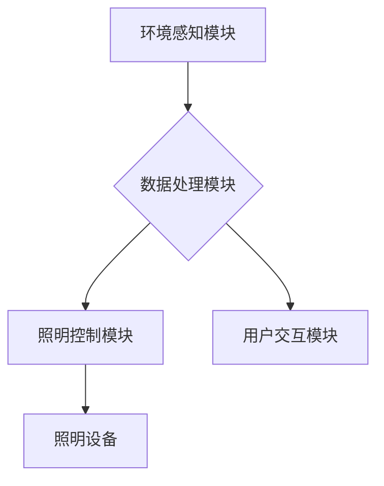

## AI驱动的智能照明系统:节能与舒适并重

> 关键词：智能照明、人工智能、机器学习、深度学习、节能、舒适度、环境感知、场景识别

## 1. 背景介绍

随着全球对能源消耗和环境保护的日益关注，智能照明系统作为一种节能环保的解决方案，逐渐成为建筑和家居领域的重要发展方向。传统的照明系统通常采用固定亮度和开关控制方式，无法根据实际需求动态调整照明强度，导致能源浪费和用户体验不佳。

人工智能（AI）技术的快速发展为智能照明系统带来了新的机遇。AI算法能够分析环境光线、用户行为、时间等多种因素，实现智能控制和个性化定制，从而提升照明系统的节能效率和舒适度。

## 2. 核心概念与联系

### 2.1 智能照明系统

智能照明系统是指利用传感器、网络、控制系统和照明设备等技术，实现照明场景的自动控制和个性化定制的照明系统。

### 2.2 人工智能

人工智能是指模拟人类智能行为的计算机系统。在智能照明系统中，AI算法可以用于环境感知、场景识别、行为预测等方面，实现智能照明控制。

### 2.3 核心架构

智能照明系统基于AI技术的核心架构主要包括以下几个部分：

* **环境感知模块:** 利用传感器收集环境光线、温度、湿度、人体位置等数据。
* **数据处理模块:** 利用AI算法对收集到的环境数据进行分析和处理，识别用户需求和场景。
* **照明控制模块:** 根据AI算法的分析结果，控制照明设备的亮度、颜色、模式等参数。
* **用户交互模块:** 提供用户界面，方便用户设置照明场景、调整参数和控制系统。



## 3. 核心算法原理 & 具体操作步骤

### 3.1 算法原理概述

在智能照明系统中，常用的AI算法包括机器学习和深度学习。

* **机器学习:** 通过训练模型，学习环境数据和用户行为之间的关系，实现预测和控制。例如，可以使用机器学习算法预测用户在特定时间段内的照明需求，并根据预测结果自动调整照明强度。
* **深度学习:** 利用多层神经网络，学习更复杂的特征和模式。例如，可以使用深度学习算法识别不同的照明场景，并根据场景自动选择合适的照明方案。

### 3.2 算法步骤详解

以机器学习算法为例，其在智能照明系统中的具体操作步骤如下：

1. **数据收集:** 收集环境光线、温度、湿度、人体位置等数据，以及用户对照明强度、颜色等参数的反馈。
2. **数据预处理:** 对收集到的数据进行清洗、转换和特征提取，以便于模型训练。
3. **模型选择:** 选择合适的机器学习算法，例如线性回归、决策树、支持向量机等。
4. **模型训练:** 利用训练数据训练模型，学习环境数据和用户行为之间的关系。
5. **模型评估:** 使用测试数据评估模型的性能，并根据评估结果调整模型参数。
6. **模型部署:** 将训练好的模型部署到智能照明系统中，实现实时控制和个性化定制。

### 3.3 算法优缺点

**优点:**

* **智能控制:** 根据环境和用户需求自动调整照明强度和颜色，提升照明效率和舒适度。
* **个性化定制:** 用户可以根据自己的喜好设置不同的照明场景，满足个性化需求。
* **节能环保:** 通过智能控制，减少不必要的照明浪费，降低能源消耗。

**缺点:**

* **数据依赖:** 需要大量的数据进行训练和评估，数据质量直接影响模型性能。
* **计算复杂度:** 训练深度学习模型需要大量的计算资源和时间。
* **隐私安全:** 智能照明系统收集的用户数据需要妥善保护，避免隐私泄露。

### 3.4 算法应用领域

AI驱动的智能照明系统广泛应用于以下领域:

* **住宅:** 智能家居照明，根据用户行为和环境光线自动调节照明强度和颜色，提升舒适度和节能效果。
* **商业:** 商业场所照明，根据人流量和时间段自动调整照明强度，降低能源消耗。
* **工业:** 工厂照明，根据生产需求和环境光线自动调节照明强度，提高生产效率和安全性。
* **公共设施:** 道路照明、公共场所照明等，根据人流量和时间段自动调节照明强度，提升安全性并降低能源消耗。

## 4. 数学模型和公式 & 详细讲解 & 举例说明

### 4.1 数学模型构建

在智能照明系统中，可以使用数学模型来描述环境光线、用户需求和照明强度之间的关系。例如，可以使用以下公式来计算环境光线强度：

$$E = \frac{I}{A}$$

其中：

* $E$ 表示环境光线强度（Lux）
* $I$ 表示光源强度（流明）
* $A$ 表示光线照射面积（平方米）

### 4.2 公式推导过程

该公式的推导过程如下：

* 光源强度是指光源发出的光通量，单位为流明（lm）。
* 环境光线强度是指光线照射到物体表面的光强，单位为Lux（lx）。
* 光线照射面积是指光线照射到物体的面积，单位为平方米（m²）。

根据光学原理，光源发出的光线会均匀地照射到周围的物体表面，因此环境光线强度与光源强度和光线照射面积成反比关系。

### 4.3 案例分析与讲解

假设一个光源强度为1000流明的灯泡，照射到1平方米的面积上，则环境光线强度为：

$$E = \frac{1000 lm}{1 m^2} = 1000 lx$$

如果将灯泡移动到2平方米的面积上，则环境光线强度为：

$$E = \frac{1000 lm}{2 m^2} = 500 lx$$

可见，随着光线照射面积的增加，环境光线强度会降低。

## 5. 项目实践：代码实例和详细解释说明

### 5.1 开发环境搭建

本项目使用Python语言进行开发，需要安装以下软件：

* Python 3.x
* TensorFlow或PyTorch深度学习框架
* OpenCV计算机视觉库
* NumPy数值计算库

### 5.2 源代码详细实现

以下代码示例展示了使用深度学习算法实现场景识别的基本流程：

```python
import tensorflow as tf
from tensorflow.keras.models import Sequential
from tensorflow.keras.layers import Conv2D, MaxPooling2D, Flatten, Dense

# 定义模型结构
model = Sequential()
model.add(Conv2D(32, (3, 3), activation='relu', input_shape=(64, 64, 3)))
model.add(MaxPooling2D((2, 2)))
model.add(Conv2D(64, (3, 3), activation='relu'))
model.add(MaxPooling2D((2, 2)))
model.add(Flatten())
model.add(Dense(10, activation='softmax'))

# 编译模型
model.compile(optimizer='adam',
              loss='categorical_crossentropy',
              metrics=['accuracy'])

# 训练模型
model.fit(train_data, train_labels, epochs=10)

# 预测场景
predictions = model.predict(test_data)
```

### 5.3 代码解读与分析

* 该代码首先定义了一个深度学习模型，包含卷积层、池化层、全连接层等。
* 然后，使用Adam优化器和交叉熵损失函数对模型进行编译。
* 接着，使用训练数据训练模型，训练epochs为10。
* 最后，使用测试数据预测场景，并输出预测结果。

### 5.4 运行结果展示

训练完成后，可以将模型应用于实际场景，例如根据摄像头采集的图像识别房间类型、活动类型等。

## 6. 实际应用场景

### 6.1 住宅照明

AI驱动的智能照明系统可以根据用户的活动模式和喜好，自动调节照明强度和颜色，营造舒适的居家氛围。例如，当用户在客厅观看电影时，系统可以自动降低照明强度，营造影院般的氛围；当用户在厨房烹饪时，系统可以自动提高照明强度，提高工作效率。

### 6.2 商业照明

在商业场所，AI智能照明系统可以根据人流量和时间段自动调节照明强度，降低能源消耗。例如，在人流量较少的区域，系统可以自动降低照明强度；在人流量较大的区域，系统可以自动提高照明强度。

### 6.3 工业照明

在工业生产环境中，AI智能照明系统可以根据生产需求和环境光线自动调节照明强度，提高生产效率和安全性。例如，在需要高精度的操作区域，系统可以提供更明亮的照明；在需要保护眼睛的区域，系统可以提供柔和的照明。

### 6.4 未来应用展望

随着AI技术的不断发展，智能照明系统将拥有更强大的功能和更广泛的应用场景。例如，未来智能照明系统可以实现以下功能：

* **个性化照明:** 根据用户的生理特征和心理状态，自动调节照明强度和颜色，提升用户舒适度和健康。
* **场景联动:** 与其他智能家居设备联动，实现场景联动控制，例如，当用户打开电视时，系统可以自动调节照明强度和颜色，营造最佳的观影体验。
* **远程控制:** 通过手机APP或语音助手远程控制照明系统，方便用户随时随地调节照明环境。
* **安全监控:** 利用摄像头和AI算法，实现智能监控功能，例如，检测异常情况并报警。

## 7. 工具和资源推荐

### 7.1 学习资源推荐

* **书籍:**
    * 《深度学习》 - Ian Goodfellow, Yoshua Bengio, Aaron Courville
    * 《机器学习》 - Tom Mitchell
* **在线课程:**
    * Coursera: 深度学习 Specialization
    * edX: 机器学习
* **博客和网站:**
    * TensorFlow博客: https://blog.tensorflow.org/
    * PyTorch博客: https://pytorch.org/blog/

### 7.2 开发工具推荐

* **Python:** https://www.python.org/
* **TensorFlow:** https://www.tensorflow.org/
* **PyTorch:** https://pytorch.org/
* **OpenCV:** https://opencv.org/
* **NumPy:** https://numpy.org/

### 7.3 相关论文推荐

* **《ImageNet Classification with Deep Convolutional Neural Networks》** - Alex Krizhevsky, Ilya Sutskever, Geoffrey E. Hinton
* **《Attention Is All You Need》** - Ashish Vaswani, Noam Shazeer, Niki Parmar, Jakob Uszkoreit, Llion Jones, Aidan N. Gomez, Łukasz Kaiser, Illia Polosukhin
* **《Generative Adversarial Networks》** - Ian Goodfellow, Jean Pouget-Abadie, Mehdi Mirza, Bing Xu, David Warde-Farley, Sherjil Ozair, Aaron Courville, Yoshua Bengio

## 8. 总结：未来发展趋势与挑战

### 8.1 研究成果总结

AI驱动的智能照明系统已经取得了显著的成果，能够实现智能控制、个性化定制、节能环保等功能，并广泛应用于住宅、商业、工业等领域。

### 8.2 未来发展趋势

未来，AI智能照明系统将朝着以下方向发展：

* **更智能的控制:** 利用更先进的AI算法，实现更精准的场景识别和行为预测，提供更个性化的照明体验。
* **更广泛的应用:** 将AI智能照明技术应用于更多领域，例如医疗、教育、交通等。
* **更安全的系统:** 加强数据安全保护，防止隐私泄露和恶意攻击。

### 8.3 面临的挑战

AI智能照明系统的发展也面临着一些挑战