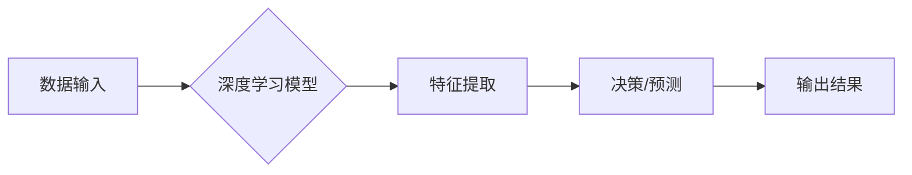

## Andrej Karpathy：人工智能的未来发展挑战

> 关键词：人工智能、深度学习、计算机视觉、自然语言处理、强化学习、伦理、可解释性、未来趋势

### 1. 背景介绍

人工智能（AI）近年来取得了令人瞩目的进展，深度学习算法的突破性发展推动了计算机视觉、自然语言处理等领域的技术飞跃。Andrej Karpathy，一位享誉全球的人工智能专家，在深度学习领域做出了卓越贡献，他曾担任特斯拉自动驾驶团队负责人，现任英伟达副总裁，致力于推动人工智能技术的进步和应用。

Karpathy在众多演讲和文章中，对人工智能的未来发展提出了深刻的思考，他强调了人工智能技术面临的挑战，并呼吁关注人工智能的伦理和可解释性问题。本文将深入探讨Karpathy提出的挑战，并分析其对人工智能发展的影响。

### 2. 核心概念与联系

人工智能的核心概念是模拟人类智能的行为，包括学习、推理、决策和感知等。深度学习作为人工智能的重要分支，通过构建多层神经网络，模拟大脑神经元网络的结构和功能，实现对复杂数据的学习和处理。

**Mermaid 流程图：**



**核心概念联系：**

* 数据：深度学习模型的训练和运行依赖于海量数据，数据质量和数量直接影响模型的性能。
* 模型：深度学习模型的结构和参数决定了模型的学习能力和应用范围。
* 算法：深度学习算法包括前馈神经网络、卷积神经网络、循环神经网络等，不同的算法适用于不同的任务。
* 计算资源：深度学习模型的训练和推理需要强大的计算资源，例如GPU和TPU。

### 3. 核心算法原理 & 具体操作步骤

#### 3.1  算法原理概述

深度学习算法的核心原理是通过多层神经网络学习数据特征，并逐步抽象出更高级的特征表示。每个神经元接收来自上一层的输入信号，并通过激活函数进行非线性变换，输出到下一层。通过调整神经网络的权重和偏置，模型可以学习到数据中的模式和规律。

#### 3.2  算法步骤详解

1. **数据预处理：** 将原始数据转换为模型可接受的格式，例如归一化、编码等。
2. **模型构建：** 根据任务需求选择合适的深度学习模型结构，例如卷积神经网络、循环神经网络等。
3. **模型训练：** 使用训练数据训练模型，通过反向传播算法调整模型参数，使模型的预测结果与真实值尽可能接近。
4. **模型评估：** 使用测试数据评估模型的性能，例如准确率、召回率、F1-score等。
5. **模型部署：** 将训练好的模型部署到实际应用场景中，用于预测或决策。

#### 3.3  算法优缺点

**优点：**

* 学习能力强：深度学习模型能够学习到复杂数据中的非线性模式和关系。
* 表现优异：在图像识别、自然语言处理等领域取得了突破性进展。
* 自动特征提取：无需人工特征工程，模型能够自动学习特征。

**缺点：**

* 数据依赖性强：深度学习模型需要海量数据进行训练，否则性能会下降。
* 计算资源消耗大：训练深度学习模型需要强大的计算资源。
* 可解释性差：深度学习模型的决策过程难以理解，缺乏透明度。

#### 3.4  算法应用领域

深度学习算法广泛应用于各个领域，例如：

* 计算机视觉：图像识别、目标检测、图像分割、人脸识别等。
* 自然语言处理：机器翻译、文本摘要、情感分析、对话系统等。
* 语音识别：语音转文本、语音助手等。
* 自动驾驶：车辆感知、路径规划、决策控制等。
* 医疗诊断：疾病预测、图像分析、药物研发等。

### 4. 数学模型和公式 & 详细讲解 & 举例说明

#### 4.1  数学模型构建

深度学习模型通常由多个神经层组成，每个神经层包含多个神经元。每个神经元接收来自上一层的输入信号，并通过激活函数进行非线性变换，输出到下一层。

**神经元模型：**

$$
y = f(w^T x + b)
$$

其中：

* $x$：输入信号向量
* $w$：权重向量
* $b$：偏置项
* $f$：激活函数
* $y$：输出信号

#### 4.2  公式推导过程

深度学习模型的训练过程基于反向传播算法，其核心思想是通过计算模型输出与真实值的误差，并反向传播误差信号，调整模型参数，使模型的预测结果与真实值尽可能接近。

**损失函数：**

$$
L(y, \hat{y})
$$

其中：

* $y$：真实值
* $\hat{y}$：模型预测值

**梯度下降算法：**

$$
\theta = \theta - \alpha \nabla L(\theta)
$$

其中：

* $\theta$：模型参数
* $\alpha$：学习率
* $\nabla L(\theta)$：损失函数对模型参数的梯度

#### 4.3  案例分析与讲解

**图像分类任务：**

假设我们训练一个深度学习模型用于识别猫和狗的图像。模型的输入是图像像素数据，输出是猫和狗的概率。

* 损失函数：可以使用交叉熵损失函数，衡量模型预测结果与真实标签之间的差异。
* 梯度下降算法：可以使用随机梯度下降算法，通过迭代更新模型参数，降低损失函数的值。

通过训练数据和反向传播算法，模型可以学习到猫和狗的特征，并能够准确地识别图像中的猫和狗。

### 5. 项目实践：代码实例和详细解释说明

#### 5.1  开发环境搭建

* 安装Python和必要的库，例如TensorFlow、PyTorch等。
* 设置GPU环境，例如CUDA和cuDNN。

#### 5.2  源代码详细实现

```python
import tensorflow as tf

# 定义模型结构
model = tf.keras.models.Sequential([
    tf.keras.layers.Conv2D(32, (3, 3), activation='relu', input_shape=(28, 28, 1)),
    tf.keras.layers.MaxPooling2D((2, 2)),
    tf.keras.layers.Conv2D(64, (3, 3), activation='relu'),
    tf.keras.layers.MaxPooling2D((2, 2)),
    tf.keras.layers.Flatten(),
    tf.keras.layers.Dense(10, activation='softmax')
])

# 编译模型
model.compile(optimizer='adam',
              loss='sparse_categorical_crossentropy',
              metrics=['accuracy'])

# 训练模型
model.fit(x_train, y_train, epochs=10)

# 评估模型
loss, accuracy = model.evaluate(x_test, y_test)
print('Test loss:', loss)
print('Test accuracy:', accuracy)
```

#### 5.3  代码解读与分析

* 代码定义了一个简单的卷积神经网络模型，用于手写数字识别任务。
* 模型包含两个卷积层、两个最大池化层、一个全连接层和一个softmax输出层。
* 模型使用Adam优化器、交叉熵损失函数和准确率作为评估指标。
* 模型使用训练数据进行训练，并使用测试数据进行评估。

#### 5.4  运行结果展示

训练完成后，模型的准确率通常会达到较高的水平，例如98%以上。

### 6. 实际应用场景

深度学习算法已广泛应用于各个领域，例如：

* **计算机视觉：** 自动驾驶、人脸识别、图像分类、目标检测、图像分割等。
* **自然语言处理：** 机器翻译、文本摘要、情感分析、对话系统、问答系统等。
* **语音识别：** 语音转文本、语音助手、语音搜索等。
* **医疗诊断：** 疾病预测、图像分析、药物研发等。
* **金融分析：** 欺诈检测、风险评估、投资预测等。

### 6.4  未来应用展望

未来，深度学习算法将继续推动人工智能技术的进步，并应用于更多领域，例如：

* **个性化推荐：** 基于用户行为和偏好，提供个性化的商品、服务和内容推荐。
* **智能教育：** 提供个性化的学习方案、智能辅导和自动评估。
* **智能制造：** 实现自动化生产、质量控制和预测维护。
* **科学研究：** 加速药物研发、材料科学和天体物理学等领域的科学研究。

### 7. 工具和资源推荐

#### 7.1  学习资源推荐

* **书籍：**
    * 深度学习 (Deep Learning) - Ian Goodfellow, Yoshua Bengio, Aaron Courville
    * 构建深度学习模型 (Hands-On Machine Learning with Scikit-Learn, Keras & TensorFlow) - Aurélien Géron
* **在线课程：**
    * 深度学习 Specialization - Andrew Ng (Coursera)
    * fast.ai - Practical Deep Learning for Coders
* **博客和网站：**
    * Andrej Karpathy's Blog: https://karpathy.github.io/
    * OpenAI Blog: https://openai.com/blog/
    * TensorFlow Blog: https://blog.tensorflow.org/

#### 7.2  开发工具推荐

* **深度学习框架：** TensorFlow, PyTorch, Keras
* **编程语言：** Python
* **数据处理工具：** Pandas, NumPy
* **可视化工具：** Matplotlib, Seaborn

#### 7.3  相关论文推荐

* **ImageNet Classification with Deep Convolutional Neural Networks** - Alex Krizhevsky, Ilya Sutskever, Geoffrey E. Hinton
* **Attention Is All You Need** - Ashish Vaswani, Noam Shazeer, Niki Parmar, Jakob Uszkoreit, Llion Jones, Aidan N. Gomez, Łukasz Kaiser, Illia Polosukhin
* **Generative Adversarial Networks** - Ian Goodfellow, Jean Pouget-Abadie, Mehdi Mirza, Bing Xu, David Warde-Farley, Sherjil Ozair, Aaron Courville, Yoshua Bengio

### 8. 总结：未来发展趋势与挑战

#### 8.1  研究成果总结

近年来，深度学习算法取得了令人瞩目的进展，在计算机视觉、自然语言处理等领域取得了突破性成果。

#### 8.2  未来发展趋势

* **模型规模和复杂度提升：** 模型参数数量和层数将继续增加，从而提高模型的学习能力和性能。
* **数据增强和合成技术发展：** 通过数据增强和合成技术，可以生成更多高质量的训练数据，从而提高模型的泛化能力。
* **模型可解释性和透明度提升：** 研究人员将致力于开发更可解释的深度学习模型，以便更好地理解模型的决策过程。
* **边缘计算和部署：** 将深度学习模型部署到边缘设备，实现更快速的推理和更低的延迟。

#### 8.3  面临的挑战

* **数据隐私和安全：** 深度学习模型的训练和应用需要大量数据，如何保护数据隐私和安全是一个重要的挑战。
* **算法偏见和公平性：** 深度学习模型可能存在算法偏见，导致不公平的结果，需要研究如何 mitigate 算法偏见。
* **模型安全性：** 深度学习模型可能受到攻击，导致模型输出错误的结果，需要研究如何提高模型的安全性。

#### 8.4  研究展望

未来，人工智能研究将继续朝着更智能、更安全、更可解释的方向发展。


### 9. 附录：常见问题与解答

**Q1：深度学习模型需要多少数据才能训练？**

**A1：** 深度学习模型的数据需求取决于