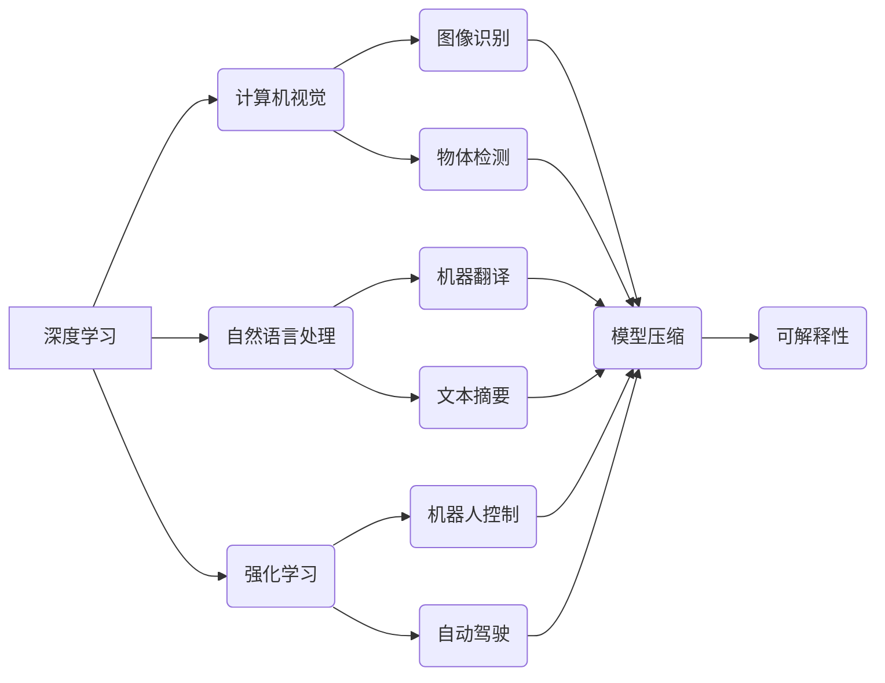

## Andrej Karpathy：人工智能的未来发展方向

> 关键词：人工智能、深度学习、计算机视觉、自然语言处理、强化学习、模型压缩、可解释性

### 1. 背景介绍

人工智能（AI）正以惊人的速度发展，深刻地改变着我们生活和工作的方式。作为AI领域的领军人物之一，Andrej Karpathy 在深度学习、计算机视觉和自然语言处理等领域做出了杰出的贡献。他的研究成果和洞察力为我们理解AI的未来发展方向提供了宝贵的指引。

### 2. 核心概念与联系

**2.1 深度学习**

深度学习是机器学习的一个子领域，它利用多层神经网络来模拟人类大脑的学习过程。通过学习大量的训练数据，深度学习模型能够自动提取特征，并进行复杂的模式识别和预测。

**2.2 计算机视觉**

计算机视觉是让计算机“看”和理解图像和视频的技术。深度学习在计算机视觉领域取得了突破性的进展，例如图像识别、物体检测、图像分割和视频分析等。

**2.3 自然语言处理**

自然语言处理（NLP）是让计算机理解和处理人类语言的技术。深度学习在NLP领域也取得了显著的成果，例如机器翻译、文本摘要、情感分析和对话系统等。

**2.4 强化学习**

强化学习是一种机器学习方法，它通过奖励和惩罚机制来训练智能体，使其在特定环境中做出最优决策。强化学习在机器人控制、游戏 AI 和自动驾驶等领域具有广泛的应用前景。

**2.5 模型压缩**

随着深度学习模型规模的不断增长，模型部署和推理效率成为一个关键问题。模型压缩技术旨在减小模型大小和计算复杂度，使其能够在资源受限的设备上运行。

**2.6 可解释性**

深度学习模型的决策过程通常是不可解释的，这使得其应用在一些安全关键领域受到限制。可解释性研究旨在提高深度学习模型的透明度和可理解性，使其决策过程更加可信和可控。

**核心概念与联系流程图**



### 3. 核心算法原理 & 具体操作步骤

**3.1 算法原理概述**

深度学习算法的核心是多层神经网络。神经网络由许多相互连接的神经元组成，每个神经元接收输入信号，对其进行处理，并输出信号。通过调整神经元之间的连接权重，神经网络能够学习复杂的模式和关系。

**3.2 算法步骤详解**

1. **数据预处理:** 将原始数据转换为深度学习模型可以理解的格式。
2. **网络结构设计:** 根据任务需求设计神经网络的结构，包括层数、神经元数量和激活函数等。
3. **参数初始化:** 为神经网络的参数（连接权重）赋予初始值。
4. **前向传播:** 将输入数据通过神经网络传递，计算输出结果。
5. **损失函数计算:** 计算模型输出与真实值的差异，即损失值。
6. **反向传播:** 根据损失值，调整神经网络的参数，使其能够更好地预测真实值。
7. **优化算法:** 使用优化算法（例如梯度下降）来更新神经网络的参数。
8. **模型评估:** 使用测试数据评估模型的性能。
9. **模型调优:** 根据评估结果，调整网络结构、参数或训练策略，以提高模型性能。

**3.3 算法优缺点**

**优点:**

* 能够自动提取特征，无需人工特征工程。
* 能够处理大规模数据，学习复杂的模式。
* 在图像识别、自然语言处理等领域取得了突破性进展。

**缺点:**

* 需要大量的训练数据。
* 训练过程耗时且计算资源消耗大。
* 模型的决策过程通常是不可解释的。

**3.4 算法应用领域**

* 计算机视觉：图像识别、物体检测、图像分割、视频分析
* 自然语言处理：机器翻译、文本摘要、情感分析、对话系统
* 强化学习：机器人控制、游戏 AI、自动驾驶
* 其他领域：医疗诊断、金融预测、推荐系统

### 4. 数学模型和公式 & 详细讲解 & 举例说明

**4.1 数学模型构建**

深度学习模型通常基于神经网络，其数学模型可以表示为一系列的矩阵运算和激活函数。

**4.2 公式推导过程**

深度学习模型的训练过程基于梯度下降算法，其核心公式为：

$$
\theta = \theta - \alpha \nabla L(\theta)
$$

其中：

* $\theta$ 是模型参数
* $\alpha$ 是学习率
* $L(\theta)$ 是损失函数

梯度 $\nabla L(\theta)$ 表示损失函数对参数 $\theta$ 的偏导数，它指示了参数更新的方向。

**4.3 案例分析与讲解**

以图像识别为例，深度学习模型会将图像转换为特征向量，然后通过分类器将特征向量映射到不同的类别。

假设模型输出的概率分布为 $p(y|x)$，其中 $y$ 是图像类别，$x$ 是图像特征向量。损失函数通常采用交叉熵损失，其公式为：

$$
L(y, p(y|x)) = - \sum_{i} y_i \log p(y_i|x)
$$

其中 $y_i$ 是真实类别标签，$p(y_i|x)$ 是模型预测的类别概率。

通过反向传播算法，可以计算损失函数对模型参数的梯度，并根据梯度更新参数，从而提高模型的识别精度。

### 5. 项目实践：代码实例和详细解释说明

**5.1 开发环境搭建**

使用 Python 作为编程语言，并安装深度学习框架 TensorFlow 或 PyTorch。

**5.2 源代码详细实现**

以下是一个简单的图像分类示例代码，使用 TensorFlow 实现：

```python
import tensorflow as tf

# 定义模型结构
model = tf.keras.models.Sequential([
  tf.keras.layers.Conv2D(32, (3, 3), activation='relu', input_shape=(28, 28, 1)),
  tf.keras.layers.MaxPooling2D((2, 2)),
  tf.keras.layers.Conv2D(64, (3, 3), activation='relu'),
  tf.keras.layers.MaxPooling2D((2, 2)),
  tf.keras.layers.Flatten(),
  tf.keras.layers.Dense(10, activation='softmax')
])

# 编译模型
model.compile(optimizer='adam',
              loss='sparse_categorical_crossentropy',
              metrics=['accuracy'])

# 加载 MNIST 数据集
(x_train, y_train), (x_test, y_test) = tf.keras.datasets.mnist.load_data()

# 训练模型
model.fit(x_train, y_train, epochs=5)

# 评估模型
loss, accuracy = model.evaluate(x_test, y_test)
print('Test loss:', loss)
print('Test accuracy:', accuracy)
```

**5.3 代码解读与分析**

代码首先定义了一个简单的卷积神经网络模型，包含两个卷积层、两个最大池化层、一个全连接层和一个 softmax 输出层。然后，模型使用 Adam 优化器、交叉熵损失函数和准确率指标进行编译。

接着，代码加载 MNIST 手写数字数据集，并使用模型训练 5 个 epochs。最后，代码评估模型在测试集上的性能。

**5.4 运行结果展示**

运行代码后，会输出测试集上的损失值和准确率。

### 6. 实际应用场景

**6.1 计算机视觉**

* **图像识别:** 自动识别图像中的物体、场景和人物。
* **物体检测:** 在图像中定位和识别多个物体。
* **图像分割:** 将图像分割成不同的区域，例如分割出前景和背景。
* **视频分析:** 分析视频内容，例如检测运动、识别行为和跟踪物体。

**6.2 自然语言处理**

* **机器翻译:** 将文本从一种语言翻译成另一种语言。
* **文本摘要:** 自动生成文本的简短摘要。
* **情感分析:** 分析文本的情感倾向，例如判断文本是积极的、消极的还是中性的。
* **对话系统:** 创建能够与人类进行自然对话的聊天机器人。

**6.3 强化学习**

* **机器人控制:** 训练机器人执行复杂的任务，例如导航、抓取和操作物体。
* **游戏 AI:** 创建能够玩游戏并与人类竞争的 AI 玩家。
* **自动驾驶:** 训练自动驾驶汽车感知周围环境并做出安全驾驶决策。

**6.4 未来应用展望**

* **医疗诊断:** 利用 AI 辅助医生诊断疾病，提高诊断准确率。
* **金融预测:** 利用 AI 分析金融数据，预测市场趋势和风险。
* **个性化教育:** 利用 AI 提供个性化的学习方案，提高学习效率。
* **科学发现:** 利用 AI 分析大规模数据，加速科学发现。

### 7. 工具和资源推荐

**7.1 学习资源推荐**

* **书籍:**
    * Deep Learning by Ian Goodfellow, Yoshua Bengio, and Aaron Courville
    * Hands-On Machine Learning with Scikit-Learn, Keras & TensorFlow by Aurélien Géron
* **在线课程:**
    * Deep Learning Specialization by Andrew Ng (Coursera)
    * Fast.ai
* **博客和网站:**
    * Andrej Karpathy's Blog
    * OpenAI Blog
    * Towards Data Science

**7.2 开发工具推荐**

* **深度学习框架:** TensorFlow, PyTorch, Keras
* **编程语言:** Python
* **数据处理工具:** Pandas, NumPy
* **可视化工具:** Matplotlib, Seaborn

**7.3 相关论文推荐**

* AlexNet: ImageNet Classification with Deep Convolutional Neural Networks
* ImageNet Classification with Deep Convolutional Neural Networks
* Sequence to Sequence Learning with Neural Networks

### 8. 总结：未来发展趋势与挑战

**8.1 研究成果总结**

近年来，深度学习取得了令人瞩目的进展，在计算机视觉、自然语言处理等领域取得了突破性成果。

**8.2 未来发展趋势**

* **模型规模和效率:** 探索更大型、更有效的深度学习模型，以提高模型性能和降低计算成本。
* **可解释性:** 研究深度学习模型的决策过程，提高模型的透明度和可理解性。
* **安全性和鲁棒性:** 提高深度学习模型的安全性，使其能够抵抗攻击和对抗样本。
* **跨模态学习:** 研究跨越不同模态（例如文本、图像、音频）的深度学习模型，以更好地理解和交互世界。

**8.3 面临的挑战**

* **数据获取和标注:** 深度学习模型需要大量的训练数据，数据获取和标注成本高昂。
* **计算资源:** 训练大型深度学习模型需要大量的计算资源，这对于资源有限的机构和个人来说是一个挑战。
* **伦理问题:** 深度学习技术的应用可能引发伦理问题，例如算法偏见、隐私泄露和工作岗位替代。

**8.4 研究展望**

未来，深度学习研究将继续朝着更智能、更安全、更可解释的方向发展。


### 9. 附录：常见问题与解答

**9.1 什么是深度学习？**

深度学习是一种机器学习方法，它利用多层神经网络来模拟人类大脑的学习过程。

**9.2 深度学习有哪些应用