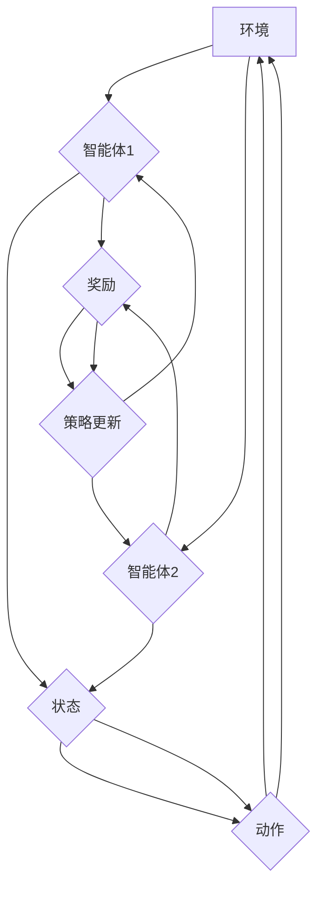

## 一切皆是映射：多智能体DQN：原理、挑战与协同机制

> 关键词：多智能体强化学习，DQN，协同机制，深度神经网络，环境交互，策略更新

### 1. 背景介绍

在人工智能领域，强化学习 (Reinforcement Learning, RL) 作为一种模仿人类学习的算法，在解决复杂决策问题方面展现出强大的潜力。传统的强化学习方法主要集中在单智能体学习场景，即只有一个智能体与环境交互，并通过奖励信号不断优化其策略。然而，现实世界中充满了多智能体交互的复杂场景，例如无人驾驶、机器人协作、游戏AI等。

多智能体强化学习 (Multi-Agent Reinforcement Learning, MARL) 旨在解决多个智能体共同学习、协作完成任务的问题。与单智能体强化学习相比，MARL面临着更大的挑战：

* **非独立性:** 多个智能体的行动会相互影响，导致环境状态的演变更加复杂。
* **协调性:** 多个智能体需要协同合作，共同完成任务，需要设计有效的通信和决策机制。
* **学习效率:** 在复杂的多智能体环境中，学习效率往往会降低，需要探索更有效的学习算法。

### 2. 核心概念与联系

多智能体DQN (Multi-Agent Deep Q-Network) 是一种基于深度神经网络的MARL算法，它将DQN算法扩展到多智能体场景。

**核心概念:**

* **智能体 (Agent):**  独立的决策主体，可以感知环境并采取行动。
* **环境 (Environment):** 智能体与之交互的外部世界，会根据智能体的行动产生新的状态和奖励。
* **状态 (State):** 环境的当前描述，包含所有相关信息。
* **动作 (Action):** 智能体可以采取的行动，会改变环境状态。
* **奖励 (Reward):** 环境给予智能体的反馈信号，用于评估智能体的行为。
* **策略 (Policy):** 智能体根据当前状态选择动作的规则。
* **价值函数 (Value Function):**  评估智能体在特定状态下采取特定动作的长期回报。

**架构图:**



### 3. 核心算法原理 & 具体操作步骤

#### 3.1 算法原理概述

多智能体DQN算法的核心思想是利用深度神经网络来学习每个智能体的价值函数，并根据价值函数更新其策略。

* **价值函数估计:**  每个智能体都拥有一个独立的深度神经网络，用于估计其在当前状态下采取不同动作的未来回报。
* **策略更新:**  根据价值函数的估计结果，每个智能体会选择最大化未来回报的动作，并更新其策略。
* **经验回放:**  为了提高学习效率，多智能体DQN算法使用经验回放机制，将过去的经验存储在经验池中，并随机采样经验进行训练。

#### 3.2 算法步骤详解

1. **初始化:**  每个智能体初始化其价值函数网络，并设置学习参数。
2. **环境交互:**  每个智能体与环境交互，感知环境状态并采取动作。
3. **奖励获取:**  环境根据智能体的动作产生新的状态和奖励。
4. **经验存储:**  将当前状态、动作、奖励和下一个状态存储在经验池中。
5. **经验回放:**  从经验池中随机采样经验进行训练。
6. **价值函数更新:**  利用采样的经验，更新每个智能体的价值函数网络。
7. **策略更新:**  根据更新后的价值函数网络，每个智能体更新其策略，选择最大化未来回报的动作。
8. **重复步骤2-7:**  重复以上步骤，直到达到预设的训练目标。

#### 3.3 算法优缺点

**优点:**

* **能够解决复杂的多智能体问题:**  深度神经网络可以学习复杂的决策策略，适用于各种多智能体场景。
* **学习效率高:**  经验回放机制可以提高学习效率，加速训练过程。
* **可扩展性强:**  多智能体DQN算法可以扩展到多个智能体场景。

**缺点:**

* **训练复杂:**  多智能体DQN算法的训练过程相对复杂，需要大量的计算资源和时间。
* **探索与利用的平衡:**  在多智能体场景中，需要平衡探索新策略和利用已知策略，这对于算法的性能至关重要。
* **通信机制:**  在需要协作的场景中，需要设计有效的通信机制，使智能体能够共享信息并协调行动。

#### 3.4 算法应用领域

多智能体DQN算法在以下领域具有广泛的应用前景:

* **无人驾驶:**  多个无人驾驶汽车协同行驶，避障、路径规划等。
* **机器人协作:**  多个机器人协同完成任务，例如搬运、组装等。
* **游戏AI:**  多个游戏角色协同作战，提高游戏体验。
* **金融交易:**  多个交易策略协同决策，优化投资组合。

### 4. 数学模型和公式 & 详细讲解 & 举例说明

#### 4.1 数学模型构建

多智能体DQN算法的核心是价值函数估计。每个智能体 i 的价值函数 V_i(s_t, a_t) 表示在时间步 t，状态 s_t 下采取动作 a_t 的未来回报。

#### 4.2 公式推导过程

价值函数可以使用深度神经网络进行估计。假设每个智能体 i 的价值函数网络为 Q_i(s_t, a_t)，则 Q_i(s_t, a_t) 可以表示为:

$$Q_i(s_t, a_t) = \omega_i^T \phi(s_t, a_t)$$

其中:

* $\omega_i$ 是价值函数网络的参数向量。
* $\phi(s_t, a_t)$ 是状态 s_t 和动作 a_t 的特征向量。

价值函数网络的训练目标是最小化以下损失函数:

$$L_i = \mathbb{E}_{s_t, a_t, r_t, s_{t+1}}[(r_t + \gamma \max_{a_{t+1}} Q_i(s_{t+1}, a_{t+1})) - Q_i(s_t, a_t)]^2$$

其中:

* $\gamma$ 是折扣因子，控制未来回报的权重。
* $r_t$ 是在时间步 t 获得的奖励。
* $s_{t+1}$ 是时间步 t+1 的状态。

#### 4.3 案例分析与讲解

假设有两个智能体在玩一个简单的游戏，每个智能体可以采取向上、向下、向左、向右四个动作。

* 智能体 1 的价值函数网络估计在当前状态下采取向上动作的未来回报为 10，采取向下动作的未来回报为 5，采取向左动作的未来回报为 8，采取向右动作的未来回报为 7。
* 智能体 2 的价值函数网络估计在当前状态下采取向上动作的未来回报为 7，采取向下动作的未来回报为 9，采取向左动作的未来回报为 6，采取向右动作的未来回报为 8。

根据价值函数网络的估计结果，智能体 1 会选择采取向上动作，智能体 2 会选择采取向下动作。

### 5. 项目实践：代码实例和详细解释说明

#### 5.1 开发环境搭建

* Python 3.6+
* TensorFlow/PyTorch
* OpenAI Gym

#### 5.2 源代码详细实现

```python
import gym
import numpy as np
import tensorflow as tf

# 定义智能体类
class Agent:
    def __init__(self, state_size, action_size):
        self.state_size = state_size
        self.action_size = action_size
        self.model = self.build_model()

    def build_model(self):
        # 定义价值函数网络模型
        model = tf.keras.Sequential([
            tf.keras.layers.Dense(64, activation='relu', input_shape=(self.state_size,)),
            tf.keras.layers.Dense(64, activation='relu'),
            tf.keras.layers.Dense(self.action_size)
        ])
        return model

    def choose_action(self, state):
        # 根据当前状态选择动作
        state = np.expand_dims(state, axis=0)
        q_values = self.model.predict(state)
        return np.argmax(q_values[0])

    def update_model(self, state, action, reward, next_state):
        # 更新价值函数网络模型
        with tf.GradientTape() as tape:
            target_q_value = reward + 0.99 * np.max(self.model.predict(next_state))
            q_value = self.model.predict(state)[0][action]
            loss = tf.keras.losses.MSE(target_q_value, q_value)
        gradients = tape.gradient(loss, self.model.trainable_variables)
        optimizer.apply_gradients(zip(gradients, self.model.trainable_variables))

# 创建环境
env = gym.make('CartPole-v1')

# 创建智能体
agent = Agent(state_size=env.observation_space.shape[0], action_size=env.action_space.n)

# 训练智能体
for episode in range(1000):
    state = env.reset()
    done = False
    total_reward = 0
    while not done:
        action = agent.choose_action(state)
        next_state, reward, done, _ = env.step(action)
        agent.update_model(state, action, reward, next_state)
        state = next_state
        total_reward += reward
    print(f'Episode {episode+1}: Total Reward = {total_reward}')

# 测试智能体
state = env.reset()
while True:
    env.render()
    action = agent.choose_action(state)
    next_state, reward, done, _ = env.step(action)
    state = next_state
    if done:
        break
env.close()
```

#### 5.3 代码解读与分析

* **智能体类:**  定义了智能体的基本结构，包括状态大小、动作大小、价值函数网络模型、动作选择方法和模型更新方法。
* **价值函数网络模型:**  使用深度神经网络来估计价值函数，包含多个全连接层和激活函数。
* **动作选择方法:**  根据价值函数网络的估计结果，选择最大化未来回报的动作。
* **模型更新方法:**  使用梯度下降算法更新价值函数网络模型的参数。
* **训练循环:**  重复执行环境交互、动作选择、奖励获取和模型更新步骤，直到达到训练目标。
* **测试循环:**  使用训练好的智能体与环境交互，并渲染环境状态。

#### 5.4 运行结果展示

运行代码后，会看到智能体在CartPole环境中学习并逐渐掌握平衡杆的行为。

### 6. 实际应用场景

多智能体DQN算法在以下实际应用场景中展现出巨大的潜力:

* **无人驾驶:**  多个无人驾驶汽车协同行驶，避障、路径规划、交通流量控制等。
* **机器人协作:**  多个机器人协同完成任务，例如搬运、组装、探索等。
* **游戏AI:**  多个游戏角色协同作战，提高游戏体验，例如策略游戏、多人在线游戏等