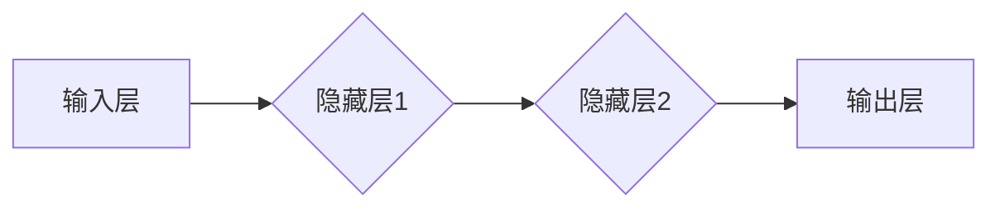

## 一切皆是映射：深度学习中的前向传播算法

> 关键词：深度学习、前向传播、神经网络、激活函数、损失函数、梯度下降

### 1. 背景介绍

深度学习作为机器学习领域的一颗璀璨明珠，近年来在图像识别、自然语言处理、语音识别等领域取得了令人瞩目的成就。其核心在于模仿人类大脑神经网络的结构和功能，通过多层神经元网络进行特征提取和学习，从而实现对复杂数据的理解和预测。而前向传播算法作为深度学习的基础，是神经网络训练的核心环节之一。

传统的机器学习算法往往需要人工提取特征，而深度学习则能够自动学习特征，这使得其在处理复杂数据时具有更强的能力。然而，深度学习模型的训练过程也更加复杂，需要大量的训练数据和计算资源。前向传播算法正是深度学习模型训练中不可或缺的一部分，它负责将输入数据传递到网络的输出层，并计算输出结果与真实值的误差。

### 2. 核心概念与联系

前向传播算法的核心在于将输入数据通过一系列神经元层进行逐层传递，并不断进行计算和激活，最终得到输出结果。

**2.1 神经网络结构**

神经网络由多个神经元层组成，每一层都包含多个神经元。输入层接收原始数据，输出层输出最终结果，中间层负责对数据进行特征提取和学习。

**2.2 激活函数**

激活函数是神经网络中一个重要的组成部分，它决定了神经元的输出是否被激活。常见的激活函数包括 sigmoid 函数、ReLU 函数、tanh 函数等。激活函数的作用是引入非线性，使得神经网络能够学习更复杂的映射关系。

**2.3 权重和偏置**

每个神经元都与其他神经元连接，连接之间都有一个权重，权重决定了信号的强度。偏置则是每个神经元的阈值，它决定了神经元是否被激活。

**2.4 前向传播流程**

前向传播流程如下：

1. 将输入数据传递到输入层。
2. 每个神经元接收来自前一层神经元的输入信号，并根据权重和偏置进行计算。
3. 将计算结果通过激活函数进行处理，得到神经元的输出信号。
4. 将神经元的输出信号传递到下一层神经元。
5. 重复步骤 2-4，直到输出层。
6. 将输出层的输出结果作为最终结果。

**2.5 Mermaid 流程图**



### 3. 核心算法原理 & 具体操作步骤

**3.1 算法原理概述**

前向传播算法的核心原理是通过一系列线性变换和非线性激活函数，将输入数据映射到输出结果。

**3.2 算法步骤详解**

1. **初始化权重和偏置:** 在训练开始之前，需要对神经网络中的权重和偏置进行随机初始化。
2. **输入数据:** 将输入数据传递到输入层。
3. **前向传播:** 将输入数据逐层传递到网络的输出层，并计算每个神经元的输出值。
4. **计算损失函数:** 将输出结果与真实值进行比较，计算损失函数的值。损失函数衡量了模型预测结果与真实值的差距。
5. **反向传播:** 将损失函数的梯度反向传播到网络的各个层，更新权重和偏置的值。

**3.3 算法优缺点**

**优点:**

* 算法简单易懂，易于实现。
* 训练速度相对较快。

**缺点:**

* 容易陷入局部最优解。
* 对初始权重和偏置的敏感性较高。

**3.4 算法应用领域**

前向传播算法广泛应用于各种深度学习领域，例如：

* **图像识别:** 用于识别图像中的物体、场景和人脸。
* **自然语言处理:** 用于文本分类、情感分析、机器翻译等任务。
* **语音识别:** 用于将语音转换为文本。
* **推荐系统:** 用于推荐用户感兴趣的内容。

### 4. 数学模型和公式 & 详细讲解 & 举例说明

**4.1 数学模型构建**

神经网络可以看作是一个多层感知机，每个神经元接收来自前一层神经元的输入信号，并通过一个线性变换和一个激活函数进行处理。

**4.2 公式推导过程**

假设一个神经网络包含输入层、隐藏层和输出层，隐藏层包含多个神经元。

* **线性变换:** 每个神经元接收来自前一层神经元的输入信号，并通过一个权重矩阵进行线性变换。

$$z_j = \sum_{i=1}^{n} w_{ji}x_i + b_j$$

其中：

* $z_j$ 是第 $j$ 个神经元的输入值。
* $w_{ji}$ 是第 $i$ 个输入神经元到第 $j$ 个隐藏神经元的权重。
* $x_i$ 是第 $i$ 个输入神经元的输出值。
* $b_j$ 是第 $j$ 个隐藏神经元的偏置。

* **激活函数:** 将线性变换后的值通过一个激活函数进行处理，得到神经元的输出值。

$$a_j = f(z_j)$$

其中：

* $a_j$ 是第 $j$ 个隐藏神经元的输出值。
* $f(z_j)$ 是激活函数。

**4.3 案例分析与讲解**

假设一个简单的神经网络用于分类手写数字，输入层包含 784 个神经元，隐藏层包含 128 个神经元，输出层包含 10 个神经元。

* 输入层接收一张手写数字的图像数据，每个神经元代表图像像素的值。
* 隐藏层通过线性变换和激活函数对图像数据进行特征提取。
* 输出层将隐藏层的输出值映射到 10 个类别，每个类别代表一个数字。

通过训练数据，神经网络可以学习到将图像数据映射到数字类别的映射关系。

### 5. 项目实践：代码实例和详细解释说明

**5.1 开发环境搭建**

使用 Python 语言和 TensorFlow 或 PyTorch 等深度学习框架进行开发。

**5.2 源代码详细实现**

```python
import tensorflow as tf

# 定义模型结构
model = tf.keras.models.Sequential([
    tf.keras.layers.Flatten(input_shape=(28, 28)),
    tf.keras.layers.Dense(128, activation='relu'),
    tf.keras.layers.Dense(10, activation='softmax')
])

# 编译模型
model.compile(optimizer='adam',
              loss='sparse_categorical_crossentropy',
              metrics=['accuracy'])

# 训练模型
model.fit(x_train, y_train, epochs=10)

# 评估模型
loss, accuracy = model.evaluate(x_test, y_test)
print('Test loss:', loss)
print('Test accuracy:', accuracy)
```

**5.3 代码解读与分析**

* `tf.keras.models.Sequential` 创建一个顺序模型，神经层按顺序连接。
* `tf.keras.layers.Flatten` 将输入数据扁平化，以便输入到隐藏层。
* `tf.keras.layers.Dense` 定义全连接层，每个神经元与前一层所有神经元连接。
* `activation='relu'` 使用 ReLU 激活函数。
* `optimizer='adam'` 使用 Adam 优化器更新权重和偏置。
* `loss='sparse_categorical_crossentropy'` 使用稀疏类别交叉熵损失函数。
* `metrics=['accuracy']` 使用准确率作为评估指标。

**5.4 运行结果展示**

训练完成后，模型可以用于预测新的手写数字。

### 6. 实际应用场景

前向传播算法在深度学习领域有着广泛的应用场景，例如：

* **图像识别:** 用于识别图像中的物体、场景和人脸。
* **自然语言处理:** 用于文本分类、情感分析、机器翻译等任务。
* **语音识别:** 用于将语音转换为文本。
* **推荐系统:** 用于推荐用户感兴趣的内容。

**6.4 未来应用展望**

随着深度学习技术的不断发展，前向传播算法的应用场景将会更加广泛，例如：

* **自动驾驶:** 用于识别道路场景、车辆和行人。
* **医疗诊断:** 用于辅助医生诊断疾病。
* **药物研发:** 用于预测药物的有效性和安全性。

### 7. 工具和资源推荐

**7.1 学习资源推荐**

* **书籍:**
    * 深度学习
    * 构建深度神经网络
* **在线课程:**
    * Coursera 深度学习课程
    * Udacity 深度学习工程师 Nanodegree

**7.2 开发工具推荐**

* **TensorFlow:** 开源深度学习框架
* **PyTorch:** 开源深度学习框架
* **Keras:** 高级深度学习API

**7.3 相关论文推荐**

* **AlexNet: ImageNet Classification with Deep Convolutional Neural Networks**
* **Deep Residual Learning for Image Recognition**
* **Attention Is All You Need**

### 8. 总结：未来发展趋势与挑战

**8.1 研究成果总结**

前向传播算法作为深度学习的基础，取得了显著的成果，在图像识别、自然语言处理等领域取得了突破性的进展。

**8.2 未来发展趋势**

* **模型效率:** 研究更高效的深度学习模型，减少计算资源消耗。
* **模型解释性:** 研究更可解释的深度学习模型，提高模型的透明度和可信度。
* **数据效率:** 研究更有效的训练方法，减少训练数据需求。

**8.3 面临的挑战**

* **数据获取:** 深度学习模型需要大量的训练数据，数据获取成本较高。
* **计算资源:** 训练大型深度学习模型需要大量的计算资源，成本较高。
* **模型泛化能力:** 深度学习模型容易过拟合，泛化能力不足。

**8.4 研究展望**

未来，前向传播算法将会继续发展，并与其他人工智能技术相结合，推动人工智能技术的进步。


### 9. 附录：常见问题与解答

**9.1 什么是激活函数？**

激活函数是神经网络中一个重要的组成部分，它决定了神经元的输出是否被激活。常见的激活函数包括 sigmoid 函数、ReLU 函数、tanh 函数等。

**9.2 为什么需要使用激活函数？**

激活函数引入非线性，使得神经网络能够学习更复杂的映射关系。

**9.3 如何选择合适的激活函数？**

不同的激活函数适用于不同的任务，需要根据具体情况选择。

**9.4 如何训练深度学习模型？**

深度学习模型的训练过程包括以下步骤：

1. 初始化权重和偏置。
2. 将输入数据传递到网络。
3. 计算损失函数的值。
4. 反向传播梯度，更新权重和偏置。
5. 重复步骤 2-4，直到模型收敛。


作者：禅与计算机程序设计艺术 / Zen and the Art of Computer Programming 
