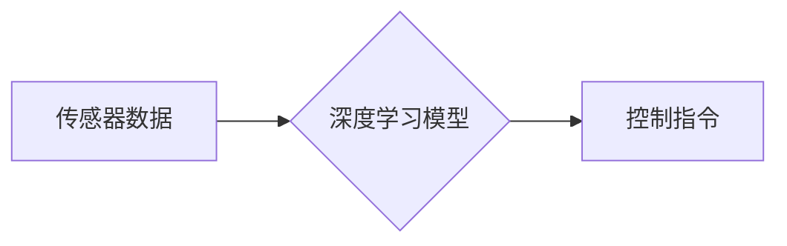

##  业内对端到端自动驾驶前景的分歧观点

> 关键词：端到端自动驾驶、深度学习、计算机视觉、传感器融合、安全可靠性、伦理问题、未来发展趋势

## 1. 背景介绍

自动驾驶技术近年来发展迅速，已成为智能交通领域的核心技术之一。传统的自动驾驶系统通常采用规则-基于的控制方法，需要大量的专家知识和手工标注数据进行开发和维护。而端到端自动驾驶，也称为深度学习自动驾驶，则利用深度学习算法直接从传感器数据中学习驾驶策略，无需人工设计复杂的规则，具有更高的学习能力和适应性。

端到端自动驾驶的核心思想是将驾驶任务作为一个整体，通过深度神经网络直接将传感器数据映射到控制指令，实现从感知到决策再到控制的全流程自动化。这种方法简化了系统设计，提高了开发效率，并能够更好地应对复杂和动态的驾驶场景。

## 2. 核心概念与联系

**2.1 核心概念**

* **端到端学习 (End-to-End Learning):**  一种机器学习方法，直接将输入数据映射到输出结果，无需人工设计中间特征提取步骤。
* **深度学习 (Deep Learning):**  一种基于多层神经网络的机器学习方法，能够学习复杂的数据表示和模式。
* **传感器融合 (Sensor Fusion):**  将来自不同传感器（如摄像头、雷达、激光雷达）的数据进行整合，提高感知精度和鲁棒性。
* **计算机视觉 (Computer Vision):**  利用计算机技术模拟人类视觉系统，从图像和视频中提取信息。

**2.2 架构图**



**2.3 联系**

端到端自动驾驶系统将深度学习、传感器融合和计算机视觉等技术有机结合，实现从感知到决策再到控制的全流程自动化。

## 3. 核心算法原理 & 具体操作步骤

**3.1 算法原理概述**

端到端自动驾驶的核心算法是深度神经网络，通常采用卷积神经网络 (CNN) 和循环神经网络 (RNN) 的组合结构。CNN 用于处理图像和视频数据，提取特征信息；RNN 用于处理时间序列数据，例如车辆速度和方向变化，预测未来驾驶场景。

**3.2 算法步骤详解**

1. **数据采集和预处理:** 收集来自各种传感器的数据，并进行预处理，例如图像增强、数据归一化等。
2. **模型训练:** 使用深度学习算法训练神经网络模型，将预处理后的数据作为输入，控制指令作为输出。训练过程中，使用损失函数评估模型性能，并通过反向传播算法更新模型参数。
3. **模型评估:** 在测试数据集上评估模型性能，例如准确率、召回率、平均位移误差等。
4. **模型部署:** 将训练好的模型部署到自动驾驶系统中，用于实时感知、决策和控制。

**3.3 算法优缺点**

**优点:**

* 学习能力强，能够从大量数据中学习复杂的驾驶策略。
* 适应性强，能够应对复杂和动态的驾驶场景。
* 系统设计简化，开发效率提高。

**缺点:**

* 数据需求量大，需要大量的标注数据进行训练。
* 训练时间长，需要强大的计算资源。
* 可解释性差，难以理解模型决策过程。

**3.4 算法应用领域**

端到端自动驾驶算法广泛应用于自动驾驶汽车、无人机、机器人等领域。

## 4. 数学模型和公式 & 详细讲解 & 举例说明

**4.1 数学模型构建**

端到端自动驾驶系统可以看作是一个从输入到输出的映射关系，可以使用数学函数来表示。

假设输入数据为 $X = \{x_1, x_2,..., x_n\}$, 输出控制指令为 $Y = \{y_1, y_2,..., y_m\}$, 则可以使用神经网络函数 $f$ 来表示映射关系：

$$Y = f(X)$$

其中，$f$ 是一个多层神经网络，包含多个隐藏层和输出层。

**4.2 公式推导过程**

神经网络的训练过程是通过最小化损失函数来实现的。损失函数 $L$ 通常定义为预测值与真实值的差值，例如均方误差 (MSE)。

$$L(Y, \hat{Y}) = \frac{1}{m} \sum_{i=1}^{m} (y_i - \hat{y}_i)^2$$

其中，$\hat{Y}$ 是模型预测的输出值。

通过反向传播算法，可以计算出每个神经元的梯度，并根据梯度更新神经网络参数。

**4.3 案例分析与讲解**

例如，在自动驾驶汽车中，输入数据可以包括摄像头、雷达和激光雷达的传感器数据，输出控制指令可以包括车辆的加速度、转向角和制动力。

通过训练深度神经网络模型，可以学习到从传感器数据到控制指令的映射关系，从而实现自动驾驶汽车的自主行驶。

## 5. 项目实践：代码实例和详细解释说明

**5.1 开发环境搭建**

* 操作系统：Ubuntu 20.04
* 深度学习框架：TensorFlow 2.x
* 编程语言：Python 3.7

**5.2 源代码详细实现**

```python
import tensorflow as tf

# 定义神经网络模型
model = tf.keras.models.Sequential([
    tf.keras.layers.Conv2D(32, (3, 3), activation='relu', input_shape=(64, 64, 3)),
    tf.keras.layers.MaxPooling2D((2, 2)),
    tf.keras.layers.Conv2D(64, (3, 3), activation='relu'),
    tf.keras.layers.MaxPooling2D((2, 2)),
    tf.keras.layers.Flatten(),
    tf.keras.layers.Dense(10, activation='softmax')
])

# 编译模型
model.compile(optimizer='adam',
              loss='sparse_categorical_crossentropy',
              metrics=['accuracy'])

# 训练模型
model.fit(x_train, y_train, epochs=10)

# 评估模型
loss, accuracy = model.evaluate(x_test, y_test)
print('Loss:', loss)
print('Accuracy:', accuracy)
```

**5.3 代码解读与分析**

这段代码定义了一个简单的卷积神经网络模型，用于图像分类任务。

* `tf.keras.models.Sequential` 创建了一个顺序模型，将层级依次连接。
* `tf.keras.layers.Conv2D` 定义了一个卷积层，用于提取图像特征。
* `tf.keras.layers.MaxPooling2D` 定义了一个最大池化层，用于降低特征图尺寸。
* `tf.keras.layers.Flatten` 将多维特征图转换为一维向量。
* `tf.keras.layers.Dense` 定义了一个全连接层，用于分类。
* `model.compile` 编译模型，指定优化器、损失函数和评价指标。
* `model.fit` 训练模型，使用训练数据进行训练。
* `model.evaluate` 评估模型，使用测试数据计算损失和准确率。

**5.4 运行结果展示**

训练完成后，可以将模型部署到自动驾驶系统中，用于实时感知和决策。

## 6. 实际应用场景

**6.1 自动驾驶汽车**

端到端自动驾驶算法已在自动驾驶汽车的研发中得到广泛应用。例如，特斯拉 Autopilot 系统就采用了端到端学习方法，能够实现自动驾驶、自动泊车等功能。

**6.2 无人机**

端到端自动驾驶算法也应用于无人机的自主飞行控制。例如，使用深度学习算法可以训练无人机识别障碍物、避开障碍物、自动导航等。

**6.3 机器人**

端到端自动驾驶算法可以用于机器人自主导航和路径规划。例如，使用深度学习算法可以训练机器人识别环境、规划路径、避开障碍物等。

**6.4 未来应用展望**

随着深度学习技术的不断发展，端到端自动驾驶算法将在更多领域得到应用，例如智能交通、物流配送、农业机械化等。

## 7. 工具和资源推荐

**7.1 学习资源推荐**

* **书籍:**
    * Deep Learning by Ian Goodfellow, Yoshua Bengio, and Aaron Courville
    * Hands-On Machine Learning with Scikit-Learn, Keras & TensorFlow by Aurélien Géron
* **在线课程:**
    * TensorFlow Tutorials: https://www.tensorflow.org/tutorials
    * Deep Learning Specialization by Andrew Ng: https://www.deeplearning.ai/

**7.2 开发工具推荐**

* **深度学习框架:** TensorFlow, PyTorch, Keras
* **计算机视觉库:** OpenCV, Pillow
* **数据标注工具:** LabelImg, VGG Image Annotator

**7.3 相关论文推荐**

* End to End Learning for Self-Driving Cars by NVIDIA
* Deep Reinforcement Learning for End-to-End Autonomous Driving by OpenAI
* Learning to Drive in a Simulator by Waymo

## 8. 总结：未来发展趋势与挑战

**8.1 研究成果总结**

端到端自动驾驶技术取得了显著进展，能够实现车辆的自主感知、决策和控制。

**8.2 未来发展趋势**

* **模型复杂度提升:** 采用更复杂的深度学习模型，例如Transformer网络，提高模型的学习能力和鲁棒性。
* **数据规模扩大:** 收集和标注更多的数据，例如真实道路场景数据，提高模型的泛化能力。
* **安全可靠性增强:** 开发更安全的自动驾驶算法，并进行严格的测试和验证，确保自动驾驶系统的安全可靠性。

**8.3 面临的挑战**

* **数据标注成本高:** 自动驾驶数据标注需要大量的人工成本，提高标注效率是未来研究的重要方向。
* **模型可解释性差:** 深度学习模型的决策过程难以理解，如何提高模型的可解释性是未来研究的挑战。
* **安全可靠性问题:** 自动驾驶系统需要能够应对各种复杂和突发情况，确保安全可靠性是未来研究的关键问题。

**8.4 研究展望**

未来，端到端自动驾驶技术将继续发展，并应用于更多领域。研究者将继续探索更先进的算法、更丰富的传感器数据和更严格的安全测试方法，推动自动驾驶技术向更安全、更可靠、更智能的方向发展。

## 9. 附录：常见问题与解答

**9.1 Q: 端到端自动驾驶和传统自动驾驶有什么区别？**

**A:** 端到端自动驾驶采用深度学习算法直接从传感器数据中学习驾驶策略，无需人工设计复杂的规则，而传统自动驾驶则依赖于规则-基于的控制方法，需要大量的专家知识和手工标注数据进行开发和维护。

**9.2 Q: 端到端自动驾驶的安全性如何保证？**

**A:** 端到端自动驾驶系统的安全性是一个重要的研究课题。研究者正在探索多种方法来提高模型的鲁棒性、安全性，例如数据增强、对抗训练、安全验证等。

**9.3 Q: 端到端自动驾驶技术何时能够实现商业化？**

**A:** 端到端自动驾驶技术的商业化时间取决于技术发展、法规政策和社会接受度等多方面因素。目前，部分自动驾驶功能已在一些车型上实现，但完全自动驾驶的商业化还需要一些时间。


作者：禅与计算机程序设计艺术 / Zen and the Art of Computer Programming 
