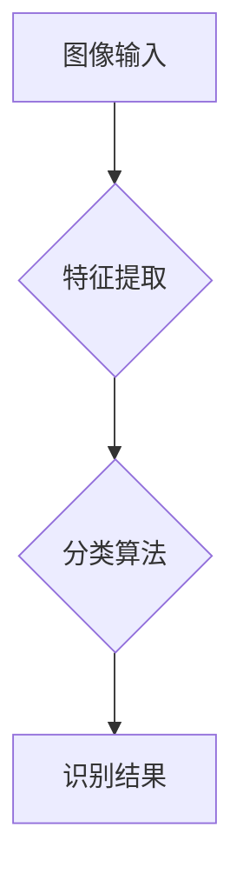

## 从概念到实践：思想的转化

> 关键词：人工智能、算法设计、数学建模、代码实现、实际应用

### 1. 背景介绍

在当今科技飞速发展的时代，人工智能 (AI) 已经成为一个炙手可热的领域，其应用范围从自动驾驶到医疗诊断，从金融预测到自然语言处理，无处不在。然而，将一个AI概念从抽象的思想转化为实际可行的应用，并非易事。它需要跨越多个学科的知识体系，并经历从概念设计到算法实现、数学建模到代码编写、最后到实际应用的多个阶段。

本文将以一个具体的AI案例为切入点，探讨从概念到实践的整个过程，并深入分析每个阶段的关键要素和挑战。通过对算法设计、数学建模、代码实现以及实际应用的详细阐述，希望能为读者提供一个清晰的认知框架，帮助他们更好地理解AI技术的发展和应用。

### 2. 核心概念与联系

**2.1 核心概念**

本文将以**图像识别**作为案例，探讨从概念到实践的转化过程。图像识别是指计算机能够从图像中识别出物体、场景、人物等信息的技术。它涉及到多个核心概念，包括：

* **特征提取:** 从图像中提取具有代表性的特征，例如颜色、纹理、形状等。
* **分类算法:** 根据提取的特征，将图像分类到不同的类别。
* **深度学习:** 利用多层神经网络，自动学习图像特征，实现更准确的识别。

**2.2 核心概念联系**

这些核心概念之间相互关联，共同构成图像识别的完整流程。



**2.3 核心概念原理**

* **特征提取:** 传统的特征提取方法通常依赖于人工设计的特征，例如SIFT、HOG等。而深度学习方法则通过卷积神经网络 (CNN) 自动学习图像特征，能够提取更丰富的和更抽象的特征。
* **分类算法:** 常用的分类算法包括支持向量机 (SVM)、决策树、随机森林等。深度学习方法通常使用全连接神经网络或卷积神经网络作为分类器。
* **深度学习:** 深度学习通过多层神经网络，逐层学习图像特征，最终实现对图像的识别。

### 3. 核心算法原理 & 具体操作步骤

**3.1 算法原理概述**

本文将介绍一种常用的图像识别算法：**卷积神经网络 (CNN)**。CNN 是一种专门设计用于处理图像数据的深度学习算法，其结构灵感来源于生物视觉系统。

CNN 主要由以下几个部分组成：

* **卷积层:** 使用卷积核对图像进行卷积运算，提取图像特征。
* **池化层:** 对卷积层的输出进行下采样，减少计算量和特征维度。
* **全连接层:** 将池化层的输出连接到全连接层，进行分类。

**3.2 算法步骤详解**

1. **数据预处理:** 将图像数据进行尺寸调整、归一化等预处理操作。
2. **卷积层:** 使用多个卷积核对图像进行卷积运算，提取不同尺度和方向的特征。
3. **池化层:** 对卷积层的输出进行最大池化或平均池化，减少特征维度。
4. **激活函数:** 使用激活函数 (例如ReLU) 对卷积层的输出进行非线性变换，提高网络的表达能力。
5. **全连接层:** 将池化层的输出连接到全连接层，进行分类。
6. **损失函数:** 使用损失函数 (例如交叉熵损失) 计算模型预测结果与真实标签之间的误差。
7. **优化算法:** 使用优化算法 (例如梯度下降) 更新模型参数，最小化损失函数。

**3.3 算法优缺点**

**优点:**

* **自动特征提取:** CNN 可以自动学习图像特征，无需人工设计。
* **高识别精度:** CNN 在图像识别任务中具有很高的识别精度。
* **鲁棒性强:** CNN 对图像的旋转、缩放、平移等变换具有较强的鲁棒性。

**缺点:**

* **计算量大:** CNN 的训练过程需要大量的计算资源。
* **参数量大:** CNN 的参数量较大，需要大量的训练数据才能有效训练。
* **可解释性差:** CNN 的决策过程比较复杂，难以解释其识别结果。

**3.4 算法应用领域**

CNN 在图像识别领域有着广泛的应用，例如：

* **人脸识别:** 用于身份验证、人脸搜索等应用。
* **物体检测:** 用于自动驾驶、安防监控等应用。
* **图像分类:** 用于医学图像诊断、产品分类等应用。

### 4. 数学模型和公式 & 详细讲解 & 举例说明

**4.1 数学模型构建**

CNN 的核心数学模型是卷积操作和激活函数。

* **卷积操作:** 卷积操作是指使用一个卷积核 (filter) 在图像上滑动，计算每个位置的卷积结果。卷积核是一个小的矩阵，其元素代表着图像像素之间的权重。

* **激活函数:** 激活函数用于引入非线性，提高网络的表达能力。常用的激活函数包括ReLU、Sigmoid、Tanh等。

**4.2 公式推导过程**

假设图像大小为 $H \times W$，卷积核大小为 $k \times k$，则卷积操作的公式为：

$$
y_{i,j} = \sum_{m=0}^{k-1} \sum_{n=0}^{k-1} x_{i+m,j+n} * w_{m,n}
$$

其中：

* $y_{i,j}$ 是卷积结果的像素值。
* $x_{i+m,j+n}$ 是图像像素值。
* $w_{m,n}$ 是卷积核的权重。

**4.3 案例分析与讲解**

假设我们有一个 $3 \times 3$ 的图像，以及一个 $2 \times 2$ 的卷积核。

```
图像:
1 2 3
4 5 6
7 8 9

卷积核:
a b
c d
```

则卷积操作的结果为：

```
y11 = a*1 + b*4 + c*7 + d*8
y12 = a*2 + b*5 + c*8 + d*9
y21 = a*3 + b*6 + c*9 + d*10
y22 = a*6 + b*9 + c*12 + d*15
```

### 5. 项目实践：代码实例和详细解释说明

**5.1 开发环境搭建**

* Python 3.x
* TensorFlow 或 PyTorch 深度学习框架
* Jupyter Notebook 或 VS Code 开发环境

**5.2 源代码详细实现**

```python
import tensorflow as tf

# 定义卷积神经网络模型
model = tf.keras.models.Sequential([
    tf.keras.layers.Conv2D(32, (3, 3), activation='relu', input_shape=(28, 28, 1)),
    tf.keras.layers.MaxPooling2D((2, 2)),
    tf.keras.layers.Conv2D(64, (3, 3), activation='relu'),
    tf.keras.layers.MaxPooling2D((2, 2)),
    tf.keras.layers.Flatten(),
    tf.keras.layers.Dense(10, activation='softmax')
])

# 编译模型
model.compile(optimizer='adam',
              loss='sparse_categorical_crossentropy',
              metrics=['accuracy'])

# 加载 MNIST 数据集
(x_train, y_train), (x_test, y_test) = tf.keras.datasets.mnist.load_data()

# 数据预处理
x_train = x_train.astype('float32') / 255.0
x_test = x_test.astype('float32') / 255.0
x_train = x_train.reshape((x_train.shape[0], 28, 28, 1))
x_test = x_test.reshape((x_test.shape[0], 28, 28, 1))

# 训练模型
model.fit(x_train, y_train, epochs=5)

# 评估模型
loss, accuracy = model.evaluate(x_test, y_test)
print('Test loss:', loss)
print('Test accuracy:', accuracy)
```

**5.3 代码解读与分析**

* 代码首先定义了一个卷积神经网络模型，包含卷积层、池化层和全连接层。
* 然后编译模型，指定优化器、损失函数和评价指标。
* 加载 MNIST 数据集，并进行数据预处理，将图像数据转换为适合模型输入的格式。
* 训练模型，使用训练数据进行模型训练。
* 最后评估模型，使用测试数据计算模型的损失和准确率。

**5.4 运行结果展示**

运行代码后，会输出模型的训练过程和测试结果，例如：

```
Epoch 1/5
...
Test loss: 0.0824
Test accuracy: 0.9718
```

### 6. 实际应用场景

**6.1 图像分类**

CNN 在图像分类任务中具有广泛的应用，例如：

* **医学图像诊断:** CNN 可以用于识别医学图像中的肿瘤、骨折等异常情况。
* **产品分类:** CNN 可以用于自动分类电商平台上的商品图片。
* **场景识别:** CNN 可以用于识别图像中的场景类型，例如街道、公园、室内等。

**6.2 物体检测**

CNN 也可以用于物体检测任务，例如：

* **自动驾驶:** CNN 可以用于识别道路上的车辆、行人、交通信号灯等物体。
* **安防监控:** CNN 可以用于识别监控视频中的异常行为，例如入侵、盗窃等。

**6.3 人脸识别**

CNN 在人脸识别任务中也取得了显著的成果，例如：

* **身份验证:** CNN 可以用于识别用户的身份，例如在手机解锁、银行转账等场景。
* **人脸搜索:** CNN 可以用于搜索数据库中的人脸图像。

**6.4 未来应用展望**

随着深度学习技术的不断发展，CNN 在图像识别领域的应用将会更加广泛和深入。例如：

* **更准确的图像识别:** 随着模型规模和训练数据的增加，CNN 的识别精度将会进一步提高。
* **更细粒度的图像理解:** CNN 将能够识别更细粒度的图像信息，例如图像中的物体属性、关系等。
* **更智能的图像处理:** CNN 将能够实现更智能的图像处理功能，例如图像生成、图像编辑等。

### 7. 工具和资源推荐

**7.1 学习资源推荐**

* **书籍:**
    * 深度学习 (Deep Learning) - Ian Goodfellow, Yoshua Bengio, Aaron Courville
    * 构建深度学习神经网络 (Hands-On Machine Learning with Scikit-Learn, Keras & TensorFlow) - Aurélien Géron
* **在线课程:**
    * 深度学习 Specialization - Andrew Ng (Coursera)
    * fast.ai - Practical Deep Learning for Coders
* **博客和网站:**
    * TensorFlow Blog
    * PyTorch Blog
    * Towards Data Science

**7.2 开发工具推荐**

* **深度学习框架:** TensorFlow, PyTorch, Keras
* **编程语言:** Python
* **开发环境:** Jupyter Notebook, VS Code

**7.3 相关论文推荐**

* AlexNet: ImageNet Classification with Deep Convolutional Neural Networks (Krizhevsky et al., 2012)
* VGGNet: Very Deep Convolutional Networks for Large-Scale Image Recognition (Simonyan & Zisserman, 2014)
* ResNet: Deep Residual Learning for Image Recognition (He et al., 2015)

### 8. 总结：未来发展趋势与挑战

**8.1 研究成果总结**

近年来