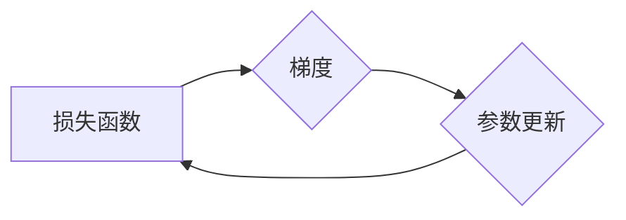

## 关键词：梯度下降、机器学习、优化算法、损失函数、偏导数、学习率、凸优化

## 1. 背景介绍

在机器学习领域，模型训练的核心是找到最优的模型参数，使得模型在给定数据上表现最佳。而寻找最优参数的过程本质上是一个优化问题。梯度下降算法作为最经典、最常用的优化算法之一，在机器学习的各个领域都得到了广泛应用。

梯度下降算法的核心思想是通过不断迭代地更新模型参数，朝着损失函数的最小值方向前进。 损失函数用来衡量模型预测结果与真实结果之间的差距，目标是找到能够使损失函数达到最小值的模型参数。

## 2. 核心概念与联系

### 2.1 损失函数 (Loss Function)

损失函数是机器学习模型训练的核心，它用来衡量模型预测结果与真实结果之间的差距。损失函数越小，模型的预测结果就越好。常见的损失函数包括均方误差 (MSE)、交叉熵 (Cross-Entropy) 等。

### 2.2 梯度 (Gradient)

梯度是一个向量，它表示损失函数在某一点的导数方向。梯度的方向指向损失函数增长最快的方向，因此，为了最小化损失函数，我们需要沿着梯度的负方向更新模型参数。

### 2.3 学习率 (Learning Rate)

学习率是一个控制参数更新幅度的超参数。学习率过大可能会导致参数更新过快，甚至发散；学习率过小可能会导致参数更新过慢，难以收敛到最优解。

**Mermaid 流程图**



## 3. 核心算法原理 & 具体操作步骤

### 3.1 算法原理概述

梯度下降算法的基本原理是迭代地更新模型参数，使得损失函数不断减小。具体来说，算法会计算损失函数对每个参数的偏导数，然后根据学习率和偏导数的方向更新每个参数的值。

### 3.2 算法步骤详解

1. **初始化模型参数:**  随机初始化模型参数。
2. **计算损失函数:**  使用当前模型参数计算损失函数的值。
3. **计算梯度:**  计算损失函数对每个参数的偏导数，即梯度。
4. **更新参数:**  根据学习率和梯度方向更新每个参数的值。
5. **重复步骤2-4:**  重复以上步骤，直到损失函数收敛到一个足够小的值。

### 3.3 算法优缺点

**优点:**

* 算法简单易懂，易于实现。
* 能够找到局部最优解。
* 适用于各种类型的损失函数。

**缺点:**

* 容易陷入局部最优解。
* 收敛速度可能较慢。
* 需要手动选择学习率。

### 3.4 算法应用领域

梯度下降算法广泛应用于机器学习领域，例如：

* 线性回归
* Logistic 回归
* 神经网络
* 支持向量机

## 4. 数学模型和公式 & 详细讲解 & 举例说明

### 4.1 数学模型构建

假设我们的模型参数为 $\theta$，损失函数为 $J(\theta)$，则梯度下降算法的目标是找到使 $J(\theta)$ 最小的 $\theta$。

### 4.2 公式推导过程

梯度下降算法的更新公式为：

$$\theta = \theta - \alpha \nabla J(\theta)$$

其中：

* $\theta$ 是模型参数
* $\alpha$ 是学习率
* $\nabla J(\theta)$ 是损失函数 $J(\theta)$ 的梯度

### 4.3 案例分析与讲解

**举例说明:**

假设我们有一个线性回归模型，损失函数为均方误差 (MSE)：

$$J(\theta) = \frac{1}{2n} \sum_{i=1}^{n} (y_i - \theta_0 - \theta_1 x_i)^2$$

其中：

* $n$ 是样本数量
* $y_i$ 是第 $i$ 个样本的真实值
* $x_i$ 是第 $i$ 个样本的特征值
* $\theta_0$ 和 $\theta_1$ 是模型参数

我们可以计算损失函数对 $\theta_0$ 和 $\theta_1$ 的偏导数，然后使用梯度下降算法更新参数值。

## 5. 项目实践：代码实例和详细解释说明

### 5.1 开发环境搭建

* Python 3.x
* NumPy
* Matplotlib

### 5.2 源代码详细实现

```python
import numpy as np
import matplotlib.pyplot as plt

# 生成随机数据
np.random.seed(0)
X = np.random.rand(100, 1) * 10
y = 2 * X + 1 + np.random.randn(100, 1)

# 定义损失函数
def mse_loss(y_true, y_pred):
    return np.mean((y_true - y_pred) ** 2)

# 定义梯度下降算法
def gradient_descent(X, y, learning_rate, num_iterations):
    m, n = X.shape
    theta = np.zeros((n, 1))
    costs = []

    for i in range(num_iterations):
        y_pred = X @ theta
        cost = mse_loss(y, y_pred)
        costs.append(cost)

        # 计算梯度
        gradient = (1 / m) * X.T @ (y_pred - y)

        # 更新参数
        theta = theta - learning_rate * gradient

    return theta, costs

# 设置超参数
learning_rate = 0.01
num_iterations = 1000

# 执行梯度下降算法
theta, costs = gradient_descent(X, y, learning_rate, num_iterations)

# 绘制损失函数变化曲线
plt.plot(costs)
plt.xlabel('Iterations')
plt.ylabel('Cost')
plt.title('Cost Function vs. Iterations')
plt.show()

# 打印模型参数
print('theta:', theta)
```

### 5.3 代码解读与分析

* 代码首先生成随机数据，并定义均方误差 (MSE) 损失函数。
* 然后定义梯度下降算法函数，其中包含参数初始化、损失函数计算、梯度计算和参数更新等步骤。
* 设置超参数学习率和迭代次数，并执行梯度下降算法。
* 最后绘制损失函数变化曲线，并打印模型参数。

### 5.4 运行结果展示

运行代码后，会生成一个损失函数变化曲线图，以及模型参数的值。

## 6. 实际应用场景

梯度下降算法在机器学习领域有着广泛的应用场景，例如：

* **图像识别:** 训练卷积神经网络 (CNN) 用于识别图像中的物体。
* **自然语言处理:** 训练循环神经网络 (RNN) 用于机器翻译、文本生成等任务。
* **推荐系统:** 训练协同过滤模型用于推荐用户感兴趣的内容。

### 6.4 未来应用展望

随着机器学习技术的不断发展，梯度下降算法也将继续在更多领域得到应用，例如：

* **自动驾驶:** 训练深度学习模型用于感知环境、规划路径和控制车辆。
* **医疗诊断:** 训练机器学习模型用于辅助医生诊断疾病。
* **金融预测:** 训练机器学习模型用于预测股票价格、风险评估等。

## 7. 工具和资源推荐

### 7.1 学习资源推荐

* **书籍:**
    * "Deep Learning" by Ian Goodfellow, Yoshua Bengio, and Aaron Courville
    * "Pattern Recognition and Machine Learning" by Christopher M. Bishop
* **在线课程:**
    * Coursera: Machine Learning by Andrew Ng
    * edX: Deep Learning by Andrew Ng

### 7.2 开发工具推荐

* **Python:** 作为机器学习领域的编程语言，Python 提供了丰富的库和工具，例如 NumPy、Pandas、Scikit-learn 等。
* **TensorFlow:** Google 开发的开源机器学习框架，支持各种深度学习模型的训练和部署。
* **PyTorch:** Facebook 开发的开源机器学习框架，以其灵活性和易用性而闻名。

### 7.3 相关论文推荐

* "On the Convergence of Gradient Descent" by Robbins and Monro
* "Stochastic Gradient Descent" by Bottou

## 8. 总结：未来发展趋势与挑战

### 8.1 研究成果总结

梯度下降算法作为机器学习领域的基础算法，在过去几十年中取得了巨大的成功。它为各种机器学习模型的训练提供了强大的工具，推动了人工智能技术的快速发展。

### 8.2 未来发展趋势

未来，梯度下降算法的研究将继续朝着以下方向发展：

* **加速算法:** 研究更快的梯度下降算法，例如小批量梯度下降 (Mini-Batch Gradient Descent)、动量梯度下降 (Momentum Gradient Descent) 等。
* **鲁棒性:** 研究更鲁棒的梯度下降算法，能够应对噪声数据和非凸优化问题。
* **并行化:** 研究并行化的梯度下降算法，能够利用多核处理器和分布式计算资源提高训练速度。

### 8.3 面临的挑战

尽管梯度下降算法取得了巨大的成功，但它仍然面临一些挑战：

* **局部最优解:** 梯度下降算法容易陷入局部最优解，难以找到全局最优解。
* **学习率选择:** 学习率的选择对算法收敛速度和最终结果有重要影响，需要进行仔细的调优。
* **高维数据:** 在高维数据情况下，梯度下降算法的收敛速度会变慢。

### 8.4 研究展望

未来，研究人员将继续探索新的梯度下降算法，以克服现有算法的局限性，并将其应用于更复杂、更实际的机器学习问题。


## 9. 附录：常见问题与解答

**Q1: 梯度下降算法为什么容易陷入局部最优解？**

**A1:** 梯度下降算法沿着损失函数的负梯度方向更新参数，如果损失函数存在多个局部最小值，那么算法可能会停留在其中一个局部最小值附近，无法找到全局最小值。

**Q2: 如何选择合适的学习率？**

**A2:** 学习率的选择是一个经验性的过程，通常需要通过试错来找到最佳值。过大的学习率会导致参数更新过快，甚至发散；过小的学习率会导致参数更新过慢，难以收敛。

**Q3: 梯度下降算法的收敛速度如何？**

**A3:** 梯度下降算法的收敛速度取决于学习率、损失函数的性质以及数据的规模等因素。一般来说，在凸优化问题中，梯度下降算法能够收敛到全局最优解；但在非凸优化问题中，收敛速度可能会变慢，并且可能陷入局部最优解。


作者：禅与计算机程序设计艺术 / Zen and the Art of Computer Programming 
