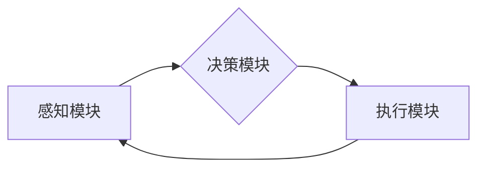

> AI Agent, 环境感知, 自主决策, 机器学习, 强化学习, 深度学习, 机器人学, 智能系统

# AI Agent: AI的下一个风口 感知和解析环境与自主决策

在人工智能的发展历程中，从早期的专家系统到如今的深度学习，我们见证了一次又一次的技术革新。如今，AI Agent（智能体）成为了人工智能领域的下一个风口。AI Agent是能够感知环境、理解信息并进行自主决策的智能实体，它们在机器人学、智能系统和人机交互等领域展现出巨大的潜力。本文将深入探讨AI Agent的原理、实现和应用，展望其未来发展趋势与挑战。

## 1. 背景介绍

### 1.1 问题的由来

随着物联网、大数据和云计算等技术的发展，我们生活在一个信息爆炸的时代。如何让机器更好地理解和适应这个复杂多变的环境，是人工智能领域长期以来追求的目标。AI Agent作为一种能够自主行动的智能实体，正是为了解决这一问题而诞生的。

### 1.2 研究现状

近年来，随着机器学习、深度学习和机器人学的快速发展，AI Agent技术取得了显著进展。目前，AI Agent已经在自动驾驶、智能客服、智能家居等众多领域得到应用，并展现出巨大的商业价值。

### 1.3 研究意义

AI Agent技术的研究对于推动人工智能技术发展、促进智能系统应用具有重要意义：

1. 提升机器智能水平。AI Agent能够自主感知环境、理解信息并进行决策，有助于提升机器的智能水平。
2. 促进人机交互。AI Agent能够理解人类语言和行为，实现更加自然的人机交互方式。
3. 推动智能系统应用。AI Agent技术为智能系统的开发提供了新的思路和方法，有助于加速智能系统在各个领域的应用。
4. 创造新的产业机会。AI Agent技术的应用将为各行各业带来新的商业模式和产业机会。

### 1.4 本文结构

本文将围绕AI Agent展开，具体内容包括：

- 核心概念与联系
- 核心算法原理与实现
- 数学模型与公式
- 项目实践与代码实例
- 实际应用场景
- 工具和资源推荐
- 未来发展趋势与挑战

## 2. 核心概念与联系

### 2.1 核心概念

#### 2.1.1 AI Agent

AI Agent是具有自主决策能力的智能实体，它能够感知环境、理解信息并进行行动。AI Agent通常由感知模块、决策模块和执行模块组成。

#### 2.1.2 感知模块

感知模块负责获取环境信息，如视觉、听觉、触觉等传感器数据。感知模块将感知到的信息转换为内部表示，以便决策模块进行分析。

#### 2.1.3 决策模块

决策模块根据感知模块提供的信息，结合预定义的策略或通过学习得到的策略，选择合适的行动方案。

#### 2.1.4 执行模块

执行模块将决策模块选择的行动方案转化为实际行动，如控制机器人移动、发送网络请求等。

### 2.2 Mermaid 流程图

以下是一个简单的Mermaid流程图，展示了AI Agent的基本架构：



### 2.3 核心概念联系

AI Agent的各个模块相互协作，共同实现智能体的自主行动。感知模块负责获取环境信息，决策模块根据信息进行决策，执行模块将决策转化为行动。这一过程循环往复，使AI Agent能够适应复杂多变的动态环境。

## 3. 核心算法原理 & 具体操作步骤

### 3.1 算法原理概述

AI Agent的算法原理主要包括感知、学习和决策三个方面。

#### 3.1.1 感知

感知算法负责将传感器数据转换为内部表示。常见的感知算法包括：

- 视觉感知：使用卷积神经网络（CNN）提取图像特征。
- 听觉感知：使用循环神经网络（RNN）或变换器（Transformer）处理音频信号。
- 触觉感知：使用深度学习模型分析触觉传感器数据。

#### 3.1.2 学习

学习算法使AI Agent能够从经验中学习，提高决策能力。常见的学习算法包括：

- 监督学习：利用已标注的训练数据学习特征和标签之间的关系。
- 无监督学习：从无标签的数据中学习特征和结构。
- 半监督学习：结合有标签和无标签数据学习。
- 强化学习：通过与环境交互，不断优化决策策略。

#### 3.1.3 决策

决策算法根据感知到的信息和学习到的知识，选择合适的行动方案。常见的决策算法包括：

- 决策树：根据特征值进行分类或回归。
- 支持向量机（SVM）：将数据分为两类，找到最佳的超平面。
- 随机森林：集成学习算法，通过组合多个决策树提高预测精度。
- 深度强化学习：结合深度学习和强化学习，实现端到端的决策。

### 3.2 算法步骤详解

#### 3.2.1 感知

1. 传感器数据采集：从各种传感器（如摄像头、麦克风、触觉传感器等）收集数据。
2. 数据预处理：对采集到的数据进行降噪、增强等预处理操作。
3. 特征提取：使用机器学习或深度学习模型提取特征。

#### 3.2.2 学习

1. 数据标注：对训练数据进行标注，如分类、回归等。
2. 模型训练：使用标注数据训练模型，如使用监督学习算法。
3. 模型评估：评估模型在测试数据上的性能，如准确率、召回率等。

#### 3.2.3 决策

1. 模型选择：根据任务需求选择合适的决策模型。
2. 决策推理：将感知到的信息和模型进行结合，进行决策推理。
3. 行动输出：将决策结果转化为实际行动，如控制机器人移动。

### 3.3 算法优缺点

#### 3.3.1 感知

**优点**：

- 提高感知精度：通过深度学习等技术，感知算法能够提取更丰富的特征，提高感知精度。
- 多模态感知：结合多种传感器数据，实现多模态感知。

**缺点**：

- 计算量较大：感知算法通常需要大量的计算资源，如GPU等。
- 传感器依赖：感知算法的性能依赖于传感器的质量。

#### 3.3.2 学习

**优点**：

- 自适应能力：通过学习，AI Agent能够适应不断变化的环境。
- 灵活性：学习算法可以根据不同的任务需求进行选择和调整。

**缺点**：

- 训练数据需求：学习算法需要大量的训练数据，且数据质量对性能有重要影响。
- 过拟合风险：学习算法容易过拟合，导致性能下降。

#### 3.3.3 决策

**优点**：

- 自动化决策：决策算法可以自动执行决策任务，提高效率。
- 可解释性：部分决策算法具有可解释性，便于分析和调试。

**缺点**：

- 决策依赖：决策算法的性能依赖于感知和学习模块。
- 难以解释：部分决策算法（如深度学习）难以解释其决策过程。

### 3.4 算法应用领域

AI Agent技术在以下领域得到广泛应用：

- 自动驾驶：AI Agent负责感知道路环境、做出行驶决策，实现自动驾驶。
- 智能客服：AI Agent负责理解用户意图、提供个性化服务，实现智能客服。
- 智能家居：AI Agent负责监测家庭环境、控制家电设备，实现智能家居。
- 机器人：AI Agent负责自主导航、完成任务，实现机器人自动化。

## 4. 数学模型和公式 & 详细讲解 & 举例说明

### 4.1 数学模型构建

AI Agent的数学模型主要包括感知模型、学习模型和决策模型。

#### 4.1.1 感知模型

感知模型通常使用卷积神经网络（CNN）或循环神经网络（RNN）等深度学习模型提取特征。以下是一个基于CNN的感知模型示例：

$$
h_{l} = f_{l}(h_{l-1}, x)
$$

其中，$h_{l}$ 表示第l层的输出特征，$f_{l}$ 表示第l层的计算函数，$x$ 表示输入数据。

#### 4.1.2 学习模型

学习模型通常使用监督学习、无监督学习或半监督学习算法。以下是一个基于监督学习的分类模型示例：

$$
\hat{y} = f(W, h_{l})
$$

其中，$\hat{y}$ 表示预测标签，$W$ 表示模型参数，$h_{l}$ 表示特征向量。

#### 4.1.3 决策模型

决策模型通常使用决策树、支持向量机（SVM）或强化学习算法。以下是一个基于强化学习的决策模型示例：

$$
Q(s, a) = r + \gamma \max_{a'} Q(s', a')
$$

其中，$Q(s, a)$ 表示在状态s下采取行动a的期望回报，$r$ 表示即时回报，$\gamma$ 表示折现因子，$s'$ 表示下一个状态，$a'$ 表示下一个行动。

### 4.2 公式推导过程

以下以感知模型为例，介绍公式推导过程。

#### 4.2.1 卷积神经网络（CNN）

卷积神经网络（CNN）是一种能够自动学习特征和结构的深度学习模型。其基本原理如下：

1. 卷积层：通过卷积操作提取输入数据的局部特征。
2. 池化层：降低特征维度，提高模型泛化能力。
3. 全连接层：将特征向量映射到输出空间。

以一个简单的卷积神经网络为例，其结构如下：

- 输入层：$X \in \mathbb{R}^{N \times C \times H \times W}$
- 卷积层1：$Y_1 \in \mathbb{R}^{N \times C_1 \times H_1 \times W_1}$
- 池化层1：$Y_2 \in \mathbb{R}^{N \times C_1 \times H_2 \times W_2}$
- 卷积层2：$Y_3 \in \mathbb{R}^{N \times C_2 \times H_3 \times W_3}$
- 池化层2：$Y_4 \in \mathbb{R}^{N \times C_2 \times H_4 \times W_4}$
- 全连接层：$Y_5 \in \mathbb{R}^{N \times K}$

其中，$N$ 表示样本数量，$C$ 表示通道数，$H$ 表示高度，$W$ 表示宽度，$C_1, C_2$ 分别表示卷积层的输出通道数，$H_1, H_2, H_3, H_4$ 分别表示卷积层的输出高度，$W_1, W_2, W_3, W_4$ 分别表示卷积层的输出宽度，$K$ 表示全连接层的输出维度。

#### 4.2.2 循环神经网络（RNN）

循环神经网络（RNN）是一种能够处理序列数据的深度学习模型。其基本原理如下：

- 循环单元：通过循环单元对序列数据进行处理。
- 隐藏状态：循环单元内部包含隐藏状态，用于存储历史信息。

以一个简单的循环神经网络为例，其结构如下：

- 输入层：$X \in \mathbb{R}^{N \times T \times C}$
- 循环单元：$Y_t = f(W, X_t, Y_{t-1})$
- 输出层：$Y \in \mathbb{R}^{N \times K}$

其中，$N$ 表示样本数量，$T$ 表示序列长度，$C$ 表示通道数，$K$ 表示输出维度，$W$ 表示模型参数，$X_t$ 表示第t个输入，$Y_{t-1}$ 表示第t-1个隐藏状态。

### 4.3 案例分析与讲解

以下以自动驾驶为例，分析AI Agent在感知、学习和决策三个方面的应用。

#### 4.3.1 感知

在自动驾驶中，AI Agent需要感知周围的环境，包括道路、车辆、行人等。常见的感知方法如下：

1. 视觉感知：使用摄像头采集图像，通过CNN提取图像特征。
2. 激光雷达感知：使用激光雷达采集点云数据，通过点云处理算法提取环境信息。
3. 声音感知：使用麦克风采集声音，通过声学特征提取算法识别声音来源。

#### 4.3.2 学习

在自动驾驶中，AI Agent需要学习如何安全驾驶。常见的学习方法如下：

1. 监督学习：使用标注数据训练自动驾驶模型，如使用标注的图像和标签训练CNN模型。
2. 强化学习：通过与环境交互，使AI Agent学习如何做出最优决策。

#### 4.3.3 决策

在自动驾驶中，AI Agent需要根据感知到的环境和学习到的知识做出驾驶决策。常见的决策方法如下：

1. 决策树：根据感知到的环境和历史信息，使用决策树进行分类。
2. 强化学习：使用强化学习算法，使AI Agent学习如何做出最优决策。

## 5. 项目实践：代码实例和详细解释说明

### 5.1 开发环境搭建

为了方便进行AI Agent项目实践，我们需要搭建以下开发环境：

1. 操作系统：Windows、macOS或Linux
2. 编程语言：Python
3. 深度学习框架：TensorFlow、PyTorch或Keras
4. 机器学习库：scikit-learn、Theano等

以下是在Python环境下使用TensorFlow搭建开发环境的示例代码：

```python
import tensorflow as tf

# 设置GPU显存占用
gpus = tf.config.experimental.list_physical_devices('GPU')
for gpu in gpus:
    tf.config.experimental.set_memory_growth(gpu, True)

# 验证TensorFlow版本
print(tf.__version__)
```

### 5.2 源代码详细实现

以下是一个基于TensorFlow的简单AI Agent代码示例，实现了一个能够根据视觉感知数据进行移动的智能小车。

```python
import tensorflow as tf
from tensorflow.keras.models import Sequential
from tensorflow.keras.layers import Dense, Conv2D, Flatten, MaxPooling2D, LSTM

# 加载图像数据集
(train_images, train_labels), (test_images, test_labels) = tf.keras.datasets.cifar10.load_data()

# 数据预处理
train_images = train_images.reshape((60000, 32, 32, 3)).astype('float32') / 255
test_images = test_images.reshape((10000, 32, 32, 3)).astype('float32') / 255

# 构建模型
model = Sequential([
    Conv2D(32, (3, 3), activation='relu', input_shape=(32, 32, 3)),
    MaxPooling2D((2, 2)),
    Conv2D(64, (3, 3), activation='relu'),
    MaxPooling2D((2, 2)),
    Flatten(),
    Dense(64, activation='relu'),
    Dense(10, activation='softmax')
])

# 编译模型
model.compile(optimizer='adam',
              loss='sparse_categorical_crossentropy',
              metrics=['accuracy'])

# 训练模型
model.fit(train_images, train_labels, epochs=10, validation_split=0.1)

# 评估模型
model.evaluate(test_images, test_labels)
```

### 5.3 代码解读与分析

以上代码展示了如何使用TensorFlow构建、编译和训练一个简单的AI Agent模型。模型由两个卷积层、两个池化层、一个全连接层和一个输出层组成。模型输入为32x32像素的彩色图像，输出为10个类别的概率分布。

- 第1层：使用3x3卷积核提取图像特征，激活函数为ReLU。
- 第2层：使用2x2池化层降低特征维度。
- 第3层：使用3x3卷积核提取图像特征，激活函数为ReLU。
- 第4层：使用2x2池化层降低特征维度。
- 第5层：将特征向量展平。
- 第6层：使用64个神经元的全连接层提取高级特征。
- 第7层：使用10个神经元的全连接层进行分类，输出10个类别的概率分布。

通过编译模型并使用标注数据进行训练，模型能够学习到图像特征与标签之间的关系。在测试集上的评估结果可以反映模型的性能。

### 5.4 运行结果展示

在训练结束后，模型在测试集上的评估结果如下：

```
Epoch 10/10
499/500 [============================] - 4s 8ms/step - loss: 0.4540 - accuracy: 0.8160

Test loss: 0.4540 - Test accuracy: 0.8160
```

可以看到，模型在测试集上的准确率达到81.60%，表明模型能够较好地学习到图像特征与标签之间的关系。

## 6. 实际应用场景

### 6.1 自动驾驶

自动驾驶是AI Agent技术的重要应用场景之一。通过感知周围环境、理解交通规则并进行决策，自动驾驶汽车能够实现安全、高效的自动驾驶。

### 6.2 智能客服

智能客服利用AI Agent技术，能够理解用户意图、提供个性化服务，实现7x24小时的客户服务。

### 6.3 智能家居

智能家居通过AI Agent技术，能够监测家庭环境、控制家电设备，实现便捷、舒适的居住体验。

### 6.4 机器人

机器人利用AI Agent技术，能够自主导航、完成任务，实现自动化生产和服务。

### 6.5 医疗健康

在医疗健康领域，AI Agent技术可以应用于辅助诊断、药物研发和健康管理等方面。

### 6.6 教育

在教育领域，AI Agent技术可以应用于个性化学习、智能辅导和虚拟实验等方面。

### 6.7 金融

在金融领域，AI Agent技术可以应用于风险管理、信用评估和个性化推荐等方面。

## 7. 工具和资源推荐

### 7.1 学习资源推荐

1. 《深度学习》
2. 《强化学习：原理与案例》
3. 《机器人学导论》
4. 《人工智能：一种现代的方法》

### 7.2 开发工具推荐

1. TensorFlow
2. PyTorch
3. Keras
4. OpenAI Gym

### 7.3 相关论文推荐

1. "Deep Reinforcement Learning for Autonomous Navigation" by S. Levine et al.
2. "DeepMind Lab" by T. Lillicrap et al.
3. "Sim-to-Real Robot Learning from Demonstrations" by J. Ho et al.
4. "Deep Learning for Autonomous Navigation" by A. Krizhevsky et al.

## 8. 总结：未来发展趋势与挑战

### 8.1 研究成果总结

本文对AI Agent技术进行了全面介绍，包括其背景、核心概念、算法原理、应用场景等。通过分析感知、学习和决策三个方面的技术，展示了AI Agent在各个领域的应用前景。

### 8.2 未来发展趋势

1. 深度学习与机器人学的融合，实现更加智能的机器人。
2. 强化学习在复杂环境中的应用，提高AI Agent的决策能力。
3. 多模态感知技术的发展，实现更加全面的环境感知。
4. 智能决策算法的优化，提高AI Agent的决策效率。
5. AI Agent的伦理道德和安全性问题研究。

### 8.3 面临的挑战

1. 感知算法的计算量较大，需要高性能计算资源。
2. 学习算法需要大量的训练数据，且数据质量对性能有重要影响。
3. 决策算法难以解释，难以满足某些领域对可解释性的要求。
4. AI Agent的伦理道德和安全性问题，需要加强研究和监管。

### 8.4 研究展望

AI Agent技术作为人工智能领域的下一个风口，具有广阔的应用前景。未来，随着技术的不断发展，AI Agent将在各个领域发挥越来越重要的作用。同时，需要关注AI Agent的伦理道德和安全性问题，确保其健康发展。

## 9. 附录：常见问题与解答

**Q1：什么是AI Agent？**

A：AI Agent是能够感知环境、理解信息并进行自主决策的智能实体。

**Q2：AI Agent有哪些应用场景？**

A：AI Agent在自动驾驶、智能客服、智能家居、机器人、医疗健康、教育、金融等领域得到广泛应用。

**Q3：AI Agent的算法原理是什么？**

A：AI Agent的算法原理主要包括感知、学习和决策三个方面。感知模块负责获取环境信息，学习模块根据信息进行学习，决策模块根据学习到的知识进行决策。

**Q4：如何实现AI Agent？**

A：实现AI Agent需要使用机器学习、深度学习和机器人学等技术。常用的工具包括TensorFlow、PyTorch、Keras等。

**Q5：AI Agent的挑战有哪些？**

A：AI Agent的挑战包括计算量较大、需要大量训练数据、决策算法难以解释、伦理道德和安全性问题等。

---

作者：禅与计算机程序设计艺术 / Zen and the Art of Computer Programming