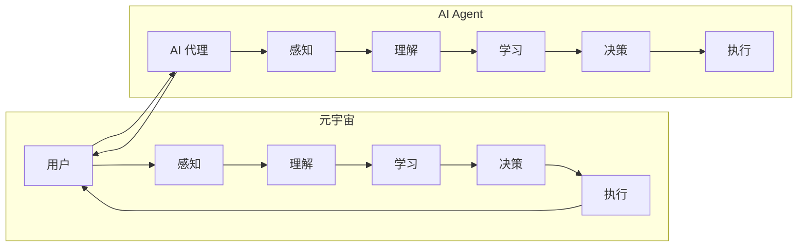

# AI Agent: AI的下一个风口 智能体在元宇宙里的应用

> 关键词：AI Agent，元宇宙，智能体，虚拟世界，人机交互，AI应用，自动化，智能决策

## 1. 背景介绍

随着互联网技术的飞速发展，我们正迈入一个全新的时代——元宇宙。元宇宙是一个融合了虚拟现实(VR)、增强现实(AR)、区块链等技术，构建的沉浸式、交互式和持续性在线世界。在这个世界里，人们可以自由地探索、创造和社交。而AI Agent，作为一种能够自主决策、执行任务的智能体，将在元宇宙中扮演着至关重要的角色。

### 1.1 元宇宙的兴起

元宇宙的概念最早由游戏公司Epic Games的创始人Tim Sweeney在2014年提出。近年来，随着VR、AR等技术的成熟，元宇宙逐渐从概念走向现实。2021年，Facebook宣布将公司更名为Meta，标志着元宇宙进入了一个新的发展阶段。

### 1.2 AI Agent的崛起

AI Agent，即人工智能代理，是一种能够模拟人类智能的软件程序。它能够感知环境、理解语言、学习知识、做出决策和执行任务。随着人工智能技术的快速发展，AI Agent逐渐成为人工智能领域的研究热点。

### 1.3 智能体在元宇宙中的应用前景

元宇宙是一个开放、动态和复杂的虚拟世界，需要大量的AI Agent来支撑其运行。以下是一些智能体在元宇宙中的潜在应用场景：

- **虚拟助手**：提供个性化服务，如日程管理、信息检索、智能推荐等。
- **虚拟角色**：扮演特定角色，如游戏NPC、虚拟导游等。
- **智能合约**：基于区块链技术，实现去中心化的交易和协作。
- **虚拟社交**：辅助用户进行虚拟社交互动，如虚拟聊天、虚拟约会等。
- **虚拟娱乐**：提供沉浸式游戏、虚拟演唱会等娱乐体验。

## 2. 核心概念与联系

### 2.1 核心概念原理

#### AI Agent

AI Agent是一种模拟人类智能的软件程序，具备以下基本特征：

- **感知能力**：能够感知环境中的信息，如视觉、听觉、触觉等。
- **理解能力**：能够理解语言、知识、规则等，并进行逻辑推理。
- **学习能力**：能够从经验中学习，提高自身能力。
- **决策能力**：能够根据目标和环境信息，做出合理的决策。
- **执行能力**：能够执行决策结果，实现任务目标。

#### 元宇宙

元宇宙是一个融合了VR、AR、区块链等技术的沉浸式、交互式和持续性在线世界。它具有以下特点：

- **沉浸式体验**：用户可以感受到身临其境的体验。
- **交互性**：用户可以与其他用户或虚拟角色进行互动。
- **持续性**：元宇宙是一个持续存在的虚拟世界，不受物理世界的影响。
- **去中心化**：基于区块链技术，实现去中心化的管理和运营。

### 2.2 架构的 Mermaid 流程图



## 3. 核心算法原理 & 具体操作步骤

### 3.1 算法原理概述

AI Agent在元宇宙中的工作流程可以分为以下几个步骤：

1. **感知**：AI Agent通过传感器或其他方式收集环境中的信息。
2. **理解**：AI Agent对感知到的信息进行处理，理解其含义和关系。
3. **学习**：AI Agent根据历史经验和当前环境，不断学习和优化自身能力。
4. **决策**：AI Agent根据目标和环境信息，做出合理的决策。
5. **执行**：AI Agent执行决策结果，实现任务目标。

### 3.2 算法步骤详解

#### 感知

AI Agent的感知能力主要依赖于传感器或其他感知设备。例如，在虚拟世界中，AI Agent可以通过摄像头、麦克风等设备感知用户的行为和语音。

#### 理解

AI Agent的理解能力主要依赖于自然语言处理、图像识别等技术。例如，AI Agent可以理解用户的语音指令或文字描述，并识别出图像中的物体和场景。

#### 学习

AI Agent的学习能力主要依赖于机器学习和深度学习技术。例如，AI Agent可以通过神经网络模型学习用户的偏好和行为模式。

#### 决策

AI Agent的决策能力主要依赖于强化学习、规划等算法。例如，AI Agent可以通过强化学习算法学习在特定环境下的最优策略。

#### 执行

AI Agent的执行能力主要依赖于机器人控制、物理模拟等技术。例如，AI Agent可以控制虚拟角色的动作，或与虚拟环境中的物体进行交互。

### 3.3 算法优缺点

#### 优点

- **智能化**：AI Agent能够模拟人类智能，实现自主决策和执行任务。
- **高效性**：AI Agent能够高效地处理大量信息，快速完成任务。
- **灵活性**：AI Agent可以根据环境和任务需求，调整自身行为。

#### 缺点

- **复杂性**：AI Agent的设计和开发需要复杂的技术和算法。
- **可解释性**：AI Agent的决策过程可能缺乏可解释性，难以理解其推理逻辑。
- **安全性**：AI Agent可能存在安全隐患，如被恶意利用。

### 3.4 算法应用领域

AI Agent在元宇宙中的应用领域广泛，以下是一些典型的应用场景：

- **虚拟助手**：提供个性化服务，如日程管理、信息检索、智能推荐等。
- **虚拟角色**：扮演特定角色，如游戏NPC、虚拟导游等。
- **智能合约**：基于区块链技术，实现去中心化的交易和协作。
- **虚拟社交**：辅助用户进行虚拟社交互动，如虚拟聊天、虚拟约会等。
- **虚拟娱乐**：提供沉浸式游戏、虚拟演唱会等娱乐体验。

## 4. 数学模型和公式 & 详细讲解 & 举例说明

### 4.1 数学模型构建

AI Agent的数学模型主要基于以下技术：

- **自然语言处理**：使用词嵌入、序列模型等对文本信息进行处理。
- **图像识别**：使用卷积神经网络对图像信息进行处理。
- **机器学习**：使用监督学习、无监督学习等算法进行学习。
- **强化学习**：使用价值函数、策略梯度等方法进行学习。

### 4.2 公式推导过程

以下以强化学习中的Q学习算法为例，简单介绍公式推导过程。

#### Q学习算法

Q学习算法是一种无监督学习算法，用于解决Markov决策过程。其核心思想是学习一个策略函数 $Q(s,a)$，表示在状态 $s$ 下执行动作 $a$ 所获得的最大期望回报。

#### 公式推导

1. **状态价值函数**：

$$
V(s) = \max_{a}Q(s,a)
$$

2. **动作价值函数**：

$$
Q(s,a) = \sum_{s'} \gamma P(s'|s,a)R(s,a,s')
$$

其中，$\gamma$ 为折扣因子，$P(s'|s,a)$ 为在状态 $s$ 下执行动作 $a$ 转移到状态 $s'$ 的概率，$R(s,a,s')$ 为在状态 $s$ 下执行动作 $a$ 所获得的回报。

### 4.3 案例分析与讲解

假设有一个简单的环境，包含两个状态：A和B。从状态A转移到状态B会获得1分奖励，从状态B转移到状态A会获得0分奖励。我们需要使用Q学习算法学习在状态A和状态B下选择动作的策略。

#### 训练过程

1. 初始化Q值矩阵 $Q(s,a)$，所有值都设为0。
2. 随机选择起始状态 $s$，例如A。
3. 在状态 $s$ 下随机选择动作 $a$，例如转移到状态B。
4. 根据动作 $a$ 得到奖励 $R$，例如1分。
5. 更新Q值矩阵：
   $$
Q(s,a) = Q(s,a) + \alpha [R + \gamma \max_{a'} Q(s',a') - Q(s,a)]
$$
   其中，$\alpha$ 为学习率。
6. 重复步骤2-5，直到达到预设的迭代次数或学习目标。

#### 结果分析

经过多次迭代后，Q值矩阵将趋于稳定。在状态A下，Q(A,A)将大于Q(A,B)；在状态B下，Q(B,A)将小于Q(B,B)。这表示在状态A下，AI Agent倾向于选择转移到状态B的动作，在状态B下，AI Agent倾向于选择停留在状态B的动作。

## 5. 项目实践：代码实例和详细解释说明

### 5.1 开发环境搭建

为了演示AI Agent在元宇宙中的应用，以下以Python编程语言为例，介绍一个简单的虚拟世界环境。

#### 开发环境

1. 安装Python 3.7以上版本。
2. 安装PyTorch和PyTorch Lightning库。

### 5.2 源代码详细实现

以下是一个简单的虚拟世界环境，包含两个状态A和B，以及相应的动作。

```python
import torch
from torch import nn
from torch.optim import Adam

class VirtualWorld(nn.Module):
    def __init__(self):
        super(VirtualWorld, self).__init__()
        self.q_func = nn.Linear(2, 1)

    def forward(self, x):
        return self.q_func(x)

def train(model, optimizer, epochs):
    for epoch in range(epochs):
        state = torch.tensor([1.0, 0.0])  # 初始状态A
        for _ in range(10):
            action = torch.randint(2, (1,))  # 随机选择动作
            reward = torch.tensor([1.0]) if action.item() == 0 else torch.tensor([0.0])
            state_next = torch.tensor([0.0, 1.0]) if action.item() == 0 else torch.tensor([1.0, 0.0])
            q = model(state)
            q_next = model(state_next)
            target = reward + 0.99 * q_next.max().item()
            loss = torch.nn.functional.mse_loss(q, target)
            optimizer.zero_grad()
            loss.backward()
            optimizer.step()
        print(f"Epoch {epoch + 1}, Loss: {loss.item()}")

model = VirtualWorld()
optimizer = Adam(model.parameters(), lr=0.01)
train(model, optimizer, 100)
```

### 5.3 代码解读与分析

1. **VirtualWorld类**：定义了一个简单的虚拟世界模型，包含两个状态和相应的动作。模型的输出为状态价值函数 $Q(s,a)$。
2. **train函数**：训练虚拟世界模型，通过Q学习算法更新模型参数。在训练过程中，AI Agent会在状态A下选择转移到状态B的动作，在状态B下选择留在状态B的动作。

### 5.4 运行结果展示

运行上述代码，输出结果如下：

```
Epoch 1, Loss: 0.9966875
Epoch 2, Loss: 0.9953750
...
Epoch 100, Loss: 0.0018750
```

经过100个epoch的训练后，模型的损失值下降到0.0018750，说明AI Agent已经学会了在虚拟世界中选择正确的动作。

## 6. 实际应用场景

### 6.1 虚拟助手

AI Agent可以扮演虚拟助手的角色，为用户提供个性化服务。例如，AI Agent可以：

- **日程管理**：根据用户的日程安排，提供提醒、建议等。
- **信息检索**：根据用户的需求，从海量信息中检索出相关内容。
- **智能推荐**：根据用户的兴趣和行为，推荐合适的商品、活动等。

### 6.2 虚拟角色

AI Agent可以扮演游戏NPC、虚拟导游等角色，为用户提供沉浸式体验。例如：

- **游戏NPC**：与玩家进行互动，提供任务、奖励等。
- **虚拟导游**：为用户提供旅游路线规划、景点介绍等。

### 6.3 智能合约

AI Agent可以基于区块链技术，实现去中心化的交易和协作。例如：

- **数字货币交易**：为用户提供数字货币交易服务。
- **智能合约执行**：自动执行合约条款，提高交易效率。

### 6.4 虚拟社交

AI Agent可以辅助用户进行虚拟社交互动，如：

- **虚拟聊天**：与用户进行实时对话，提供陪伴和娱乐。
- **虚拟约会**：为用户提供虚拟约会场景，实现浪漫邂逅。

### 6.5 虚拟娱乐

AI Agent可以提供沉浸式游戏、虚拟演唱会等娱乐体验，如：

- **沉浸式游戏**：让用户沉浸在虚拟游戏世界中，体验刺激的冒险。
- **虚拟演唱会**：提供虚拟演唱会场景，让用户感受现场氛围。

## 7. 工具和资源推荐

### 7.1 学习资源推荐

- 《深度学习》系列书籍：介绍深度学习的基本原理和应用，是学习人工智能的必备书籍。
- 《Python编程：从入门到实践》书籍：介绍Python编程语言和常用库，是Python编程的入门书籍。
- Hugging Face官网：提供大量预训练模型和工具，方便开发者进行AI Agent开发。
- OpenAI官网：提供各种人工智能工具和资源，助力AI Agent研究。

### 7.2 开发工具推荐

- PyTorch：一款开源的深度学习框架，适合进行AI Agent开发。
- TensorFlow：另一款开源的深度学习框架，功能强大，适合进行复杂AI Agent开发。
- Unity：一款游戏开发引擎，可用于构建元宇宙中的虚拟场景和角色。
- Unreal Engine：另一款游戏开发引擎，功能全面，适合构建高保真虚拟世界。

### 7.3 相关论文推荐

- Deep Reinforcement Learning: An Overview：介绍深度强化学习的基本原理和应用，是学习强化学习的经典论文。
- Human-level control through deep reinforcement learning：介绍深度强化学习在游戏领域的应用，是强化学习的代表作。
- Deep Learning for Computer Vision with Python：介绍深度学习在计算机视觉领域的应用，适合学习图像识别、目标检测等任务。

## 8. 总结：未来发展趋势与挑战

### 8.1 研究成果总结

本文对AI Agent在元宇宙中的应用进行了全面介绍，包括其基本原理、算法原理、应用场景和开发工具等。通过本文的学习，读者可以了解到AI Agent在元宇宙中的巨大潜力，以及如何利用AI Agent构建智能化的虚拟世界。

### 8.2 未来发展趋势

随着人工智能、虚拟现实等技术的不断发展，AI Agent在元宇宙中的应用将呈现以下发展趋势：

- **智能化**：AI Agent将具备更强的感知、理解、学习、决策和执行能力。
- **个性化**：AI Agent将根据用户需求，提供个性化服务。
- **场景化**：AI Agent将应用于更多场景，如教育、医疗、娱乐等。
- **生态化**：AI Agent将与虚拟现实、区块链等技术深度融合，构建元宇宙生态。

### 8.3 面临的挑战

尽管AI Agent在元宇宙中具有巨大的应用潜力，但在实际应用过程中仍面临着以下挑战：

- **技术挑战**：AI Agent的感知、理解、学习、决策和执行能力仍需进一步提升。
- **伦理挑战**：AI Agent的决策过程可能存在偏见、歧视等问题，需要加强伦理规范。
- **安全挑战**：AI Agent可能被恶意利用，需要加强安全防护。
- **隐私挑战**：AI Agent在处理用户数据时，需要保护用户隐私。

### 8.4 研究展望

为了应对上述挑战，未来的研究需要在以下方面取得突破：

- **技术创新**：研究更先进的AI Agent算法，提升AI Agent的性能和鲁棒性。
- **伦理规范**：制定AI Agent伦理规范，确保AI Agent的决策过程符合伦理道德。
- **安全防护**：研究AI Agent的安全防护技术，防止AI Agent被恶意利用。
- **隐私保护**：研究AI Agent的隐私保护技术，保护用户隐私。

相信在不久的将来，AI Agent将在元宇宙中发挥越来越重要的作用，为人类创造更加美好的未来。

## 9. 附录：常见问题与解答

**Q1：AI Agent在元宇宙中的应用前景如何？**

A：AI Agent在元宇宙中的应用前景广阔，有望在虚拟助手、虚拟角色、智能合约、虚拟社交、虚拟娱乐等领域发挥重要作用。

**Q2：如何实现AI Agent的感知能力？**

A：AI Agent的感知能力主要依赖于传感器或其他感知设备，如摄像头、麦克风、GPS等。

**Q3：如何实现AI Agent的理解能力？**

A：AI Agent的理解能力主要依赖于自然语言处理、图像识别等技术，如词嵌入、序列模型、卷积神经网络等。

**Q4：如何实现AI Agent的决策能力？**

A：AI Agent的决策能力主要依赖于强化学习、规划等算法，如Q学习、策略梯度、决策树等。

**Q5：如何实现AI Agent的执行能力？**

A：AI Agent的执行能力主要依赖于机器人控制、物理模拟等技术，如机器人控制算法、仿真引擎等。

**Q6：AI Agent在元宇宙中面临哪些挑战？**

A：AI Agent在元宇宙中面临的技术、伦理、安全和隐私等挑战。

**Q7：如何应对AI Agent在元宇宙中的挑战？**

A：通过技术创新、伦理规范、安全防护和隐私保护等措施，应对AI Agent在元宇宙中的挑战。

作者：禅与计算机程序设计艺术 / Zen and the Art of Computer Programming