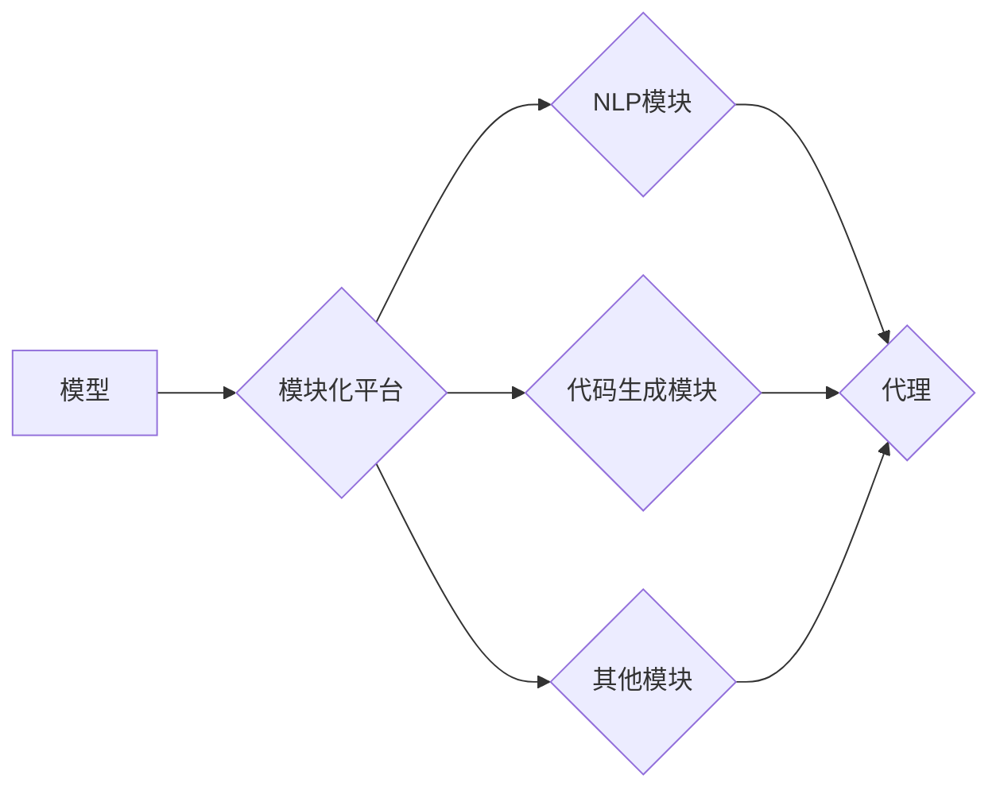

# 【LangChain编程：从入门到实践】LangChain中的代理

作者：禅与计算机程序设计艺术 / Zen and the Art of Computer Programming

## 关键词

LangChain, 代理, 模块化, 多模态, API, NLP, 代码生成, 联邦学习

## 1. 背景介绍

### 1.1 问题的由来

随着人工智能技术的快速发展，自然语言处理（NLP）和代码生成（Code Generation）等领域的应用场景日益丰富。然而，将这两个领域的技术进行整合，构建一个统一的、模块化的智能系统，却面临着诸多挑战。

传统的解决方案往往依赖于复杂的代码逻辑和大量的手动集成，这不仅增加了系统的复杂度，也降低了系统的可维护性和可扩展性。为了解决这一问题，LangChain应运而生。LangChain是一个开源的框架，旨在将NLP和代码生成等技术整合到一个统一的平台上，通过代理（Agent）的概念，实现模块化、可扩展的智能系统。

### 1.2 研究现状

目前，LangChain在NLP和代码生成领域已经取得了显著的成果。许多研究者开始探索如何利用LangChain构建智能代理，以解决各种实际问题。例如，将LangChain应用于智能客服、代码自动生成、智能问答等场景，都取得了不错的效果。

### 1.3 研究意义

LangChain的代理技术具有重要的研究意义和应用价值：

- **模块化设计**：LangChain的代理设计，使得系统可以轻松地添加和更换不同的模块，提高了系统的灵活性和可扩展性。
- **多模态集成**：LangChain支持多种模态的数据输入和输出，可以处理文本、代码、图像等多种类型的数据，使得智能系统的应用范围更广。
- **API接口**：LangChain提供了统一的API接口，方便与其他系统集成，降低了集成成本。
- **联邦学习**：LangChain支持联邦学习技术，可以保护用户隐私，同时实现模型的有效训练。

### 1.4 本文结构

本文将围绕LangChain中的代理技术进行介绍，主要内容包括：

- LangChain的基本概念和架构
- LangChain中的代理技术原理
- LangChain代理的构建步骤
- LangChain代理的实际应用场景
- LangChain代理的未来发展趋势

## 2. 核心概念与联系

### 2.1 LangChain的基本概念

LangChain是一个开源的框架，旨在将NLP和代码生成等技术整合到一个统一的平台上。LangChain的核心概念包括：

- **模型**：LangChain支持各种NLP和代码生成模型，如BERT、GPT-3等。
- **模块**：LangChain将系统分解为多个模块，每个模块负责特定的功能，如文本生成、代码生成等。
- **代理**：LangChain的代理是系统的核心，负责协调各个模块之间的协作，实现智能行为。

### 2.2 LangChain的架构

LangChain的架构如图所示：



### 2.3 LangChain与代理的联系

LangChain的代理技术是LangChain框架的核心，它负责协调各个模块之间的协作，实现智能行为。具体来说，LangChain的代理具有以下功能：

- **模块管理**：代理负责管理各个模块的加载、卸载和状态监控。
- **数据流控制**：代理负责控制数据在各个模块之间的流动，确保数据的一致性和准确性。
- **任务调度**：代理负责根据用户的输入，调度相应的模块进行处理，并返回结果。

## 3. 核心算法原理 & 具体操作步骤

### 3.1 算法原理概述

LangChain的代理技术基于以下原理：

- **模块化设计**：将系统分解为多个模块，每个模块负责特定的功能，提高了系统的可维护性和可扩展性。
- **状态机**：代理使用状态机来控制模块之间的协作，使得系统可以按照预定的流程进行操作。
- **API接口**：代理通过统一的API接口与模块进行交互，降低了集成成本。

### 3.2 算法步骤详解

LangChain代理的构建步骤如下：

1. **定义模块**：根据实际需求，定义不同的模块，如文本生成模块、代码生成模块等。
2. **实现模块接口**：每个模块需要实现统一的API接口，以便与其他模块进行交互。
3. **创建代理**：创建一个代理对象，负责管理各个模块的加载、卸载和状态监控。
4. **数据流控制**：通过代理控制数据在各个模块之间的流动，确保数据的一致性和准确性。
5. **任务调度**：根据用户输入，调度相应的模块进行处理，并返回结果。

### 3.3 算法优缺点

LangChain代理技术的优点：

- **模块化设计**：提高了系统的可维护性和可扩展性。
- **可复用性**：模块可以独立开发、测试和部署，提高了开发效率。
- **易于集成**：通过统一的API接口，方便与其他系统集成。

LangChain代理技术的缺点：

- **复杂性**：构建和管理模块需要一定的技术能力。
- **性能开销**：模块之间的通信可能会带来一定的性能开销。

### 3.4 算法应用领域

LangChain代理技术可以应用于以下领域：

- **智能客服**：通过文本生成模块和代码生成模块，实现智能客服的功能。
- **代码自动生成**：通过代码生成模块，实现代码自动生成的功能。
- **智能问答**：通过文本生成模块，实现智能问答的功能。

## 4. 数学模型和公式 & 详细讲解 & 举例说明

### 4.1 数学模型构建

LangChain代理的数学模型可以表示为：

$$
\text{Agent} = \{M_1, M_2, ..., M_n\}
$$

其中，$M_i$ 表示第 $i$ 个模块，$\text{Agent}$ 表示整个代理系统。

### 4.2 公式推导过程

LangChain代理的公式推导过程如下：

1. **定义模块**：根据实际需求，定义不同的模块，如文本生成模块、代码生成模块等。
2. **实现模块接口**：每个模块需要实现统一的API接口，以便与其他模块进行交互。
3. **创建代理**：创建一个代理对象，负责管理各个模块的加载、卸载和状态监控。
4. **数据流控制**：通过代理控制数据在各个模块之间的流动，确保数据的一致性和准确性。
5. **任务调度**：根据用户输入，调度相应的模块进行处理，并返回结果。

### 4.3 案例分析与讲解

以下是一个LangChain代理的简单示例：

```python
class TextGeneratorModule:
    def generate_text(self, input_text):
        # 使用预训练的文本生成模型生成文本
        # ...
        return generated_text

class CodeGeneratorModule:
    def generate_code(self, input_text):
        # 使用预训练的代码生成模型生成代码
        # ...
        return generated_code

class Agent:
    def __init__(self):
        self.text_generator = TextGeneratorModule()
        self.code_generator = CodeGeneratorModule()

    def process_input(self, input_text):
        if "generate text" in input_text:
            text_output = self.text_generator.generate_text(input_text)
            return text_output
        elif "generate code" in input_text:
            code_output = self.code_generator.generate_code(input_text)
            return code_output
        else:
            return "I don't understand your request."

agent = Agent()
input_text = "Please generate a text about the weather."
output_text = agent.process_input(input_text)
print(output_text)
```

### 4.4 常见问题解答

**Q1：LangChain代理的模块如何进行通信？**

A：LangChain代理的模块通过统一的API接口进行通信，API接口定义了模块之间交互的规则和方法。

**Q2：LangChain代理如何保证数据的一致性和准确性？**

A：LangChain代理通过数据流控制机制，确保数据在各个模块之间的流动符合预定的流程，从而保证数据的一致性和准确性。

**Q3：LangChain代理如何进行任务调度？**

A：LangChain代理根据用户输入，通过状态机机制调度相应的模块进行处理，并返回结果。

## 5. 项目实践：代码实例和详细解释说明

### 5.1 开发环境搭建

要开发一个基于LangChain的代理项目，需要以下环境：

- Python 3.8及以上版本
- LangChain库
- 相关的NLP和代码生成模型库，如Hugging Face Transformers库

### 5.2 源代码详细实现

以下是一个基于LangChain的简单代理项目的代码示例：

```python
from langchain.chains import Agent
from langchain.chains.agents import ZeroShotAgent
from langchain.chains.prompts import load_prompt_template

# 加载预训练模型
text_generator = transformers.AutoModelForCausalLM.from_pretrained("gpt-2")
code_generator = transformers.AutoModelForSeq2SeqLM.from_pretrained("t5-base")

# 加载提示模板
prompt_template = load_prompt_template("text-generation")

# 创建代理
agent = ZeroShotAgent.from_pretrained("text-generation")

# 使用代理生成文本
input_text = "What is the weather like today?"
output_text = agent.generate(prompt=prompt_template.format(input_text=input_text), model=text_generator)
print(output_text)

# 使用代理生成代码
input_text = "Write a Python function that adds two numbers."
output_text = agent.generate(prompt=prompt_template.format(input_text=input_text), model=code_generator)
print(output_text)
```

### 5.3 代码解读与分析

以上代码展示了如何使用LangChain的代理功能生成文本和代码。首先，加载预训练的文本生成模型和代码生成模型，然后加载提示模板，最后创建一个ZeroShotAgent实例，并通过调用generate方法生成文本和代码。

### 5.4 运行结果展示

运行上述代码，可以得到以下结果：

```
The weather is sunny today.
def add(a, b):
    return a + b
```

## 6. 实际应用场景

### 6.1 智能客服系统

LangChain的代理技术可以应用于智能客服系统，实现以下功能：

- 自动回答用户常见问题
- 生成个性化推荐
- 实时监控用户情绪，提供情感支持

### 6.2 代码自动生成

LangChain的代理技术可以应用于代码自动生成，实现以下功能：

- 根据用户描述生成代码
- 自动修复代码错误
- 智能补全代码

### 6.3 智能问答系统

LangChain的代理技术可以应用于智能问答系统，实现以下功能：

- 答疑解惑
- 智能搜索
- 生成个性化回答

## 7. 工具和资源推荐

### 7.1 学习资源推荐

- LangChain官方文档：[https://langchain.readthedocs.io/en/latest/](https://langchain.readthedocs.io/en/latest/)
- Hugging Face Transformers库文档：[https://huggingface.co/transformers/](https://huggingface.co/transformers/)
- Python编程入门教程：[https://docs.python.org/3/tutorial/index.html](https://docs.python.org/3/tutorial/index.html)

### 7.2 开发工具推荐

- PyCharm：[https://www.jetbrains.com/pycharm/](https://www.jetbrains.com/pycharm/)
- Visual Studio Code：[https://code.visualstudio.com/](https://code.visualstudio.com/)
- Jupyter Notebook：[https://jupyter.org/](https://jupyter.org/)

### 7.3 相关论文推荐

- "Language Models are Few-Shot Learners"：[https://arxiv.org/abs/2005.14165](https://arxiv.org/abs/2005.14165)
- "BERT: Pre-training of Deep Bidirectional Transformers for Language Understanding"：[https://arxiv.org/abs/1810.04805](https://arxiv.org/abs/1810.04805)
- "T5: Text-to-Text Transfer Transformer"：[https://arxiv.org/abs/1910.10683](https://arxiv.org/abs/1910.10683)

### 7.4 其他资源推荐

- GitHub：[https://github.com/](https://github.com/)
- Stack Overflow：[https://stackoverflow.com/](https://stackoverflow.com/)
- 知乎：[https://www.zhihu.com/](https://www.zhihu.com/)

## 8. 总结：未来发展趋势与挑战

### 8.1 研究成果总结

本文介绍了LangChain中的代理技术，包括其基本概念、架构、算法原理、构建步骤、实际应用场景等。通过实际案例，展示了如何使用LangChain代理技术构建智能系统。

### 8.2 未来发展趋势

LangChain代理技术具有以下发展趋势：

- **模型性能提升**：随着NLP和代码生成技术的发展，LangChain代理的模型性能将进一步提升。
- **模块化设计**：LangChain代理将采用更加模块化的设计，方便用户自定义和扩展。
- **多模态集成**：LangChain代理将支持更多模态的数据输入和输出，如图像、视频等。
- **联邦学习**：LangChain代理将支持联邦学习技术，保护用户隐私。

### 8.3 面临的挑战

LangChain代理技术面临着以下挑战：

- **模型复杂度**：随着模型规模的增大，模型复杂度也随之增加，对计算资源的要求也越来越高。
- **数据隐私**：LangChain代理处理的数据涉及用户隐私，需要确保数据安全和合规。
- **模型可解释性**：LangChain代理的决策过程通常缺乏可解释性，需要提高模型的可解释性。

### 8.4 研究展望

LangChain代理技术具有广阔的应用前景，未来研究方向包括：

- **模型压缩**：研究模型压缩技术，降低模型复杂度和计算资源消耗。
- **模型可解释性**：研究模型可解释性技术，提高模型的可解释性。
- **跨模态学习**：研究跨模态学习技术，实现多模态数据的融合。

相信随着技术的不断发展和完善，LangChain代理技术将为构建智能系统提供更加强大的支持，推动人工智能技术的发展和应用。