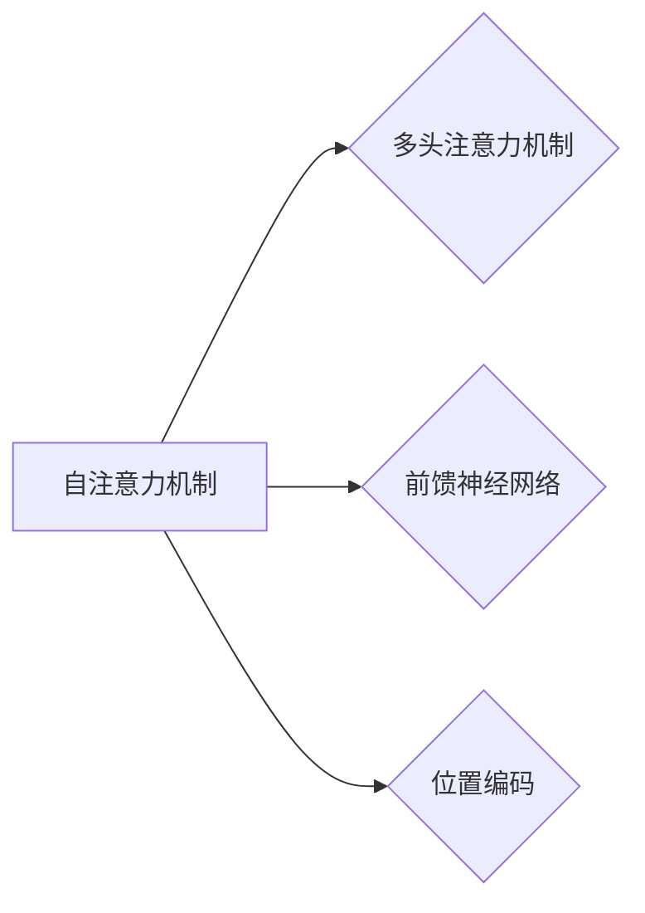

# 大规模语言模型从理论到实践 Transformer结构

作者：禅与计算机程序设计艺术 / Zen and the Art of Computer Programming

## 1. 背景介绍
### 1.1 问题的由来

随着互联网的快速发展，自然语言处理（NLP）领域面临着处理大规模文本数据的需求。传统的循环神经网络（RNN）在处理长序列数据时存在梯度消失或梯度爆炸问题，难以捕捉序列中的长距离依赖关系。为了解决这些问题，研究人员提出了Transformer结构，并成功应用于各种NLP任务，取得了显著的性能提升。本文将深入探讨Transformer结构的原理、实现和应用，帮助读者全面了解大规模语言模型的实践。

### 1.2 研究现状

近年来，基于Transformer的大规模语言模型在NLP领域取得了显著的成果，如BERT、GPT系列、T5等。这些模型在多项NLP任务中取得了SOTA（State-of-the-Art）性能，推动了NLP技术的快速发展。

### 1.3 研究意义

研究Transformer结构有助于我们深入理解大规模语言模型的工作原理，推动NLP技术的进步。同时，掌握Transformer结构的相关知识，可以帮助开发者更好地设计和应用大规模语言模型，为各种自然语言处理任务提供解决方案。

### 1.4 本文结构

本文将分为以下几个部分：

- 第2章介绍核心概念与联系，回顾与Transformer相关的关键技术。
- 第3章详细讲解Transformer结构，包括其原理、操作步骤、优缺点和应用领域。
- 第4章分析Transformer的数学模型和公式，并通过实例进行说明。
- 第5章提供代码实例，展示如何使用PyTorch实现Transformer结构。
- 第6章探讨Transformer在实际应用场景中的案例。
- 第7章推荐相关工具和资源，帮助读者深入学习。
- 第8章总结研究成果，展望未来发展趋势与挑战。
- 第9章列出常见问题与解答，方便读者查阅。

## 2. 核心概念与联系
### 2.1 相关概念

为了更好地理解Transformer结构，以下是一些相关的核心概念：

- **自注意力机制（Self-Attention）**：一种基于序列中每个词与所有词的关联度进行计算的方法，能够捕捉长距离依赖关系。
- **多头注意力机制（Multi-Head Attention）**：通过将自注意力机制分解为多个子模块，提高模型的表示能力。
- **前馈神经网络（Feed-Forward Neural Network）**：一种前向传播的网络结构，用于非线性变换。
- **位置编码（Positional Encoding）**：一种为序列添加位置信息的技巧，帮助模型理解序列的顺序关系。

### 2.2 关系图

以下展示了这些核心概念之间的关系：



## 3. 核心算法原理 & 具体操作步骤
### 3.1 算法原理概述

Transformer结构主要由自注意力机制、多头注意力机制、前馈神经网络和位置编码组成。以下是各组件的简要介绍：

- **自注意力机制**：将序列中的每个词与所有词进行关联度计算，从而捕捉长距离依赖关系。
- **多头注意力机制**：将自注意力机制分解为多个子模块，提高模型的表示能力。
- **前馈神经网络**：对每个词进行非线性变换，增加模型的表达能力。
- **位置编码**：为序列添加位置信息，帮助模型理解序列的顺序关系。

### 3.2 算法步骤详解

以下为Transformer结构的具体操作步骤：

1. **输入序列**：将输入序列进行分词，并转换为词向量。
2. **位置编码**：为词向量添加位置信息。
3. **多头注意力机制**：将词向量分解为多个子模块，计算每个子模块的注意力分数。
4. **前馈神经网络**：对每个词进行非线性变换。
5. **层归一化**：对每个步骤的结果进行归一化处理。
6. **残差连接**：将每个步骤的结果与之前的输出进行拼接。
7. **输出层**：将最终的输出结果进行分类、回归等操作。

### 3.3 算法优缺点

**优点**：

- **并行计算**：Transformer结构可以并行计算，加速模型训练和推理过程。
- **捕捉长距离依赖**：自注意力机制能够捕捉长距离依赖关系，提高模型的表达能力。
- **无循环结构**：无循环结构使得模型更容易训练，避免了梯度消失和梯度爆炸问题。

**缺点**：

- **计算复杂度**：多头注意力机制的引入增加了模型的计算复杂度。
- **参数量**：Transformer结构参数量较大，需要大量的计算资源。

### 3.4 算法应用领域

Transformer结构在以下NLP任务中取得了显著的成果：

- **文本分类**：如情感分析、主题分类等。
- **序列标注**：如命名实体识别、词性标注等。
- **机器翻译**：将源语言文本翻译成目标语言。
- **文本生成**：如摘要、诗歌创作等。

## 4. 数学模型和公式 & 详细讲解 & 举例说明
### 4.1 数学模型构建

以下为Transformer结构的数学模型：

$$
\text{Transformer}(\mathbf{x}) = \text{LayerNorm}(\text{Residual}(F(\text{MultiHeadAttention}(F(\text{LayerNorm}(\mathbf{W}(\text{PositionalEncoding}(\mathbf{x}))))))) + \mathbf{x}
$$

其中，$\mathbf{x}$ 为输入序列，$\mathbf{W}$ 为权重矩阵，$\mathbf{F}$ 为前馈神经网络，$\text{MultiHeadAttention}$ 为多头注意力机制，$\text{LayerNorm}$ 为层归一化。

### 4.2 公式推导过程

以下以自注意力机制为例，介绍公式推导过程：

假设输入序列 $\mathbf{x} = [x_1, x_2, \ldots, x_n]$，其中 $x_i \in \mathbb{R}^d$。自注意力机制的公式如下：

$$
\text{Attention}(\mathbf{x}) = \frac{\text{softmax}(\mathbf{QW}_k \mathbf{x})\mathbf{KV}_v^T}{\sqrt{d_k}}
$$

其中，$Q$、$K$、$V$ 分别为查询（Query）、键（Key）和值（Value）矩阵，$W_k$ 和 $W_v$ 为权重矩阵，$\text{softmax}$ 为softmax函数，$\sqrt{d_k}$ 为归一化因子。

### 4.3 案例分析与讲解

以下以BERT模型为例，分析其Transformer结构的实现：

```python
import torch
import torch.nn as nn
from transformers import BertModel

class BertForSequenceClassification(nn.Module):
    def __init__(self, bert_model):
        super(BertForSequenceClassification, self).__init__()
        self.bert = bert_model
        self.classifier = nn.Linear(self.bert.config.hidden_size, 2)

    def forward(self, input_ids, attention_mask=None, token_type_ids=None):
        outputs = self.bert(input_ids, attention_mask=attention_mask, token_type_ids=token_type_ids)
        sequence_output = outputs[0]
        logits = self.classifier(sequence_output[:, 0, :])
        return logits
```

该模型首先使用BERT预训练模型进行文本编码，然后将第一个词的隐藏状态输入到分类器中进行分类。

### 4.4 常见问题解答

**Q1：Transformer结构如何解决RNN的梯度消失和梯度爆炸问题？**

A1：Transformer结构采用自注意力机制，能够捕捉长距离依赖关系，避免了RNN中存在的梯度消失和梯度爆炸问题。

**Q2：多头注意力机制的作用是什么？**

A2：多头注意力机制将自注意力机制分解为多个子模块，提高模型的表示能力，使模型能够学习到更丰富的特征。

**Q3：如何提高Transformer结构的计算效率？**

A3：可以通过以下方法提高Transformer结构的计算效率：

- 使用更小的模型参数
- 采用量化技术
- 使用混合精度训练

## 5. 项目实践：代码实例和详细解释说明
### 5.1 开发环境搭建

在进行项目实践前，我们需要搭建以下开发环境：

- Python 3.7+
- PyTorch 1.7+
- Transformers库

### 5.2 源代码详细实现

以下为使用PyTorch和Transformers库实现BERT模型的代码示例：

```python
import torch
import torch.nn as nn
from transformers import BertModel, AdamW, get_linear_schedule_with_warmup

class BertForSequenceClassification(nn.Module):
    def __init__(self, bert_model):
        super(BertForSequenceClassification, self).__init__()
        self.bert = bert_model
        self.classifier = nn.Linear(self.bert.config.hidden_size, 2)

    def forward(self, input_ids, attention_mask=None, token_type_ids=None):
        outputs = self.bert(input_ids, attention_mask=attention_mask, token_type_ids=token_type_ids)
        sequence_output = outputs[0]
        logits = self.classifier(sequence_output[:, 0, :])
        return logits

# 加载预训练模型
bert_model = BertModel.from_pretrained('bert-base-uncased')
model = BertForSequenceClassification(bert_model)

# 定义优化器和学习率调度器
optimizer = AdamW(model.parameters(), lr=5e-5)
scheduler = get_linear_schedule_with_warmup(optimizer, num_warmup_steps=0, num_training_steps=1000)

# 训练模型
for epoch in range(3):
    for batch in dataloader:
        input_ids, attention_mask, labels = batch
        optimizer.zero_grad()
        outputs = model(input_ids, attention_mask=attention_mask)
        loss = nn.CrossEntropyLoss()(outputs, labels)
        loss.backward()
        optimizer.step()
        scheduler.step()
```

### 5.3 代码解读与分析

- `BertForSequenceClassification` 类：定义了BERT序列分类模型的类，包含预训练模型、分类器等组件。
- 加载预训练模型：使用 `BertModel.from_pretrained` 方法加载预训练的BERT模型。
- 定义优化器和学习率调度器：使用 `AdamW` 优化器和 `get_linear_schedule_with_warmup` 学习率调度器进行训练。
- 训练模型：迭代训练数据，计算损失并更新模型参数。

### 5.4 运行结果展示

在训练过程中，我们可以使用以下命令查看训练进度和损失：

```python
print(f"Epoch {epoch+1}, loss: {loss.item()}")
```

在训练结束后，我们可以使用以下命令评估模型性能：

```python
test_loss = 0.0
test_accuracy = 0.0

for batch in test_dataloader:
    input_ids, attention_mask, labels = batch
    optimizer.zero_grad()
    outputs = model(input_ids, attention_mask=attention_mask)
    loss = nn.CrossEntropyLoss()(outputs, labels)
    test_loss += loss.item()
    preds = outputs.logits.argmax(dim=1)
    test_accuracy += (preds == labels).sum().item()

test_loss /= len(test_dataloader)
test_accuracy /= len(test_dataloader)

print(f"Test loss: {test_loss:.4f}, Test accuracy: {test_accuracy:.4f}")
```

## 6. 实际应用场景
### 6.1 文本分类

Transformer结构在文本分类任务中取得了显著的成果。以下是一些基于Transformer的文本分类模型：

- BERT：基于Transformer的预训练语言模型，在多项文本分类任务中取得了SOTA性能。
- RoBERTa：对BERT进行改进，在多个NLP任务中取得了更好的性能。
- DistilBERT：通过知识蒸馏技术，将BERT的预训练知识迁移到更小的模型中。

### 6.2 机器翻译

Transformer结构在机器翻译任务中也取得了显著的成果。以下是一些基于Transformer的机器翻译模型：

-神经机器翻译（NMT）：基于Transformer的神经机器翻译模型，在多项机器翻译任务中取得了SOTA性能。
- T5：基于Transformer的端到端文本到文本学习模型，可以处理各种NLP任务。

### 6.3 文本生成

Transformer结构在文本生成任务中也取得了显著的成果。以下是一些基于Transformer的文本生成模型：

- GPT：基于Transformer的预训练语言模型，可以生成各种自然语言文本。
- GPT-2：GPT的改进版本，具有更大的模型规模和更强的生成能力。

## 7. 工具和资源推荐
### 7.1 学习资源推荐

以下是一些学习Transformer结构的资源：

- 《Deep Learning with PyTorch》
- 《Transformers: State-of-the-Art Natural Language Processing with Transformers》
- Hugging Face官网文档：https://huggingface.co/
- Transformer原理与实现：https://github.com/huggingface/transformers

### 7.2 开发工具推荐

以下是一些用于开发Transformer结构的工具：

- PyTorch：https://pytorch.org/
- Transformers库：https://huggingface.co/
- TensorFlow：https://www.tensorflow.org/

### 7.3 相关论文推荐

以下是一些与Transformer结构相关的论文：

- "Attention is All You Need"
- "BERT: Pre-training of Deep Bidirectional Transformers for Language Understanding"
- "Generative Language Models: A Survey of Recent Advances"
- "T5: Text-to-Text Transfer Transformer"

### 7.4 其他资源推荐

以下是一些其他与Transformer结构相关的资源：

- BERT实战教程：https://github.com/huggingface/transformers-tutorials
- Transformer模型开源代码：https://github.com/huggingface/transformers

## 8. 总结：未来发展趋势与挑战
### 8.1 研究成果总结

本文深入探讨了Transformer结构的原理、实现和应用，展示了其在NLP领域的广泛应用。Transformer结构已成为NLP领域的重要范式，推动了NLP技术的快速发展。

### 8.2 未来发展趋势

未来，Transformer结构将在以下方面取得进一步发展：

- 模型规模将继续扩大，模型参数量将达到数以亿计。
- 模型将更加高效，计算复杂度和内存占用将进一步降低。
- 模型将更加灵活，能够处理更多样化的NLP任务。
- 模型将更加安全，能够避免偏见和歧视。

### 8.3 面临的挑战

Transformer结构在应用过程中也面临着以下挑战：

- 计算资源消耗大，对硬件要求高。
- 模型可解释性不足，难以理解模型的决策过程。
- 模型存在偏见和歧视，需要进一步改进。

### 8.4 研究展望

未来，研究人员需要关注以下研究方向：

- 开发更轻量级的Transformer模型，降低计算资源消耗。
- 提高模型的可解释性和透明度，方便理解和调试。
- 降低模型的偏见和歧视，使其更加公平和可靠。

## 9. 附录：常见问题与解答

**Q1：什么是Transformer结构？**

A1：Transformer结构是一种基于自注意力机制和前馈神经网络的深度学习模型，在NLP领域取得了显著的成果。

**Q2：Transformer结构如何解决RNN的梯度消失和梯度爆炸问题？**

A2：Transformer结构采用自注意力机制，能够捕捉长距离依赖关系，避免了RNN中存在的梯度消失和梯度爆炸问题。

**Q3：什么是多头注意力机制？**

A3：多头注意力机制将自注意力机制分解为多个子模块，提高模型的表示能力。

**Q4：如何提高Transformer结构的计算效率？**

A4：可以通过以下方法提高Transformer结构的计算效率：

- 使用更小的模型参数
- 采用量化技术
- 使用混合精度训练

**Q5：Transformer结构在哪些NLP任务中取得了显著成果？**

A5：Transformer结构在以下NLP任务中取得了显著成果：

- 文本分类
- 机器翻译
- 文本生成
- 命名实体识别
- 问答系统

通过不断研究和改进，相信Transformer结构将在NLP领域发挥越来越重要的作用，为构建更智能的语言处理系统提供有力支持。

---

作者：禅与计算机程序设计艺术 / Zen and the Art of Computer Programming