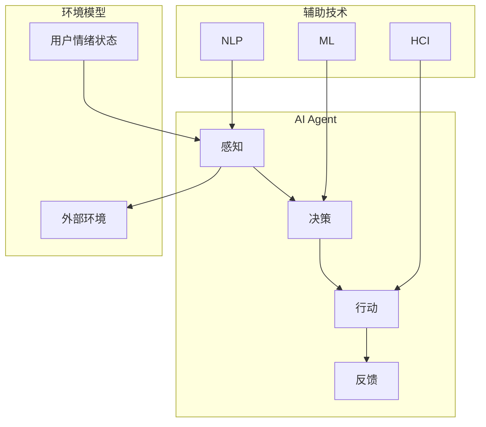

# AI Agent在情感陪伴中的角色

> 关键词：情感陪伴，AI Agent，自然语言处理，机器学习，人机交互，心理健康

## 1. 背景介绍

在快速发展的科技时代，人工智能（AI）已经成为我们生活中不可或缺的一部分。从智能家居到自动驾驶，AI正在改变我们的生活方式。然而，AI在情感陪伴这一领域的应用，却是一个相对较新的研究方向。随着社会结构的变化和人口老龄化的加剧，人们对情感陪伴的需求日益增长。AI Agent作为一种新型的智能实体，开始在情感陪伴中扮演着越来越重要的角色。

### 1.1 问题的由来

传统的社会支持和家庭结构正面临挑战，人们的生活节奏加快，工作压力增大，导致情感陪伴的需求日益增长。然而，现实中的陪伴资源有限，尤其是在一些特殊群体中，如孤独症儿童、老年人、抑郁症患者等，他们的情感陪伴需求更为迫切。

### 1.2 研究现状

近年来，AI Agent在情感陪伴领域的应用研究逐渐增多。研究者们尝试利用自然语言处理（NLP）、机器学习（ML）和人机交互（HCI）等技术，开发出能够理解和满足人们情感需求的AI Agent。

### 1.3 研究意义

AI Agent在情感陪伴中的应用具有重要的研究意义：

- 提供持续的情感支持，弥补现实陪伴资源的不足。
- 改善特殊群体的生活质量，提高他们的心理健康水平。
- 推动人工智能技术在人类生活中的应用，促进AI与人类关系的和谐发展。

### 1.4 本文结构

本文将分为以下几个部分：

- 第2部分，介绍AI Agent在情感陪伴中的核心概念和架构。
- 第3部分，阐述AI Agent的情感陪伴算法原理和具体操作步骤。
- 第4部分，讲解AI Agent的情感陪伴数学模型和公式。
- 第5部分，展示AI Agent情感陪伴的代码实例和解释说明。
- 第6部分，探讨AI Agent在情感陪伴中的实际应用场景。
- 第7部分，展望AI Agent在情感陪伴领域的未来发展趋势和挑战。
- 第8部分，总结全文，并对研究展望。

## 2. 核心概念与联系

### 2.1 核心概念

- AI Agent：指具有自主行为、能够感知环境并作出决策的智能实体。
- 情感陪伴：指通过语言、行为等方式，满足人们对情感交流、心理支持的需求。
- 自然语言处理（NLP）：指计算机理解和生成人类语言的技术。
- 机器学习（ML）：指使计算机系统能够从数据中学习并作出决策的技术。
- 人机交互（HCI）：指研究人与计算机之间交互的技术。

### 2.2 架构

以下是一个简化的AI Agent情感陪伴架构：



AI Agent通过感知用户情绪状态和外部环境，结合NLP、ML和HCI技术，进行决策和行动，并接收用户的反馈，形成一个闭环的交互过程。

## 3. 核心算法原理 & 具体操作步骤

### 3.1 算法原理概述

AI Agent情感陪伴的核心算法主要包括以下三个方面：

- 情感识别：通过NLP技术分析用户语言中的情感倾向，识别用户情绪状态。
- 情感理解：通过ML技术理解用户情感背后的原因，预测用户的未来情绪变化。
- 情感响应：根据用户情绪状态和预测结果，生成合适的情感响应。

### 3.2 算法步骤详解

1. **情感识别**：使用情感分析模型对用户语言进行情感分析，识别用户情绪状态。例如，可以使用VADER、TextBlob等情感分析工具。
2. **情感理解**：使用情感理解模型对用户情绪背后的原因进行分析，预测用户未来的情绪变化。例如，可以使用LSTM、Transformer等序列模型。
3. **情感响应**：根据用户情绪状态和预测结果，生成合适的情感响应。例如，可以使用生成式文本模型，如GPT-2、T5等。

### 3.3 算法优缺点

**优点**：

- 可持续的情感支持：AI Agent可以随时随地为用户提供陪伴，不受时间和地点的限制。
- 定制的情感响应：AI Agent可以根据用户的具体情况生成个性化的情感响应。
- 客观公正：AI Agent在陪伴过程中不会受到个人情感因素的影响。

**缺点**：

- 技术依赖：AI Agent的性能取决于NLP、ML和HCI等技术的成熟度。
- 缺乏同理心：AI Agent无法像人类一样真正理解用户的情感需求。

### 3.4 算法应用领域

AI Agent在情感陪伴领域的应用领域包括：

- 孤独症儿童陪伴
- 老年人陪伴
- 抑郁症患者陪伴
- 心理咨询服务
- 儿童教育

## 4. 数学模型和公式 & 详细讲解 & 举例说明

### 4.1 数学模型构建

AI Agent情感陪伴的核心数学模型包括：

- 情感识别模型：通常使用情感分析模型，如SVM、Naive Bayes等。
- 情感理解模型：通常使用序列模型，如LSTM、GRU、Transformer等。
- 情感响应模型：通常使用生成式文本模型，如GPT-2、T5等。

### 4.2 公式推导过程

以下是一个简化的情感识别模型公式：

$$
y = f(x) 
$$

其中，$x$ 是输入文本，$y$ 是情感标签。$f(x)$ 表示情感识别模型。

### 4.3 案例分析与讲解

以下是一个简单的情感识别案例：

输入文本：`I feel so happy today!`

输出标签：`happy`

情感识别模型通过对输入文本进行情感分析，识别出用户情绪为“happy”。

## 5. 项目实践：代码实例和详细解释说明

### 5.1 开发环境搭建

为了实现AI Agent情感陪伴，我们需要搭建以下开发环境：

- Python开发环境
- NLP库（如NLTK、spaCy）
- ML库（如scikit-learn、TensorFlow、PyTorch）
- 文本生成库（如GPT-2、T5）

### 5.2 源代码详细实现

以下是一个简单的AI Agent情感陪伴代码实例：

```python
import nltk
from nltk.sentiment import SentimentIntensityAnalyzer

# 初始化情感分析模型
sia = SentimentIntensityAnalyzer()

# 情感分析函数
def analyze_sentiment(text):
    return sia.polarity_scores(text)

# 情感响应函数
def respond_to_sentiment(sentiment_score):
    if sentiment_score['compound'] >= 0.05:
        return "I'm glad to hear that you're feeling good!"
    elif sentiment_score['compound'] <= -0.05:
        return "I'm sorry to hear that you're feeling bad. Would you like to talk about it?"
    else:
        return "It sounds like you're feeling neutral. Do you want to share more about your day?"

# 主函数
def main():
    text = input("What would you like to tell me? ")
    sentiment_score = analyze_sentiment(text)
    response = respond_to_sentiment(sentiment_score)
    print(response)

if __name__ == "__main__":
    main()
```

### 5.3 代码解读与分析

上述代码展示了如何使用Python实现一个简单的AI Agent情感陪伴程序。程序首先初始化一个情感分析模型，然后定义了情感分析和情感响应函数。在主函数中，程序提示用户输入文本，分析其情感，并生成相应的情感响应。

### 5.4 运行结果展示

运行程序后，用户可以输入自己的感受，程序将根据用户输入的情感分析结果，生成相应的情感响应。

```
What would you like to tell me? I feel so happy today!
I'm glad to hear that you're feeling good!
```

## 6. 实际应用场景

AI Agent在情感陪伴中的实际应用场景包括：

- **孤独症儿童陪伴**：AI Agent可以帮助孤独症儿童进行日常交流，提高他们的社交能力。
- **老年人陪伴**：AI Agent可以陪伴老年人聊天、娱乐，减轻他们的孤独感，提高生活质量。
- **抑郁症患者陪伴**：AI Agent可以帮助抑郁症患者进行情绪宣泄，提供心理支持。
- **心理咨询服务**：AI Agent可以作为心理咨询服务的一部分，为用户提供初步的心理健康评估和建议。
- **儿童教育**：AI Agent可以陪伴儿童学习，提供个性化的学习建议。

## 7. 工具和资源推荐

### 7.1 学习资源推荐

- 《自然语言处理综论》（Peter D. Turney）
- 《机器学习》（Tom M. Mitchell）
- 《人机交互：设计、评估与实施》（John M. Carroll）

### 7.2 开发工具推荐

- Python
- NLTK
- spaCy
- TensorFlow
- PyTorch

### 7.3 相关论文推荐

- **《Affective Computing: Where Are We and Where Do We Go from Here?》** by Rosalind Picard
- **《The State of the Art in Sentiment Analysis: A Survey》** by S. Thelwall, K. Tan, and J. Howard
- **《A Survey of Deep Learning Techniques for Sentiment Analysis》** by S. Wang, Y. Li, and Y. Zhang

## 8. 总结：未来发展趋势与挑战

### 8.1 研究成果总结

本文介绍了AI Agent在情感陪伴中的角色，阐述了其核心概念、算法原理、应用场景等。通过实际代码实例，展示了如何利用Python实现一个简单的AI Agent情感陪伴程序。

### 8.2 未来发展趋势

- **个性化情感陪伴**：AI Agent将根据用户的个性和需求，提供更加个性化的情感陪伴服务。
- **多模态情感识别**：AI Agent将结合文本、语音、图像等多模态信息，更准确地识别用户的情绪状态。
- **情感理解与生成**：AI Agent将具备更深入的情感理解和生成能力，提供更加丰富的情感互动。

### 8.3 面临的挑战

- **技术挑战**：如何提高AI Agent的情感识别和理解的准确性，以及如何生成更加自然、流畅的情感响应。
- **伦理挑战**：如何确保AI Agent在情感陪伴中的行为符合伦理道德规范，避免对用户造成负面影响。
- **隐私挑战**：如何保护用户的隐私，防止敏感信息泄露。

### 8.4 研究展望

AI Agent在情感陪伴中的应用前景广阔。随着技术的不断发展和完善，AI Agent将为人们提供更加温馨、贴心的陪伴，成为人类生活中不可或缺的一部分。

## 9. 附录：常见问题与解答

**Q1：AI Agent能否完全替代人类进行情感陪伴？**

A：AI Agent可以提供持续的情感支持，但不能完全替代人类进行情感陪伴。人类具有独特的情感表达和同理心，这是AI Agent难以复制的。

**Q2：AI Agent在情感陪伴中的应用有哪些潜在风险？**

A：AI Agent在情感陪伴中可能存在以下潜在风险：

- 情感误判：AI Agent可能无法准确识别用户的情绪状态，导致情感响应不当。
- 隐私泄露：AI Agent可能收集用户的个人信息，导致隐私泄露。
- 依赖性增强：用户可能过度依赖AI Agent，影响人际交往。

**Q3：如何提高AI Agent在情感陪伴中的性能？**

A：提高AI Agent在情感陪伴中的性能可以从以下几个方面入手：

- 优化情感识别和理解的算法。
- 收集更多高质量的数据，提高模型的泛化能力。
- 加强AI Agent的人机交互设计，提高用户满意度。

**Q4：AI Agent在情感陪伴中的应用有哪些伦理道德问题？**

A：AI Agent在情感陪伴中的应用可能涉及以下伦理道德问题：

- 同理心：AI Agent是否能够真正理解人类的情感需求。
- 价值观：AI Agent的行为是否符合人类的价值观。
- 责任归属：AI Agent的行为导致不良后果时，责任应由谁来承担。

作者：禅与计算机程序设计艺术 / Zen and the Art of Computer Programming