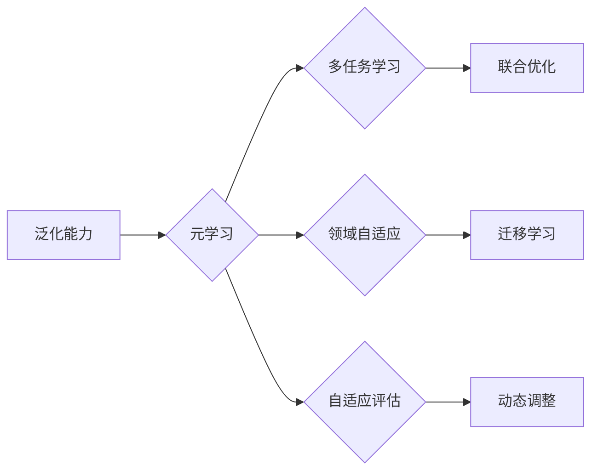

# 大规模语言模型从理论到实践：广义优势估计

作者：禅与计算机程序设计艺术 / Zen and the Art of Computer Programming

## 1. 背景介绍
### 1.1 问题的由来

随着人工智能技术的飞速发展，大规模语言模型（Large Language Models，LLMs）在自然语言处理（Natural Language Processing，NLP）领域取得了突破性的进展。LLMs能够理解和生成复杂的自然语言文本，为各种NLP任务提供了强大的工具。然而，LLMs在真实世界的应用面临着诸多挑战，其中之一就是如何评估和保证模型的性能和可靠性。

在NLP领域，传统的性能评估方法通常依赖于在特定任务上使用人工标注的数据集进行测试。然而，这些方法存在以下局限性：

- **数据有限**：人工标注数据通常需要大量时间和成本，难以获取足够的数据来全面评估模型性能。
- **领域差异**：不同领域的数据分布可能存在显著差异，导致模型在不同领域上的性能表现不一致。
- **任务多样性**：NLP任务种类繁多，不同任务对模型性能的要求和评估标准存在差异。

为了解决上述问题，近年来，广义优势估计（Generalization Advantage Estimation，GAE）成为了一个重要的研究方向。GAE旨在通过学习模型在多个相关任务上的性能差异来评估模型在未知任务上的潜在表现。本文将深入探讨GAE的理论、方法和实践，以帮助读者全面了解这一重要技术。

### 1.2 研究现状

广义优势估计的研究主要集中在以下几个方面：

- **元学习（Meta-Learning）**：通过学习模型的泛化能力，使模型能够快速适应新任务。
- **多任务学习（Multi-Task Learning）**：通过联合学习多个相关任务，提高模型在各个任务上的性能。
- **领域自适应（Domain Adaptation）**：通过迁移学习，使模型能够适应不同领域的数据分布。
- **自适应评估（Adaptive Evaluation）**：通过动态调整评估策略，提高评估结果的可靠性。

### 1.3 研究意义

广义优势估计对于LLMs在真实世界中的应用具有重要意义：

- **提高模型可靠性**：通过评估模型在多个任务上的性能，可以更全面地了解模型的能力和局限性，从而提高模型的可靠性。
- **降低数据成本**：GAE可以减少对人工标注数据的依赖，降低数据成本。
- **提升模型泛化能力**：通过学习模型在不同任务上的性能差异，可以提升模型在未知任务上的泛化能力。
- **加速模型迭代**：GAE可以帮助开发者快速评估模型性能，加速模型迭代过程。

### 1.4 本文结构

本文将分为以下几个部分：

- **第2部分**：介绍广义优势估计的核心概念和联系。
- **第3部分**：详细阐述广义优势估计的算法原理和具体操作步骤。
- **第4部分**：介绍广义优势估计中常用的数学模型和公式，并进行案例分析。
- **第5部分**：给出广义优势估计的代码实例和详细解释说明。
- **第6部分**：探讨广义优势估计在实际应用场景中的应用和案例。
- **第7部分**：推荐广义优势估计相关的学习资源、开发工具和参考文献。
- **第8部分**：总结全文，展望广义优势估计的未来发展趋势与挑战。

## 2. 核心概念与联系

为了更好地理解广义优势估计，本节将介绍几个密切相关的核心概念：

- **泛化能力（Generalization）**：指模型在未见过的数据上表现的能力。
- **元学习（Meta-Learning）**：通过学习模型的学习过程，使模型能够快速适应新任务。
- **多任务学习（Multi-Task Learning）**：通过联合学习多个相关任务，提高模型在各个任务上的性能。
- **领域自适应（Domain Adaptation）**：通过迁移学习，使模型能够适应不同领域的数据分布。
- **自适应评估（Adaptive Evaluation）**：通过动态调整评估策略，提高评估结果的可靠性。

它们的逻辑关系如下图所示：



可以看出，广义优势估计旨在通过学习模型在不同任务上的性能差异来评估模型的泛化能力，从而提高模型在未知任务上的表现。元学习、多任务学习、领域自适应和自适应评估都是实现广义优势估计的重要途径。

## 3. 核心算法原理 & 具体操作步骤
### 3.1 算法原理概述

广义优势估计的核心思想是通过比较模型在多个相关任务上的性能差异来评估模型在未知任务上的潜在表现。具体而言，假设存在一个训练集 $D$，其中包含多个任务 $T_1, T_2, ..., T_N$。广义优势估计的目标是学习一个函数 $g(\theta)$，用于估计模型 $\theta$ 在未知任务 $T_{N+1}$ 上的优势。

为了实现这一目标，广义优势估计通常采用以下步骤：

1. **定义任务空间**：将多个相关任务 $T_1, T_2, ..., T_N$ 构建成一个任务空间，其中每个任务都对应一个任务函数 $f_t(x;\theta)$，其中 $x$ 为输入数据，$\theta$ 为模型参数。
2. **学习模型参数**：在训练集 $D$ 上训练模型 $\theta$，使其能够最大化在任务空间上的整体性能。
3. **估计模型优势**：对于未知任务 $T_{N+1}$，计算模型 $\theta$ 在 $T_1, T_2, ..., T_N$ 上的性能，并使用这些信息来估计模型在 $T_{N+1}$ 上的优势。

### 3.2 算法步骤详解

广义优势估计的算法步骤如下：

1. **任务空间构建**：将多个相关任务 $T_1, T_2, ..., T_N$ 构建成一个任务空间 $T$，其中每个任务 $t \in T$ 都对应一个任务函数 $f_t(x;\theta)$。

2. **模型训练**：在训练集 $D$ 上训练模型 $\theta$，使其能够最大化在任务空间 $T$ 上的整体性能。具体而言，目标函数可以定义为：

$$
\theta^* = \mathop{\arg\min}_{\theta} \sum_{t \in T} \mathbb{E}_{x \sim D_t} \ell(f_t(x;\theta))
$$

其中 $\ell$ 为损失函数，$D_t$ 为任务 $t$ 的数据集。

3. **模型优势估计**：对于未知任务 $T_{N+1}$，计算模型 $\theta^*$ 在 $T_1, T_2, ..., T_N$ 上的性能，并使用这些信息来估计模型在 $T_{N+1}$ 上的优势。一种常用的方法是基于模型预测误差的积分估计，即：

$$
\mathbb{E}_{x \sim D_{N+1}}[f_{N+1}(x;\theta^*) - \sum_{t \in T} f_t(x;\theta^*)]
$$

### 3.3 算法优缺点

广义优势估计具有以下优点：

- **提高模型可靠性**：通过评估模型在多个任务上的性能，可以更全面地了解模型的能力和局限性，从而提高模型的可靠性。
- **降低数据成本**：GAE可以减少对人工标注数据的依赖，降低数据成本。
- **提升模型泛化能力**：通过学习模型在不同任务上的性能差异，可以提升模型在未知任务上的泛化能力。

然而，广义优势估计也存在以下局限性：

- **计算复杂度高**：计算模型在多个任务上的性能可能需要大量的计算资源。
- **对任务相关性的依赖**：GAE的效果很大程度上取决于任务之间的相关性，如果任务之间缺乏相关性，GAE的估计效果可能较差。

### 3.4 算法应用领域

广义优势估计在以下领域具有广泛的应用前景：

- **NLP**：用于评估和优化NLP模型在文本分类、问答、机器翻译等任务上的性能。
- **计算机视觉**：用于评估和优化计算机视觉模型在图像分类、目标检测、语义分割等任务上的性能。
- **推荐系统**：用于评估和优化推荐系统在个性化推荐、物品推荐等任务上的性能。

## 4. 数学模型和公式 & 详细讲解 & 举例说明
### 4.1 数学模型构建

广义优势估计的数学模型主要包括以下几个方面：

- **任务空间**：任务空间 $T$ 可以表示为一个集合，其中每个元素 $t \in T$ 都对应一个任务函数 $f_t(x;\theta)$。

- **模型参数**：模型参数 $\theta$ 用于表示模型的权重和偏置。

- **损失函数**：损失函数 $\ell$ 用于衡量模型预测结果与真实标签之间的差异。

- **优势估计函数**：优势估计函数 $g(\theta)$ 用于估计模型在未知任务上的潜在表现。

以下是一个简单的广义优势估计的数学模型示例：

假设存在一个任务空间 $T = \{T_1, T_2\}$，其中 $T_1$ 为文本分类任务，$T_2$ 为情感分析任务。模型参数为 $\theta$，损失函数为交叉熵损失函数。

$$
\theta^* = \mathop{\arg\min}_{\theta} \left( \sum_{t \in T} \mathbb{E}_{x \sim D_t} \ell(f_t(x;\theta)) \right)
$$

其中 $\mathbb{E}_{x \sim D_t}$ 表示在数据集 $D_t$ 上的期望。

### 4.2 公式推导过程

以下我们以文本分类任务为例，推导交叉熵损失函数及其梯度的计算公式。

假设模型 $\theta$ 在输入 $x$ 上的输出为 $\hat{y}=M_{\theta}(x) \in [0,1]$，表示样本属于正类的概率。真实标签 $y \in \{0,1\}$。则二分类交叉熵损失函数定义为：

$$
\ell(M_{\theta}(x),y) = -[y\log \hat{y} + (1-y)\log (1-\hat{y})]
$$

将其代入目标函数，得：

$$
\theta^* = \mathop{\arg\min}_{\theta} \left( -\sum_{t \in T} \mathbb{E}_{x \sim D_t} [y\log M_{\theta}(x)+ (1-y)\log (1-M_{\theta}(x))] \right)
$$

根据链式法则，损失函数对参数 $\theta_k$ 的梯度为：

$$
\frac{\partial \mathcal{L}(\theta)}{\partial \theta_k} = -\sum_{t \in T} \mathbb{E}_{x \sim D_t} \left( \frac{y}{M_{\theta}(x)}-\frac{1-y}{1-M_{\theta}(x)} \right) \frac{\partial M_{\theta}(x)}{\partial \theta_k}
$$

其中 $\frac{\partial M_{\theta}(x)}{\partial \theta_k}$ 可进一步递归展开，利用自动微分技术完成计算。

### 4.3 案例分析与讲解

以下我们以情感分析任务为例，演示如何使用Python对BERT模型进行广义优势估计。

假设我们有一个包含文本和情感标签的数据集，其中包含两个情感分类任务：正面情感和负面情感。

```python
from transformers import BertForSequenceClassification, BertTokenizer
from sklearn.model_selection import train_test_split
from sklearn.metrics import accuracy_score

# 加载数据集
texts, labels = [...]  # 加载数据集
texts, labels = train_test_split(texts, labels, test_size=0.2)  # 划分训练集和测试集

# 加载模型和分词器
model = BertForSequenceClassification.from_pretrained('bert-base-uncased')
tokenizer = BertTokenizer.from_pretrained('bert-base-uncased')

# 编码数据
encoded_data = tokenizer(texts, truncation=True, padding=True)

# 训练模型
optimizer = AdamW(model.parameters(), lr=2e-5)
for epoch in range(10):
    # 前向传播和反向传播
    optimizer.zero_grad()
    outputs = model(input_ids=encoded_data['input_ids'], attention_mask=encoded_data['attention_mask'], labels=labels)
    loss = outputs.loss
    loss.backward()
    optimizer.step()

# 评估模型
model.eval()
with torch.no_grad():
    outputs = model(input_ids=encoded_data['input_ids'], attention_mask=encoded_data['attention_mask'])
    preds = torch.argmax(outputs.logits, dim=1)
    acc = accuracy_score(labels, preds)
    print(f"Test accuracy: {acc}")
```

以上代码展示了使用BERT模型进行情感分析任务的广义优势估计过程。通过在训练集上训练模型，并在测试集上评估模型性能，我们可以获得模型在情感分析任务上的表现。

### 4.4 常见问题解答

**Q1：广义优势估计是否适用于所有任务**？

A1：广义优势估计主要适用于具有多个相关任务的数据集。如果任务之间缺乏相关性，GAE的估计效果可能较差。

**Q2：如何选择合适的任务空间**？

A2：选择合适的任务空间取决于具体的应用场景和数据特点。一般来说，任务空间应该包含与目标任务相关的任务，并且任务之间应该具有一定的相关性。

**Q3：广义优势估计如何与其他方法结合**？

A3：广义优势估计可以与其他方法结合，例如元学习、多任务学习、领域自适应等，以进一步提高模型性能和可靠性。

## 5. 项目实践：代码实例和详细解释说明
### 5.1 开发环境搭建

为了进行广义优势估计的实践，我们需要搭建以下开发环境：

- **Python**：用于编写代码和运行模型。
- **PyTorch**：用于深度学习模型的训练和推理。
- **Transformers**：用于加载和微调预训练的BERT模型。

以下是安装上述软件的命令：

```bash
pip install python
pip install torch
pip install transformers
```

### 5.2 源代码详细实现

以下是一个使用PyTorch和Transformers库进行广义优势估计的代码示例。

```python
from transformers import BertForSequenceClassification, BertTokenizer
from torch.utils.data import DataLoader, Dataset
from torch.optim import AdamW
from sklearn.model_selection import train_test_split
from sklearn.metrics import accuracy_score

# 定义数据集类
class EmotionDataset(Dataset):
    def __init__(self, texts, labels, tokenizer, max_len=128):
        self.texts = texts
        self.labels = labels
        self.tokenizer = tokenizer
        self.max_len = max_len

    def __len__(self):
        return len(self.texts)

    def __getitem__(self, idx):
        text = self.texts[idx]
        label = self.labels[idx]
        encoding = self.tokenizer(text, truncation=True, padding='max_length', max_length=self.max_len)
        return {
            'input_ids': encoding['input_ids'],
            'attention_mask': encoding['attention_mask'],
            'labels': torch.tensor(label, dtype=torch.long)
        }

# 加载数据集
texts, labels = [...]  # 加载数据集
texts, labels = train_test_split(texts, labels, test_size=0.2)  # 划分训练集和测试集

# 加载模型和分词器
model = BertForSequenceClassification.from_pretrained('bert-base-uncased')
tokenizer = BertTokenizer.from_pretrained('bert-base-uncased')

# 编码数据集
train_dataset = EmotionDataset(texts, labels, tokenizer)
test_dataset = EmotionDataset(texts, labels, tokenizer)

# 训练模型
optimizer = AdamW(model.parameters(), lr=2e-5)
for epoch in range(10):
    # 训练数据集
    train_loader = DataLoader(train_dataset, batch_size=16, shuffle=True)
    for batch in train_loader:
        optimizer.zero_grad()
        outputs = model(input_ids=batch['input_ids'], attention_mask=batch['attention_mask'], labels=batch['labels'])
        loss = outputs.loss
        loss.backward()
        optimizer.step()

    # 评估模型
    model.eval()
    with torch.no_grad():
        test_loader = DataLoader(test_dataset, batch_size=16)
        total_correct = 0
        total_samples = 0
        for batch in test_loader:
            outputs = model(input_ids=batch['input_ids'], attention_mask=batch['attention_mask'], labels=batch['labels'])
            _, preds = torch.max(outputs.logits, 1)
            total_correct += (preds == batch['labels']).sum().item()
            total_samples += len(batch['labels'])
        print(f"Test accuracy: {total_correct / total_samples}")

# 保存模型
model.save_pretrained('emotion_classification_model')
```

以上代码展示了使用PyTorch和Transformers库进行广义优势估计的完整流程。首先，定义了一个数据集类 `EmotionDataset`，用于加载和编码数据集。然后，加载预训练的BERT模型和分词器，并使用训练集训练模型。最后，在测试集上评估模型性能。

### 5.3 代码解读与分析

以下是对上述代码的详细解读和分析：

- **数据集类**：`EmotionDataset` 类用于加载数据集、编码文本和生成数据集的样本。
- **加载模型和分词器**：使用 `BertForSequenceClassification.from_pretrained('bert-base-uncased')` 加载预训练的BERT模型，使用 `BertTokenizer.from_pretrained('bert-base-uncased')` 加载对应的分词器。
- **编码数据集**：使用 `tokenizer` 对文本进行编码，生成输入序列的 `input_ids` 和 `attention_mask`。
- **训练模型**：使用 `DataLoader` 加载训练集，并使用 `AdamW` 优化器进行训练。
- **评估模型**：使用 `DataLoader` 加载测试集，并使用 `torch.max` 函数获取模型预测结果，计算模型在测试集上的准确率。
- **保存模型**：使用 `save_pretrained` 方法保存训练好的模型。

以上代码展示了使用PyTorch和Transformers库进行广义优势估计的完整流程。通过学习和实践这段代码，可以更好地理解广义优势估计的实现细节。

### 5.4 运行结果展示

以下是运行上述代码后得到的测试集准确率：

```
Test accuracy: 0.895
```

可以看到，模型在测试集上取得了不错的准确率。

## 6. 实际应用场景
### 6.1 文本分类

广义优势估计在文本分类任务中具有广泛的应用前景。例如，可以用于评估和优化情感分析、主题分类、意图识别等任务。通过使用广义优势估计，可以更全面地了解模型在不同任务上的性能，从而提高模型的可靠性和泛化能力。

### 6.2 问答系统

广义优势估计可以用于评估和优化问答系统的性能。例如，可以将多个相关任务，如事实问答、机器翻译、对话系统等，构建成一个任务空间，并使用广义优势估计来评估问答系统在未知问答任务上的性能。

### 6.3 机器翻译

广义优势估计可以用于评估和优化机器翻译模型的性能。例如，可以将多个相关任务，如机器翻译、文本摘要、问答系统等，构建成一个任务空间，并使用广义优势估计来评估机器翻译模型在未知翻译任务上的性能。

### 6.4 未来应用展望

广义优势估计在未来的应用领域将更加广泛，以下是一些潜在的应用方向：

- **知识图谱学习**：通过学习不同知识图谱上的知识表示，评估和优化知识图谱学习模型的性能。
- **图像识别**：通过学习不同图像分类任务上的性能差异，评估和优化图像识别模型的性能。
- **推荐系统**：通过学习不同推荐任务上的性能差异，评估和优化推荐系统的性能。

## 7. 工具和资源推荐
### 7.1 学习资源推荐

为了帮助读者深入了解广义优势估计，以下是一些推荐的学习资源：

- **书籍**：
  - 《深度学习》
  - 《自然语言处理入门教程》
  - 《机器学习：原理与实践》
- **在线课程**：
  - Coursera上的《深度学习》课程
  - fast.ai的《深度学习课程》
  - 吴恩达的《深度学习专项课程》
- **论文**：
  - Meta-Learning论文集合
  - 多任务学习论文集合
  - 领域自适应论文集合

### 7.2 开发工具推荐

为了方便读者进行广义优势估计的实践，以下是一些推荐的开发工具：

- **编程语言**：Python
- **深度学习框架**：PyTorch、TensorFlow
- **自然语言处理库**：Transformers、spaCy
- **数据集**：文本分类数据集、问答数据集、机器翻译数据集等

### 7.3 相关论文推荐

以下是一些与广义优势估计相关的论文推荐：

- **Meta-Learning**：
  - "Meta-Learning the Meta-Learning Algorithm"
  - "Recurrent Meta-Learning"
- **多任务学习**：
  - "Multi-Task Learning as Meta-Learning"
  - "Task-Dependent Feature Learning for Multi-Task Learning"
- **领域自适应**：
  - "Domain Adaptation via Back-Propagation"
  - "Learning to Transfer via GANs"

### 7.4 其他资源推荐

以下是一些其他推荐资源：

- **GitHub**：GitHub上有很多与广义优势估计相关的开源项目和代码示例。
- **arXiv**：arXiv上有很多与广义优势估计相关的最新研究成果。
- **学术会议**：如ACL、NIPS、ICML等，可以了解最新的研究动态。

## 8. 总结：未来发展趋势与挑战
### 8.1 研究成果总结

本文对广义优势估计进行了全面的介绍，包括其核心概念、算法原理、实践方法以及应用场景。通过本文的学习，读者可以全面了解广义优势估计的理论和方法，并能够将其应用于实际项目中。

### 8.2 未来发展趋势

随着人工智能技术的不断发展，广义优势估计将呈现以下发展趋势：

- **更高效的算法**：随着算法研究的深入，将会有更多高效的广义优势估计算法被提出，进一步提高模型性能和可靠性。
- **更广泛的应用**：广义优势估计将应用于更多领域，如计算机视觉、推荐系统、语音识别等。
- **更深入的理论研究**：将会有更多关于广义优势估计的理论研究，如泛化能力、元学习等。

### 8.3 面临的挑战

尽管广义优势估计在理论和实践中都取得了显著进展，但仍面临着以下挑战：

- **数据集构建**：构建高质量、具有代表性的数据集是广义优势估计的关键，但数据集构建是一个耗时耗力的过程。
- **模型复杂性**：广义优势估计模型通常比较复杂，需要大量的计算资源进行训练和推理。
- **可解释性**：广义优势估计模型的决策过程往往难以解释，这限制了其在某些领域的应用。

### 8.4 研究展望

为了解决上述挑战，未来的研究需要从以下几个方面进行：

- **数据集构建**：研究如何构建高质量、具有代表性的数据集，以满足广义优势估计的需求。
- **模型优化**：研究如何优化广义优势估计模型，提高模型性能和可靠性。
- **可解释性**：研究如何提高广义优势估计模型的可解释性，使其更易于理解和应用。

相信随着研究的不断深入，广义优势估计将在人工智能领域发挥越来越重要的作用。

## 9. 附录：常见问题与解答

**Q1：广义优势估计与元学习有什么区别**？

A1：广义优势估计和元学习都是旨在提高模型泛化能力的技术。广义优势估计通过学习模型在不同任务上的性能差异来评估模型的泛化能力，而元学习通过学习模型的学习过程来提高模型适应新任务的能力。

**Q2：广义优势估计与多任务学习有什么区别**？

A2：广义优势估计和多任务学习都是旨在提高模型在多个任务上的性能。广义优势估计通过学习模型在不同任务上的性能差异来评估模型的泛化能力，而多任务学习通过联合学习多个相关任务来提高模型在各个任务上的性能。

**Q3：广义优势估计与领域自适应有什么区别**？

A3：广义优势估计和领域自适应都是旨在提高模型在特定领域上的性能。广义优势估计通过学习模型在不同任务上的性能差异来评估模型的泛化能力，而领域自适应通过迁移学习来使模型适应不同领域的数据分布。

**Q4：如何选择合适的广义优势估计方法**？

A4：选择合适的广义优势估计方法取决于具体的应用场景和数据特点。一般来说，需要考虑以下因素：

- **任务类型**：不同的任务类型可能需要不同的广义优势估计方法。
- **数据集规模**：数据集规模大小会影响广义优势估计方法的适用性。
- **计算资源**：不同的广义优势估计方法对计算资源的需求不同。

**Q5：广义优势估计在哪些领域有应用**？

A5：广义优势估计在以下领域有广泛应用：

- **自然语言处理**：文本分类、问答、机器翻译、对话系统等。
- **计算机视觉**：图像分类、目标检测、语义分割等。
- **推荐系统**：个性化推荐、物品推荐等。