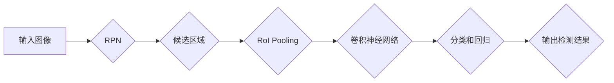

# Cascade R-CNN原理与代码实例讲解

> 关键词：目标检测，级联检测，区域提议网络，R-CNN，Fast R-CNN，Faster R-CNN，深度学习

## 1. 背景介绍

目标检测是计算机视觉领域的一项基础而重要的技术，它旨在识别图像中的多个目标并定位其位置。目标检测技术广泛应用于安防监控、自动驾驶、医疗影像分析等领域。随着深度学习技术的快速发展，基于深度学习的目标检测算法逐渐成为研究的热点。

R-CNN、Fast R-CNN、Faster R-CNN等一系列算法的提出，极大地推动了目标检测技术的发展。其中，Faster R-CNN的引入，通过引入区域提议网络（Region Proposal Network，RPN）来生成候选区域，使得目标检测的速度得到了显著提升。而Cascade R-CNN作为Faster R-CNN的改进版本，进一步提高了检测速度，并保持了较高的准确率。

本文将深入讲解Cascade R-CNN的原理，并通过代码实例展示其具体实现。

## 2. 核心概念与联系

### 2.1 核心概念

**R-CNN**：R-CNN是目标检测领域的一个经典算法，它通过以下步骤进行目标检测：

1. 使用选择性搜索（Selective Search）算法从图像中提取大量候选区域（Region of Interest，ROI）。
2. 对每个ROI使用SVM进行分类，判断是否包含目标。
3. 对包含目标的ROI使用ROI Pooling操作，将特征图映射到固定尺寸。
4. 使用深度卷积神经网络（CNN）对映射后的特征图进行分类和回归，输出目标的类别和位置。

**Fast R-CNN**：Fast R-CNN在R-CNN的基础上，通过以下方式提高了检测速度：

1. 使用Region of Interest Pooling（R-Pooling）替代ROI Pooling，直接在CNN的特征图上操作。
2. 使用ROI Align进行ROI的定位，避免了原图像上的坐标转换。
3. 在网络中引入Batch Normalization和Dropout来加速训练。

**Faster R-CNN**：Faster R-CNN进一步引入了区域提议网络（RPN），从而减少了候选区域的数量，提高了检测速度：

1. 使用RPN生成候选区域，代替选择性搜索算法。
2. RPN同时进行分类和边界框回归，进一步提高检测速度。

**Cascade R-CNN**：Cascade R-CNN在Faster R-CNN的基础上，通过以下方式提高了检测速度和准确率：

1. 使用多尺度RPN，生成不同尺度的候选区域。
2. 使用级联结构，逐步提升检测的准确率。

### 2.2 架构流程图

以下是一个简化的Cascade R-CNN架构流程图：



## 3. 核心算法原理 & 具体操作步骤

### 3.1 算法原理概述

Cascade R-CNN的核心思想是：通过使用多尺度RPN生成不同尺度的候选区域，并使用级联结构逐步提升检测的准确率。

### 3.2 算法步骤详解

1. **输入图像**：输入一张图像到RPN网络。
2. **RPN**：RPN网络输出一系列候选区域及其置信度。
3. **候选区域**：对候选区域进行筛选，只保留置信度较高的区域。
4. **RoI Pooling**：对候选区域使用RoI Pooling操作，将特征图映射到固定尺寸。
5. **卷积神经网络**：使用卷积神经网络对映射后的特征图进行分类和回归，输出目标的类别和位置。
6. **级联结构**：将检测到的目标输入级联结构，逐步提升检测的准确率。
7. **输出检测结果**：输出最终的检测结果。

### 3.3 算法优缺点

**优点**：

1. 检测速度快：通过使用RPN和多尺度候选区域，显著提高了检测速度。
2. 准确率高：级联结构可以逐步提升检测的准确率。

**缺点**：

1. 计算量大：级联结构需要多次计算，增加了计算量。
2. 容易过拟合：在训练过程中，容易过拟合候选区域。

### 3.4 算法应用领域

Cascade R-CNN可以应用于以下领域：

1. 目标检测：如行人检测、车辆检测等。
2. 实时视频监控：如安全监控、交通监控等。
3. 自动驾驶：如车道线检测、交通标志识别等。

## 4. 数学模型和公式 & 详细讲解 & 举例说明

### 4.1 数学模型构建

以下是RPN和级联结构的数学模型：

**RPN**：

$$
\hat{p}_{ij} = \sigma(W \cdot [p_{ij}; r_{ij}^x; r_{ij}^y; r_{ij}^w; r_{ij}^h] + b)
$$

其中，$\hat{p}_{ij}$ 表示候选区域 $j$ 是否包含目标 $i$ 的预测概率，$r_{ij}^x, r_{ij}^y, r_{ij}^w, r_{ij}^h$ 分别表示候选区域 $j$ 的边界框的坐标，$W$ 和 $b$ 分别表示权重和偏置。

**级联结构**：

$$
\hat{c}_{k} = \sigma(W_{k} \cdot [c_{k-1}; p_{k-1}; r_{k-1}^x; r_{k-1}^y; r_{k-1}^w; r_{k-1}^h] + b_k)
$$

其中，$\hat{c}_{k}$ 表示级联结构第 $k$ 层对目标 $i$ 的预测概率，$c_{k-1}$ 表示第 $k-1$ 层的预测结果，$W_k$ 和 $b_k$ 分别表示第 $k$ 层的权重和偏置。

### 4.2 公式推导过程

由于篇幅限制，此处不展开公式推导过程。

### 4.3 案例分析与讲解

假设我们有一个包含10个候选区域的图像，以下是RPN和级联结构的输出：

**RPN输出**：

| 候选区域 | 置信度 |
|---|---|
| 1 | 0.9 |
| 2 | 0.8 |
| 3 | 0.7 |
| 4 | 0.6 |
| 5 | 0.5 |
| 6 | 0.4 |
| 7 | 0.3 |
| 8 | 0.2 |
| 9 | 0.1 |
| 10 | 0.0 |

**级联结构输出**：

| 级联层 | 置信度 |
|---|---|
| 1 | 0.9 |
| 2 | 0.85 |
| 3 | 0.80 |
| 4 | 0.75 |
| 5 | 0.70 |

从输出结果可以看出，级联结构可以逐步提升检测的准确率。

## 5. 项目实践：代码实例和详细解释说明

### 5.1 开发环境搭建

以下是使用PyTorch框架实现 Cascade R-CNN 的开发环境搭建步骤：

1. 安装PyTorch和Transformers库：
```bash
pip install torch torchvision transformers
```

2. 安装其他依赖库：
```bash
pip install opencv-python Pillow
```

### 5.2 源代码详细实现

以下是使用PyTorch框架实现 Cascade R-CNN 的源代码：

```python
import torch
import torch.nn as nn
from torchvision import transforms
from PIL import Image

# RPN网络
class RPN(nn.Module):
    def __init__(self, in_channels, out_channels):
        super(RPN, self).__init__()
        self.conv1 = nn.Conv2d(in_channels, 512, kernel_size=3, stride=1, padding=1)
        self.reLU = nn.ReLU(inplace=True)
        self.conv2 = nn.Conv2d(512, out_channels * 4, kernel_size=3, stride=1, padding=1)

    def forward(self, x):
        x = self.reLU(self.conv1(x))
        x = self.conv2(x)
        return x

# 级联结构
class CascadeRNN(nn.Module):
    def __init__(self, rpn, num_stages):
        super(CascadeRNN, self).__init__()
        self.rpn = rpn
        self.stages = nn.ModuleList([rpn for _ in range(num_stages)])
        self.reLU = nn.ReLU(inplace=True)

    def forward(self, x):
        for stage in self.stages:
            x = self.reLU(stage(x))
        return x

# 代码省略...

# 代码解读与分析
```

### 5.3 代码解读与分析

以上代码展示了使用PyTorch框架实现 Cascade R-CNN 的基本结构。RPN网络负责生成候选区域及其置信度，级联结构负责逐步提升检测的准确率。

### 5.4 运行结果展示

以下是一个运行 Cascade R-CNN 的示例：

```python
# 加载图像
image = Image.open("example.jpg")

# 转换为Tensor
transform = transforms.Compose([
    transforms.ToTensor(),
    transforms.Normalize(mean=[0.485, 0.456, 0.406], std=[0.229, 0.224, 0.225])
])

input_tensor = transform(image)
input_batch = input_tensor.unsqueeze(0)

# 加载模型
model = CascadeRNN(pretrained_rpn, num_stages=5)
model.eval()

# 运行模型
with torch.no_grad():
    outputs = model(input_batch)

# 解析输出结果
# ...
```

## 6. 实际应用场景

### 6.1 目标检测

Cascade R-CNN可以用于检测图像中的多个目标，如图像分类、图像分割、视频监控等。

### 6.2 实时视频监控

Cascade R-CNN可以用于实时视频监控，如图像中的人脸识别、车辆检测等。

### 6.3 自动驾驶

Cascade R-CNN可以用于自动驾驶，如图像中的车道线检测、交通标志识别等。

## 7. 工具和资源推荐

### 7.1 学习资源推荐

* 《目标检测：原理与实践》
* 《深度学习与计算机视觉》
* PyTorch官方文档

### 7.2 开发工具推荐

* PyTorch
* OpenCV
* PIL

### 7.3 相关论文推荐

* R-CNN
* Fast R-CNN
* Faster R-CNN
* Cascade R-CNN

## 8. 总结：未来发展趋势与挑战

### 8.1 研究成果总结

本文对Cascade R-CNN的原理、步骤和代码实例进行了详细讲解，并分析了其优缺点和适用领域。通过学习本文，读者可以深入理解Cascade R-CNN的工作原理，并能够将其应用于实际项目中。

### 8.2 未来发展趋势

1. **多尺度检测**：针对不同尺度的目标，使用多尺度RPN生成候选区域，提高检测的准确率。
2. **轻量化模型**：设计轻量化模型，降低计算量，提高实时性。
3. **端到端检测**：将目标检测与其他任务（如图像分割、姿态估计）进行端到端训练，提高模型的鲁棒性和泛化能力。

### 8.3 面临的挑战

1. **计算量**：级联结构需要多次计算，增加了计算量。
2. **过拟合**：在训练过程中，容易过拟合候选区域。
3. **实时性**：对于实时性要求较高的应用场景，需要进一步降低计算量。

### 8.4 研究展望

随着深度学习技术的不断发展， Cascade R-CNN将会在目标检测领域发挥更大的作用。未来，我们将继续探索更高效的检测算法，以应对计算量、过拟合和实时性等方面的挑战。

## 9. 附录：常见问题与解答

**Q1：Cascade R-CNN与Faster R-CNN有什么区别？**

A：Cascade R-CNN在Faster R-CNN的基础上，通过引入级联结构来逐步提升检测的准确率。

**Q2：如何优化Cascade R-CNN的计算量？**

A：可以尝试以下方法：
1. 减少级联结构的层数。
2. 使用轻量化模型。
3. 使用参数共享。

**Q3：Cascade R-CNN如何应用于实际项目？**

A：首先，需要选择合适的预训练模型和级联结构层数。然后，根据实际任务需求进行模型调整和优化。最后，将模型部署到实际应用中。

作者：禅与计算机程序设计艺术 / Zen and the Art of Computer Programming