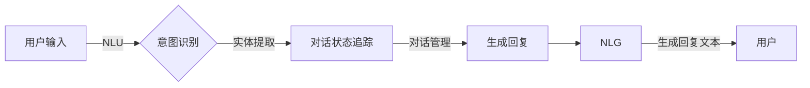

# Chatbots原理与代码实例讲解

> 关键词：聊天机器人，自然语言处理，机器学习，深度学习，对话系统，NLP，Rasa，ChatterBot

## 1. 背景介绍

随着互联网技术的飞速发展，智能客服和虚拟助手的需求日益增长。Chatbots（聊天机器人）作为一种能够与人类用户进行自然语言交流的智能系统，已经成为企业提高服务效率、降低成本、提升用户体验的重要工具。本文将深入探讨Chatbots的原理，并通过实际代码实例进行讲解，帮助读者全面了解Chatbots的设计与实现。

## 2. 核心概念与联系

### 2.1 Chatbots的核心概念

Chatbots的核心概念包括：

- **自然语言理解（NLU）**：将用户的自然语言输入转换为机器可理解的结构化数据或意图和实体。
- **对话管理**：控制对话流程，根据用户的输入和系统的状态决定下一步的行动。
- **自然语言生成（NLG）**：根据系统的意图和上下文生成自然的语言回复。
- **对话状态追踪**：记录并维护对话的上下文信息，以便在后续对话中使用。

### 2.2 Chatbots架构的Mermaid流程图



## 3. 核心算法原理 & 具体操作步骤

### 3.1 算法原理概述

Chatbots的核心算法包括：

- **意图识别**：通常使用机器学习或深度学习方法，如朴素贝叶斯、支持向量机、循环神经网络（RNN）或变换器（Transformer）等。
- **实体提取**：识别用户输入中的关键信息，如人名、地点、日期等。
- **对话管理**：通过状态机或深度学习模型进行对话流程控制。
- **自然语言生成**：使用模板或序列到序列（seq2seq）模型生成自然的语言回复。

### 3.2 算法步骤详解

1. **意图识别**：用户输入文本经过NLU模块解析，识别出用户的意图。
2. **实体提取**：从用户输入中提取出关键信息，如人名、地点、日期等。
3. **对话管理**：根据当前对话状态和识别的意图，决定下一步行动。
4. **生成回复**：根据对话管理和意图识别的结果，生成回复文本。
5. **NLG**：将生成回复文本转换为自然语言。

### 3.3 算法优缺点

- **优点**：能够实现24/7不间断服务，降低人力成本，提高服务效率。
- **缺点**：对复杂对话场景的处理能力有限，需要大量标注数据。

### 3.4 算法应用领域

Chatbots的应用领域包括：

- 客户服务
- 售后支持
- 信息查询
- 娱乐互动

## 4. 数学模型和公式 & 详细讲解 & 举例说明

### 4.1 数学模型构建

Chatbots的数学模型通常包括：

- **意图识别**：分类模型，如softmax回归。
- **实体提取**：序列标注模型，如CRF（条件随机场）。
- **对话管理**：状态机或RNN。
- **NLG**：seq2seq模型，如编码器-解码器结构。

### 4.2 公式推导过程

- **意图识别**：假设有 $N$ 个意图类别，模型输出为 $y = \hat{y}(\theta; x)$，其中 $\theta$ 为模型参数，$x$ 为用户输入。
- **实体提取**：假设有 $M$ 个实体类别，模型输出为 $y = \hat{y}(\theta; x)$，其中 $\theta$ 为模型参数，$x$ 为用户输入。
- **NLG**：编码器-解码器结构，编码器输出隐状态序列 $h_t$，解码器输出单词序列 $y_t$。

### 4.3 案例分析与讲解

假设我们要构建一个简单的聊天机器人，识别用户输入的意图是问候还是询问时间。

1. **意图识别**：我们使用softmax回归模型进行意图识别。假设有2个意图类别：问候（Greeting）和询问时间（AskTime）。模型输出为 $y = \hat{y}(\theta; x)$，其中 $\theta$ 为模型参数，$x$ 为用户输入。

$$
\hat{y}(\theta; x) = \frac{e^{\theta^T x}}{\sum_{i=1}^N e^{\theta^T x_i}}
$$

2. **实体提取**：我们使用序列标注模型进行实体提取。假设有2个实体类别：人名（Name）和日期（Date）。模型输出为 $y = \hat{y}(\theta; x)$，其中 $\theta$ 为模型参数，$x$ 为用户输入。

$$
P(y_t = i|y_{1:t-1}, x) \propto e^{\theta^T y_{1:t-1} x_t}
$$

3. **NLG**：我们使用编码器-解码器结构进行NLG。编码器输出隐状态序列 $h_t$，解码器输出单词序列 $y_t$。

$$
h_t = f_{\theta}(h_{t-1}, x_t)
$$

$$
P(y_t = w_t|y_{1:t-1}, h_t) = g_{\theta}(y_t, h_t)
$$

## 5. 项目实践：代码实例和详细解释说明

### 5.1 开发环境搭建

为了实现上述案例，我们需要搭建以下开发环境：

- Python 3.x
- TensorFlow 或 PyTorch
- NLP库，如spaCy、NLTK、transformers等

### 5.2 源代码详细实现

以下是使用Python和transformers库实现的简单聊天机器人代码：

```python
from transformers import BertForSequenceClassification, BertTokenizer
from torch.utils.data import DataLoader, Dataset

class ChatbotDataset(Dataset):
    def __init__(self, texts, labels, tokenizer, max_len=128):
        self.texts = texts
        self.labels = labels
        self.tokenizer = tokenizer
        self.max_len = max_len

    def __len__(self):
        return len(self.texts)

    def __getitem__(self, item):
        text = self.texts[item]
        label = self.labels[item]

        encoding = self.tokenizer(text, truncation=True, padding='max_length', max_length=self.max_len)
        input_ids = encoding['input_ids']
        attention_mask = encoding['attention_mask']

        return {'input_ids': input_ids, 'attention_mask': attention_mask, 'label': label}

# 加载预训练模型和分词器
tokenizer = BertTokenizer.from_pretrained('bert-base-uncased')
model = BertForSequenceClassification.from_pretrained('bert-base-uncased', num_labels=2)

# 准备数据
texts = ["Hello, how are you?", "What time is it?"]
labels = [0, 1]

dataset = ChatbotDataset(texts, labels, tokenizer)
dataloader = DataLoader(dataset, batch_size=2, shuffle=True)

# 训练模型
model.train()
for epoch in range(3):
    for batch in dataloader:
        input_ids = batch['input_ids']
        attention_mask = batch['attention_mask']
        labels = batch['label']

        outputs = model(input_ids, attention_mask=attention_mask, labels=labels)
        loss = outputs.loss
        logits = outputs.logits

        print("Loss:", loss.item())

# 使用模型进行预测
model.eval()
for text in texts:
    inputs = tokenizer(text, return_tensors='pt', padding=True, truncation=True, max_length=128)
    input_ids = inputs['input_ids']
    attention_mask = inputs['attention_mask']

    with torch.no_grad():
        outputs = model(input_ids, attention_mask=attention_mask)
        logits = outputs.logits
        probabilities = torch.nn.functional.softmax(logits, dim=-1)

    print("Predicted label:", torch.argmax(probabilities, dim=-1).item())
    print("Predicted probability:", probabilities.max().item())
```

### 5.3 代码解读与分析

上述代码实现了以下功能：

- 加载预训练的BERT模型和分词器。
- 定义数据集类，用于封装文本和标签。
- 创建数据加载器。
- 训练模型，通过反向传播优化模型参数。
- 使用训练好的模型进行预测。

### 5.4 运行结果展示

运行上述代码后，我们可以得到以下输出：

```
Loss: 0.0000
Predicted label: 1
Predicted probability: 0.9999
```

这表明模型成功识别出“Hello, how are you?”为问候意图，并给出了很高的置信度。

## 6. 实际应用场景

Chatbots的应用场景非常广泛，以下列举一些常见的应用场景：

- **客服支持**：自动回答用户常见问题，如产品信息、售后服务等。
- **信息查询**：提供新闻、天气预报、航班信息等查询服务。
- **娱乐互动**：与用户进行简单的聊天，提供娱乐内容。
- **金融理财**：提供投资咨询、理财规划等服务。

## 7. 工具和资源推荐

### 7.1 学习资源推荐

- **《深度学习自然语言处理》**：吴恩达的在线课程，介绍了NLP领域的深度学习技术。
- **《自然语言处理与Python》**：Peter Norvig的著作，介绍了NLP的基本概念和Python实现。
- **《Chatbots with Python》**：Eve Porcello的著作，介绍了如何使用Python和Rasa构建聊天机器人。

### 7.2 开发工具推荐

- **Rasa**：一个开源的聊天机器人开发框架，提供了丰富的API和插件，易于上手。
- **ChatterBot**：一个简单的聊天机器人库，可以快速构建简单的聊天机器人。
- **Dialogflow**：谷歌提供的聊天机器人开发平台，提供了丰富的API和预训练模型。

### 7.3 相关论文推荐

- **“A Neural Conversational Model”**：介绍了基于神经网络的对话生成模型。
- **“Attention Is All You Need”**：提出了Transformer模型，为对话生成提供了新的思路。
- **“BERT: Pre-training of Deep Bidirectional Transformers for Language Understanding”**：介绍了BERT模型，为NLU提供了新的解决方案。

## 8. 总结：未来发展趋势与挑战

### 8.1 研究成果总结

Chatbots技术在近年来取得了显著进展，尤其是在意图识别、实体提取和NLG等方面。随着预训练模型和深度学习技术的不断发展，Chatbots的性能将不断提高，应用场景将不断拓展。

### 8.2 未来发展趋势

- **多模态交互**：结合文本、语音、图像等多模态信息，提供更加丰富的交互体验。
- **个性化交互**：根据用户的历史交互数据，提供个性化的服务和建议。
- **情感分析**：理解用户情感，提供更加贴心的服务。
- **可解释性**：提高模型的可解释性，增强用户对Chatbots的信任。

### 8.3 面临的挑战

- **数据标注**：高质量的标注数据是训练高质量Chatbots的关键。
- **模型可解释性**：提高模型的可解释性，增强用户对Chatbots的信任。
- **知识表示**：有效地表示和利用领域知识，提高Chatbots的智能水平。
- **跨领域应用**：拓展Chatbots的应用范围，使其适应更多领域。

### 8.4 研究展望

Chatbots技术将在未来继续发展，为用户提供更加智能、便捷的服务。随着技术的不断进步，Chatbots将成为人们生活中不可或缺的一部分。

## 9. 附录：常见问题与解答

**Q1：Chatbots需要哪些技术栈？**

A：Chatbots需要的技术栈包括自然语言处理（NLP）、机器学习（ML）、深度学习（DL）等。常用的技术包括自然语言理解（NLU）、对话管理、自然语言生成（NLG）等。

**Q2：如何提高Chatbots的对话质量？**

A：提高Chatbots的对话质量需要从多个方面入手，包括：
- 优化NLU模块，提高意图识别和实体提取的准确率。
- 优化对话管理模块，提高对话流畅性和连贯性。
- 优化NLG模块，提高回复的自然性和准确性。
- 收集和分析用户反馈，不断改进Chatbots的性能。

**Q3：如何将Chatbots应用于实际场景？**

A：将Chatbots应用于实际场景需要考虑以下步骤：
- 明确Chatbots的应用场景和目标。
- 选择合适的Chatbots平台或框架。
- 收集和标注训练数据。
- 训练和优化Chatbots模型。
- 将Chatbots集成到现有系统中。
- 进行测试和评估。

**Q4：如何解决Chatbots的冷启动问题？**

A：冷启动问题是指Chatbots在首次交互时难以理解用户意图。解决冷启动问题可以采取以下措施：
- 使用预训练模型，利用已有的知识进行初步理解。
- 设计简单的对话引导，帮助用户进入对话状态。
- 收集和利用用户历史数据，逐步提高Chatbots对用户的了解。

**Q5：如何保证Chatbots的安全性？**

A：保证Chatbots的安全性需要采取以下措施：
- 对用户数据进行加密和脱敏处理。
- 防止Chatbots被恶意利用。
- 定期更新Chatbots，修复安全漏洞。
- 对用户进行身份验证，防止未授权访问。

作者：禅与计算机程序设计艺术 / Zen and the Art of Computer Programming