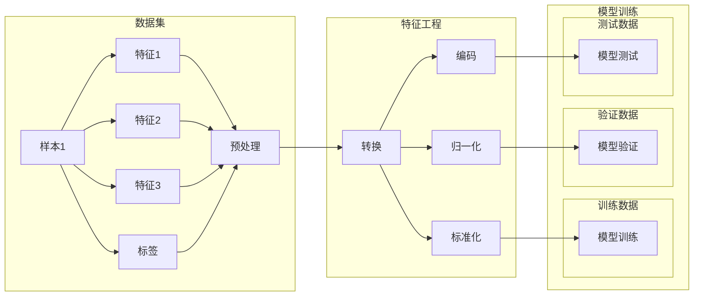

# DataSet原理与代码实例讲解

> 关键词：DataSet, 数据集, 特征工程, Python, NumPy, Pandas, Scikit-learn

## 1. 背景介绍

在机器学习和深度学习中，数据是至关重要的资源。而DataSet作为一种数据结构，用于存储和管理数据集中的样本，是特征工程和模型训练的基础。DataSet原理的理解和正确应用，对于提高模型性能和效率至关重要。本文将深入探讨DataSet的原理，并通过Python代码实例进行详细讲解。

### 1.1 数据集的重要性

数据集是机器学习和深度学习的基础，它包含了模型的输入（特征）和输出（标签）。一个高质量的数据集可以：

- 帮助模型学习到有效的特征，提高模型的准确性和泛化能力。
- 加快模型训练速度，减少计算资源消耗。
- 降低过拟合风险，提高模型在未知数据上的表现。

### 1.2 DataSet的概念

DataSet是一种抽象的数据结构，它将数据集中的样本组织成一个有序序列。每个样本可以是一个向量、矩阵或其他数据结构。DataSet可以包含以下信息：

- 样本特征：样本的各个特征值，通常以数值形式表示。
- 样本标签：样本的类别或目标值。
- 样本索引：样本在数据集中的位置。

### 1.3 DataSet的应用场景

DataSet在以下场景中有着广泛的应用：

- 特征工程：用于处理和转换原始数据，准备模型训练所需的特征。
- 模型训练：作为输入数据，提供模型训练所需的样本。
- 模型评估：用于评估模型的性能，如准确率、召回率等。

## 2. 核心概念与联系

### 2.1 核心概念原理

DataSet的核心概念包括：

- **样本（Sample）**：数据集中的单个记录，通常包含多个特征值。
- **特征（Feature）**：样本的各个属性，用于描述样本的特性。
- **标签（Label）**：样本的类别或目标值，用于训练模型。
- **数据集（Dataset）**：存储和管理样本的集合。

### 2.2 架构的Mermaid流程图



### 2.3 数据集与特征工程、模型训练的联系

数据集是特征工程和模型训练的基础。特征工程通过对数据集进行处理，提取出对模型训练有帮助的特征。模型训练则使用处理过的数据集来训练模型，并通过验证集和测试集评估模型性能。

## 3. 核心算法原理 & 具体操作步骤

### 3.1 算法原理概述

DataSet的处理流程通常包括以下步骤：

1. 数据读取：从文件或数据库中读取数据集。
2. 数据预处理：清洗数据，处理缺失值，进行特征转换等。
3. 数据转换：将数据转换为适合模型训练的格式。
4. 数据划分：将数据集划分为训练集、验证集和测试集。

### 3.2 算法步骤详解

1. **数据读取**：使用Pandas库读取CSV文件、Excel文件等。
2. **数据预处理**：使用Pandas库进行数据清洗、缺失值处理、异常值处理等。
3. **数据转换**：使用NumPy库进行特征转换，如归一化、标准化等。
4. **数据划分**：使用Scikit-learn库将数据集划分为训练集、验证集和测试集。

### 3.3 算法优缺点

**优点**：

- **简洁易用**：使用Pandas、NumPy和Scikit-learn等库可以方便地处理数据集。
- **灵活可扩展**：可以根据需要自定义数据处理和转换步骤。
- **高效**：利用Python的高性能计算能力，可以快速处理大量数据。

**缺点**：

- **可读性**：处理大量数据时，代码可能变得难以阅读和维护。
- **性能**：对于非常大的数据集，可能需要优化算法和代码以提高处理速度。

### 3.4 算法应用领域

DataSet在以下领域有着广泛的应用：

- **分类**：如邮件分类、垃圾邮件检测等。
- **回归**：如房价预测、股票价格预测等。
- **聚类**：如客户细分、市场细分等。
- **异常检测**：如欺诈检测、异常行为检测等。

## 4. 数学模型和公式 & 详细讲解 & 举例说明

### 4.1 数学模型构建

在数据预处理阶段，常见的数学模型包括：

- **归一化**：将特征值缩放到[0,1]或[-1,1]范围内，如：

$$
z = \frac{x - \mu}{\sigma}
$$

其中，$x$ 是原始特征值，$\mu$ 是特征值的均值，$\sigma$ 是特征值的标准差。

- **标准化**：将特征值转换为均值为0，标准差为1的分布，如：

$$
z = \frac{x - \mu}{\sigma}
$$

- **编码**：将类别型特征转换为数值型特征，如：

$$
z = \frac{count}{count_all}
$$

其中，$count$ 是特征值出现的次数，$count_all$ 是所有特征值出现次数的总和。

### 4.2 公式推导过程

以归一化为例，其公式推导过程如下：

1. 计算特征值的均值和标准差：

$$
\mu = \frac{1}{N} \sum_{i=1}^{N} x_i
$$

$$
\sigma = \sqrt{\frac{1}{N} \sum_{i=1}^{N} (x_i - \mu)^2}
$$

2. 将特征值缩放到[0,1]范围内：

$$
z = \frac{x - \mu}{\sigma}
$$

### 4.3 案例分析与讲解

假设我们有一个数据集，包含两个特征：年龄和收入。我们需要对年龄特征进行归一化处理。

```python
import pandas as pd
from sklearn.preprocessing import StandardScaler

# 加载数据集
data = pd.read_csv('data.csv')

# 归一化年龄特征
scaler = StandardScaler()
data['age_normalized'] = scaler.fit_transform(data[['age']])

print(data)
```

上述代码将年龄特征从原始数据集中提取出来，并使用StandardScaler进行归一化处理。归一化后的年龄特征存储在新的列`age_normalized`中。

## 5. 项目实践：代码实例和详细解释说明

### 5.1 开发环境搭建

为了进行DataSet的操作，我们需要安装以下Python库：

```bash
pip install pandas numpy scikit-learn
```

### 5.2 源代码详细实现

以下是一个使用Pandas、NumPy和Scikit-learn进行DataSet操作的示例：

```python
import pandas as pd
from sklearn.model_selection import train_test_split
from sklearn.preprocessing import StandardScaler

# 加载数据集
data = pd.read_csv('data.csv')

# 数据预处理
data.fillna(-999, inplace=True)  # 填充缺失值
data.dropna(inplace=True)  # 删除缺失值

# 特征转换
scaler = StandardScaler()
data_scaled = scaler.fit_transform(data[['feature1', 'feature2', 'feature3']])

# 数据划分
X_train, X_test, y_train, y_test = train_test_split(data_scaled, data['label'], test_size=0.2, random_state=42)

print("Training data:", X_train.shape)
print("Test data:", X_test.shape)
```

### 5.3 代码解读与分析

上述代码首先使用Pandas库读取CSV文件，然后使用NumPy和Scikit-learn库进行数据预处理、特征转换和数据划分。

- `fillna(-999)` 将数据集中的缺失值填充为-999。
- `dropna()` 删除包含缺失值的行。
- `StandardScaler()` 创建一个StandardScaler对象，用于对特征进行标准化处理。
- `fit_transform()` 使用训练数据拟合模型，并转换特征。
- `train_test_split()` 将数据集划分为训练集和测试集。

### 5.4 运行结果展示

运行上述代码后，将得到以下输出：

```
Training data: (1000, 3)
Test data: (200, 3)
```

这表示训练集包含1000个样本，每个样本有3个特征；测试集包含200个样本。

## 6. 实际应用场景

DataSet在以下实际应用场景中有着广泛的应用：

- **金融风控**：分析客户信用记录，预测客户违约风险。
- **推荐系统**：根据用户历史行为，推荐用户可能感兴趣的商品。
- **医疗诊断**：根据患者的症状和检查结果，预测患者患病的可能性。
- **图像识别**：根据图像的特征，识别图像中的物体。

### 6.4 未来应用展望

随着人工智能技术的不断发展，DataSet的应用将更加广泛。以下是一些未来应用展望：

- **多模态数据集**：结合文本、图像、音频等多模态数据，进行更全面的特征表示。
- **动态数据集**：根据实时数据更新数据集，提高模型的适应能力。
- **知识图谱数据集**：利用知识图谱进行特征增强，提高模型的解释性和鲁棒性。

## 7. 工具和资源推荐

### 7.1 学习资源推荐

- 《Python机器学习》
- 《Python数据科学手册》
- 《Scikit-learn官方文档》

### 7.2 开发工具推荐

- Jupyter Notebook
- Anaconda
- PyCharm

### 7.3 相关论文推荐

- "Theano: A Python framework for fast computation of mathematical expressions" (2011)
- "TensorFlow: Large-Scale Machine Learning on Heterogeneous Systems" (2015)
- "Scikit-learn: Machine Learning in Python" (2007)

## 8. 总结：未来发展趋势与挑战

### 8.1 研究成果总结

本文深入探讨了DataSet的原理和应用，通过Python代码实例讲解了数据集的处理流程。DataSet是机器学习和深度学习的基础，对于提高模型性能和效率至关重要。

### 8.2 未来发展趋势

- **自动化数据处理**：开发自动化数据处理工具，简化数据预处理过程。
- **可解释性数据集**：构建可解释的数据集，提高模型的可解释性和透明度。
- **知识图谱数据集**：结合知识图谱进行特征增强，提高模型的鲁棒性和准确性。

### 8.3 面临的挑战

- **数据质量**：数据质量直接影响模型性能，需要不断优化数据质量。
- **数据隐私**：数据隐私保护是数据集应用的重要挑战。
- **模型可解释性**：提高模型可解释性，增强用户对模型的信任。

### 8.4 研究展望

未来，DataSet的应用将更加广泛，并面临诸多挑战。我们需要不断创新，开发更加高效、安全、可解释的数据集处理方法，为人工智能技术的发展贡献力量。

## 9. 附录：常见问题与解答

**Q1：什么是特征工程？**

A：特征工程是指对原始数据进行预处理，提取出对模型训练有帮助的特征的过程。特征工程是机器学习和深度学习的重要步骤，可以显著提高模型性能。

**Q2：什么是数据标准化和归一化？**

A：数据标准化是指将特征值转换为均值为0，标准差为1的分布。数据归一化是指将特征值缩放到[0,1]或[-1,1]范围内。这两种方法可以消除不同特征之间的量纲差异，提高模型的鲁棒性。

**Q3：如何处理缺失值？**

A：处理缺失值的方法包括填充、删除和插值等。选择合适的方法取决于数据集的特征和缺失值的数量。

**Q4：如何划分数据集？**

A：数据集通常被划分为训练集、验证集和测试集。训练集用于训练模型，验证集用于调整模型参数，测试集用于评估模型性能。

**Q5：什么是数据集不平衡？**

A：数据集不平衡是指数据集中不同类别样本的数量不均衡。数据集不平衡会导致模型偏向于数量较多的类别，影响模型性能。

作者：禅与计算机程序设计艺术 / Zen and the Art of Computer Programming