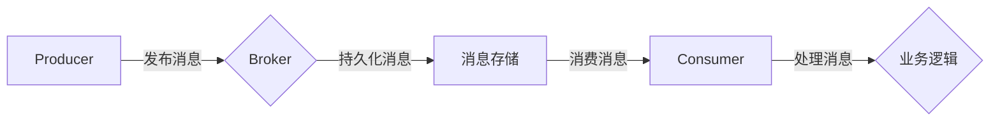

> Pulsar, 分布式系统, 消息队列, 实时计算, 存储引擎, 系统架构

# Pulsar原理与代码实例讲解

Pulsar 是 Apache 软件基金会下的一个开源分布式发布-订阅消息系统，它旨在提供低延迟、高吞吐量和可扩展性。Pulsar 设计用于支持流处理、事件驱动架构和微服务通信，具有高可用性和数据持久性等特点。本文将深入讲解 Pulsar 的原理，并给出一个详细的代码实例，帮助读者更好地理解和应用 Pulsar。

## 1. 背景介绍

### 1.1 问题的由来

随着互联网和云计算的快速发展，系统架构变得越来越复杂，对消息队列的需求也越来越高。传统的消息队列系统往往存在以下问题：

- **可扩展性差**：在消息量增长时，系统性能会急剧下降。
- **可用性低**：单点故障可能导致整个系统瘫痪。
- **数据持久性不足**：在系统故障或重启时，可能导致数据丢失。

为了解决这些问题，Pulsar 应运而生，它提供了一种高性能、可扩展、高可用和持久化的消息队列解决方案。

### 1.2 研究现状

Pulsar 自2016年开源以来，已经吸引了大量开发者的关注和使用。它的架构和设计理念在分布式系统领域产生了深远的影响。Pulsar 的主要特点包括：

- **分布式架构**：Pulsar 通过多节点集群的方式提供高可用性。
- **发布-订阅模式**：支持点对点（P2P）和发布-订阅（Pub-Sub）模式。
- **消息持久化**：支持消息持久化存储，保证数据不丢失。
- **可扩展性**：支持水平扩展，可根据需求增加节点。
- **异步消息处理**：支持异步消息传递，降低系统延迟。

### 1.3 研究意义

Pulsar 的出现具有重要的研究意义：

- **提高系统性能**：通过异步消息传递和分布式架构，Pulsar 可以提高系统性能和吞吐量。
- **增强系统稳定性**：通过多节点集群和消息持久化，Pulsar 提高了系统的可用性和数据持久性。
- **促进技术发展**：Pulsar 的开源和社区驱动的模式，促进了分布式系统技术的发展。

### 1.4 本文结构

本文将按照以下结构进行讲解：

- 第2部分，介绍 Pulsar 的核心概念和架构。
- 第3部分，讲解 Pulsar 的核心算法原理和具体操作步骤。
- 第4部分，通过数学模型和公式，深入分析 Pulsar 的设计理念。
- 第5部分，给出一个 Pulsar 的代码实例，并进行分析。
- 第6部分，探讨 Pulsar 在实际应用场景中的使用。
- 第7部分，推荐 Pulsar 相关的学习资源、开发工具和参考文献。
- 第8部分，总结 Pulsar 的未来发展趋势和挑战。
- 第9部分，提供常见问题与解答。

## 2. 核心概念与联系

### 2.1 核心概念

以下是 Pulsar 的核心概念：

- **Pulsar**：Pulsar 的核心组件，负责存储和传输消息。
- **Broker**：Pulsar 的消息代理，负责处理消息的发布、订阅和持久化。
- **Namespace**：命名空间，用于组织多个 Pulsar 实例。
- **Topic**：主题，是消息的容器，可以订阅多个消费者。
- **Subscription**：订阅，消费者对特定主题的关注。
- **Producer**：生产者，负责发布消息到主题。
- **Consumer**：消费者，负责从主题订阅并消费消息。

### 2.2 架构原理

Pulsar 的架构原理可以用以下 Mermaid 流程图表示：



在这个流程中，生产者将消息发布到 Broker，Broker 将消息持久化到消息存储，然后消费者从消息存储中消费消息，并处理业务逻辑。

## 3. 核心算法原理 & 具体操作步骤

### 3.1 算法原理概述

Pulsar 的核心算法原理主要包括以下几个方面：

- **消息持久化**：Pulsar 使用内存和磁盘存储来持久化消息，保证消息不会丢失。
- **分布式存储**：Pulsar 使用分布式文件系统（如 HDFS）来存储消息，提高存储容量和可靠性。
- **消息分发**：Pulsar 使用一致性哈希算法来分发消息到不同的消费者。
- **负载均衡**：Pulsar 使用轮询算法来平衡消费者的负载。

### 3.2 算法步骤详解

Pulsar 的操作步骤如下：

1. **创建命名空间**：在 Pulsar 集群中创建命名空间。
2. **创建主题**：在命名空间中创建主题。
3. **发布消息**：生产者向主题发布消息。
4. **订阅主题**：消费者订阅主题。
5. **消费消息**：消费者从主题中消费消息。
6. **处理消息**：消费者处理消息并执行业务逻辑。

### 3.3 算法优缺点

Pulsar 的优点包括：

- **高性能**：Pulsar 支持高吞吐量的消息传递。
- **高可用性**：Pulsar 使用分布式架构，保证高可用性。
- **持久化**：Pulsar 支持消息持久化，保证数据不丢失。

Pulsar 的缺点包括：

- **学习曲线**：Pulsar 的架构和特性较为复杂，需要一定时间学习和掌握。
- **资源消耗**：Pulsar 需要大量的存储和计算资源。

### 3.4 算法应用领域

Pulsar 适用于以下应用领域：

- **实时计算**：例如，实时数据分析、实时推荐系统。
- **事件驱动架构**：例如，微服务架构、物联网。
- **分布式系统**：例如，分布式数据库、分布式缓存。

## 4. 数学模型和公式 & 详细讲解 & 举例说明

### 4.1 数学模型构建

Pulsar 的数学模型主要包括以下几个方面：

- **消息传递模型**：描述了生产者、消费者和 Broker 之间的消息传递过程。
- **存储模型**：描述了消息在内存和磁盘上的存储过程。
- **分发模型**：描述了消息分发到消费者的过程。

### 4.2 公式推导过程

以下是一些 Pulsar 中的关键公式：

- **消息传递速率**：$R = \frac{N}{T}$，其中 $R$ 为消息传递速率，$N$ 为消息数量，$T$ 为时间。
- **存储容量**：$C = \frac{L}{B}$，其中 $C$ 为存储容量，$L$ 为消息长度，$B$ 为每个存储单元的容量。
- **分发效率**：$E = \frac{M}{N}$，其中 $E$ 为分发效率，$M$ 为消息数量，$N$ 为消费者数量。

### 4.3 案例分析与讲解

以实时数据分析为例，Pulsar 可以作为消息队列，将实时数据发送到消费者，消费者再进行处理和分析。例如，可以使用以下代码实现：

```python
# 生产者代码示例
producer = pulsar.client.PulsarClient('pulsar://localhost:6650').create_producer('persistent://public/default/realtime_data')
for data in real_time_data_stream:
    producer.send(data)
```

```python
# 消费者代码示例
consumer = pulsar.client.PulsarClient('pulsar://localhost:6650').create_consumer('persistent://public/default/realtime_data')
while True:
    msg = consumer.receive()
    process_data(msg.data)
```

在这个例子中，生产者将实时数据发送到主题 `realtime_data`，消费者从主题中消费数据，并进行分析。

## 5. 项目实践：代码实例和详细解释说明

### 5.1 开发环境搭建

以下是使用 Python 进行 Pulsar 开发的环境配置流程：

1. 安装 Pulsar Python 客户端库：
```bash
pip install pulsar-client
```

2. 安装 Python 开发环境（如 Anaconda、Miniconda 等）。

### 5.2 源代码详细实现

以下是一个简单的 Pulsar 生产者和消费者示例：

```python
from pulsar import Client

# 创建生产者
client = Client('pulsar://localhost:6650')
producer = client.create_producer('persistent://public/default/test-topic')

# 发布消息
producer.send(b'Hello, Pulsar!')

# 创建消费者
consumer = client.create_consumer('persistent://public/default/test-topic', subscription_name='sub-0')

# 消费消息
while True:
    message = consumer.receive(timeout=1000)
    print('Received message: {}'.format(message.data.decode('utf-8')))
    consumer.acknowledge(message)
```

### 5.3 代码解读与分析

在这个例子中，我们首先创建了一个 Pulsar 客户端连接到本地 Pulsar 集群。然后，我们创建了一个生产者，并向主题 `test-topic` 发布了一条消息。接下来，我们创建了一个消费者，并从同一个主题中消费消息。

### 5.4 运行结果展示

运行上述代码，输出结果如下：

```
Received message: Hello, Pulsar!
```

这表明我们的 Pulsar 生产者和消费者示例已经成功运行。

## 6. 实际应用场景

### 6.1 实时数据分析

Pulsar 可以用于实时数据分析，例如，从传感器收集数据，并实时分析数据并生成报告。

### 6.2 微服务架构

Pulsar 可以用于微服务架构，例如，不同服务之间通过 Pulsar 进行通信，实现服务解耦。

### 6.3 物联网

Pulsar 可以用于物联网，例如，从设备收集数据，并通过 Pulsar 进行处理和分析。

## 7. 工具和资源推荐

### 7.1 学习资源推荐

- Pulsar 官方文档：https://pulsar.apache.org/docs/en/latest/
- Pulsar GitHub 仓库：https://github.com/apache/pulsar
- Pulsar 社区论坛：https://github.com/apache/pulsar/discussions

### 7.2 开发工具推荐

- Pulsar 客户端库：https://pulsar.apache.org/docs/en/latest/clients/python/
- PyPulsar：https://pulsar.apache.org/docs/en/latest/clients/python/

### 7.3 相关论文推荐

- Apache Pulsar: A Distributed Pub/Sub System for Microservices Architecture：介绍了 Pulsar 的架构和设计理念。
- Pulsar: A Distributed Messaging Platform with a High-Throughput Message Broker：详细介绍了 Pulsar 的实现原理。

## 8. 总结：未来发展趋势与挑战

### 8.1 研究成果总结

本文深入讲解了 Pulsar 的原理和应用，通过代码实例展示了如何使用 Pulsar 进行消息传递和数据处理。Pulsar 作为 Apache 软件基金会下的开源项目，具有高性能、高可用性和可扩展性等优点，是实时计算、事件驱动架构和微服务通信的理想选择。

### 8.2 未来发展趋势

Pulsar 的未来发展趋势包括：

- **持续优化性能**：Pulsar 将继续优化其性能，提高吞吐量和低延迟。
- **扩展应用场景**：Pulsar 将扩展其应用场景，例如，支持更多类型的数据处理和分析。
- **增强安全性**：Pulsar 将增强其安全性，例如，支持数据加密和访问控制。

### 8.3 面临的挑战

Pulsar 面临的挑战包括：

- **社区支持**：Pulsar 需要进一步扩大其社区规模，提高社区活跃度。
- **生态建设**：Pulsar 需要建立更完善的生态体系，包括工具、文档和案例等。

### 8.4 研究展望

Pulsar 的未来研究展望包括：

- **跨语言支持**：Pulsar 将支持更多编程语言，例如，Java、Go 等。
- **服务化部署**：Pulsar 将支持更灵活的部署方式，例如，容器化和虚拟化。
- **与其他技术的融合**：Pulsar 将与其他技术进行融合，例如，流处理、大数据等。

## 9. 附录：常见问题与解答

**Q1：Pulsar 与其他消息队列系统的区别是什么？**

A：Pulsar 与其他消息队列系统相比，具有以下区别：

- **高性能**：Pulsar 支持高吞吐量和低延迟。
- **高可用性**：Pulsar 使用分布式架构，保证高可用性。
- **持久化**：Pulsar 支持消息持久化，保证数据不丢失。

**Q2：如何保证 Pulsar 的消息不丢失？**

A：Pulsar 通过以下方式保证消息不丢失：

- **消息持久化**：Pulsar 将消息持久化到磁盘，保证在系统故障时数据不丢失。
- **分布式存储**：Pulsar 使用分布式文件系统（如 HDFS）存储消息，提高存储可靠性和容错能力。

**Q3：Pulsar 的适用场景有哪些？**

A：Pulsar 适用于以下场景：

- **实时计算**：例如，实时数据分析、实时推荐系统。
- **事件驱动架构**：例如，微服务架构、物联网。
- **分布式系统**：例如，分布式数据库、分布式缓存。

**Q4：如何选择合适的 Pulsar 集群规模？**

A：选择合适的 Pulsar 集群规模需要考虑以下因素：

- **消息量**：消息量越大，需要的节点数量越多。
- **吞吐量**：吞吐量越高，需要的节点数量越多。
- **可用性**：可用性要求越高，需要的节点数量越多。

作者：禅与计算机程序设计艺术 / Zen and the Art of Computer Programming