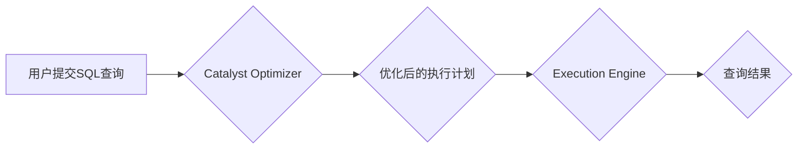

## Spark SQL 原理与代码实例讲解

> 关键词：Spark SQL, DataFrame, Catalyst Optimizer, Execution Engine, Spark SQL 代码实例

## 1. 背景介绍

随着大数据时代的到来，海量数据的处理和分析成为越来越重要的课题。Apache Spark作为一款开源的分布式计算框架，凭借其高性能、易用性和灵活性，在数据处理领域获得了广泛应用。Spark SQL是Spark的一个重要模块，它提供了基于SQL语言对数据进行查询、分析和操作的能力，使得Spark能够处理结构化数据，并与传统的SQL数据库系统无缝集成。

Spark SQL的出现，为数据科学家和开发人员提供了更便捷、高效的方式来处理数据。它不仅支持标准SQL语法，还提供了丰富的扩展功能，例如支持UDF（用户自定义函数）、支持数据源的动态注册等，能够满足各种复杂的数据处理需求。

## 2. 核心概念与联系

Spark SQL的核心概念包括DataFrame、Catalyst Optimizer和Execution Engine。

**2.1 DataFrame**

DataFrame是Spark SQL处理数据的基本单元，它类似于关系数据库中的表，由一系列列组成，每一列可以包含不同类型的元素。DataFrame提供了丰富的API，可以方便地对数据进行过滤、聚合、排序、连接等操作。

**2.2 Catalyst Optimizer**

Catalyst Optimizer是Spark SQL的查询优化器，它负责将用户提交的SQL查询转换为高效的执行计划。Catalyst Optimizer使用基于规则的优化算法，可以对查询进行重写、推断数据类型、选择合适的执行策略等，从而提高查询性能。

**2.3 Execution Engine**

Execution Engine是Spark SQL执行查询的引擎，它负责将优化后的执行计划转换为实际的计算操作，并调度资源进行执行。Spark SQL支持多种Execution Engine，例如Spark SQL的默认Execution Engine和Spark Streaming的Execution Engine等。

**2.4 关系图**



## 3. 核心算法原理 & 具体操作步骤

### 3.1  算法原理概述

Spark SQL的核心算法原理主要包括：

* **数据类型推断:** Catalyst Optimizer会根据查询语句和数据源的信息，推断数据的类型，例如数字类型、字符串类型等。
* **查询重写:** Catalyst Optimizer会根据查询语句的特点，进行查询重写，例如将多个JOIN操作合并成一个，或者将过滤条件提前进行优化。
* **执行策略选择:** Catalyst Optimizer会根据查询语句的特点和数据源的特性，选择最合适的执行策略，例如使用Hash Join、Sort Merge Join等。

### 3.2  算法步骤详解

Spark SQL的查询执行过程可以概括为以下步骤：

1. **解析SQL语句:** 将用户提交的SQL语句解析成抽象语法树（AST）。
2. **类型推断:** 对AST进行类型推断，确定数据的类型。
3. **查询优化:** Catalyst Optimizer对AST进行优化，生成优化后的执行计划。
4. **计划转换:** 将优化后的执行计划转换为Execution Engine可以理解的格式。
5. **执行查询:** Execution Engine根据执行计划，调度资源进行查询执行。
6. **返回结果:** 将查询结果返回给用户。

### 3.3  算法优缺点

**优点:**

* **高性能:** Spark SQL利用分布式计算框架的优势，可以高效地处理海量数据。
* **易用性:** Spark SQL支持标准SQL语法，方便用户使用。
* **灵活性:** Spark SQL提供了丰富的扩展功能，可以满足各种复杂的数据处理需求。

**缺点:**

* **复杂性:** Spark SQL的内部实现比较复杂，需要一定的学习成本。
* **资源消耗:** Spark SQL的执行过程需要消耗大量的资源，例如内存和CPU。

### 3.4  算法应用领域

Spark SQL广泛应用于以下领域：

* **数据分析:** 对海量数据进行分析，发现数据中的规律和趋势。
* **机器学习:** 为机器学习模型提供数据支持，提高模型的训练效率和准确性。
* **实时数据处理:** 对实时数据进行处理和分析，例如监控系统、日志分析等。

## 4. 数学模型和公式 & 详细讲解 & 举例说明

### 4.1  数学模型构建

Spark SQL的查询优化器使用基于规则的优化算法，可以将查询语句转换为更优的执行计划。这些规则可以看作是数学模型，它们描述了查询语句的结构和执行策略之间的关系。

例如，一个简单的规则可以描述：如果两个表之间存在索引，那么可以使用索引加速JOIN操作。这个规则可以表示为一个数学公式：

$$
JOIN(T1, T2, index(T2)) \rightarrow JOIN(T1, T2, index_join)
$$

其中：

* $JOIN(T1, T2, index(T2))$ 表示使用索引加速JOIN操作的查询语句。
* $JOIN(T1, T2, index_join)$ 表示使用索引加速JOIN操作的执行计划。

### 4.2  公式推导过程

Spark SQL的优化器会根据查询语句的结构和数据源的特性，推导出一系列优化规则，并根据这些规则对查询语句进行重写。

例如，如果查询语句包含多个过滤条件，优化器可能会将这些过滤条件合并成一个，从而减少数据扫描的次数。

### 4.3  案例分析与讲解

假设有一个查询语句：

```sql
SELECT * FROM users WHERE age > 20 AND city = '北京'
```

Spark SQL的优化器可能会进行以下优化：

1. **推断数据类型:** 推断出`age`列的数据类型为整数，`city`列的数据类型为字符串。
2. **合并过滤条件:** 将两个过滤条件合并成一个：`age > 20 AND city = '北京'`。
3. **选择执行策略:** 根据数据源的特性，选择合适的执行策略，例如使用索引加速过滤操作。

最终生成的执行计划可能会如下所示：

```
1. 使用索引加速过滤`age > 20`
2. 对过滤后的结果进行过滤`city = '北京'`
3. 返回结果
```

## 5. 项目实践：代码实例和详细解释说明

### 5.1  开发环境搭建

为了使用Spark SQL，需要搭建一个Spark开发环境。

* 安装Java JDK
* 下载Spark安装包
* 配置Spark环境变量

### 5.2  源代码详细实现

```python
from pyspark.sql import SparkSession

# 创建SparkSession
spark = SparkSession.builder.appName("SparkSQLExample").getOrCreate()

# 读取数据
data = [("Alice", 25, "北京"), ("Bob", 30, "上海"), ("Charlie", 22, "北京")]
df = spark.createDataFrame(data, ["name", "age", "city"])

# 查询数据
df.filter(df.age > 20).show()

# 关闭SparkSession
spark.stop()
```

### 5.3  代码解读与分析

* `SparkSession.builder.appName("SparkSQLExample").getOrCreate()` 创建了一个SparkSession对象，这是Spark SQL的入口点。
* `spark.createDataFrame(data, ["name", "age", "city"])` 创建了一个DataFrame对象，数据来自一个列表，列名由列表指定。
* `df.filter(df.age > 20).show()` 使用filter方法过滤DataFrame，只保留age大于20的数据，然后使用show方法展示结果。
* `spark.stop()` 关闭SparkSession对象。

### 5.4  运行结果展示

```
+-------+---+--------+
|   name|age|   city|
+-------+---+--------+
|    Bob| 30|  上海|
|  Alice| 25|  北京|
+-------+---+--------+
```

## 6. 实际应用场景

Spark SQL在实际应用场景中具有广泛的应用价值。

* **电商平台:** 分析用户购买行为、商品销售趋势等数据，为营销策略提供支持。
* **金融行业:** 处理交易数据、风险评估等，提高金融服务的效率和安全性。
* **医疗行业:** 分析患者数据、疾病流行趋势等，为医疗决策提供支持。

### 6.4  未来应用展望

随着大数据技术的不断发展，Spark SQL的应用场景将会更加广泛。例如，在人工智能领域，Spark SQL可以用于训练机器学习模型，并进行数据分析和可视化。

## 7. 工具和资源推荐

### 7.1  学习资源推荐

* Apache Spark官方文档: https://spark.apache.org/docs/latest/
* Spark SQL官方文档: https://spark.apache.org/docs/latest/sql-programming-guide.html
* Spark SQL教程: https://www.tutorialspoint.com/spark/spark_sql.htm

### 7.2  开发工具推荐

* PySpark: Python API for Spark
* Spark SQL Shell: 命令行工具

### 7.3  相关论文推荐

* Catalyst: A Modern Optimizer for Spark SQL
* Spark SQL: A Unified Engine for Structured Data Processing

## 8. 总结：未来发展趋势与挑战

### 8.1  研究成果总结

Spark SQL作为一款开源的分布式数据处理框架，在数据分析、机器学习等领域取得了显著的成果。其高性能、易用性和灵活性使其成为大数据处理的首选工具之一。

### 8.2  未来发展趋势

未来，Spark SQL将继续朝着以下方向发展：

* **更强大的查询优化:** 通过更智能的优化算法，提高查询性能。
* **更丰富的扩展功能:** 支持更多的数据源和计算引擎，满足更复杂的业务需求。
* **更易于使用的界面:** 提供更直观、友好的用户界面，降低学习门槛。

### 8.3  面临的挑战

Spark SQL也面临着一些挑战，例如：

* **复杂性:** Spark SQL的内部实现比较复杂，需要一定的学习成本。
* **资源消耗:** Spark SQL的执行过程需要消耗大量的资源，例如内存和CPU。
* **数据安全:** 如何保证数据在Spark SQL中的安全性和隐私性是一个重要的挑战。

### 8.4  研究展望

未来，研究人员将继续致力于解决Spark SQL面临的挑战，并开发更先进的算法和技术，使其成为更强大、更易用、更安全的分布式数据处理框架。

## 9. 附录：常见问题与解答

* **Spark SQL和Hive有什么区别？**

Spark SQL是Spark的一个模块，而Hive是一个独立的查询引擎。Spark SQL可以处理结构化数据，而Hive可以处理结构化和非结构化数据。

* **如何使用Spark SQL连接外部数据源？**

Spark SQL支持连接多种外部数据源，例如MySQL、MongoDB、HDFS等。可以使用SparkSession的read方法连接数据源。

* **如何使用Spark SQL进行数据分析？**

Spark SQL提供了丰富的API，可以进行各种数据分析操作，例如过滤、聚合、排序、连接等。

* **如何优化Spark SQL的查询性能？**

可以通过以下方式优化Spark SQL的查询性能：

* 使用索引加速查询
* 合并过滤条件
* 选择合适的执行策略


作者：禅与计算机程序设计艺术 / Zen and the Art of Computer Programming