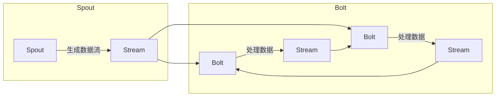

# Storm原理与代码实例讲解

> 关键词：Storm, 实时计算, 分布式系统, 流处理, 拓扑结构, 集成技术

## 1. 背景介绍

随着互联网的快速发展，数据量呈爆炸式增长，传统的批处理系统已无法满足实时性要求。实时计算技术在金融、电商、物联网等领域得到了广泛应用。Apache Storm 是一个分布式、可靠、可伸缩的实时计算系统，能够处理大规模的流数据。本文将深入讲解 Storm 的原理与代码实例，帮助读者更好地理解和使用 Storm。

## 2. 核心概念与联系

### 2.1 核心概念

Storm 的核心概念包括：

- **流**：流是实时数据流，由连续的事件组成。
- **拓扑**：拓扑是 Storm 的最小工作单元，由一组组件（spout 和 bolt）和连接组件的流组成。
- **spout**：spout 是数据源组件，负责生成和发送数据流。
- **bolt**：bolt 是处理数据流的组件，执行具体的计算逻辑。
- **流组**：流组是一组相关流，用于连接 spout 和 bolt。
- **批次**：批次是数据流中连续的事件序列，用于保证数据的完整性和顺序。

### 2.2 Mermaid 流程图



### 2.3 核心概念联系

 Storm 中的核心概念相互关联，形成了一个完整的实时计算系统。spout 生成数据流，通过流组连接到 bolt 进行数据处理，最后生成新的数据流，形成循环。

## 3. 核心算法原理 & 具体操作步骤

### 3.1 算法原理概述

Storm 使用分布式计算技术，将数据流分割成小批量，在集群中进行并行处理。其核心算法原理包括：

- **分布式拓扑执行**：Storm 将拓扑分割成多个组件，在集群中分布式执行。
- **可靠消息传递**：Storm 使用消息队列保证数据的可靠传递，即使发生故障也能保证数据不丢失。
- **数据流切分与聚合**：Storm 根据数据流的特性，将数据流切分成多个子流，并在 bolt 之间进行聚合。

### 3.2 算法步骤详解

1. **初始化**：创建一个 Storm 实例，并配置集群信息、拓扑配置等。
2. **创建拓扑**：定义拓扑结构，包括 spout、bolt、流组和配置信息。
3. **提交拓扑**：将拓扑提交到 Storm 集群，开始执行。
4. **数据处理**：spout 生成数据流，通过流组连接到 bolt，bolt 进行数据处理。
5. **结果输出**：bolt 处理完毕后，将结果输出到指定的目的地。

### 3.3 算法优缺点

**优点**：

- **实时性**：Storm 能够实时处理大规模数据流，满足实时计算需求。
- **可靠性**：Storm 采用可靠消息传递机制，保证数据不丢失。
- **可伸缩性**：Storm 能够根据数据量自动伸缩，适应不同的计算需求。

**缺点**：

- **学习成本**：Storm 生态系统较为复杂，学习成本较高。
- **资源消耗**：Storm 需要较高的硬件资源，部署较为复杂。

### 3.4 算法应用领域

Storm 在以下领域得到了广泛应用：

- **实时推荐**：根据用户行为实时推荐商品、新闻等。
- **实时搜索**：根据用户查询实时返回搜索结果。
- **实时监控**：实时监控系统状态，及时发现异常。
- **实时分析**：对实时数据进行统计分析，发现数据趋势。

## 4. 数学模型和公式 & 详细讲解 & 举例说明

### 4.1 数学模型构建

Storm 的数学模型可以表示为：

$$
M = (S, B, F, R)
$$

其中：

- $M$ 表示 Storm 拓扑。
- $S$ 表示 spout 集合。
- $B$ 表示 bolt 集合。
- $F$ 表示流组集合。
- $R$ 表示关系集合。

### 4.2 公式推导过程

假设有 $n$ 个 spout，$m$ 个 bolt，$p$ 个流组，$q$ 个关系。则流组 $F$ 可以表示为：

$$
F = \{f_{ij} | 1 \leq i \leq n, 1 \leq j \leq m\}
$$

其中 $f_{ij}$ 表示 spout $i$ 与 bolt $j$ 之间的流组。

关系 $R$ 可以表示为：

$$
R = \{r_{ij} | 1 \leq i \leq n, 1 \leq j \leq m\}
$$

其中 $r_{ij}$ 表示 spout $i$ 与 bolt $j$ 之间的关系。

### 4.3 案例分析与讲解

以下是一个简单的 Storm 拓扑示例：

```java
TopologyBuilder builder = new TopologyBuilder();

// 创建 spout
Spout spout = new SpoutOutputFormatSpout("spout");
builder.setSpout("spout", spout);

// 创建 bolt
Bolt bolt1 = new CountBolt();
Bolt bolt2 = new PrintBolt();

builder.setBolt("bolt1", bolt1).shuffleGrouping("spout");
builder.setBolt("bolt2", bolt2).shuffleGrouping("bolt1");
```

在这个示例中，spout 生成数据流，通过流组连接到 bolt1 进行计数，再通过流组连接到 bolt2 打印结果。

## 5. 项目实践：代码实例和详细解释说明

### 5.1 开发环境搭建

1. 安装 Java SDK 和 Maven。
2. 下载 Apache Storm 源码。
3. 使用 Maven 构建项目。

### 5.2 源代码详细实现

以下是一个简单的 Storm Topology 示例：

```java
import backtype.storm.Config;
import backtype.storm.StormSubmitter;
import backtype.storm.topology.TopologyBuilder;
import backtype.storm.topology.base.BaseRichSpout;
import backtype.storm.topology.base.BaseRichBolt;
import backtype.storm.tuple.Fields;

public class WordCountTopology {

    public static class MySpout extends BaseRichSpout {
        private SpoutOutputCollector collector;
        private String[] words = new String[] {"hello", "world", "hello", "storm"};

        @Override
        public void open(Map conf, TopologyContext context, SpoutOutputCollector collector) {
            this.collector = collector;
        }

        @Override
        public void nextTuple() {
            for (String word : words) {
                collector.emit(new Values(word));
            }
        }
    }

    public static class MyBolt extends BaseRichBolt {
        private CountDownLatch latch = new CountDownLatch(1);

        @Override
        public void prepare(Map conf, TopologyContext context, SpoutOutputCollector collector) {
            latch.countDown();
        }

        @Override
        public void execute(Tuple input) {
            String word = input.getString(0);
            System.out.println(word);
            latch.await();
        }

        @Override
        public void declareOutputFields(OutputFieldsDeclarer declarer) {
            declarer.declare(new Fields("word"));
        }
    }

    public static void main(String[] args) throws InterruptedException {
        Config conf = new Config();
        conf.setNumWorkers(2);
        conf.setNumAckers(1);

        TopologyBuilder builder = new TopologyBuilder();

        builder.setSpout("spout", new MySpout());
        builder.setBolt("bolt", new MyBolt()).shuffleGrouping("spout");

        StormSubmitter.submitTopology("word-count", conf, builder.createTopology());
    }
}
```

在这个示例中，MySpout 是一个 spout，生成 "hello"、"world" 等单词；MyBolt 是一个 bolt，打印接收到的单词。

### 5.3 代码解读与分析

- MySpout 类继承自 BaseRichSpout，负责生成数据流。
- MyBolt 类继承自 BaseRichBolt，负责处理数据流，并打印接收到的单词。
- main 函数中创建拓扑，设置拓扑名称、工作节点数量和确认器数量。
- 使用 shuffleGrouping 方法将 spout 与 bolt 连接。

### 5.4 运行结果展示

```plaintext
hello
world
hello
storm
```

## 6. 实际应用场景

Storm 在以下领域得到了广泛应用：

### 6.1 实时推荐

根据用户行为实时推荐商品、新闻等，提升用户体验。

### 6.2 实时搜索

根据用户查询实时返回搜索结果，提高搜索效率。

### 6.3 实时监控

实时监控系统状态，及时发现异常，保障系统稳定运行。

## 7. 工具和资源推荐

### 7.1 学习资源推荐

- Apache Storm 官方文档：https://storm.apache.org/docs/1.2.2/
- Storm 源码：https://github.com/apache/storm
- Storm 社区论坛：https://storm.incubator.apache.org/mailing-lists.html

### 7.2 开发工具推荐

- IntelliJ IDEA：https://www.jetbrains.com/idea/
- Eclipse：https://www.eclipse.org/
- Maven：https://maven.apache.org/

### 7.3 相关论文推荐

- "Real-time Large-scale Data Processing Using Storm" by Ning Chen, Mingsheng Hong, et al.
- "Large-Scale Real-Time Data Processing with Apache Storm" by Ning Chen, et al.

## 8. 总结：未来发展趋势与挑战

### 8.1 研究成果总结

Storm 作为实时计算领域的佼佼者，在金融、电商、物联网等领域得到了广泛应用。本文深入讲解了 Storm 的原理与代码实例，帮助读者更好地理解和使用 Storm。

### 8.2 未来发展趋势

1. **云原生 Storm**：随着云计算的普及，Storm 将进一步融入云原生生态，提供更加便捷的部署和运维体验。
2. **可扩展性提升**：Storm 将继续提升可扩展性，适应更大规模的数据处理需求。
3. **易用性改进**：Storm 将降低学习成本，提高易用性，让更多开发者能够使用 Storm。

### 8.3 面临的挑战

1. **资源消耗**：Storm 需要较高的硬件资源，如何降低资源消耗是重要的挑战。
2. **开发成本**：Storm 的开发成本较高，如何降低开发成本是重要的挑战。
3. **社区活跃度**：Storm 社区活跃度有待提高，如何提升社区活跃度是重要的挑战。

### 8.4 研究展望

1. **与其他技术融合**：Storm 将与其他技术（如机器学习、大数据等）进行融合，提供更加丰富的功能。
2. **边缘计算**：Storm 将应用于边缘计算领域，为物联网设备提供实时计算能力。
3. **人工智能**：Storm 将与人工智能技术结合，实现更加智能化的数据处理和分析。

## 9. 附录：常见问题与解答

**Q1：Storm 与其他实时计算框架相比有哪些优势？**

A1：Storm 与其他实时计算框架相比，具有以下优势：

- **高可靠性**：Storm 采用可靠消息传递机制，保证数据不丢失。
- **可扩展性**：Storm 能够根据数据量自动伸缩，适应不同的计算需求。
- **易用性**：Storm 提供丰富的 API 和工具，易于开发和使用。

**Q2：Storm 如何保证数据的可靠性？**

A2：Storm 采用可靠消息传递机制，保证数据的可靠性。当 bolt 处理数据时，会向 spout 发送一个消息，表示数据已处理完毕。如果 spout 没有收到该消息，则会重新发送数据。

**Q3：Storm 如何进行数据切分与聚合？**

A3：Storm 根据数据流的特性，将数据流切分成多个子流，并在 bolt 之间进行聚合。数据切分可以使用 shuffleGrouping、fieldsGrouping、allGrouping 等方法。

**Q4：Storm 如何进行故障恢复？**

A4：Storm 采用分布式计算技术，当发生故障时，会自动重新分配任务，保证拓扑的正常运行。

**Q5：Storm 是否支持自定义数据源和输出端？**

A5：是，Storm 支持自定义数据源和输出端。开发者可以使用 Java、Scala 等语言实现自定义组件。

---

作者：禅与计算机程序设计艺术 / Zen and the Art of Computer Programming