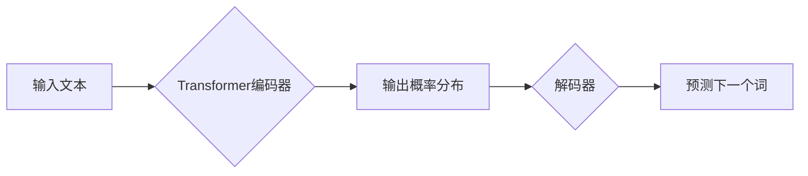

# XLNet原理与代码实例讲解

> 关键词：XLNet, NLP, Transformer, 自回归，掩码语言模型，预训练，微调

## 1. 背景介绍

随着深度学习在自然语言处理（NLP）领域的广泛应用，自回归语言模型（如BERT）取得了显著的成果。然而，自回归模型在处理长文本和序列任务时存在一定的局限性。为了解决这一问题，Google Research提出了XLNet，一种基于Transformer的自回归语言模型，它通过引入掩码语言模型（Masked Language Model，MLM）和旋转位置编码，显著提高了模型在长文本理解和序列生成任务上的性能。

## 2. 核心概念与联系

### 2.1 核心概念

- **Transformer**: 一种基于自注意力机制的深度神经网络模型，能够捕捉序列中任意两个位置之间的关系。
- **自回归语言模型**: 一种基于Transformer的语言模型，通常用于生成下一个词预测任务。
- **掩码语言模型（MLM）**: 一种特殊的预训练任务，通过随机遮蔽（masking）部分词元，使得模型能够学习预测被遮蔽的词元。
- **旋转位置编码**: 一种位置编码方法，通过旋转正弦和余弦函数，为每个词元分配位置编码。

### 2.2 架构的 Mermaid 流程图



### 2.3 核心概念之间的联系

XLNet结合了Transformer和MLM的优势，通过以下方式实现长文本理解和序列生成任务：

1. 使用Transformer编码器捕捉序列中任意两个位置之间的关系。
2. 通过MLM任务学习预测被遮蔽的词元，增强模型对语言结构的理解。
3. 利用旋转位置编码处理长文本中的位置信息。

## 3. 核心算法原理 & 具体操作步骤

### 3.1 算法原理概述

XLNet的核心原理是利用Transformer和MLM进行预训练，并通过微调将预训练模型应用于下游任务。

### 3.2 算法步骤详解

1. **预训练阶段**：
   - 使用大量无标签文本数据，通过Transformer编码器学习词元之间的依赖关系。
   - 引入MLM任务，随机遮蔽部分词元，训练模型预测被遮蔽的词元。
   - 使用旋转位置编码为每个词元分配位置信息。

2. **微调阶段**：
   - 收集下游任务的数据，如文本分类、问答、翻译等。
   - 将预训练模型应用于下游任务，调整部分参数以适应特定任务。
   - 使用下游任务的标注数据训练模型，优化参数。

### 3.3 算法优缺点

**优点**：

- **长文本理解能力强**：由于Transformer编码器能够捕捉序列中任意两个位置之间的关系，XLNet在长文本理解任务上表现优异。
- **泛化能力强**：预训练阶段学习到的知识可以迁移到下游任务，提高模型在未见数据上的泛化能力。

**缺点**：

- **计算复杂度高**：Transformer编码器需要大量计算资源，训练和推理速度较慢。
- **参数量大**：预训练模型参数量较大，导致模型部署困难。

### 3.4 算法应用领域

XLNet在以下领域取得了显著的成果：

- 文本分类
- 问答系统
- 文本摘要
- 机器翻译
- 序列生成

## 4. 数学模型和公式 & 详细讲解 & 举例说明

### 4.1 数学模型构建

XLNet的数学模型主要包括以下部分：

- **Transformer编码器**：输入序列 $\{x_1, x_2, ..., x_n\}$，输出序列 $\{y_1, y_2, ..., y_n\}$。
- **MLM任务**：输入序列 $\{x_1, x_2, ..., x_n\}$，输出遮蔽词元 $\{m_1, m_2, ..., m_n\}$。
- **微调任务**：输入序列 $\{x_1, x_2, ..., x_n\}$，输出标签 $\{y_1, y_2, ..., y_n\}$。

### 4.2 公式推导过程

**Transformer编码器**：

- **自注意力机制**：

$$
\text{Attention}(Q, K, V) = \frac{(QK^T)}{\sqrt{d_k}}\text{softmax}(VW^TQK^T)
$$

- **多头注意力**：

$$
\text{MultiHeadAttention}(Q, K, V) = \text{Concat}(\text{head}_1, ..., \text{head}_h)W^O
$$

**MLM任务**：

- **遮蔽词元预测**：

$$
\text{MLM}(x, m) = \text{softmax}(W_{MLM}[\text{Transformer}(x, m)])
$$

**微调任务**：

- **交叉熵损失函数**：

$$
L(\theta, x, y) = -\sum_{i=1}^n y_i \log(\hat{y}_i(\theta))
$$

### 4.3 案例分析与讲解

以文本分类任务为例，假设输入序列为 $\{x_1, x_2, ..., x_n\}$，标签为 $y$。预训练模型在MLM任务中学习到的词元表示和位置信息，可以帮助模型在微调任务中更好地理解文本内容，从而提高分类准确率。

## 5. 项目实践：代码实例和详细解释说明

### 5.1 开发环境搭建

1. 安装TensorFlow和TensorFlow Text。
2. 安装huggingface的transformers库。

### 5.2 源代码详细实现

```python
from transformers import XLNetTokenizer, XLNetForSequenceClassification

# 加载预训练模型和分词器
tokenizer = XLNetTokenizer.from_pretrained('xlnet-base')
model = XLNetForSequenceClassification.from_pretrained('xlnet-base')

# 处理输入数据
inputs = tokenizer("Hello, my dog is cute", return_tensors="pt")

# 微调模型
outputs = model(**inputs)
loss = outputs.loss
logits = outputs.logits

# 输出结果
print("Loss:", loss.item())
print("Logits:", logits)
```

### 5.3 代码解读与分析

1. 加载预训练模型和分词器。
2. 处理输入数据，将文本转换为模型所需的格式。
3. 微调模型，计算损失和输出结果。

### 5.4 运行结果展示

运行上述代码，可以得到模型在文本分类任务上的损失和输出结果。

## 6. 实际应用场景

XLNet在以下领域取得了显著的成果：

- **文本分类**：如情感分析、主题分类、意图识别等。
- **问答系统**：如阅读理解、机器翻译、对话系统等。
- **文本摘要**：如自动文摘、摘要生成等。
- **机器翻译**：如机器翻译、多模态翻译等。

## 7. 工具和资源推荐

### 7.1 学习资源推荐

- 《XLNet: General Language Modeling with Beyond-Contextual Self-Attention》
- Huggingface官方文档
- TensorFlow官方文档

### 7.2 开发工具推荐

- TensorFlow
- PyTorch
- Huggingface transformers库

### 7.3 相关论文推荐

- 《BERT: Pre-training of Deep Bidirectional Transformers for Language Understanding》
- 《XLNet: General Language Modeling with Beyond-Contextual Self-Attention》

## 8. 总结：未来发展趋势与挑战

### 8.1 研究成果总结

XLNet作为基于Transformer的自回归语言模型，在长文本理解和序列生成任务上取得了显著的成果。它通过引入掩码语言模型和旋转位置编码，提高了模型在语言理解方面的能力。

### 8.2 未来发展趋势

- **更强大的预训练模型**：随着计算资源的增加，未来会有更多更强大的预训练模型出现，进一步提高模型性能。
- **多模态预训练**：将预训练模型扩展到多模态数据，如图像、视频等，以更好地理解人类语言。
- **可解释性**：提高模型的可解释性，使其更易于理解和应用。

### 8.3 面临的挑战

- **计算复杂度**：预训练模型的计算复杂度较高，需要更多计算资源和时间进行训练。
- **模型规模**：随着模型规模的增加，模型部署和推理将面临新的挑战。
- **数据标注**：高质量的数据标注是模型训练的基础，需要投入大量人力和时间。

### 8.4 研究展望

XLNet等预训练语言模型在NLP领域取得了显著的成果，为语言理解和生成任务提供了新的思路和方法。未来，随着研究的不断深入，预训练语言模型将在更多领域发挥重要作用。

## 9. 附录：常见问题与解答

**Q1：XLNet和BERT有什么区别？**

A：XLNet和BERT都是基于Transformer的自回归语言模型，但XLNet在预训练过程中引入了掩码语言模型和旋转位置编码，使得模型在长文本理解和序列生成任务上表现更优。

**Q2：XLNet如何进行微调？**

A：XLNet的微调过程与BERT类似，通过收集下游任务的标注数据，将预训练模型应用于下游任务，并调整部分参数以适应特定任务。

**Q3：XLNet适用于哪些任务？**

A：XLNet适用于各种NLP任务，如文本分类、问答、文本摘要、机器翻译、序列生成等。

**Q4：XLNet的训练过程需要多少时间和计算资源？**

A：XLNet的训练过程需要大量的时间和计算资源，具体取决于模型规模、数据规模和硬件配置。

**Q5：如何评估XLNet的性能？**

A：评估XLNet的性能可以通过多种指标，如准确率、F1值、BLEU值等，具体取决于任务类型。

作者：禅与计算机程序设计艺术 / Zen and the Art of Computer Programming