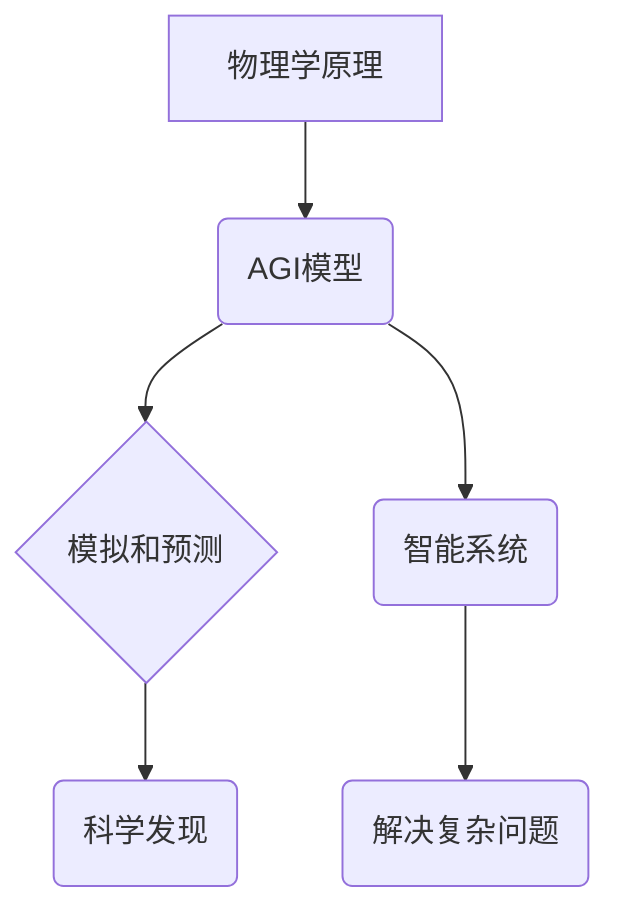

## AGI与物理学的未来发展

> 关键词：通用人工智能 (AGI)、物理学、机器学习、深度学习、模拟、预测、科学发现

## 1. 背景介绍

人工智能 (AI) 正在经历前所未有的发展，从图像识别到自然语言处理，AI 已经取得了令人瞩目的成就。其中，通用人工智能 (AGI) 作为人工智能领域终极目标，一直是研究者们孜孜以求的方向。AGI 旨在创造能够像人类一样学习、理解和解决各种复杂问题的智能系统。

物理学作为自然科学的基础，致力于探索宇宙的本质规律和物质运动的奥秘。它为我们提供了理解世界运行机制的框架，也为科技发展提供了源源不断的动力。近年来，物理学和人工智能的交叉融合逐渐成为一个热门的研究领域。

## 2. 核心概念与联系

**2.1  AGI 的概念**

AGI 是一种能够像人类一样学习、理解和解决各种复杂问题的智能系统。它具备以下关键特征：

* **通用性:** AGI 不局限于特定任务，能够学习和适应各种新的任务和环境。
* **自主性:** AGI 可以独立思考、决策和行动，无需人类干预。
* **创造性:** AGI 能够生成新的知识、想法和解决方案。
* **情感智能:** AGI 能够理解和回应人类的情感。

**2.2  物理学与 AGI 的联系**

物理学和 AGI 之间存在着密切的联系。

* **物理学原理的应用:** AGI 的开发需要基于物理学原理，例如动力学、热力学和量子力学，来构建智能系统的模型和算法。
* **模拟和预测:** AGI 可以利用物理学模型对物理现象进行模拟和预测，例如天气预报、地震预测和材料科学研究。
* **科学发现:** AGI 可以辅助物理学家进行科学发现，例如探索宇宙的起源、寻找新的物理规律和设计新的实验。

**2.3  核心概念架构**



## 3. 核心算法原理 & 具体操作步骤

**3.1  算法原理概述**

AGI 的核心算法原理主要包括机器学习、深度学习和强化学习。

* **机器学习:**  机器学习算法能够从数据中学习模式和规律，并根据这些模式进行预测或分类。
* **深度学习:** 深度学习是机器学习的一个子集，它使用多层神经网络来模拟人类大脑的学习过程。
* **强化学习:** 强化学习算法通过试错和奖励机制来训练智能体，使其在特定环境中获得最大奖励。

**3.2  算法步骤详解**

1. **数据收集和预处理:** 收集大量相关数据，并进行清洗、转换和特征提取。
2. **模型选择和训练:** 选择合适的机器学习、深度学习或强化学习算法，并根据训练数据进行模型训练。
3. **模型评估和优化:** 使用测试数据评估模型性能，并根据评估结果调整模型参数，提高模型精度。
4. **模型部署和应用:** 将训练好的模型部署到实际应用场景中，并进行持续监控和维护。

**3.3  算法优缺点**

* **优点:** 能够自动学习和适应复杂环境，具有强大的泛化能力。
* **缺点:** 需要大量数据进行训练，训练过程耗时且资源消耗大，解释性较差。

**3.4  算法应用领域**

* **图像识别:** 人脸识别、物体检测、图像分类。
* **自然语言处理:** 语音识别、机器翻译、文本摘要。
* **推荐系统:** 商品推荐、内容推荐、个性化服务。
* **医疗诊断:** 病症诊断、疾病预测、药物研发。

## 4. 数学模型和公式 & 详细讲解 & 举例说明

**4.1  数学模型构建**

AGI 的数学模型通常基于概率论、统计学和微积分。

* **概率论:** 用于描述智能系统对未知事件的预测和决策。
* **统计学:** 用于分析数据、识别模式和构建统计模型。
* **微积分:** 用于描述智能系统状态的演化和变化。

**4.2  公式推导过程**

例如，在深度学习中，神经网络的权重更新可以使用梯度下降算法进行优化。梯度下降算法的核心公式如下：

$$
\theta = \theta - \alpha \nabla J(\theta)
$$

其中：

* $\theta$ 是神经网络的权重参数。
* $\alpha$ 是学习率，控制着参数更新的步长。
* $\nabla J(\theta)$ 是损失函数 $J(\theta)$ 的梯度，表示参数更新的方向。

**4.3  案例分析与讲解**

例如，在图像识别任务中，可以使用卷积神经网络 (CNN) 模型进行图像分类。CNN 模型利用卷积操作和池化操作来提取图像特征，并使用全连接层进行分类。

## 5. 项目实践：代码实例和详细解释说明

**5.1  开发环境搭建**

使用 Python 语言和 TensorFlow 或 PyTorch 深度学习框架进行开发。

**5.2  源代码详细实现**

```python
import tensorflow as tf

# 定义卷积神经网络模型
model = tf.keras.models.Sequential([
    tf.keras.layers.Conv2D(32, (3, 3), activation='relu', input_shape=(28, 28, 1)),
    tf.keras.layers.MaxPooling2D((2, 2)),
    tf.keras.layers.Conv2D(64, (3, 3), activation='relu'),
    tf.keras.layers.MaxPooling2D((2, 2)),
    tf.keras.layers.Flatten(),
    tf.keras.layers.Dense(10, activation='softmax')
])

# 编译模型
model.compile(optimizer='adam',
              loss='sparse_categorical_crossentropy',
              metrics=['accuracy'])

# 训练模型
model.fit(x_train, y_train, epochs=5)

# 评估模型
loss, accuracy = model.evaluate(x_test, y_test)
print('Test loss:', loss)
print('Test accuracy:', accuracy)
```

**5.3  代码解读与分析**

这段代码定义了一个简单的卷积神经网络模型，用于 MNIST 手写数字识别任务。

* `tf.keras.models.Sequential` 创建了一个顺序模型，其中层级依次连接。
* `tf.keras.layers.Conv2D` 定义了一个卷积层，用于提取图像特征。
* `tf.keras.layers.MaxPooling2D` 定义了一个最大池化层，用于降低特征图尺寸。
* `tf.keras.layers.Flatten` 将多维特征图转换为一维向量。
* `tf.keras.layers.Dense` 定义了一个全连接层，用于分类。
* `model.compile` 编译模型，指定优化器、损失函数和评价指标。
* `model.fit` 训练模型，使用训练数据进行迭代训练。
* `model.evaluate` 评估模型，使用测试数据计算损失和准确率。

**5.4  运行结果展示**

训练完成后，模型能够对 MNIST 手写数字进行识别，并达到一定的准确率。

## 6. 实际应用场景

**6.1  科学发现**

* **宇宙学:** AGI 可以帮助物理学家模拟宇宙的演化，探索暗物质和暗能量的性质。
* **粒子物理:** AGI 可以分析粒子碰撞数据，寻找新的粒子和物理规律。
* **材料科学:** AGI 可以预测材料的性能，设计新型材料。

**6.2  技术创新**

* **药物研发:** AGI 可以加速药物研发过程，发现新的药物靶点和药物候选物。
* **能源开发:** AGI 可以优化能源生产和利用方式，开发清洁能源技术。
* **人工智能安全:** AGI 可以帮助开发更安全的 AI 系统，防止 AI 滥用和攻击。

**6.3  社会服务**

* **医疗诊断:** AGI 可以辅助医生进行疾病诊断，提高诊断准确率。
* **教育教学:** AGI 可以提供个性化教育服务，帮助学生更好地学习。
* **环境保护:** AGI 可以监测环境变化，预测自然灾害，帮助保护环境。

**6.4  未来应用展望**

AGI 将在未来各个领域发挥越来越重要的作用，例如：

* **科学发现:** AGI 将帮助人类探索宇宙的奥秘，揭示自然规律。
* **技术创新:** AGI 将推动科技发展，创造新的技术和产品。
* **社会进步:** AGI 将改善人类生活，解决社会问题。

## 7. 工具和资源推荐

**7.1  学习资源推荐**

* **书籍:**
    * 《深度学习》
    * 《人工智能：现代方法》
    * 《机器学习》
* **在线课程:**
    * Coursera: 深度学习
    * edX: 人工智能
    * Udacity: 机器学习工程师

**7.2  开发工具推荐**

* **Python:** 广泛用于 AI 开发，拥有丰富的库和框架。
* **TensorFlow:** Google 开发的开源深度学习框架。
* **PyTorch:** Facebook 开发的开源深度学习框架。
* **Jupyter Notebook:** 用于交互式编程和数据可视化的工具。

**7.3  相关论文推荐**

* **《ImageNet Classification with Deep Convolutional Neural Networks》**
* **《Attention Is All You Need》**
* **《Generative Pre-trained Transformer 3》**

## 8. 总结：未来发展趋势与挑战

**8.1  研究成果总结**

近年来，AGI 和物理学交叉融合取得了显著进展，例如：

* **物理模拟:** AGI 可以用于模拟复杂物理系统，例如天气预报、地震预测和材料科学研究。
* **科学发现:** AGI 可以辅助物理学家进行科学发现，例如探索宇宙的起源、寻找新的物理规律和设计新的实验。
* **技术创新:** AGI 可以推动科技发展，例如药物研发、能源开发和人工智能安全。

**8.2  未来发展趋势**

* **更强大的计算能力:** AGI 的发展需要强大的计算能力，未来将出现更强大的计算硬件和软件。
* **更丰富的知识库:** AGI 需要访问更丰富的知识库，例如科学文献、百科全书和互联网数据。
* **更完善的算法:** AGI 的算法需要不断改进，例如提高学习效率、增强泛化能力和解释性。

**8.3  面临的挑战**

* **数据获取和标注:** AGI 的训练需要大量数据，获取和标注这些数据是一个巨大的挑战。
* **算法解释性和可信度:** AGI 的决策过程往往难以解释，这会影响其可信度和应用范围。
* **伦理和安全问题:** AGI 的发展可能带来伦理和安全问题，例如算法偏见、隐私泄露和人工智能失控。

**8.4  研究展望**

未来，AGI 和物理学交叉融合的研究将继续深入，探索更深层次的科学问题，推动科技发展，改善人类生活。


## 9. 附录：常见问题与解答

**9.1  AGI 是否会取代人类？**

AGI 的目的是帮助人类解决问题，提高生活质量，而不是取代人类。AGI 应该被视为人类的工具，而不是人类的敌人。

**9.2  AGI 的发展会带来哪些风险？**

AGI 的发展可能带来一些风险，例如算法偏见、隐私泄露和人工智能失控。我们需要认真思考这些风险，并采取措施加以规避。

**9.3  如何确保 AGI 的安全和伦理？**

确保 AGI 的安全和伦理需要多方面的努力，例如制定相关法律法规、加强算法监管、提高公众意识等。

作者：禅与计算机程序设计艺术 / Zen and the Art of Computer Programming 


