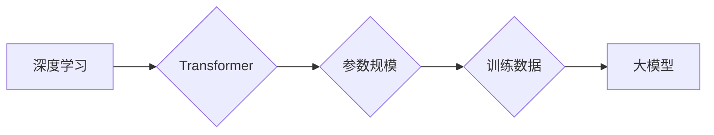

## AI 大模型原理与应用：大模型的商业模式和壁垒

> 关键词：大模型、Transformer、深度学习、自然语言处理、计算机视觉、商业模式、壁垒

### 1. 背景介绍

近年来，人工智能（AI）技术取得了飞速发展，其中大模型（Large Language Model，LLM）作为AI领域的重要突破口，引发了广泛关注。大模型是指参数规模庞大、训练数据海量的人工智能模型，其强大的学习能力和泛化能力使其在自然语言处理（NLP）、计算机视觉（CV）、语音识别等多个领域展现出令人瞩目的应用潜力。

从早期基于循环神经网络（RNN）的语言模型发展到如今基于Transformer架构的巨型语言模型，大模型的规模和能力不断提升。GPT-3、BERT、LaMDA等代表性大模型的出现，标志着AI技术进入了一个新的时代，也为商业应用提供了无限可能。

然而，大模型的训练和应用也面临着诸多挑战，例如高昂的计算成本、数据隐私安全、模型可解释性等。 

### 2. 核心概念与联系

大模型的核心概念包括：

* **深度学习:** 大模型的训练基于深度学习算法，通过多层神经网络学习数据中的复杂模式和关系。
* **Transformer:** Transformer是一种新型的神经网络架构，其自注意力机制能够有效捕捉文本中的长距离依赖关系，成为大模型训练的基石。
* **参数规模:** 大模型拥有数亿甚至数十亿个参数，这些参数通过训练数据学习得到，决定了模型的复杂度和表达能力。
* **训练数据:** 大模型的训练需要海量的数据，数据质量和规模直接影响模型的性能。

**Mermaid 流程图:**



### 3. 核心算法原理 & 具体操作步骤

#### 3.1  算法原理概述

大模型的训练主要基于深度学习算法，特别是Transformer架构。Transformer通过自注意力机制和多头注意力机制，能够有效捕捉文本中的长距离依赖关系，从而实现更准确的语言理解和生成。

#### 3.2  算法步骤详解

1. **数据预处理:** 将原始文本数据进行清洗、分词、标记等预处理操作，使其能够被模型理解。
2. **模型构建:** 根据Transformer架构构建深度神经网络模型，并设定模型参数。
3. **模型训练:** 使用海量训练数据，通过反向传播算法训练模型，调整模型参数，使其能够准确预测目标输出。
4. **模型评估:** 使用测试数据评估模型的性能，例如准确率、召回率、F1-score等指标。
5. **模型调优:** 根据评估结果，调整模型参数、训练策略等，进一步提升模型性能。

#### 3.3  算法优缺点

**优点:**

* 强大的学习能力：大模型能够学习到复杂的数据模式和关系，实现更准确的预测和生成。
* 泛化能力强：经过海量数据训练的大模型能够更好地推广到新的数据场景。
* 多任务学习能力：大模型可以同时学习多个任务，提高资源利用率。

**缺点:**

* 计算成本高：训练大模型需要大量的计算资源和时间。
* 数据依赖性强：大模型的性能直接取决于训练数据的质量和规模。
* 可解释性差：大模型的决策过程复杂，难以解释其背后的逻辑。

#### 3.4  算法应用领域

大模型在多个领域展现出广泛的应用潜力，例如：

* **自然语言处理:** 文本生成、机器翻译、问答系统、情感分析等。
* **计算机视觉:** 图像识别、物体检测、图像生成等。
* **语音识别:** 语音转文本、语音合成等。
* **代码生成:** 自动生成代码、代码修复等。

### 4. 数学模型和公式 & 详细讲解 & 举例说明

#### 4.1  数学模型构建

大模型的数学模型通常基于深度神经网络，其核心是多层感知机（MLP）和注意力机制。

* **多层感知机 (MLP):** MLP由多个全连接层组成，每一层都包含多个神经元。每个神经元接收上一层的输出作为输入，并通过激活函数进行非线性变换，输出到下一层。

* **注意力机制:** 注意力机制能够学习到文本中不同词语之间的重要关系，并赋予它们不同的权重。

#### 4.2  公式推导过程

**自注意力机制公式:**

$$
Attention(Q, K, V) = softmax(\frac{QK^T}{\sqrt{d_k}})V
$$

其中：

* $Q$：查询矩阵
* $K$：键矩阵
* $V$：值矩阵
* $d_k$：键向量的维度
* $softmax$：softmax函数

#### 4.3  案例分析与讲解

例如，在机器翻译任务中，输入句子是英文，输出句子是中文。

* $Q$：表示输入句子中每个词语的查询向量。
* $K$：表示目标语言中每个词语的键向量。
* $V$：表示目标语言中每个词语的值向量。

通过自注意力机制，模型能够学习到输入句子中每个词语与目标语言中每个词语之间的关系，并根据这些关系生成最合适的翻译结果。

### 5. 项目实践：代码实例和详细解释说明

#### 5.1  开发环境搭建

* Python 3.7+
* PyTorch 或 TensorFlow
* CUDA 和 cuDNN

#### 5.2  源代码详细实现

```python
import torch
import torch.nn as nn

class Transformer(nn.Module):
    def __init__(self, vocab_size, embedding_dim, num_heads, num_layers):
        super(Transformer, self).__init__()
        self.embedding = nn.Embedding(vocab_size, embedding_dim)
        self.transformer_layers = nn.ModuleList([
            nn.TransformerEncoderLayer(embedding_dim, num_heads)
            for _ in range(num_layers)
        ])
        self.linear = nn.Linear(embedding_dim, vocab_size)

    def forward(self, x):
        x = self.embedding(x)
        for layer in self.transformer_layers:
            x = layer(x)
        x = self.linear(x)
        return x
```

#### 5.3  代码解读与分析

* `__init__` 方法：初始化模型参数，包括词嵌入层、Transformer编码器层和输出层。
* `forward` 方法：定义模型的正向传播过程，将输入序列经过词嵌入层、Transformer编码器层和输出层，最终得到预测输出。

#### 5.4  运行结果展示

训练完成后，可以使用测试数据评估模型的性能，例如准确率、困惑度等指标。

### 6. 实际应用场景

大模型在多个实际应用场景中展现出强大的能力，例如：

* **聊天机器人:** 大模型可以训练出更智能、更自然的聊天机器人，能够进行更流畅、更自然的对话。
* **文本摘要:** 大模型可以自动生成文本摘要，提取文本的关键信息，提高阅读效率。
* **机器翻译:** 大模型可以实现更高质量的机器翻译，突破语言障碍，促进跨文化交流。

### 6.4  未来应用展望

未来，大模型将应用于更多领域，例如：

* **个性化教育:** 根据学生的学习情况，提供个性化的学习内容和辅导。
* **医疗诊断:** 辅助医生进行疾病诊断，提高诊断准确率。
* **科学研究:** 加速科学研究进程，帮助科学家发现新的知识。

### 7. 工具和资源推荐

#### 7.1  学习资源推荐

* **书籍:**
    * 《深度学习》
    * 《自然语言处理》
    * 《Transformer模型》
* **在线课程:**
    * Coursera: 深度学习
    * Udacity: 自然语言处理
    * fast.ai: 深度学习

#### 7.2  开发工具推荐

* **PyTorch:** 深度学习框架
* **TensorFlow:** 深度学习框架
* **Hugging Face:** 大模型库和工具

#### 7.3  相关论文推荐

* 《Attention Is All You Need》
* 《BERT: Pre-training of Deep Bidirectional Transformers for Language Understanding》
* 《GPT-3: Language Models are Few-Shot Learners》

### 8. 总结：未来发展趋势与挑战

#### 8.1  研究成果总结

近年来，大模型在NLP、CV等领域取得了显著进展，展现出强大的应用潜力。

#### 8.2  未来发展趋势

* **模型规模继续扩大:** 随着计算资源的提升，大模型的规模将继续扩大，模型能力将进一步提升。
* **多模态大模型:** 将文本、图像、音频等多种模态数据融合到一起，构建更强大的多模态大模型。
* **可解释性研究:** 加强对大模型的解释性研究，使其决策过程更加透明可理解。

#### 8.3  面临的挑战

* **计算成本高:** 训练大模型需要大量的计算资源，成本较高。
* **数据隐私安全:** 大模型的训练需要海量数据，如何保证数据隐私安全是一个重要挑战。
* **模型可解释性:** 大模型的决策过程复杂，难以解释其背后的逻辑，这限制了其在一些领域应用。

#### 8.4  研究展望

未来，大模型研究将继续朝着更强大、更安全、更可解释的方向发展，为人类社会带来更多福祉。

### 9. 附录：常见问题与解答

* **什么是大模型？** 大模型是指参数规模庞大、训练数据海量的人工智能模型。
* **大模型的训练需要哪些资源？** 大模型的训练需要大量的计算资源、存储资源和数据资源。
* **大模型有哪些应用场景？** 大模型在NLP、CV、语音识别等多个领域都有广泛的应用场景。


作者：禅与计算机程序设计艺术 / Zen and the Art of Computer Programming 
