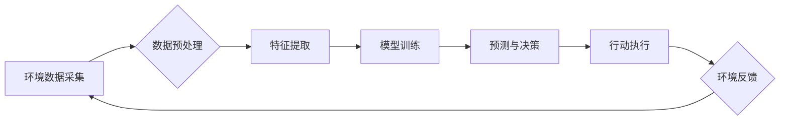

## AI人工智能 Agent：在环保领域中的应用

> 关键词：人工智能、环境保护、智能代理、机器学习、数据分析、可持续发展、环境监测、资源管理

## 1. 背景介绍

全球气候变化和环境污染问题日益严峻，迫切需要创新技术来应对这些挑战。人工智能（AI）作为一门快速发展的技术领域，展现出巨大的潜力，能够为环境保护提供有效的解决方案。

智能代理（AI Agent）作为AI的核心概念之一，是指能够感知环境、做出决策并执行行动的智能体。在环保领域，智能代理可以被设计成监测环境变化、分析数据、优化资源利用和制定环境保护策略等功能。

## 2. 核心概念与联系

### 2.1 智能代理

智能代理是一个能够自主学习、推理和决策的软件系统。它通常由以下几个核心组件组成：

* **感知模块:** 收集环境信息，例如传感器数据、图像、文本等。
* **推理模块:** 分析感知到的信息，进行知识推理和决策制定。
* **行动模块:** 执行决策，与环境进行交互，例如控制设备、发布指令等。
* **学习模块:** 从经验中学习，不断改进决策能力。

### 2.2 环境保护与智能代理

在环境保护领域，智能代理可以应用于多个方面，例如：

* **环境监测:** 利用传感器数据和机器学习算法，实时监测空气质量、水质、土壤状况等环境参数。
* **污染控制:** 分析污染源和传播路径，制定有效的污染控制策略，例如优化排放标准、控制工业生产等。
* **资源管理:** 优化资源利用，减少浪费和环境污染，例如智能农业、智慧能源管理等。
* **生态保护:** 监测生物多样性、保护濒危物种，维护生态平衡。

**Mermaid 流程图**



## 3. 核心算法原理 & 具体操作步骤

### 3.1 算法原理概述

在环境保护领域，常用的智能代理算法包括：

* **强化学习:** 通过奖励机制，训练智能代理在环境中学习最优策略。
* **机器学习:** 利用历史数据训练模型，预测环境变化和做出决策。
* **深度学习:** 使用多层神经网络，学习复杂环境特征，提高预测精度。

### 3.2 算法步骤详解

以强化学习为例，其核心步骤如下：

1. **环境建模:** 建立环境模型，描述环境状态、动作空间和奖励函数。
2. **代理初始化:** 初始化智能代理，设置初始状态和策略。
3. **环境交互:** 智能代理与环境进行交互，感知环境状态并执行动作。
4. **奖励反馈:** 环境根据代理的动作提供奖励信号。
5. **策略更新:** 智能代理根据奖励信号更新策略，提高未来决策的质量。
6. **重复步骤3-5:** 重复以上步骤，直到代理达到预设的目标或训练结束。

### 3.3 算法优缺点

**强化学习:**

* **优点:** 能够学习复杂环境，适应动态变化。
* **缺点:** 训练时间长，需要大量数据和计算资源。

**机器学习:**

* **优点:** 训练速度快，能够处理大量数据。
* **缺点:** 难以学习复杂非线性关系，对数据质量要求高。

**深度学习:**

* **优点:** 学习能力强，能够处理复杂特征。
* **缺点:** 训练成本高，需要大量数据和计算资源。

### 3.4 算法应用领域

* **环境监测:** 利用强化学习训练智能代理，自动识别污染物、预测环境变化。
* **资源管理:** 利用机器学习训练模型，优化能源分配、水资源利用等。
* **生态保护:** 利用深度学习分析生物图像，识别濒危物种、监测生态系统变化。

## 4. 数学模型和公式 & 详细讲解 & 举例说明

### 4.1 数学模型构建

在环境保护领域，常用的数学模型包括：

* **环境动力学模型:** 描述环境系统随时间变化的规律。
* **污染扩散模型:** 描述污染物在环境中的传播和扩散过程。
* **资源消耗模型:** 描述资源的获取、利用和消耗过程。

### 4.2 公式推导过程

以污染扩散模型为例，其基本公式为：

$$
\frac{\partial C}{\partial t} = D \nabla^2 C + S(x,t)
$$

其中：

* $C$ 为污染物浓度
* $t$ 为时间
* $D$ 为扩散系数
* $\nabla^2$ 为拉普拉斯算符
* $S(x,t)$ 为污染物源项

该公式描述了污染物浓度随时间和空间变化的规律，其中扩散项描述了污染物在环境中的扩散过程，源项描述了污染物来源。

### 4.3 案例分析与讲解

假设一个河流中存在污染源，其污染物浓度分布可以用上述公式描述。通过对公式的数值解，可以预测污染物在河流中的传播范围和浓度变化趋势。

## 5. 项目实践：代码实例和详细解释说明

### 5.1 开发环境搭建

* 操作系统: Ubuntu 20.04
* Python 版本: 3.8
* 必要的库: TensorFlow, NumPy, Pandas, Matplotlib

### 5.2 源代码详细实现

```python
import tensorflow as tf
from tensorflow.keras.models import Sequential
from tensorflow.keras.layers import Dense, LSTM

# 构建环境数据
#...

# 训练模型
model = Sequential()
model.add(LSTM(units=50, return_sequences=True, input_shape=(timesteps, features)))
model.add(LSTM(units=50))
model.add(Dense(units=1))

model.compile(loss='mean_squared_error', optimizer='adam')
model.fit(X_train, y_train, epochs=100, batch_size=32)

# 预测环境变化
predictions = model.predict(X_test)
```

### 5.3 代码解读与分析

* 使用 TensorFlow 库构建深度学习模型。
* 使用 LSTM 层学习时间序列数据，预测环境变化趋势。
* 使用均方误差作为损失函数，Adam 优化器进行模型训练。

### 5.4 运行结果展示

* 可视化预测结果，与实际环境数据进行对比分析。
* 评估模型性能，例如预测精度、误差率等。

## 6. 实际应用场景

### 6.1 环境监测

* 利用智能代理监测空气质量、水质、土壤状况等环境参数。
* 自动识别污染物，报警预警。
* 提供实时环境数据，支持环境决策。

### 6.2 污染控制

* 分析污染源和传播路径，制定有效的污染控制策略。
* 控制工业生产排放，优化能源利用。
* 预测污染事件，提前采取措施。

### 6.3 资源管理

* 优化水资源利用，减少水资源浪费。
* 智能农业，提高农业生产效率，减少农药和化肥使用。
* 智慧能源管理，优化能源分配，减少能源消耗。

### 6.4 未来应用展望

* 利用无人机和卫星遥感数据，实现大范围环境监测。
* 开发更智能的污染控制策略，实现精准控制。
* 利用大数据分析，预测环境变化趋势，支持可持续发展。

## 7. 工具和资源推荐

### 7.1 学习资源推荐

* **书籍:**
    * 《人工智能：一种现代方法》
    * 《深度学习》
* **在线课程:**
    * Coursera: 深度学习
    * edX: 人工智能
* **开源项目:**
    * TensorFlow
    * PyTorch

### 7.2 开发工具推荐

* **编程语言:** Python
* **深度学习框架:** TensorFlow, PyTorch
* **数据分析工具:** Pandas, NumPy
* **可视化工具:** Matplotlib, Seaborn

### 7.3 相关论文推荐

* **强化学习:**
    * Deep Reinforcement Learning: An Overview
* **机器学习:**
    * Support Vector Machines
* **深度学习:**
    * Deep Learning

## 8. 总结：未来发展趋势与挑战

### 8.1 研究成果总结

AI 人工智能 Agent 在环境保护领域取得了显著成果，例如环境监测、污染控制、资源管理等方面都展现出巨大的潜力。

### 8.2 未来发展趋势

* **更智能的代理:** 开发更智能的代理，能够自主学习、推理和决策，适应复杂环境变化。
* **更强大的计算能力:** 利用云计算和高性能计算，提高模型训练速度和精度。
* **更丰富的环境数据:** 收集更多环境数据，例如遥感数据、传感器数据等，丰富模型训练数据。

### 8.3 面临的挑战

* **数据质量:** 环境数据往往存在噪声、缺失等问题，需要进行有效的数据清洗和预处理。
* **模型解释性:** 深度学习模型的决策过程难以解释，需要开发更可解释的模型。
* **伦理问题:** AI 技术的应用需要考虑伦理问题，例如数据隐私、算法偏见等。

### 8.4 研究展望

未来，AI 人工智能 Agent 将在环境保护领域发挥更重要的作用，帮助人类应对气候变化和环境污染问题。需要加强基础研究，解决技术难题，并关注伦理问题，确保 AI 技术的健康发展。

## 9. 附录：常见问题与解答

* **Q1: AI 人工智能 Agent 是否能够完全替代人类在环境保护中的作用？**

* **A1:** 目前 AI 技术还无法完全替代人类，但可以作为人类的助手，提高效率和准确性。

* **Q2: AI 人工智能 Agent 的应用会带来哪些伦理问题？**

* **A2:** AI 技术的应用需要考虑数据隐私、算法偏见、责任归属等伦理问题。

* **Q3: 如何评估 AI 人工智能 Agent 在环境保护中的效果？**

* **A3:** 可以通过指标如预测精度、误差率、资源利用效率等来评估 AI 人工智能 Agent 的效果。


作者：禅与计算机程序设计艺术 / Zen and the Art of Computer Programming 
