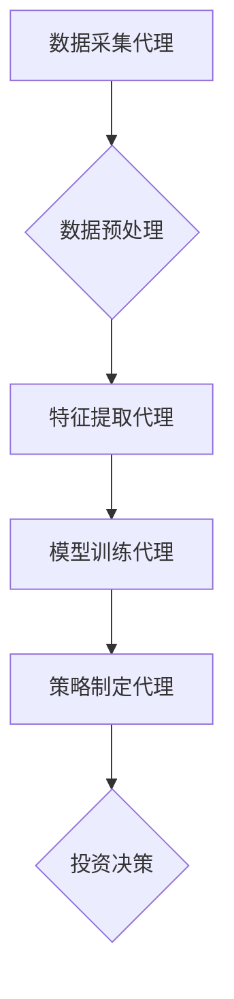

## AI人工智能代理工作流 AI Agent WorkFlow：在股票市场预测中的应用

> 关键词：人工智能代理、工作流、股票市场预测、机器学习、深度学习、强化学习、自然语言处理

## 1. 背景介绍

股票市场预测一直是金融领域研究的热点问题，其复杂性和不确定性使得传统预测方法难以有效应对。近年来，随着人工智能技术的快速发展，特别是深度学习和强化学习的突破，人工智能代理工作流 (AI Agent WorkFlow) 在股票市场预测领域展现出巨大的潜力。

AI Agent WorkFlow 是一种基于人工智能代理的自动化工作流程，它可以将复杂的股票市场预测任务分解成多个子任务，并通过一系列智能代理协同完成。每个代理都专注于特定的子任务，例如数据收集、特征提取、模型训练、策略制定等，并通过信息共享和反馈机制相互协作，最终实现对股票市场趋势的预测。

## 2. 核心概念与联系

### 2.1  人工智能代理 (AI Agent)

人工智能代理是一个能够感知环境、做出决策并与环境交互的智能体。在股票市场预测中，AI 代理可以被设计为专门处理特定任务的专家，例如：

* **数据采集代理:** 从各种数据源收集股票市场相关信息，如股票价格、交易量、新闻报道等。
* **特征提取代理:** 从原始数据中提取有价值的特征，例如技术指标、市场情绪等。
* **模型训练代理:** 利用机器学习算法训练股票市场预测模型，例如回归模型、分类模型、时间序列模型等。
* **策略制定代理:** 基于预测模型的输出，制定股票投资策略，例如买入、卖出、持有等。

### 2.2  工作流 (WorkFlow)

工作流是指一系列有序执行的任务和步骤，用于完成一个特定的目标。在 AI Agent WorkFlow 中，工作流定义了各个代理之间的交互关系和任务执行顺序，确保整个预测过程的流畅性和效率。

### 2.3  AI Agent WorkFlow 架构



**图 1：AI Agent WorkFlow 架构**

## 3. 核心算法原理 & 具体操作步骤

### 3.1  算法原理概述

AI Agent WorkFlow 中常用的算法包括机器学习、深度学习和强化学习。

* **机器学习:** 利用历史数据训练模型，预测未来股票价格趋势。常见的机器学习算法包括线性回归、逻辑回归、支持向量机、决策树等。
* **深度学习:** 利用多层神经网络学习复杂的非线性关系，提高预测精度。常见的深度学习算法包括卷积神经网络 (CNN)、循环神经网络 (RNN) 和长短期记忆网络 (LSTM)。
* **强化学习:** 通过试错学习，优化股票投资策略，最大化收益。强化学习算法通过奖励机制引导代理学习最优策略。

### 3.2  算法步骤详解

1. **数据收集:** 从各种数据源收集股票市场相关信息，例如股票价格、交易量、新闻报道、社交媒体数据等。
2. **数据预处理:** 对收集到的数据进行清洗、转换和特征工程，例如处理缺失值、归一化数据、提取技术指标等。
3. **模型训练:** 利用机器学习、深度学习或强化学习算法训练股票市场预测模型。
4. **策略制定:** 基于预测模型的输出，制定股票投资策略，例如买入、卖出、持有等。
5. **投资决策:** 根据策略制定结果，进行实际的股票投资决策。
6. **结果评估:** 对投资决策结果进行评估，例如计算收益率、风险指标等，并根据评估结果进行模型优化和策略调整。

### 3.3  算法优缺点

| 算法类型 | 优点 | 缺点 |
|---|---|---|
| 机器学习 | 易于理解和实现，训练速度快 | 难以捕捉复杂非线性关系，对数据质量要求高 |
| 深度学习 | 能够学习复杂的非线性关系，预测精度高 | 训练时间长，对计算资源要求高，容易过拟合 |
| 强化学习 | 可以学习最优策略，适应动态变化的环境 | 训练过程复杂，需要大量的试错数据 |

### 3.4  算法应用领域

AI Agent WorkFlow 在股票市场预测领域具有广泛的应用场景，例如：

* **股票价格预测:** 利用历史数据预测未来股票价格走势。
* **股票交易策略优化:** 利用强化学习算法优化股票交易策略，提高收益率。
* **风险管理:** 利用机器学习算法识别股票市场风险，降低投资损失。
* **投资组合管理:** 利用 AI Agent WorkFlow 建立智能投资组合，实现资产配置优化。

## 4. 数学模型和公式 & 详细讲解 & 举例说明

### 4.1  数学模型构建

在股票市场预测中，常用的数学模型包括时间序列模型、回归模型和神经网络模型。

* **时间序列模型:** 用于预测股票价格的未来趋势，例如ARIMA模型、SARIMA模型等。
* **回归模型:** 用于预测股票价格与其他变量之间的关系，例如线性回归、逻辑回归等。
* **神经网络模型:** 用于学习复杂的非线性关系，例如多层感知机 (MLP)、卷积神经网络 (CNN)、循环神经网络 (RNN) 等。

### 4.2  公式推导过程

时间序列模型的ARIMA模型的公式推导过程如下：

* **AR (Autoregressive):** $y_t = c + \phi_1 y_{t-1} + \phi_2 y_{t-2} +... + \phi_p y_{t-p} + \epsilon_t$

其中：

* $y_t$ 是时间t的股票价格
* $c$ 是截距项
* $\phi_i$ 是自回归系数
* $p$ 是自回归阶数
* $\epsilon_t$ 是随机误差项

* **MA (Moving Average):** $y_t = c + \epsilon_t + \theta_1 \epsilon_{t-1} + \theta_2 \epsilon_{t-2} +... + \theta_q \epsilon_{t-q}$

其中：

* $\theta_i$ 是移动平均系数
* $q$ 是移动平均阶数

* **ARIMA (Autoregressive Integrated Moving Average):** $y_t = c + \phi_1 y_{t-1} + \phi_2 y_{t-2} +... + \phi_p y_{t-p} + \theta_1 \epsilon_{t-1} + \theta_2 \epsilon_{t-2} +... + \theta_q \epsilon_{t-q} + \epsilon_t$

### 4.3  案例分析与讲解

假设我们想要预测某只股票未来一周的价格走势，可以使用ARIMA模型进行预测。首先，我们需要收集该股票的历史价格数据，并进行数据预处理，例如平滑数据、去除趋势等。然后，我们可以使用ARIMA模型的参数估计方法，例如极大似然估计，来估计模型的参数。最后，我们可以利用估计的参数，预测未来一周的股票价格。

## 5. 项目实践：代码实例和详细解释说明

### 5.1  开发环境搭建

* **操作系统:** Windows, macOS, Linux
* **编程语言:** Python
* **库依赖:** pandas, numpy, scikit-learn, tensorflow, keras

### 5.2  源代码详细实现

```python
import pandas as pd
from sklearn.model_selection import train_test_split
from sklearn.linear_model import LinearRegression
from sklearn.metrics import mean_squared_error

# 加载股票价格数据
data = pd.read_csv('stock_price.csv')

# 选择特征和目标变量
features = ['Open', 'High', 'Low', 'Volume']
target = 'Close'

# 将数据分割为训练集和测试集
X_train, X_test, y_train, y_test = train_test_split(data[features], data[target], test_size=0.2)

# 创建线性回归模型
model = LinearRegression()

# 训练模型
model.fit(X_train, y_train)

# 预测测试集数据
y_pred = model.predict(X_test)

# 计算模型性能
mse = mean_squared_error(y_test, y_pred)
print('Mean Squared Error:', mse)
```

### 5.3  代码解读与分析

* **数据加载:** 使用 pandas 库加载股票价格数据。
* **特征选择:** 选择股票价格的历史数据作为特征，例如开盘价、最高价、最低价、成交量等。
* **数据分割:** 将数据分割为训练集和测试集，用于训练和评估模型。
* **模型创建:** 使用 scikit-learn 库创建线性回归模型。
* **模型训练:** 使用训练集数据训练模型。
* **模型预测:** 使用训练好的模型预测测试集数据的股票价格。
* **模型评估:** 使用均方误差 (MSE) 评估模型的性能。

### 5.4  运行结果展示

运行代码后，会输出模型的均方误差值，该值越小，模型的预测精度越高。

## 6. 实际应用场景

AI Agent WorkFlow 在股票市场预测领域具有广泛的应用场景，例如：

* **量化投资:** 利用 AI Agent WorkFlow 自动执行量化投资策略，例如趋势跟踪、价值投资等。
* **高频交易:** 利用 AI Agent WorkFlow 快速识别市场机会，进行高频交易。
* **风险管理:** 利用 AI Agent WorkFlow 识别股票市场风险，降低投资损失。

### 6.4  未来应用展望

随着人工智能技术的不断发展，AI Agent WorkFlow 在股票市场预测领域将有更广泛的应用场景，例如：

* **个性化投资建议:** 根据用户的风险偏好和投资目标，提供个性化的投资建议。
* **智能投资组合管理:** 利用 AI Agent WorkFlow 建立智能投资组合，实现资产配置优化。
* **预测市场情绪:** 利用自然语言处理技术，预测市场情绪，辅助投资决策。

## 7. 工具和资源推荐

### 7.1  学习资源推荐

* **书籍:**
    * 《深度学习》
    * 《强化学习：原理、算法和应用》
    * 《Python机器学习》
* **在线课程:**
    * Coursera: 深度学习
    * edX: 强化学习
    * Udacity: 机器学习工程师

### 7.2  开发工具推荐

* **Python:** 
    * Jupyter Notebook
    * PyCharm
* **机器学习库:**
    * scikit-learn
    * TensorFlow
    * Keras
* **数据可视化工具:**
    * Matplotlib
    * Seaborn

### 7.3  相关论文推荐

* **AlphaGo论文:** https://arxiv.org/abs/1607.02886
* **BERT论文:** https://arxiv.org/abs/1810.04805
* **GAN论文:** https://arxiv.org/abs/1406.2661

## 8. 总结：未来发展趋势与挑战

### 8.1  研究成果总结

AI Agent WorkFlow 在股票市场预测领域取得了显著的成果，例如：

* **提高预测精度:** 深度学习和强化学习算法能够学习复杂的非线性关系，提高预测精度。
* **自动化投资决策:** AI Agent WorkFlow 可以自动化执行投资决策，提高投资效率。
* **个性化投资建议:** AI Agent WorkFlow 可以根据用户的风险偏好和投资目标，提供个性化的投资建议。

### 8.2  未来发展趋势

* **更强大的模型:** 研究更强大的深度学习和强化学习算法，提高预测精度和鲁棒性。
* **多模态数据融合:** 利用多模态数据，例如文本、图像、音频等