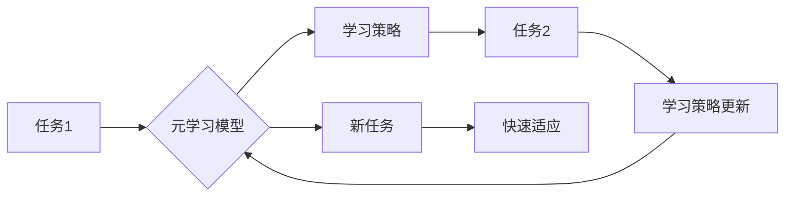

## AI人工智能核心算法原理与代码实例讲解：元学习

> 关键词：元学习、迁移学习、模型训练、优化算法、深度学习、强化学习

## 1. 背景介绍

人工智能（AI）领域近年来取得了飞速发展，深度学习算法在图像识别、自然语言处理等领域取得了突破性进展。然而，深度学习模型的训练通常需要大量的 labeled 数据和大量的计算资源，这对于一些新任务或数据稀缺场景来说是一个挑战。

元学习（Meta-Learning）应运而生，它旨在通过学习如何学习，从而提高模型在新的任务上的泛化能力和学习效率。元学习的目标不是学习一个特定的任务，而是学习一个能够快速适应新任务的学习算法。

## 2. 核心概念与联系

元学习的核心概念是“学习如何学习”。它通过在多个相关任务上进行训练，学习一个通用的学习策略，以便在遇到新的任务时能够快速适应。

**元学习流程图:**



**核心概念:**

* **内循环:** 在每个具体任务上进行模型训练，优化模型参数。
* **外循环:** 在多个任务上进行内循环训练，更新元学习模型的参数，使其能够学习更通用的学习策略。
* **元学习模型:** 学习如何学习的模型，它能够根据训练数据生成一个新的模型，并快速适应新的任务。
* **学习策略:** 元学习模型学习到的策略，用于指导模型在新的任务上的训练。

## 3. 核心算法原理 & 具体操作步骤

### 3.1  算法原理概述

元学习算法的核心思想是利用之前学习到的知识来加速新任务的学习。它通过在多个相关任务上进行训练，学习一个通用的学习策略，以便在遇到新的任务时能够快速适应。

常见的元学习算法包括：

* **Model-Agnostic Meta-Learning (MAML):**  MAML是一种通用的元学习算法，它可以应用于各种类型的模型。它通过在多个任务上进行训练，学习一个模型参数的初始值，使得模型能够快速适应新的任务。
* **Prototypical Networks:** Prototypical Networks是一种基于原型学习的元学习算法。它通过学习每个类别的原型，使得模型能够快速识别新的样本。
* **Matching Networks:** Matching Networks是一种基于匹配学习的元学习算法。它通过学习一个匹配函数，使得模型能够比较两个样本之间的相似性。

### 3.2  算法步骤详解

以MAML算法为例，其具体操作步骤如下：

1. **初始化:** 初始化元学习模型的参数。
2. **内循环训练:**
    * 随机选择一个任务。
    * 在该任务上进行模型训练，更新模型参数。
3. **外循环训练:**
    * 在多个任务上进行内循环训练，更新元学习模型的参数。
4. **测试:** 在新的任务上使用训练好的元学习模型进行测试。

### 3.3  算法优缺点

**优点:**

* **快速适应新任务:** 元学习模型能够快速适应新的任务，无需大量的训练数据。
* **提高泛化能力:** 元学习模型能够学习到更通用的学习策略，从而提高在新的任务上的泛化能力。

**缺点:**

* **计算资源消耗:** 元学习算法通常需要更多的计算资源进行训练。
* **任务相关性:** 元学习算法的性能依赖于训练任务之间的相关性。

### 3.4  算法应用领域

元学习算法在以下领域具有广泛的应用前景:

* **机器学习:** 提高模型的泛化能力和学习效率。
* **自然语言处理:** 快速适应新的语言或领域。
* **计算机视觉:** 快速学习新的物体类别或场景。
* **机器人学:** 快速学习新的任务或技能。

## 4. 数学模型和公式 & 详细讲解 & 举例说明

### 4.1  数学模型构建

元学习模型通常是一个深度神经网络，其目标是学习一个能够指导模型在新的任务上的训练的学习策略。

假设我们有 $N$ 个任务，每个任务包含 $S$ 个样本。每个样本 $x_i$ 都有一个对应的标签 $y_i$。元学习模型的目标是学习一个参数 $\theta$，使得在新的任务上，模型能够快速适应并进行预测。

### 4.2  公式推导过程

MAML算法的目标是最大化以下目标函数:

$$
\mathcal{L}(\theta) = \sum_{i=1}^{N} \sum_{j=1}^{S} \mathcal{L}_{task_i}(f_{\theta}(x_{ij}), y_{ij})
$$

其中:

* $\theta$ 是元学习模型的参数。
* $f_{\theta}(x)$ 是模型在参数 $\theta$ 下的预测函数。
* $\mathcal{L}_{task_i}(f_{\theta}(x_{ij}), y_{ij})$ 是第 $i$ 个任务上第 $j$ 个样本的损失函数。

### 4.3  案例分析与讲解

假设我们有一个元学习模型，它需要学习如何识别手写数字。我们可以使用MAML算法在多个手写数字数据集上进行训练。

在训练过程中，我们会随机选择一个任务，并在该任务上进行模型训练。训练完成后，我们会更新元学习模型的参数。

当我们遇到一个新的手写数字数据集时，我们可以使用训练好的元学习模型进行预测。由于元学习模型已经学习了如何学习，它能够快速适应新的数据集并进行准确的预测。

## 5. 项目实践：代码实例和详细解释说明

### 5.1  开发环境搭建

* Python 3.6+
* PyTorch 1.0+
* CUDA 10.0+ (可选)

### 5.2  源代码详细实现

```python
import torch
import torch.nn as nn
import torch.optim as optim

class MetaLearner(nn.Module):
    def __init__(self, input_size, hidden_size, output_size):
        super(MetaLearner, self).__init__()
        self.fc1 = nn.Linear(input_size, hidden_size)
        self.fc2 = nn.Linear(hidden_size, output_size)

    def forward(self, x):
        x = torch.relu(self.fc1(x))
        x = self.fc2(x)
        return x

# 定义训练任务
class Task:
    def __init__(self, x_train, y_train, x_test, y_test):
        self.x_train = x_train
        self.y_train = y_train
        self.x_test = x_test
        self.y_test = y_test

# 定义元学习训练函数
def meta_train(model, tasks, optimizer, epochs):
    for epoch in range(epochs):
        for task in tasks:
            # 内循环训练
            for i in range(len(task.x_train)):
                x = task.x_train[i]
                y = task.y_train[i]
                optimizer.zero_grad()
                output = model(x)
                loss = nn.MSELoss()(output, y)
                loss.backward()
                optimizer.step()

            # 外循环训练
            with torch.no_grad():
                # 在测试集上评估模型性能
                output = model(task.x_test)
                test_loss = nn.MSELoss()(output, task.y_test)
            print(f"Epoch: {epoch}, Task: {task}, Test Loss: {test_loss}")

# 实例化模型、任务、优化器
model = MetaLearner(input_size=10, hidden_size=50, output_size=1)
optimizer = optim.Adam(model.parameters(), lr=0.001)
tasks = [Task(x_train, y_train, x_test, y_test) for i in range(10)]

# 元学习训练
meta_train(model, tasks, optimizer, epochs=10)
```

### 5.3  代码解读与分析

* **MetaLearner:** 元学习模型，是一个简单的多层感知机。
* **Task:** 代表一个训练任务，包含训练数据和测试数据。
* **meta_train:** 元学习训练函数，包含内循环和外循环训练。
* **内循环训练:** 在每个任务上进行模型训练，更新模型参数。
* **外循环训练:** 在多个任务上进行内循环训练，更新元学习模型的参数。

### 5.4  运行结果展示

运行代码后，会输出每个epoch和每个任务的测试损失值。随着训练的进行，测试损失值会逐渐降低，表明元学习模型正在学习如何学习。

## 6. 实际应用场景

元学习算法在以下实际应用场景中展现出巨大的潜力:

* **个性化推荐:** 根据用户的历史行为，快速学习用户的偏好，提供个性化的推荐。
* **医疗诊断:** 利用少量病历数据，快速学习新的疾病诊断模型。
* **自动驾驶:** 在有限的训练数据下，快速学习新的驾驶场景和策略。

### 6.4  未来应用展望

随着元学习算法的不断发展，其应用场景将会更加广泛。未来，元学习算法有望在以下领域发挥更大的作用:

* **自动机器学习:** 自动学习最佳的模型架构和超参数。
* **可解释人工智能:** 提高人工智能模型的可解释性，帮助人类理解模型的决策过程。
* **边缘计算:** 在资源有限的设备上进行高效的模型训练和推理。

## 7. 工具和资源推荐

### 7.1  学习资源推荐

* **论文:**
    * Model-Agnostic Meta-Learning for Fast Adaptation of Deep Networks
    * Prototypical Networks for Few-Shot Learning
    * Matching Networks for One Shot Learning
* **博客:**
    * OpenAI Blog: Meta-Learning with MAML
    * Towards Data Science: Meta-Learning: Learning to Learn

### 7.2  开发工具推荐

* **PyTorch:** 深度学习框架，支持元学习算法的实现。
* **TensorFlow:** 深度学习框架，也支持元学习算法的实现。

### 7.3  相关论文推荐

* **Meta-Learning with Differentiable Convex Optimization**
* **Learning to Learn by Gradient Descent by Gradient Descent**
* **Meta-Learning for Few-Shot Natural Language Processing**

## 8. 总结：未来发展趋势与挑战

### 8.1  研究成果总结

元学习算法取得了显著的进展，在许多任务上展现出优异的性能。它为人工智能的学习能力带来了新的突破，并为解决数据稀缺和模型适应性问题提供了新的思路。

### 8.2  未来发展趋势

* **更通用的元学习算法:** 探索更通用的元学习算法，能够应用于更广泛的任务类型。
* **理论分析:** 深入研究元学习算法的理论基础，理解其学习机制和性能瓶颈。
* **高效的元学习训练:** 探索更有效的元学习训练方法，降低训练成本和时间。

### 8.3  面临的挑战

* **数据效率:** 元学习算法仍然需要大量的训练数据才能达到最佳性能。
* **泛化能力:** 元学习模型的泛化能力仍然存在局限性，需要进一步提高。
* **解释性:** 元学习模型的决策过程仍然难以解释，需要提高其可解释性。

### 8.4  研究展望

元学习是一个充满潜力的研究领域，未来将会有更多的研究成果涌现。相信元学习算法将在人工智能领域发挥越来越重要的作用，推动人工智能技术向更智能、更通用、更安全的方向发展。

## 9. 附录：常见问题与解答

* **什么是元学习？**

元学习是指学习如何学习的机器学习方法。它旨在学习一个通用的学习策略，以便在新的任务上能够快速适应和学习。

* **元学习算法有哪些？**

常见的元