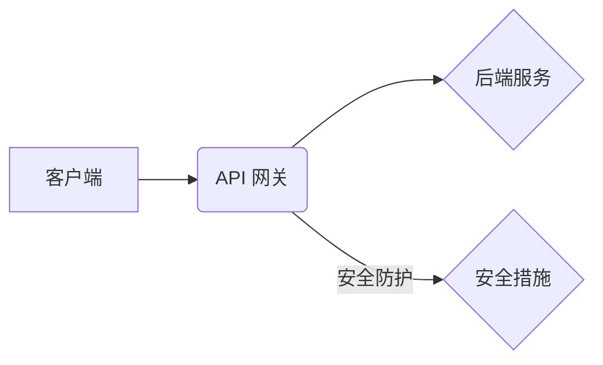

## 1. 背景介绍

在当今数字化时代，应用程序接口 (API) 已成为构建现代软件架构和服务互联的关键要素。API 网关作为 API 的入口点，承担着连接客户端和后端服务的职责，同时扮演着重要的安全角色。随着 API 的日益普及，API 安全也成为越来越重要的关注点。

API 网关的安全功能旨在保护 API 的完整性、机密性和可用性，防止各种安全威胁，例如：

* **未授权访问:** 阻止未经授权的用户或应用程序访问 API。
* **数据泄露:** 保护 API 传输的数据不被窃取或篡改。
* **拒绝服务攻击:** 防止攻击者通过超载 API 服务器导致服务不可用。
* **恶意代码注入:** 阻止攻击者通过注入恶意代码攻击 API 服务器。

## 2. 核心概念与联系

### 2.1 API 网关的概念

API 网关是一个中间层，位于客户端和后端服务之间，负责管理和控制对 API 的访问。它可以提供多种功能，例如：

* **路由:** 将请求转发到相应的后端服务。
* **身份验证:** 验证用户的身份和权限。
* **授权:** 控制用户对 API 的访问权限。
* **流量管理:** 控制 API 的流量和吞吐量。
* **安全防护:** 提供安全功能，例如 WAF (Web Application Firewall) 和 DDoS (Distributed Denial of Service) 防御。

### 2.2 API 网关与安全的关系

API 网关是 API 安全的重要组成部分，它可以提供多种安全功能，帮助保护 API 免受各种威胁。

**API 网关的安全功能与其他安全措施的关系:**

API 网关的安全功能并非独立于其他安全措施，而是与其他安全措施协同工作，形成多层次的安全防护体系。例如：

* **防火墙:** 防火墙可以阻止来自恶意 IP 地址的流量，保护 API 网关本身的安全。
* **入侵检测系统 (IDS):** IDS 可以检测 API 网关上的异常活动，例如 SQL 注入攻击和跨站脚本攻击。
* **安全信息和事件管理 (SIEM):** SIEM 可以收集和分析 API 网关的安全日志，帮助安全人员识别和响应安全威胁。

**Mermaid 流程图:**



## 3. 核心算法原理 & 具体操作步骤

### 3.1 算法原理概述

API 网关的安全功能通常基于以下核心算法原理：

* **身份验证:** 使用用户名/密码、OAuth、JWT 等机制验证用户的身份。
* **授权:** 根据用户的身份和权限，控制用户对 API 的访问权限。
* **加密:** 使用 SSL/TLS 等协议加密 API 传输的数据，防止数据泄露。
* **访问控制:** 使用 ACL (Access Control List) 或 RBAC (Role-Based Access Control) 等机制控制对 API 的访问权限。
* **异常检测:** 使用机器学习或规则引擎检测 API 上的异常活动，例如 DDoS 攻击和 SQL 注入攻击。

### 3.2 算法步骤详解

**身份验证:**

1. 客户端向 API 网关发送请求，包含身份验证信息。
2. API 网关验证身份验证信息，例如用户名/密码或 OAuth 授权码。
3. 如果验证成功，API 网关会向客户端返回一个身份验证令牌。

**授权:**

1. 客户端向 API 网关发送请求，包含身份验证令牌。
2. API 网关验证身份验证令牌，并根据用户的身份和权限，决定是否允许访问 API。
3. 如果允许访问，API 网关会转发请求到相应的后端服务。

**加密:**

1. 客户端和 API 网关之间使用 SSL/TLS 协议进行加密通信。
2. 所有 API 传输的数据都经过加密，防止数据泄露。

**访问控制:**

1. API 网关维护一个 ACL 或 RBAC 表，定义了对 API 的访问权限。
2. 当客户端发送请求时，API 网关会根据用户的身份和权限，检查 ACL 或 RBAC 表，决定是否允许访问 API。

**异常检测:**

1. API 网关收集 API 请求的各种信息，例如请求来源、请求路径、请求参数等。
2. 使用机器学习或规则引擎分析 API 请求信息，检测异常活动。
3. 如果检测到异常活动，API 网关会采取相应的措施，例如阻止请求或记录日志。

### 3.3 算法优缺点

**优点:**

* **集中式安全管理:** API 网关可以集中管理 API 的安全策略，简化安全管理工作。
* **多层次安全防护:** API 网关可以提供多种安全功能，形成多层次的安全防护体系。
* **可扩展性:** API 网关可以根据需要扩展安全功能，满足不同的安全需求。

**缺点:**

* **单点故障:** API 网关是 API 的入口点，如果 API 网关出现故障，会导致所有 API 服务不可用。
* **性能影响:** API 网关需要处理大量的 API 请求，可能会对 API 的性能造成影响。
* **复杂性:** API 网关的配置和管理相对复杂，需要专业的技术人员进行操作。

### 3.4 算法应用领域

API 网关的安全功能广泛应用于各种领域，例如：

* **金融服务:** 保护金融交易数据和用户隐私。
* **电商平台:** 防止商品价格篡改和订单欺诈。
* **医疗保健:** 保护患者医疗信息安全。
* **物联网:** 保护物联网设备的安全和数据隐私。

## 4. 数学模型和公式 & 详细讲解 & 举例说明

### 4.1 数学模型构建

API 网关的安全模型可以抽象为一个状态机，其中每个状态代表 API 网关的安全状态，例如：

* **未认证:** 用户未进行身份验证。
* **认证成功:** 用户已成功进行身份验证。
* **授权成功:** 用户已获得访问 API 的权限。
* **拒绝访问:** 用户没有访问 API 的权限。

状态机的状态转换规则可以根据 API 网关的安全策略进行定义。例如，当用户发送请求时，如果用户未进行身份验证，则状态机会从“未认证”状态转换到“认证请求”状态。如果用户身份验证成功，则状态机会从“认证请求”状态转换到“认证成功”状态。

### 4.2 公式推导过程

API 网关的安全策略可以表示为一组规则，例如：

* 如果用户身份验证成功，并且用户角色为“管理员”，则允许用户访问所有 API。
* 如果用户身份验证成功，并且用户角色为“普通用户”，则允许用户访问特定 API。

这些规则可以转换为数学公式，例如：

$$
P(API, User) = \begin{cases}
True & \text{if } Auth(User) = True \text{ and } Role(User) = "管理员" \\
True & \text{if } Auth(User) = True \text{ and } Role(User) \in AllowedRoles(API) \\
False & \text{otherwise}
\end{cases}
$$

其中：

* $P(API, User)$ 表示用户 $User$ 是否可以访问 API $API$。
* $Auth(User)$ 表示用户 $User$ 是否已进行身份验证。
* $Role(User)$ 表示用户 $User$ 的角色。
* $AllowedRoles(API)$ 表示 API $API$ 允许访问的角色列表。

### 4.3 案例分析与讲解

**案例:**

假设有一个 API 网关，需要保护一个名为“用户管理”的 API。该 API 有两个角色：管理员和普通用户。管理员可以访问所有用户管理 API，而普通用户只能访问特定 API，例如获取自己的用户信息。

**分析:**

根据上述案例，我们可以定义以下安全策略：

* 管理员可以访问所有用户管理 API。
* 普通用户只能访问获取自己用户信息的 API。

**公式:**

$$
P(UserManagementAPI, User) = \begin{cases}
True & \text{if } Auth(User) = True \text{ and } Role(User) = "管理员" \\
True & \text{if } Auth(User) = True \text{ and } Role(User) = "普通用户" \text{ and } API = "获取用户信息" \\
False & \text{otherwise}
\end{cases}
$$

## 5. 项目实践：代码实例和详细解释说明

### 5.1 开发环境搭建

* 操作系统: Ubuntu 20.04
* 编程语言: Python 3.8
* 框架: FastAPI
* 数据库: PostgreSQL

### 5.2 源代码详细实现

```python
from fastapi import FastAPI, HTTPException
from fastapi.middleware.cors import CORSMiddleware
from pydantic import BaseModel
from typing import List

app = FastAPI()

# CORS 跨域配置
origins = ["*"]  # 设置允许的域名
app.add_middleware(
    CORSMiddleware,
    allow_origins=origins,
    allow_credentials=True,
    allow_methods=["*"],
    allow_headers=["*"],
)

# 用户模型
class User(BaseModel):
    id: int
    username: str
    role: str

# 用户数据
users = [
    User(id=1, username="admin", role="管理员"),
    User(id=2, username="user", role="普通用户"),
]

# API 路由
@app.get("/users")
async def get_users():
    return users

@app.get("/users/{user_id}")
async def get_user(user_id: int):
    user = next((user for user in users if user.id == user_id), None)
    if user is None:
        raise HTTPException(status_code=404, detail="用户不存在")
    return user

# 安全验证
def authenticate_user(username, password):
    # 实现用户身份验证逻辑
    #...
    return True

# 授权验证
def authorize_user(user, api_path):
    # 实现用户授权逻辑
    #...
    return True

# 安全装饰器
async def secure_endpoint(func):
    async def wrapper(request):
        # 获取请求头中的身份验证信息
        #...
        username = request.headers.get("username")
        password = request.headers.get("password")

        if not authenticate_user(username, password):
            raise HTTPException(status_code=401, detail="身份验证失败")

        user = next((user for user in users if user.username == username), None)
        if not authorize_user(user, request.path):
            raise HTTPException(status_code=403, detail="权限不足")

        return await func(request)
    return wrapper

# 安全 API 路由
@app.get("/protected/api")
@secure_endpoint
async def protected_api():
    return {"message": "访问成功"}

```

### 5.3 代码解读与分析

* **CORS 跨域配置:** 使用 `CORSMiddleware` 处理跨域请求，允许来自指定域名的请求。
* **用户模型:** 使用 `pydantic` 定义用户模型，用于验证用户数据格式。
* **API 路由:** 使用 `FastAPI` 定义 API 路由，例如获取用户列表和单个用户信息。
* **安全验证:** `authenticate_user` 函数实现用户身份验证逻辑，例如验证用户名和密码。
* **授权验证:** `authorize_user` 函数实现用户授权逻辑，例如根据用户角色控制访问权限。
* **安全装饰器:** `secure_endpoint` 装饰器用于保护 API 路由，在请求处理之前执行身份验证和授权验证。
* **安全 API 路由:** `protected_api` 路由使用 `secure_endpoint` 装饰器进行保护，只有经过身份验证和授权的用户才能访问该 API。

### 5.4 运行结果展示

运行上述代码，并使用 Postman 或其他工具发送请求，可以验证 API 网关的安全功能。

## 6. 实际应用场景

### 6.1 API 网关在金融领域的应用

在金融领域，API 网关可以保护敏感的金融数据和交易信息。例如，银行可以使用 API 网关来管理其