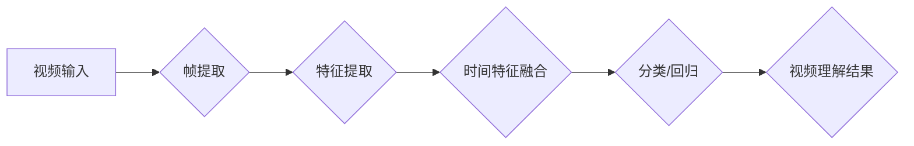

## Python深度学习实践：基于深度学习的视频理解方法

> 关键词：深度学习、视频理解、CNN、RNN、Transformer、Python、TensorFlow、PyTorch

## 1. 背景介绍

视频数据作为一种丰富的多模态信息，蕴含着巨大的价值。与静态图像相比，视频包含了时间序列信息，能够更全面地刻画场景和事件的发展。近年来，深度学习技术取得了飞速发展，为视频理解提供了强大的工具。基于深度学习的视频理解方法能够自动提取视频中的关键信息，例如动作识别、目标跟踪、场景描述、事件理解等，在智能监控、自动驾驶、医疗诊断、人机交互等领域具有广泛的应用前景。

然而，视频理解任务也面临着诸多挑战：

* **时间依赖性:** 视频数据具有强烈的时序依赖性，需要模型能够捕捉视频中不同帧之间的关系。
* **数据规模:** 视频数据通常比图像数据更大，需要更强大的计算资源和更有效的训练策略。
* **复杂场景:** 真实世界视频场景复杂多样，存在遮挡、运动模糊、光照变化等问题，对模型的鲁棒性提出了更高的要求。

## 2. 核心概念与联系

视频理解的核心概念包括：

* **帧提取:** 将视频分割成独立的图像帧，作为深度学习模型的输入。
* **特征提取:** 利用卷积神经网络 (CNN) 从视频帧中提取空间特征，例如物体、边缘、纹理等。
* **时间特征融合:** 利用循环神经网络 (RNN) 或 Transformer 等模型从视频帧序列中提取时间特征，例如动作模式、事件发展等。
* **分类/回归:** 根据提取的特征，对视频进行分类或回归，例如识别动作类别、预测目标轨迹等。

**Mermaid 流程图:**



## 3. 核心算法原理 & 具体操作步骤

### 3.1  算法原理概述

深度学习在视频理解领域中取得了显著的成果，主要基于以下几种算法：

* **CNN (卷积神经网络):** CNN 擅长提取图像特征，在视频理解中常用于帧特征提取。
* **RNN (循环神经网络):** RNN 能够处理序列数据，常用于捕捉视频帧之间的时序关系。
* **Transformer:** Transformer 是一种新型的序列模型，具有更强的长距离依赖建模能力，在视频理解领域展现出巨大的潜力。

### 3.2  算法步骤详解

以 CNN-RNN 结合的视频动作识别为例，详细说明算法步骤：

1. **帧提取:** 将视频分割成独立的图像帧。
2. **帧特征提取:** 使用 CNN 对每帧图像进行特征提取，得到每个帧的特征向量。
3. **时间特征融合:** 使用 RNN 对特征向量序列进行处理，捕捉视频帧之间的时序关系，得到视频的整体特征表示。
4. **分类:** 使用全连接层对视频的整体特征表示进行分类，预测视频的动作类别。

### 3.3  算法优缺点

**CNN-RNN 结合:**

* **优点:** 能够有效地提取空间和时间特征，在视频动作识别等任务中表现出色。
* **缺点:** RNN 训练难度大，容易出现梯度消失问题，难以处理长视频序列。

**Transformer:**

* **优点:** 具有更强的长距离依赖建模能力，能够处理更长的视频序列。
* **缺点:** 计算复杂度高，训练资源要求高。

### 3.4  算法应用领域

* **动作识别:** 识别视频中的动作类别，例如跑步、跳跃、打球等。
* **目标跟踪:** 跟踪视频中特定目标的运动轨迹。
* **场景描述:** 描述视频中的场景内容，例如人物、物体、活动等。
* **事件理解:** 理解视频中发生的事件，例如摔倒、碰撞、握手等。

## 4. 数学模型和公式 & 详细讲解 & 举例说明

### 4.1  数学模型构建

**CNN 模型:**

CNN 模型由多个卷积层、池化层和全连接层组成。卷积层使用卷积核提取图像特征，池化层降低特征维度，全连接层进行分类或回归。

**RNN 模型:**

RNN 模型由多个循环单元组成，每个循环单元接收当前输入和之前隐藏状态，输出新的隐藏状态和输出。

**Transformer 模型:**

Transformer 模型由多头自注意力机制、多层感知机和前馈网络组成。多头自注意力机制能够捕捉序列中不同位置之间的关系，多层感知机和前馈网络进行特征提取和变换。

### 4.2  公式推导过程

**CNN 模型:**

卷积操作公式:

$$
y_{i,j} = \sum_{m=0}^{M-1} \sum_{n=0}^{N-1} x_{i+m,j+n} * w_{m,n} + b
$$

其中:

* $x_{i,j}$ 是输入图像的像素值。
* $w_{m,n}$ 是卷积核的权重。
* $b$ 是偏置项。
* $y_{i,j}$ 是卷积层的输出像素值。

**RNN 模型:**

隐藏状态更新公式:

$$
h_t = f(W_{xh}x_t + W_{hh}h_{t-1} + b_h)
$$

其中:

* $h_t$ 是当前时间步的隐藏状态。
* $x_t$ 是当前时间步的输入。
* $W_{xh}$ 和 $W_{hh}$ 是权重矩阵。
* $b_h$ 是偏置项。
* $f$ 是激活函数。

### 4.3  案例分析与讲解

**视频动作识别:**

使用 CNN-RNN 模型识别视频中的动作类别。

* CNN 模型提取每帧图像的特征向量。
* RNN 模型对特征向量序列进行处理，捕捉视频帧之间的时序关系。
* 全连接层对视频的整体特征表示进行分类，预测视频的动作类别。

**举例说明:**

一个视频包含多个帧，每帧图像都包含一个人的动作。使用 CNN 模型提取每帧图像的特征向量，然后使用 RNN 模型对特征向量序列进行处理，最终得到视频的整体特征表示。全连接层根据视频的整体特征表示，预测视频的动作类别，例如跑步、跳跃、打球等。

## 5. 项目实践：代码实例和详细解释说明

### 5.1  开发环境搭建

* **操作系统:** Ubuntu 18.04 或更高版本
* **Python 版本:** 3.6 或更高版本
* **深度学习框架:** TensorFlow 或 PyTorch
* **其他依赖库:** numpy, pandas, matplotlib等

### 5.2  源代码详细实现

```python
# 使用 TensorFlow 实现视频动作识别

import tensorflow as tf

# 定义 CNN 模型
def build_cnn_model():
    model = tf.keras.models.Sequential([
        tf.keras.layers.Conv2D(32, (3, 3), activation='relu', input_shape=(128, 128, 3)),
        tf.keras.layers.MaxPooling2D((2, 2)),
        tf.keras.layers.Conv2D(64, (3, 3), activation='relu'),
        tf.keras.layers.MaxPooling2D((2, 2)),
        tf.keras.layers.Flatten(),
        tf.keras.layers.Dense(10, activation='softmax')
    ])
    return model

# 定义 RNN 模型
def build_rnn_model():
    model = tf.keras.models.Sequential([
        tf.keras.layers.LSTM(128, return_sequences=True),
        tf.keras.layers.LSTM(64),
        tf.keras.layers.Dense(10, activation='softmax')
    ])
    return model

# 构建 CNN-RNN 模型
def build_cnn_rnn_model():
    cnn_model = build_cnn_model()
    rnn_model = build_rnn_model()
    model = tf.keras.models.Sequential([
        cnn_model,
        rnn_model
    ])
    return model

# 加载视频数据
#...

# 构建模型并训练
model = build_cnn_rnn_model()
model.compile(optimizer='adam', loss='categorical_crossentropy', metrics=['accuracy'])
model.fit(video_data, labels, epochs=10)

# 预测视频动作类别
predictions = model.predict(video_data)
```

### 5.3  代码解读与分析

* **模型构建:** 代码中定义了 CNN、RNN 和 CNN-RNN 模型的构建函数。
* **数据加载:** 需要根据实际情况加载视频数据和标签。
* **模型训练:** 使用 Adam 优化器、交叉熵损失函数和准确率指标训练模型。
* **模型预测:** 使用训练好的模型预测视频的动作类别。

### 5.4  运行结果展示

训练完成后，可以评估模型的性能，例如准确率、召回率、F1-score 等。

## 6. 实际应用场景

### 6.1  智能监控

* **异常行为检测:** 利用视频理解技术识别异常行为，例如入侵、斗殴、火灾等，提高安全监控效率。
* **人员跟踪:** 追踪特定人员的运动轨迹，用于安防、人群管理等场景。

### 6.2  自动驾驶

* **行人检测和识别:** 识别行人、车辆、交通信号灯等路况信息，辅助驾驶决策。
* **道路场景理解:** 理解道路环境，例如车道线、交通标志、障碍物等，提高自动驾驶系统的安全性。

### 6.3  医疗诊断

* **手术辅助:** 利用视频理解技术辅助医生进行手术，例如识别手术器械、跟踪手术区域等。
* **疾病诊断:** 分析患者的运动轨迹和行为模式，辅助医生诊断疾病。

### 6.4  未来应用展望

* **更精准的视频理解:** 随着深度学习技术的不断发展，视频理解模型将更加精准，能够理解更复杂、更细粒度的视频内容。
* **更广泛的应用场景:** 视频理解技术将应用于更多领域，例如教育、娱乐、金融等。
* **更智能的交互方式:** 视频理解技术将推动人机交互方式的升级，例如通过视频进行自然语言对话、虚拟现实体验等。

## 7. 工具和资源推荐

### 7.1  学习资源推荐

* **书籍:**
    * 《深度学习》 - Ian Goodfellow, Yoshua Bengio, Aaron Courville
    * 《Python深度学习实践》 - Francois Chollet
* **在线课程:**
    * Coursera: 深度学习 Specialization
    * Udacity: Deep Learning Nanodegree
* **博客和网站:**
    * TensorFlow Blog: https://blog.tensorflow.org/
    * PyTorch Blog: https://pytorch.org/blog/

### 7.2  开发工具推荐

* **深度学习框架:** TensorFlow, PyTorch
* **数据处理库:** numpy, pandas
* **可视化库:** matplotlib, seaborn

### 7.3  相关论文推荐

* **视频动作识别:**
    * Two-Stream Convolutional Networks for Action Recognition
    * C3D: Deep Motion Mining on Space-Time Data
* **视频理解:**
    * Show, Attend and Tell: Neural Image Captioning with Visual Attention
    * VideoQA: Answering Questions about Videos

## 8. 总结：未来发展趋势与挑战

### 8.1  研究成果总结

深度学习技术在视频理解领域取得了显著的成果，例如动作识别、目标跟踪、场景描述等任务的性能大幅提升。

### 8.2  未来发展趋势

* **更强大的模型:** 研究更强大的视频理解模型，例如基于 Transformer 的模型，能够处理更长、更复杂的视频序列。
* **更丰富的语义理解:** 