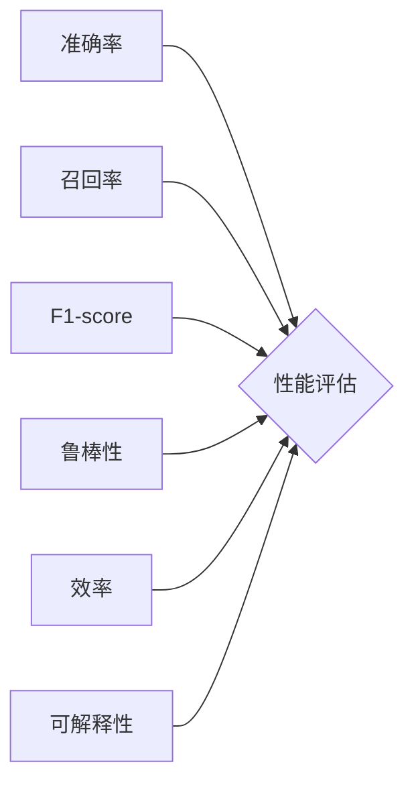

## AI系统性能评估的关键指标

> 关键词：人工智能、性能评估、指标体系、准确率、召回率、F1-score、鲁棒性、效率、可解释性

## 1. 背景介绍

随着人工智能技术的飞速发展，AI系统已广泛应用于各个领域，例如图像识别、自然语言处理、推荐系统等。然而，评估AI系统的性能是一个复杂且至关重要的任务。只有对AI系统的性能进行全面、准确的评估，才能确保其有效性和可靠性，并推动人工智能技术的进一步发展。

传统的软件性能评估方法难以直接应用于AI系统，因为AI系统的性能不仅取决于其速度和效率，还与其准确性、鲁棒性和可解释性等因素密切相关。因此，需要建立一套专门针对AI系统的性能评估指标体系。

## 2. 核心概念与联系

### 2.1  AI系统性能评估

AI系统性能评估是指对AI系统在特定任务或场景下的表现进行量化分析和评价的过程。其目的是为了衡量AI系统的准确性、效率、鲁棒性和可解释性等关键指标，并根据评估结果进行改进和优化。

### 2.2  性能指标体系

性能指标体系是指用于评估AI系统性能的一系列标准化指标。这些指标应能够全面地反映AI系统的各个方面，并能够量化地表达其性能水平。

**Mermaid 流程图**



## 3. 核心算法原理 & 具体操作步骤

### 3.1  算法原理概述

在AI系统性能评估中，常用的算法包括分类算法、回归算法、聚类算法等。这些算法的原理基于统计学、概率论和机器学习等领域。

**分类算法**

分类算法用于将数据点划分为不同的类别。例如，图像识别任务中，分类算法可以将图像分类为不同的物体类别。常见的分类算法包括支持向量机（SVM）、决策树、随机森林和神经网络等。

**回归算法**

回归算法用于预测连续数值。例如，预测房价、股票价格等。常见的回归算法包括线性回归、逻辑回归和支持向量回归等。

**聚类算法**

聚类算法用于将数据点根据其相似性进行分组。例如，客户画像分析中，聚类算法可以将客户分为不同的消费群体。常见的聚类算法包括K-means、层次聚类和DBSCAN等。

### 3.2  算法步骤详解

**分类算法步骤**

1. 数据预处理：对数据进行清洗、转换和特征工程等操作，以提高算法的性能。
2. 模型训练：使用训练数据训练分类模型，学习数据之间的关系。
3. 模型评估：使用测试数据评估模型的性能，例如准确率、召回率和F1-score等。
4. 模型调优：根据评估结果调整模型参数，以提高模型性能。
5. 模型部署：将训练好的模型部署到实际应用场景中。

**回归算法步骤**

1. 数据预处理：对数据进行清洗、转换和特征工程等操作。
2. 模型训练：使用训练数据训练回归模型，学习数据之间的关系。
3. 模型评估：使用测试数据评估模型的性能，例如均方误差（MSE）、平均绝对误差（MAE）等。
4. 模型调优：根据评估结果调整模型参数，以提高模型性能。
5. 模型部署：将训练好的模型部署到实际应用场景中。

**聚类算法步骤**

1. 数据预处理：对数据进行清洗、转换和特征工程等操作。
2. 模型选择：选择合适的聚类算法，例如K-means、层次聚类等。
3. 模型参数设置：设置聚类算法的参数，例如K值、距离度量等。
4. 模型训练：使用训练数据训练聚类模型，将数据点进行分组。
5. 模型评估：使用评估指标，例如Silhouette score、Dunn index等，评估聚类结果的质量。
6. 模型调优：根据评估结果调整模型参数，以提高聚类结果的质量。

### 3.3  算法优缺点

**分类算法**

* **优点:** 能够准确地将数据点划分为不同的类别，应用广泛。
* **缺点:** 对数据分布的假设比较强，当数据分布异常时，性能可能会下降。

**回归算法**

* **优点:** 能够预测连续数值，应用于预测分析等领域。
* **缺点:** 对异常值敏感，需要进行数据预处理。

**聚类算法**

* **优点:** 不需要预先定义类别，能够发现数据中的潜在结构。
* **缺点:** 聚类结果的解释性较弱，需要进行后续分析。

### 3.4  算法应用领域

**分类算法**

* 图像识别
* 自然语言处理
* 欺诈检测
* 医疗诊断

**回归算法**

* 房价预测
* 股票价格预测
* 销售预测
* 风险评估

**聚类算法**

* 客户画像分析
* 市场细分
* 文本聚类
* 图像分割

## 4. 数学模型和公式 & 详细讲解 & 举例说明

### 4.1  数学模型构建

在AI系统性能评估中，常用的数学模型包括概率模型、统计模型和优化模型等。

**概率模型**

概率模型用于描述随机事件之间的关系，例如贝叶斯网络、隐马尔可夫模型等。

**统计模型**

统计模型用于分析数据中的趋势和模式，例如线性回归、逻辑回归等。

**优化模型**

优化模型用于寻找最优解，例如梯度下降、随机梯度下降等。

### 4.2  公式推导过程

**准确率（Accuracy）**

$$Accuracy = \frac{TP + TN}{TP + TN + FP + FN}$$

其中：

* TP：真阳性（正确预测为正例）
* TN：真阴性（正确预测为负例）
* FP：假阳性（错误预测为正例）
* FN：假阴性（错误预测为负例）

**召回率（Recall）**

$$Recall = \frac{TP}{TP + FN}$$

**F1-score**

$$F1-score = 2 * \frac{Precision * Recall}{Precision + Recall}$$

其中：

* Precision：精确率（TP / (TP + FP)）

### 4.3  案例分析与讲解

**案例：**

假设我们有一个分类模型用于识别猫和狗的图片。测试集包含100张图片，其中50张是猫的图片，50张是狗的图片。模型预测结果如下：

* 正确预测为猫的图片：35张
* 错误预测为猫的图片：15张
* 正确预测为狗的图片：40张
* 错误预测为狗的图片：10张

**计算结果：**

* 准确率： (35 + 40) / 100 = 0.75
* 召回率： 35 / (35 + 15) = 0.7
* F1-score： 2 * (0.7 * 0.7) / (0.7 + 0.7) = 0.7

**分析：**

该模型的准确率为75%，召回率为70%，F1-score为0.7。这表明该模型在识别猫和狗的图片方面表现良好。

## 5. 项目实践：代码实例和详细解释说明

### 5.1  开发环境搭建

* Python 3.x
* TensorFlow 或 PyTorch 等深度学习框架
* Jupyter Notebook 或 VS Code 等代码编辑器

### 5.2  源代码详细实现

```python
import tensorflow as tf

# 定义模型结构
model = tf.keras.models.Sequential([
    tf.keras.layers.Conv2D(32, (3, 3), activation='relu', input_shape=(28, 28, 1)),
    tf.keras.layers.MaxPooling2D((2, 2)),
    tf.keras.layers.Conv2D(64, (3, 3), activation='relu'),
    tf.keras.layers.MaxPooling2D((2, 2)),
    tf.keras.layers.Flatten(),
    tf.keras.layers.Dense(10, activation='softmax')
])

# 编译模型
model.compile(optimizer='adam',
              loss='sparse_categorical_crossentropy',
              metrics=['accuracy'])

# 训练模型
model.fit(x_train, y_train, epochs=10)

# 评估模型
loss, accuracy = model.evaluate(x_test, y_test)
print('Test loss:', loss)
print('Test accuracy:', accuracy)
```

### 5.3  代码解读与分析

* 该代码示例展示了使用TensorFlow框架构建一个简单的图像分类模型。
* 模型结构包括卷积层、池化层和全连接层。
* 模型使用Adam优化器、交叉熵损失函数和准确率作为评估指标。
* 模型使用训练数据进行训练，并使用测试数据进行评估。

### 5.4  运行结果展示

运行结果将显示模型在测试集上的损失值和准确率。

## 6. 实际应用场景

### 6.1  图像识别

* 自动驾驶汽车：识别道路标志、行人、车辆等。
* 医疗诊断：识别病灶、肿瘤等。
* 物体检测：识别商品、人员等。

### 6.2  自然语言处理

* 机器翻译：将文本从一种语言翻译成另一种语言。
* 文本摘要：生成文本的简短摘要。
* 情感分析：分析文本的情感倾向。

### 6.3  推荐系统

* 产品推荐：根据用户的历史行为推荐产品。
* 内容推荐：根据用户的兴趣推荐内容。
* 人员推荐：根据用户的兴趣推荐人员。

### 6.4  未来应用展望

AI系统性能评估将随着人工智能技术的不断发展而更加重要。未来，AI系统性能评估将更加注重以下方面：

* **可解释性:** 提高AI系统的可解释性，以便更好地理解其决策过程。
* **鲁棒性:** 提高AI系统的鲁棒性，使其能够应对噪声数据、异常数据等挑战。
* **公平性:** 确保AI系统的公平性，避免产生偏见。
* **安全性:** 提高AI系统的安全性，防止其被恶意攻击。

## 7. 工具和资源推荐

### 7.1  学习资源推荐

* **书籍:**
    * 《深度学习》
    * 《机器学习》
    * 《人工智能：现代方法》
* **在线课程:**
    * Coursera
    * edX
    * Udacity

### 7.2  开发工具推荐

* **深度学习框架:** TensorFlow, PyTorch, Keras
* **数据处理工具:** Pandas, NumPy
* **可视化工具:** Matplotlib, Seaborn

### 7.3  相关论文推荐

* **论文:**
    * 《BERT: Pre-training of Deep Bidirectional Transformers for Language Understanding》
    * 《Attention Is All You Need》
    * 《ImageNet Classification with Deep Convolutional Neural Networks》

## 8. 总结：未来发展趋势与挑战

### 8.1  研究成果总结

AI系统性能评估已经取得了显著的进展，例如开发了多种新的性能指标、算法和工具。

### 8.2  未来发展趋势

* **更加注重可解释性:** 开发能够解释AI系统决策过程的模型和方法。
* **更加注重鲁棒性:** 开发能够应对噪声数据、异常数据等挑战的模型和方法。
* **更加注重公平性:** 开发能够避免产生偏见的模型和方法。
* **更加注重安全性:** 开发能够防止被恶意攻击的模型和方法。

### 8.3  面临的挑战

* **缺乏统一的评估标准:** 目前，AI系统性能评估缺乏统一的标准，不同领域、不同任务的评估指标存在差异。
*